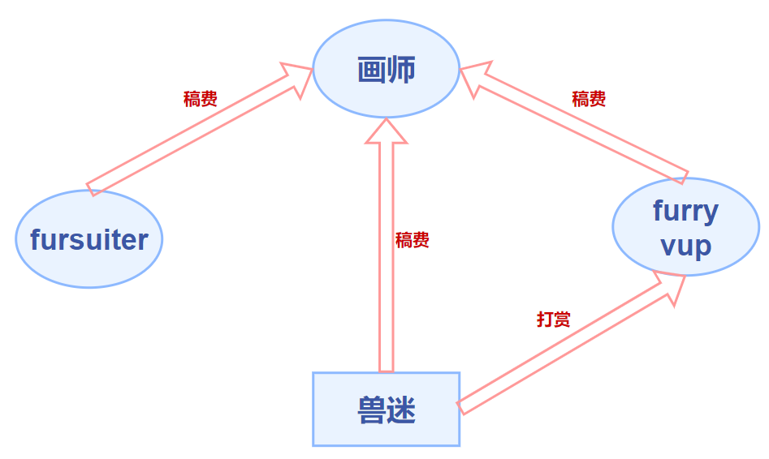


 

## 污名化

-   由于圈外人对圈内人了解不深，兽迷们可能会被错误地打上“恋兽癖”的标签。事实上，国内大多数兽迷对现实中的这种癖好都十分反感。兽圈中有一部分作品被称为 yiff[^1]，有许多兽迷喜爱 yiff，但这并不代表着他们在现实生活中就会去实践。Yiff 当然不乏优秀作品（如：欲染君色）。
-   很早便有“十兽九基”的说法，这源于圈内外对兽圈与非异性恋族群（尤其是男性同性恋族群）存在一定重合度的疑问。事实上，对拟人化动物的喜爱与性取向并无本质上的联系。在国外兽圈中，兽迷们性取向比例与大众群体无显著差异，而在国内兽圈中，非异性恋族群占比稍高（数据待补充），但也不能证明二者间较强的相关性。**笔者推测**，这一特点可能与兽文化传入国内时所展现出的开放性与包容性有关，涉及到小众圈子文化之间的相互渗透，故使得不被大众普遍接受的兽文化在非异性恋族群中得到广泛传播。
-   兽圈中的语c（请注意与文爱[^2]区分）现象。
    语c，即语言cosplay，是指在语言上通过模仿/代入角色从而扮演该角色的一种行为。在兽圈内，即指通过语言文字（大多是聊天消息）代入/扮演兽设的一种行为。这些语言特征通常会使说话人显得更加亲近/可爱，但也是使圈外人感到不适的一个重要原因。常见的语言元素（在其他圈子也可能存在）如下：
    **颜文字**（qwq，awa，QAQ，owo 等）
    **动作类**（扑，摇尾巴，舔，rua 等）
    **拟声类**（嗷，呜，呣，1551/噫呜呜噫等）
    **身体部位类**（爪子，尾巴，肉垫等）

#### 小结

最近“小心售人控”“小心福瑞控”等充满误解意味的短语/梗兴起，连兽迷们也开始使用这些词进行自嘲。但在任何情况下，请不要盲目跟风：善用举报功能。不爱，请别伤害。当兽文化的内涵被大众所知后，公众才能做出理性的判断与选择。

***

## 低龄化

由于兽文化的新鲜性、开放性与包容性，越来越多的年轻人加入了兽迷这一群体，但同时也引发了一个问题：低龄化。

-   对于兽文化本身而言，其大部分内容对于较低年龄群体是无害的，或者是有积极意义的，除了一个部分：性。低年龄群体过早地进入兽圈，接触到这部分内容后，可能会对其未来的发展产生不利影响。对于这一灰色地带，国家尚未推出有效的分级制度和管理措施，因此圈内未成年人接受到的信息是不可控的，从而可能引发一系列问题。
-   未成年人的自控能力不强，对金钱并没有十分明确的认识。在某些现象级游戏中，利用父母银行卡充值，盗刷的未成年人也不在少数，并且还存在父母不知情的情况。兽圈中兽迷花销的主要去向如下：
    **约装，约稿** **购买周边**（立牌，海报等）
    **参加兽展**（购买门票，旅途餐饮住宿花销等）
    **购买作品**（漫画等）
    其中以约装、约稿的花销尤为突出（详见商品化）。圈中未成年人一般无自己的经济收入来源，其消费不加节制，主要体现在随意约装，约稿。曾经出现过在约稿之后家长找画师追回货款的情况，令画师叫苦不迭。因此，加强对此方面的管控也显得尤为重要。
-   未成年人（尤其是处于叛逆期）群体存在感性、易冲动、判断力弱的特点，因此更有可能受到他人影响（被带节奏等），从而产生更多小鬼/杠精/键盘侠等扰乱圈子稳定的不良因素。未成年人的思想更容易走向非黑即白（站队）的极端，此现象不只存在于兽圈之中。
-   **丧文化**问题：部分未成年人心智不够成熟，在圈子内部传播大量负能量，以及发表一些“厌世言论”，甚者扬言要进行自残，自杀等行为。这些行为往往会导致一些同龄人也被他们所同化，变得更加抑郁。

***

## 商品化

### 兽圈生态

兽圈的主要组成部分及关系如下图。

虽然说兽设是一个兽迷的虚拟形象，兽装是扮演兽设的媒介，但因其都有实际的载体（文字/图片、毛装）和无法完全自给自足的特点，使得供给者和需求者之间产生了交易，从而使这两样事物附带上了商品的属性。兽圈中常见的交易类型如下：

-   **约稿**
    1. 模板稿：指已经确定好角色动作、背景等的稿件（画师在接稿前已经完成创作），画师只需根据约稿人的兽设进行花纹绘制、改模等，因此价格也会相应地降低。画师可以自己绘制，也可以从其他画师处购买模板的使用权以进行接稿。

    2. 常稿：相对于模板稿，常稿是画师根据约稿人兽设而独立绘制的成图，价格较模板高。

    注：部分画师在约稿时会注明商用/非商用，商用（用于制作周边等）稿件一般贵于非商用稿件。

-   **模板出售**
    1. 私用：指得到模板者不能将其用于商业用途（如画师接稿，售卖周边等），可以用于自己绘画（即让约稿人承担绘画成图的工作）或定制私人周边，价格较商用低。
    2. 商用：一般多见于画师间交易，可用此模板接稿或进行商业用途，价格较私用高。
-   **兽设转让**
    将自己的兽设转让给他人，一般会附带相关稿件。
-   **约装**
    1. 定制：装师根据约装人的兽设制作兽装，有时也会为其绘制兽设并制作，由装师纯手工制作[^3]故耗时较长（一般半年至一年）。
    2. 直接购买（如 K-Line）：在已生产的兽装中进行购买。

<!---->

-   **作品购买**
    如一般意义上的作品购买。
    漫画类：《全兽出击》[《有兽焉》](https://manga.bilibili.com/detail/mc29329 "《有兽焉》")等

    小说类：《星星之卵》等

    游戏类：见兽人游戏
-   **周边购买**
    如一般意义上的周边购买。

### 问题

-   **坐地起价**
    由于画风的独特性，有画师凭借“只有我画这种画”的理由恶意抬高稿费。
-   **天价稿费/名气等价于金钱**
    （由于这一问题圈内经常展开骂战，挂人等事件）
    一幅作品的实际价值/画师付出的劳动所等价的金钱远少于购买这幅作品所需的金钱。
    当一位画师推出作品/开放委托的时候，有的约稿人对其作品很满意，于是便主动付出了更多的金钱。这个行为本身无可厚非，但是有的时候可能给画师传递了一个错误观念：我的画不止这个价。于是，在画师的绘画技巧尚未与稿件质量同步提升时，画师误判了心目中作品的价值而导致拉高定价，加剧了资源的消耗。
    与此同时，许多兽迷秉承着“既然贵那么一定不会差”的思想进行约稿，模糊了圈子中“这样的稿件究竟值多少钱”“这些钱能够约到什么质量的稿件”等问题的标准，使得圈内对这类问题没有同意标准，价格反而在不断上抬。
    一些在圈子内小有名气的画师在经过积累后也渐渐提高了定价。究其原因，一方面是自己的画技在不断提高，而另一部分的原因可能是“粉丝”们的追捧使得画师对作品的自我认同更加强烈，有的便走向“反正不管我画成什么样都会有人来买”的歧途。
    这是，价格越高的画师越有名，名气越大的画师价格越高，那些刚进入圈子，价格较低且有实力的画师反而被埋没，形成了恶性循环。
-   **拍卖**
    拍卖本身也是一种交易手段，但是它与兽设、兽装本身存在的意义相悖，一次次的出价使得拍卖物完全沦为商品，失去了情感和精神的意义。~~何况在兽圈有那么多富婆~~
    在某些拍卖群里，一个兽设的价格已经超过了 2000 元，这严重地挫伤了其他兽迷的积极性，同时也让我们思考一个问题：拍卖的目的究竟是为了什么？这何尝不是某些商人恰烂钱的一种手段？

***

## 中心化/饭圈化

> “既然进来兽圈了，你要知道目前中国兽圈里面目前最欢迎的大佬是谁，中国兽圈里目前最受欢迎的大佬是流银、艾尔、斑斑、多雷诺、武大虎、鬼一一、呆呆，这七个人是最能代表整个中国兽圈的存在，是在兽圈里面最有话语权的，而且粉丝众多，没有他们参加的兽聚兽展，那就不叫兽聚兽展。”— 2021.3.20 知乎用户 大熊猫

事实上，随着新兴事物的产生，兽圈当中也诞生出一个重要的群体 — furry vup。
 vup，或者称 vtuber[^4]，如其名，是指虚拟形象主播。这类主播不以现实中的形象示人，而是通过绘制的虚拟形象代表自己，利用 Live2d / Live3d 等技术和 Facerig 等软件的面部捕捉技术将现实中自己的动作反映到虚拟形象中，从而显得更加真实。
vup 作为新兴群体，以其顺应网络时代发展潮流的特点而迅速吸纳了一大批粉丝，并且形成了一定规模和生态（如 hololive 旗下艺人）。选择做 vup 而不是以真人出镜的原因包括但不限于以下几点：

-   对现实中的自己不甚满意
-   愿意尝试新兴事物（如菜菜子 Nanako[^5]）
-   通过虚拟形象塑造更为理想化的自己

vup 在兽圈中以一种近乎匿名的方式搭上了兽文化的快车（因兽圈的核心是虚拟形象），国内也涌现出一批 furry vup（如[瑞狩](https://space.bilibili.com/8381620 "瑞狩")、鹿野灸、寒沫等），成为兽圈的重要组成部分之一。

将furry vup考虑进兽圈生态并只保留供需关系，我们可以得到如下的示意图。

从图中可以看出，兽迷是需求的核心，其供应由画师、fursuiter、furry vup 三方共同提供。
画师是产出的核心，其稿件对 fursuiter、furry vup、兽迷三方具有重要意义。

在此关系网中，三方付出了精力，得到了回报；兽迷付出了金钱，得到了精神层面以及物质实体的满足。

[^6]在一个交易过程中，交易双方本是平等的，没有地位之分，或是卖方主动降低身份，秉承“顾客就是上帝”的理念收获好评。而在兽圈（抑或是其他某些圈子），这种供求关系反而倒了过来，卑微的变成了消费者。事实上，本不应有谁感到卑微。

（下图各部分相对供需关系示意图而言，在一定程度上能够反映圈内的某些变化）

金钱由兽迷流向画师和装师、furry vup，是一种单方面的流动，由于供应远小于需求（并不是每个人都有绘画和做装的能力），使委托的价格变得异常的高，也无形之中提高了供应方的地位。

为什么圈内有钱就基本相当于有话语权？这是因为在兽圈，几乎所有的爱好都和钱分不开关系（当自己没有绘画和做装的能力时），换言之，当一个兽迷没有足够金钱的时候，他只能作为信息被动的接收者，而成为了“失语者”。

让我们回到开篇的知乎回答。这乍一看可能会感到很荒谬，~~但是当认真读过一遍后会感到更加荒谬~~，作者列举了七位有名的 fursuiter 并说明了他们的影响力，这显然是在过度夸大。

但是，这则回答也让我们看到一个问题：兽圈里，究竟还有多少像“大熊猫”这样的用户，对画师、furry vup、fursuiter 进行无脑的追捧，无条件地支持，“助长”了某些内容提供者的“嚣张气焰”？又有多少内容提供者借助“粉丝”群体进行着“圈钱”“割韭菜”的行径？

圈子中的每个人原先都具有输入（欣赏、接收）和输出（发表作品、评论、观点）的权力，但随着一些有声望的兽迷对其他兽迷的聚集，圈子中的小圈子开始形成。小圈子之间难免产生隔阂，从而使得整个兽圈割裂化分离化（当然，大部分兽迷还是希望圈子能趋向大统一下的多元化形势），部分兽迷在圈子的夹缝中艰难生存，他们发表的作品、评论、观点很快被埋没在大声望圈子中，或是随大流被迫认同观点，被迫改变自己的观点，于是成为真正意义上的失语者。

但是，我们也要注意到兽迷与三方之间关系的区别。

-   **与画师**：交易关系，画师是紧缺的供应方。
    画师没有必要以某个身份（真实或是虚拟的，如果具有形象则其还有 vup / fursuiter 等身份）示人，因此对于画师的追捧不在于形象，而在于其画技 / 人品等。
    过度追捧的后果：“神化” — 挫伤其他创作者的积极性
-   **与fursuiter**：供需关系，没有金钱交易。
    fursuiter 自愿提供返图/参加展会，给兽迷带来精神上的满足，二者之间是良性的互动关系，也可以说目前 fursuiter 是圈子中具有较强话语权的兽迷。
    过度追捧的后果：“偶像化” — “粉丝”之间产生类似拉踩等行为
-   **与furry vup**：交易关系，类似于游戏主播。
    兽迷自愿打赏主播，主播给兽迷带来精神上的满足，因而更容易形成小圈子。
    过度追捧的后果：使 vup 意识不到自己的领导作用（简称膨胀），“粉丝”们步调难以统一。

### 小结

当一个圈子扩大的时候，由于圈中个体的输出能力不同，难免会产生饭圈化的倾向。适度中心化是有利于创作主体积极性的。因此，具有较强话语权的兽迷们应意识到自身言论的带头作用，将更多的正能量传递给其他兽迷，这应当被视为一种责任。同时，也应该努力让每个兽迷都具有一定的话语权，在中心化与去中心化之间寻求平衡，才是符合兽文化核心“开放、包容”的做法。

 


[^1]: 模拟狐狸的叫声，指以 furry 为主题，含 r18 内容的漫画，类比 yaoi

[^2]: 文字性爱，指通过文字消息（带有性描写等）使自己获得性快感

[^3]: 工厂流水线型的生产被很多兽迷抵制，原因是这种方式强化了其作为商品方面的属性，而使其失去/减少了作为原有情感和精神载体的意义。

[^4]: 简称 vtb，来源于 virtual youtuber，主要指在视频网站 youtube 上发布视频的虚拟主播
    vup 可以代表所有上传视频的虚拟主播（up 即 upload，上传）

[^5]: 快去访问她的Bilibili主页来猜猜中之人是谁吧！
    [https://space.bilibili.com/595407557/](https://space.bilibili.com/595407557/)

[^6]: 此后相关的讨论仅针对圈子中出现的问题而言，事实上大部分拥有话语权/声望的兽迷们都起到了积极的引导作用。
