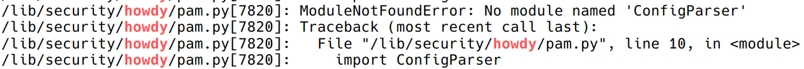
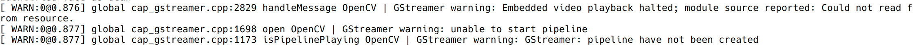

# 需求

你好！想让电脑跟你打招呼嘛，就像 Windows Hello 那样？来试试 Howdy 吧，它是 Linux 上通过电脑的红外传感器（或摄像头）识别人脸，解锁电脑的程序。


Arch Linux Wiki 上有对它的[介绍](https://wiki.archlinuxcn.org/wiki/Howdy)。Howdy 最新的稳定版是 v2.6.1，发布于 2020 年，因此有很多配置会在如今出现问题，在这篇博客中记录一下。

# 操作
## 安装
在 Arch Linux 上可以以 AUR 包的形式安装：
```shell
paru -S howdy
```
## 添加红外传感器 / 摄像头
可以在诸如 [cheese](https://archlinux.org/packages/extra/x86_64/cheese/)、[fswebcamAUR](https://aur.archlinux.org/packages/fswebcam) 或者 [v4l-utils](https://archlinux.org/packages/extra/x86_64/v4l-utils/) 的程序里找到并确定能连接到红外传感器的正确 `/dev/videoX` 文件，

以内置于 [v4l-utils](https://archlinux.org/packages/extra/x86_64/v4l-utils/) 软件包的工具为例：

```shell
$ v4l2-ctl --list-devices
Integrated_Webcam_HD: Integrate (usb-0000:00:14.0-11):
        /dev/video0
        /dev/video1

EyeChip: Tobii Video (usb-0000:00:14.0-3.4.3):
        /dev/video4
        /dev/video5

HD Webcam C525 (usb-0000:00:14.0-3.4.4):
        /dev/video2
        /dev/video3
```

在上述例子中，有不止一个网络摄像头，而且每一个摄像头都有好几个不同的 /dev/videoX 路径，一般来说选第一或第二个路径会比较好。

修改配置文件：

``` shell
sudo vim /lib/security/howdy/config.ini
```

```ini
# 修改以下内容
- device_path = none
+ device_path = /dev/videoX
```

对于我的笔记本电脑而言（幻 14 2022 / ROG Zyphyrus G14 (2022) ），摄像头路径为 `/dev/video0`，红外传感器路径为 `/dev/video2`。

如果设备有红外传感器，建议使用。使用摄像头会导致照片也能解锁设备。

## 配置红外传感器
由于红外传感器（IR Emitter）会闪烁发射，我们需要配置 `/lib/security/howdy/config.ini` 当中 `dark_threshold` 这个参数来忽略部分帧：

```ini
# Because of flashing IR emitters, some frames can be completely unlit
# Skip the frame if the lowest 1/8 of the histogram is above this percentage
# of the total
# The lower this setting is, the more dark frames are ignored
dark_threshold = 80
```

## 测试与录入人脸
测试 Howdy 的识别情况：

```shell
sudo howdy test
```

在 Howdy 中添加人脸：

```shell
sudo howdy add
```

查看添加的人脸模型：

```shell
sudo howdy list
```

## 取消拍照
Howdy 会在识别用户时拍照，然后保存到 `/lib/security/howdy/snapshots`。这某种程度来说是一个安全漏洞。攻击者能够轻易找到某次成功登录的照片并用它来冒充您进行登录，从而达到提权的目的。当然，攻击者还可以使用目标用户的任何其他照片，但是 Howdy 简化了该过程。

```shell
sudo vim /lib/security/howdy/config.ini
```

```ini
[snapshots]
capture_failed = false
capture_successful = false
```

## 鉴权配置
为了让 Howdy 能够对用户进行身份验证，您需要在使用了 Howdy 的 PAM 配置文件中做一些小改动。请把以下内容添加到对应的配置文件中：

```
auth sufficient pam_python3.so /lib/security/howdy/pam.py
```

需要 `sudo` 时启用，则添加到 `/etc/pam.d/sudo`，需要 SDDM 登录时启用，则添加到 `/etc/pam.d/sddm` 或 `/etc/pam.d/system-login`。

为 `howdy/pam.py` 添加 `sufficient` 的控制标记后，将只提示进行人脸身份验证。如果您无法中断（Ctrl+C）面部识别过程（比如在解锁屏幕和 Polkit 验证窗口中），那您将无法使用密码进行验证。想要既能人脸识别，又能用密码验证，请把以下内容添加到 `/etc/pam.d/` 下对应的 PAM 配置文件的最顶部。

```
auth sufficient pam_unix.so try_first_pass likeauth nullok
```

## 问题一：No module named 'ConfigParser'


这个问题是由于 Howdy 没有完全抛弃 Python 2 导致的。

修改 `/lib/security/howdy/pam.py`，将 `ConfigParser` 改为 `configparser`：

```Python
# pam-python is running python 2, so we use the old module here
import configparser

# Read config from disk
config = configparser.ConfigParser()
config.read(os.path.dirname(os.path.abspath(__file__)) + "/config.ini")
```

## 问题二：终端里有 GStreamer warnings


直接更改 log 输出等级即可。

```shell
sudo vim /etc/profile
```

在文件中添加 OpenCV log 日志等级环境变量：

```shell
export OPENCV_LOG_LEVEL=ERROR
```

## 使用
这样就大功告成了！如果配置了 `/etc/pam.d/sudo` 文件，可以直接新建一个终端，输入 `sudo -i` 来测试结果。