# 写在前面

这是我为自己高中的数学探索过程补上的拼图。我不是数学专业的学生，因此有很多推理过程会掺杂着自己的直觉，也会有很多不严谨的描述，感觉有点班门弄斧了，请各位多多包涵。如果各位能提出一些全新的观点，我更是感激不尽。

我还是不想做一个辜负以前的自己的人。

# 探索过程

高中时的一天，我闲来无事，在纸上画长方体的透视结构。以前学习的素描知识告诉我：所有不平行于画面的线都有灭点。同一个方向的所有直线，都有同一个灭点。对于长方体而言，就是每组四条平行的棱如果不平行于画面，（它们的延长线）就会相交于同一个点。

当时我想画一个符合两点透视（即只有一组棱平行于画面）的长方体。我怎么保证自己能够画出一个符合透视结构的长方体呢？

我先选取了两个灭点，又在两个灭点之间选取了一条线段作为最远离我们的那条棱（也是四条平行于画面的棱当中的一条），从两个灭点出发分别连接棱的两个端点，形成了两个面。接下来，我在两个平面分别选取一条棱（是四条平行于画面的棱当中的第二、三条），与第一条棱平行。再将新确定的两条棱的端点分别与对侧灭点相连，这样得到的两个交点，就确定了第四条棱。

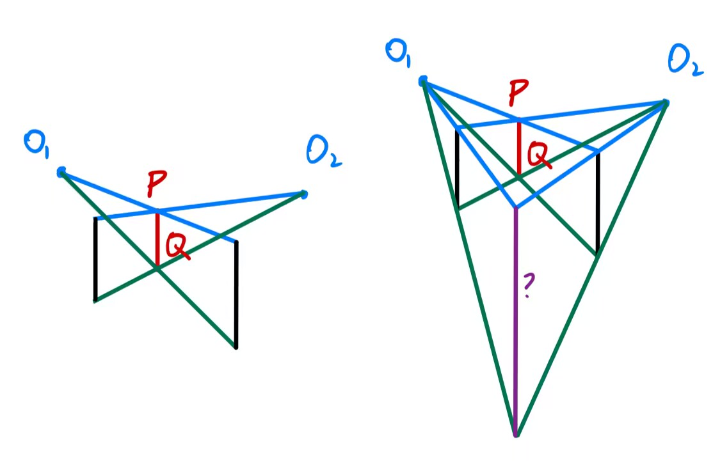

我当时就有个疑问：第四条棱为什么这样画出来就是平行的呢？我把这个过程用数学语言描述出来：

**叙述零：**$\forall\ l_1,l_2,l_3\subseteq\R^2,\ l_1\parallel l_2\parallel l_3$，三条直线将 $\R^2$ 分为 $\alpha_1,\alpha_2,\alpha_3,\alpha_4$ 四部分。

$$
\begin{gathered}
\forall\ O_1\in\alpha_1,\ O_2\in\alpha_4,\ P,Q\in l_2(P\neq Q)\\
O_1P\cap l_3=P_3,\ O_2P\cap l_1=P_1,\ O_1P_1\cap O_2P_3=P_4\\
O_1Q\cap l_3=Q_3,\ O_2Q\cap l_1=Q_1,\ O_1Q_1\cap O_2Q_3=Q_4\\
\Rightarrow P_4Q_4\parallel l_1\parallel l_2\parallel l_3 
\end{gathered}
$$

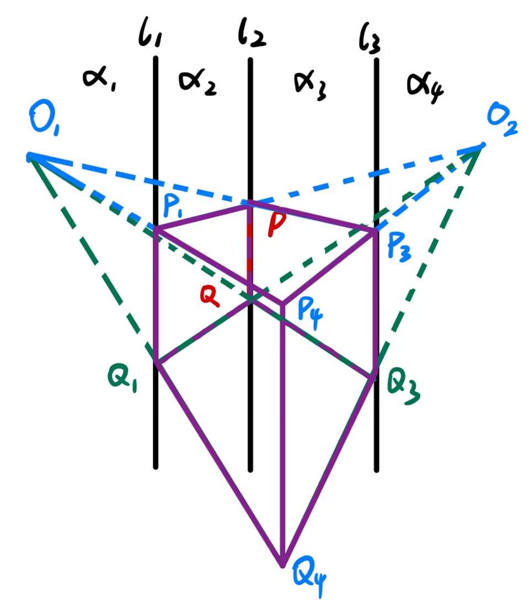

我还发现，如果沿着 $l_2$ 方向移动 $PQ$，或者沿着 $l_2$ 方向移动 $O_1,O_2$，$P_4Q_4$ 到 $l_1$ 的距离以及它的长度似乎都不会改变。于是可以做如下推广：

**叙述一：**$\forall\ l_4,l_1,l_2,l_3,l_5\subseteq\R^2,\ l_4\parallel l_1\parallel l_2\parallel l_3\parallel l_5$：

$$
\begin{gathered}
\forall\ O_1\in l_4,\ O_2\in l_5,\ P,Q\in l_2(P\neq Q)\\
O_1P\cap l_3=P_3,\ O_2P\cap l_1=P_1,\ O_1P_1\cap O_2P_3=P_4\\
O_1Q\cap l_3=Q_3,\ O_2Q\cap l_1=Q_1,\ O_1Q_1\cap O_2Q_3=Q_4\\
\Rightarrow P_4Q_4\parallel l_1\parallel l_2\parallel l_3\parallel l_4\parallel l_5\\
\text{If}\quad d_{l_4\rightarrow l_1},d_{l_1\rightarrow l_2},d_{l_2\rightarrow l_3},d_{l_3\rightarrow l_5}=\text{Constant}\\
\text{Then}\quad d_{P_4\rightarrow l_4}=\text{Constant}\\
\text{If}\quad PQ=\text{Constant}\\
\text{Then}\quad P_4Q_4 =\text{Constant}
\end{gathered}
$$

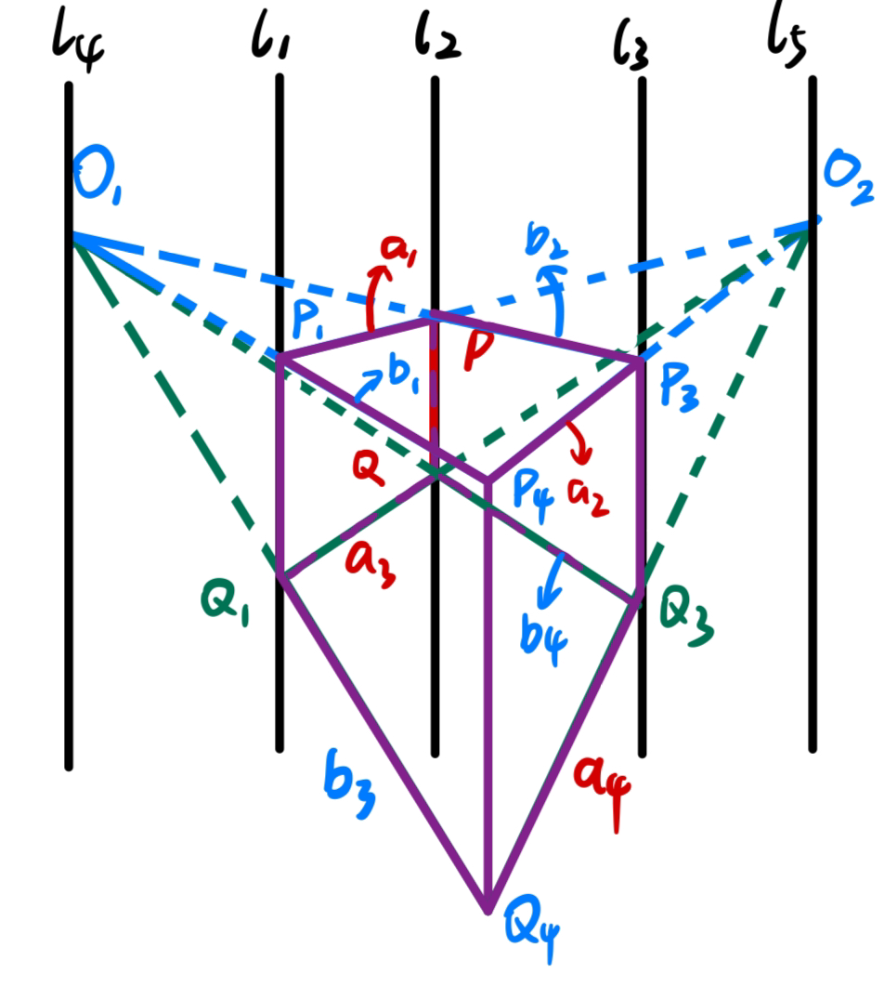

这看起来太复杂了。于是当时的我想把这个问题转换为一个更简单的问题，从而求解。

我发现 $P_4,Q_4$ 点的导出过程相同：在 $l_2$ 上选取一个点 $P$，分别由 $O_1,O_2$ 过该点做射线，分别交 $l_3,l_1$ 于 $P_3,P_1$，再做 $O_1P_1,O_2P_3$ 交于 $P_4$。于是我们可以将两个过程简化为一个过程，最终只需证明 $P_4$ 到其中任意一条平行线的距离为定值即可。

同样地，如果 $O_1,O_2$ 点沿着平行线方向移动，最终的距离仍是定值。这就转变成了一个更简单的问题：

**叙述二：**$\forall\ l_4,l_1,l_2,l_3,l_5\subseteq\R^2,\ l_4\parallel l_1\parallel l_2\parallel l_3\parallel l_5$：

$$
\begin{gathered}
\forall\ O_1\in l_4,\ O_2\in l_5,\ P\in l_2\\
O_1P\cap l_3=P_3,\ O_2P\cap l_1=P_1,\ O_1P_1\cap O_2P_3=P_4\\
\text{If}\quad d_{l_4\rightarrow l_1},d_{l_1\rightarrow l_2},d_{l_2\rightarrow l_3},d_{l_3\rightarrow l_5}=\text{Constant}\\
\text{Then}\quad d_{P_4\rightarrow l_4}=\text{Constant}\\
\text{If}\quad |y_{O_1}-y_P|,\ |y_{O_2}-y_P|=\text{Constant}\\
\text{Then}\quad |y_{O_1}-y_{P_4}|=\text{Constant}\\
\end{gathered}
$$

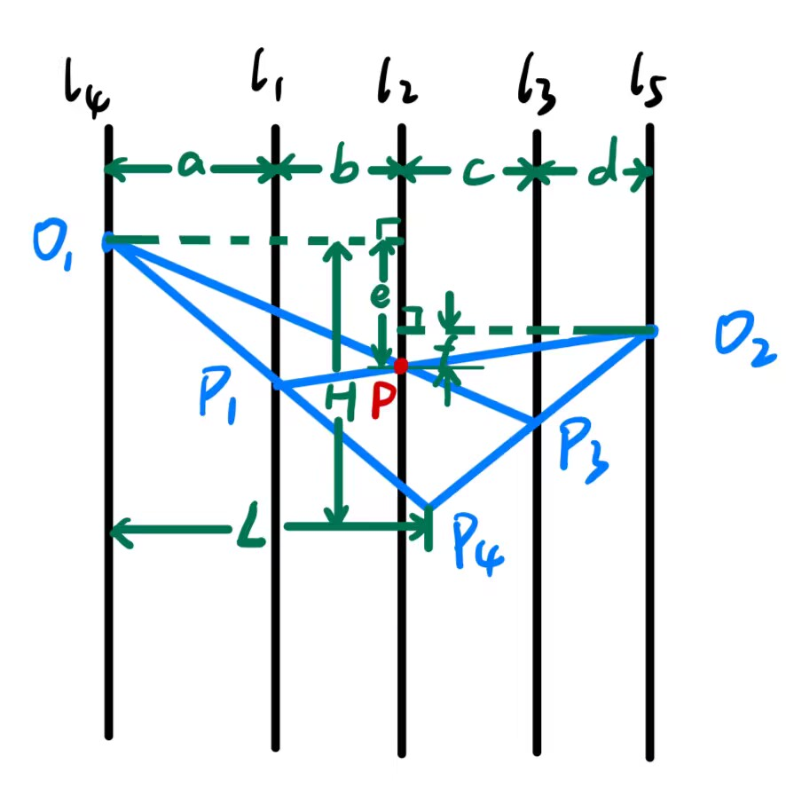

我在高中时想了很久，也没有一个很优美的解法。于是我转向了在当时（几乎）万能的解法：建系！以 $O_1$ 为原点，标定间距建立坐标系，经过一通计算（留作习题x），我得到了如下结果：

$$
\begin{gathered}
\text{More precisely, Let}\quad d_{l_4\rightarrow l_1}=a,\ d_{l_1\rightarrow l_2}=b,\ d_{l_2\rightarrow l_3}=c,\ d_{l_3\rightarrow l_5}=d\\
\text{Then}\quad d_{P_4\rightarrow l_4}=\frac{a(c+d)(a+b+c)}{ac+ad+bd}\\
\text{Let}\quad |y_{O_1}-y_P|=e,\ |y_{O_2}-y_P|=f\\
\text{Then}\quad |y_{O_1}-y_{P_4}|=\frac{(a+b+c)(ce+de+bf)}{ac+ad+bd}\\
\text{Let}\quad |y_{O_1}-y_Q|=e'\\
\text{Then}\quad |y_{P_4}-y_{Q_4}|=\frac{(a+b+c)(c+d)}{ac+ad+bd}|e-e'|=\text{Constant}\cdot \overlinesegment{PQ}
\end{gathered}
$$

终于得证！虽然过程不是很漂亮啦。不过我一直想着，由透视画法导出的结论，一定可以通过透视过程本身来导出。但因为高中学业繁重，并且能力不足，这个想法就一直被搁置了。

直到最近，我才把这些想法捡起来，并且决心要彻底解决这个问题。我在知乎上看到一篇很好的文章：[透视中的几何原理初步 - 知乎](https://zhuanlan.zhihu.com/p/169448538 "透视中的几何原理初步 - 知乎")。这篇文章是所有我所需要的。我从中选取并整理了一部分与这个问题相关的知识放在这里。让我们开始吧！

> 以下会涉及一些拓扑学相关内容，对我们理解平面透视的数学原理没有太大的影响。如果你对此感兴趣，可以去看看[拓扑学入门0——欧几里得空间的拓扑 - 知乎](https://zhuanlan.zhihu.com/p/541326042 "拓扑学入门0——欧几里得空间的拓扑 - 知乎")和[拓扑学(2) - 知乎](https://zhuanlan.zhihu.com/p/369819124 "拓扑学(2) - 知乎")。

## 视野的数学描述与透视的导出

### 视野与视球面

经验与理论可以告诉我们，我们所处的空间可以看成平直的、具有三个维度的空间，也就是三维 Euclid 空间 $\R^3$。假设我们作为一个观测者，处于 $\R^3$ 中的 $0$ 点不动，转动我们的头颅与眼球，我们可以接收来自不同方向的光，并且在脑中构成一幅图像，我们不严谨地将其称之为「**视野**」。现在的问题是，我们的视野究竟具有怎样的拓扑结构呢？

不考虑光的衍射与介质不均匀等问题，那么我们可以大致认为，光是沿着直线传播的。如果以观测点为顶点在空间作一条射线，那么射线上的所有点在我们的眼球中只能响应为一个单一的信号，这其实是一种等价关系 $∼$，它把以原点为端点的一条射线上（除去端点）上的所有点构造一个等价类，而所有等价类构成的商拓扑空间就是视野的拓扑空间。实际上，由于二维球面 $S^2$：

$$
S^2=(\R^3-0)/\sim
$$

就是如此构造出来的一个拓扑空间，所以我们认为，视野具有二维球面的拓扑结构，称之为**视球面**。这意味着，如果存在一个密封空心球形的画布，我们在它的内侧绘画，那么看画者处于球心就可以还原出真实的视觉。

为了便于理解，我画了个示意图：

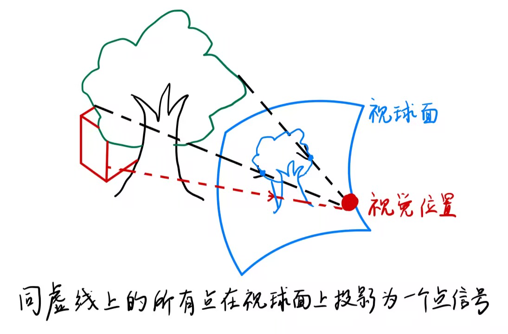

### 球面上的几何基础

在涉及球的问题中，与其在空间中使用直角坐标 $(x,y,z)$，更自然的是使用球坐标系 $(r,\theta,\varphi)$：

$$
\begin{cases}
  x = r\sin\theta\cos\varphi\\ 
  y=r\sin\theta\sin\varphi\\
  z=r\cos\theta
\end{cases}
(r\ge0,\ 0\le\theta\le\pi)
$$

其中我们也把 $z$ 轴的正半轴称为**极轴**。习惯上，我们称 $\theta$ 为**余纬度**，$\varphi$ 为**经度**。在有时候，使用**纬度** $\phi=\pi/2-\theta$ 会比使用余纬度更加方便，不过在绝大部分时间，我们都使用余纬度。

有了空间的球坐标系之后，我们可以直接方便地把 $S^2$ 等同于 $\R^3$ 中 $r=1$ 所有点的集合，所以也可以用球面坐标 $(\theta,\varphi)$ 标注 $S^2$ 上的点。在这种定义下，我们就可以把 $\R^3-\{0\}$ 自然投影到 $S^2$ 上：

$$
\begin{gathered}
\sigma:(\R^3-\{0\})\rightarrow S^2\\
(r,\theta,\varphi)\mapsto(\theta,\varphi)
\end{gathered}
$$

这个投影映射也被称为**视球面投影**。

### 直线与平面在视球面上的投影

考虑空间上距离原点为 $d$ 的一条直线，以与直线平行的方向为极轴建立球坐标系，那么直线可以写作以 $t$ 为参数的参数方程：

$$
\begin{cases}
  r = \sqrt{t^2 + d^2} \\ 
  \theta=\arctan\frac{d}{t}\\
  \varphi = \varphi_0
\end{cases}
$$

其中 $t$ 的几何意义是直线上的点到原点在直线上垂点的距离。把这条直线上各点投影到视球面上，得到球面上的投影参数方程为：

$$
(\theta=\arctan\frac{d}{t},\varphi = \varphi_0)
$$

这是球面上的一条经线，令 $t\rightarrow\infin$，得到

$$
\lim_{t\rightarrow+\infin}(\theta,\varphi)=(\pi-,\varphi_0)\\
\lim_{t\rightarrow-\infin}(\theta,\varphi)=(0+,\varphi_0)
$$

可见，在空间中无限延展的直线投影在视球面上是有限的，并且直线的无穷远处的投影对应视球面上的两个端点，被称为**消失点**。直线的消失点位于球面的两极，两极在空间中的连线与直线平行。并且我们可以看到，由于 $\theta=0,\pi$ 时，$\varphi$ 的差异失去了意义，所以无论直线距离原点多远（$d$ 为何值）、直线在原点的什么方向上（$\varphi_0$ 为何值），它们都消失在一对相同的点上。

综上所述，可以如下表述：**空间中一族平行线在视球面上投影为一族经线，并且消失在同一对极点上**。

现在考虑空间中的平面在视球面上的投影性质。考虑一不过原点的平面，那么取平面法线方向为极轴建立球坐标系，那么平面约束方程可以写为：

$$
r\cos⁡\theta=\text{const}=z_0
$$

其中 $z_0$ 的物理意义是平面交极轴的截距。

不妨假设 $z_0<0$，那么当 $r$ 从 $|z_0|$ 增长到 $+\infin$ 时，$\theta$ 可以取满 $(π/2,π]$，并且在无穷远处的投影满足

$$
\lim_{r\rightarrow\infin}⁡\theta=\pi/2
$$

这正是赤道本身，并且这与 $z_0$ 的选取无关。这就意味着：**空间中一个平面在视球面上的投影是一个半球面，并且一族平行的平面消失于同一圈赤道**。

现在给定一个平面，在这个平面内任意取一条直线，那么这条直线在视球面上的投影必定是这个平面的投影的子集。在无穷远处， 这条直线在视球面中的一对消失点必然处于平面的消失圈上。而考虑空间中任意与该平面平行的直线，由于我们必定能找到平面内的一条直线与给定直线平行，而平行线消失于同一对极点，所以我们可以得到更加强的结论：**如果一条直线平行于（或者属于）某平面，那么直线的一对消失点位于平面的消失圈上**。

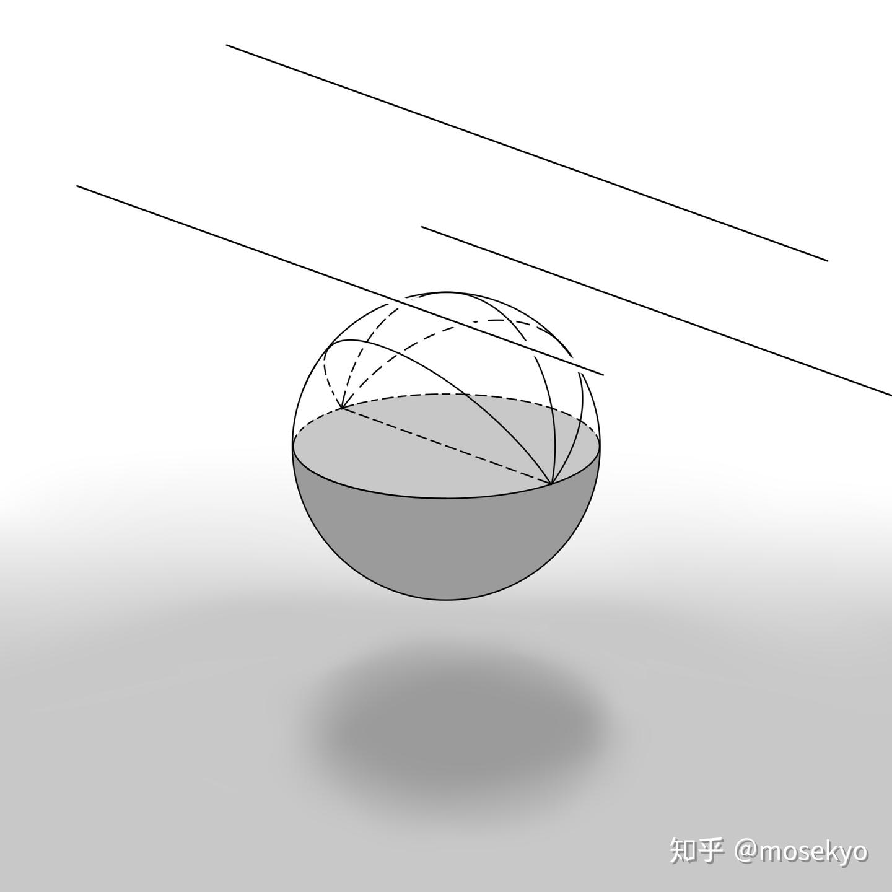

### 画布投影

由于球面形状的画布很难存在，我们在现实中只能将图画在一个平面上。如何把视球面上的图像映射到平面画布上，则属于**画布投影**的范畴。

画布投影的定义为一个连续的单射：

$$
\sigma:S\rightarrow U
$$

> 由于 $S^2$ 是紧的并且与 $\R^2$ 中的紧集不同胚，所以 $S≠S^2$。

其中 $S$ 与 $U$ 分别是 $S^2$ 与 $\R^2$ 中的开集。一般我们不能把视球面上的信息完全地呈现在平面画布中。由于 $\sigma$是 连续映射，视球面中的消失点、消失圈和它们之间的包含关系等作为拓扑性质得以保存，这给予绘画很多的便利。而**透视**一词指的是选定了画布投影之后，如何在画布上体现画像对应现实中的空间关系的一系列方法或规则。

现在介绍一类较常见的画布投影方式——[**球轴平面投影**](https://zhida.zhihu.com/search?content_id=125789214\&content_type=Article\&match_order=1\&q=球轴平面投影\&zhida_source=entity "球轴平面投影")：

$$
\begin{gathered}
\lambda\pi_a:\{S^2|\theta<\arccos ⁡a\}\rightarrow\R^2\\
(\theta,\varphi)\mapsto\lambda\frac{(1-a)\sin⁡\theta}{\cos⁡\theta-a}(\cos\varphi,\sin\varphi)
\end{gathered}
$$

其中 $-1\le a<1$ 为轴参数，$\lambda>0$ 为缩放系数。球轴投影的物理意义是把投影点放在极轴 $z=a$ 处，把投影面置为平面 $z=\lambda$，把视球面通过直线连线投影到投影面上。视球面中 $\theta=0$ 应在画布中的投影点具有特殊的地位，我们称之为**央点**，它是画布上的缩放关系空间分布的对称点。

当 $a=0$ 时为**球心投影**：

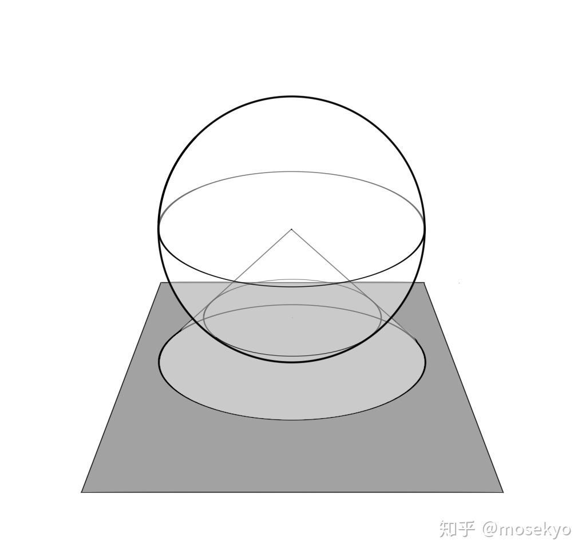

$$
\begin{gathered}
\lambda\pi_0:\{S^2|\theta<\frac{\pi}{2}\}\rightarrow\R^2\\
(\theta,\varphi)\mapsto\lambda\tan\theta(\cos\varphi,\sin\varphi)
\end{gathered}
$$

$\lambda\pi_0$ 对应的是传统的平面透视画法，由于 $\lambda\pi_0$ 等价于直接把 $\R^3$ 的一个半空间经 $0$ 投影到投影面上，它具有很多好的性质。

## 平面透视画法

### 平面射影几何中的无穷远点

在 Euclid 平面几何中，两直线如果永远不相交，便一定平行。在平面射影几何中，我们在除 $\R^2$ 中的点之外引入**无穷远点**的概念，相对地称原来 $\R^2$ 中的点为**有限远点**。我们规定：

1. 每一条 Euclid 几何中的直线过且仅过一个无穷远点；
2. 两条 Euclid 几何中的直线平行当且仅当它们经过同一个无穷远点；
3. 所有的无穷远点构成一条不通过所有有限远点直线，这条直线被称为**无穷远直线**。

从这些描述可以看出，所有无穷远点构成的集合具有一维投影空间 $P^1$ 的拓扑结构。在 Euclid 平面几何中，我们有两点确定一条直线的公设，它在平面射影几何中依然成立：

1. 如果给定两个有限远点，那么它们确定的直线就是在 Euclid 几何中确定的直线；
2. 如果给定一个有限远点、一个无穷远点，那么它们确定的直线过有限远点、并且平行于任何过该无穷远点的直线；
3. 如果给定任意两个无穷远点，那么它们确定的直线是无穷远直线。

> 引入射影几何中无穷远点的概念，有利于在平面透视理论中精简我们的语言。无穷远点并不是虚构的概念，实际上，由于 $\R^2$ 同胚于 $(D^2)^\circ=\{(x,y)\in\R^2|x^2+y^2<1\}$，把 $\partial D^2=C^1$ 的对径点粘合，我们就把 $D^2$ 转化成了平面射影空间 $P^2$。在这里 $C^1$ 经过粘合后得到的点集就可以看成无穷远点，无穷远点在其中起到了把 $\R^2$「紧化」的作用。

### 球心投影的平直性质

由于球心投影是从球心直接把视球面投影到平面上，而视球面也是通过空间上每一点向球心投影得到，所以我们可以忽略中间过程的视球面、直接把球心投影看成把空间经过原点投影到平面上。这也是我们称球心投影画法为**平面透视**的缘由。球心投影一个很好的性质就是它**把视球面上的测地线投影为画布上的直线**，这是由于视球面上的测地线是空间中直线的像，而直线经过平面投影必须成直线。

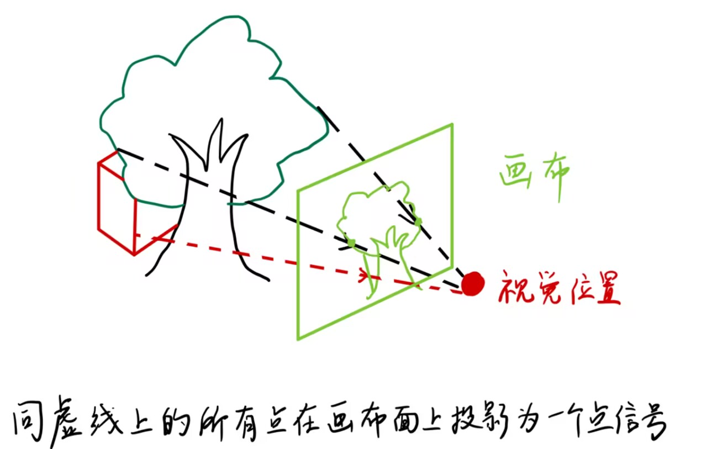

球心投影在 Euclid 几何中只能作用于视球面 $\theta<\pi/2$，这是由于在 $\theta=\pi/2$ 处 $\tan\theta$ 无意义。在射影几何中，我们就可以把 $\theta=\pi/2$ 的赤道映射到无穷远点。在视球面上，空间中直线的像消失于一对极点，如果其中一个极点在 $\theta<\pi/2$ 一侧，那么只有一个消失点被投影到画布上；而如果这对极点刚好位于 $\theta=\pi/2$ 赤道上（此时直线平行于投影面），那么赤道对径点的粘合保证了这两个消失点映射到了画布上的同一个无穷远点处。所以我们就得到了平面透视的直线消失规则：**在射影几何意义上，空间中的直线在画布中必消失于一点，并且空间中的直线平行当且仅当它们在画布中消失于同一点**。

对于平面的消失我们也有类似的结论。在视球面中，平面消失于一条赤道。由于赤道在 $S^2$ 中也是测地线，当它有一半处于 $\theta<\pi/2$ 一侧时，平面在画布中消失于一条有限远直线；当平面的消失线刚好就是 $\theta=\pi/2$ 时（此时平面平行于投影面），平面消失于无穷远直线。所以我们就得到了平面透视的平面消失规则：**在射影几何意义上，空间中的平面在画布中必消失于一条直线，并且空间中的平面平行当且仅当它们在画布中消失于同一直线**。

在视球面中，如果直线与平面平行，那么直线的一对消失极点位于平面的消失圈上。由于我们把赤道、消失点等投影到画布上射影几何意义的直线与点了，它们之间的包含关系不会改变。所以我们得到：**在射影几何意义上，若空间中一直线平行于（或属于）一平面，那么直线的消失点位于平面的消失线上**。

### 平面透视中的距离关系

平面透视中一个很重要的问题就是如何在画面中表现在空间中等距的一系列点，也就是画布中的距离如何与现实中的距离相对应的问题。

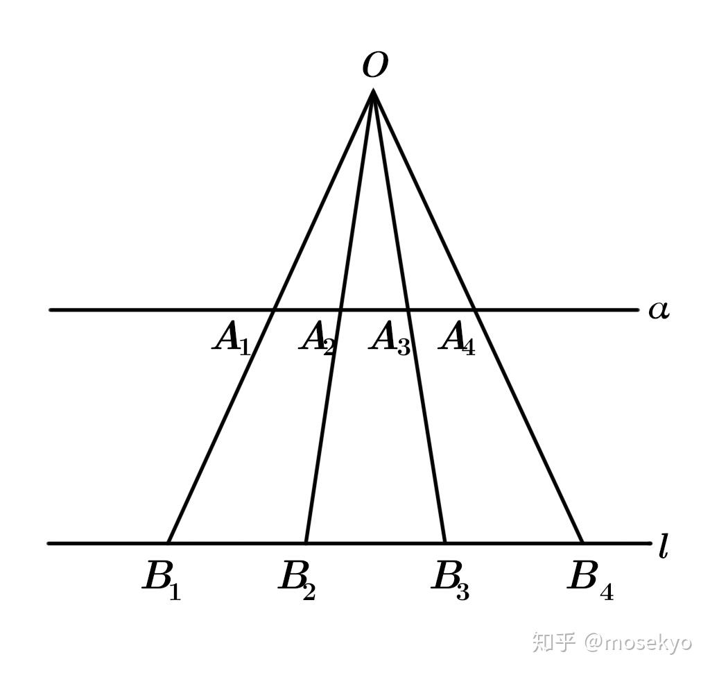

如果有一条直线平行于投影面，那么直线上等距的点 $B_1,B_2,···$ 投影到 $A_1,A_2,···$ 之后会有自然的相似关系 $\triangle A_1OA_2\sim\triangle B_1OB_2$，并且有这样的相似关系都有一样的相似比，这就保证了画布上 $A_1,A_2,···$ 也是等距的点。

### 平面透视中正交系的几何关系

在视球面上，我们说三个点 $A,B,C$ 是正交的，当且仅当对应的单位矢量 $\vec{A},\vec{B},\vec{C}$ 是正交的。我们称三个正交点为一**正交系**。确认正交系在画布上投影的位置是十分重要的，这是由于我们现实空间中的物体大多可以抽象为长方体，而各个长方体基本具备各边平行的性质。确定了正交系（也就是对应长方体三组棱的消失点）的位置，我们就可以较为方便地定出空间中各个点的位置。

示意图 视球面上的正交系(A,B,C)示意图 ")

正交系有一个非常好的性质：**正交系三点中任意一点都是过其他两点的赤道圈的对应极点**。

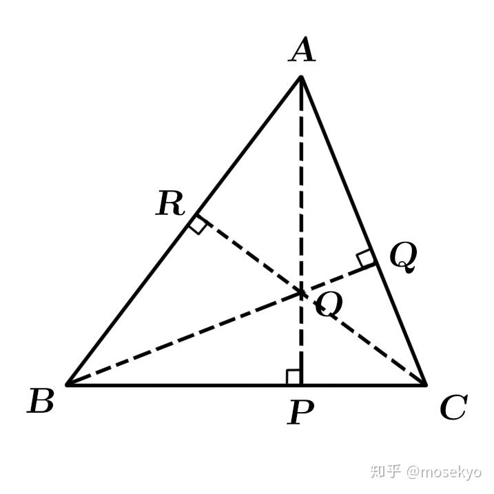

在画布中画出正交系的对应点 $A,B,C$ 与央点 $O$。如果我们延长 $AO$ 交 $BC$ 于 $P$，那么 $AP$ 在视球面中所在的赤道必定与 $BC$ 的垂直。经过一些计算，可以得到在画布上必有 $AP\perp BC$，同理还有 $BQ\perp AC$ 与 $CR\perp AB$。所以我们得到一个很优美的结论：**央点** $O$ **是正交系** $A,B,C$ **三点构成的** $\triangle ABC$ **的垂心**。

由于 $AP,BQ,CR$ 在视球面中对应的都是长度为 $\pi/2$ 的测地线并且都过 $O$ 点。如果 $OA=\lambda\tan⁡\theta$，那么就有

$$
OP=\lambda\tan⁡(\pi/2-\theta)=\lambda\cot⁡\theta
$$

更一般地有：

$$
OA⋅OP=OB⋅OQ=OC⋅OR=\lambda^2
$$

也就是说，假设我们不知道球心投影的央点在何处，$\lambda$ 为多少，那么我们在画布中确定出某个正交系三点的位置之后，就可以反过来作出央点 $O$ 并计算出 $\lambda$ 的数值。也就是说，**一个正交系同样蕴含了平面投影中的全部信息**。当一个正交系三点都是有限远点的时候，我们称这个正交系为**三点透视**。

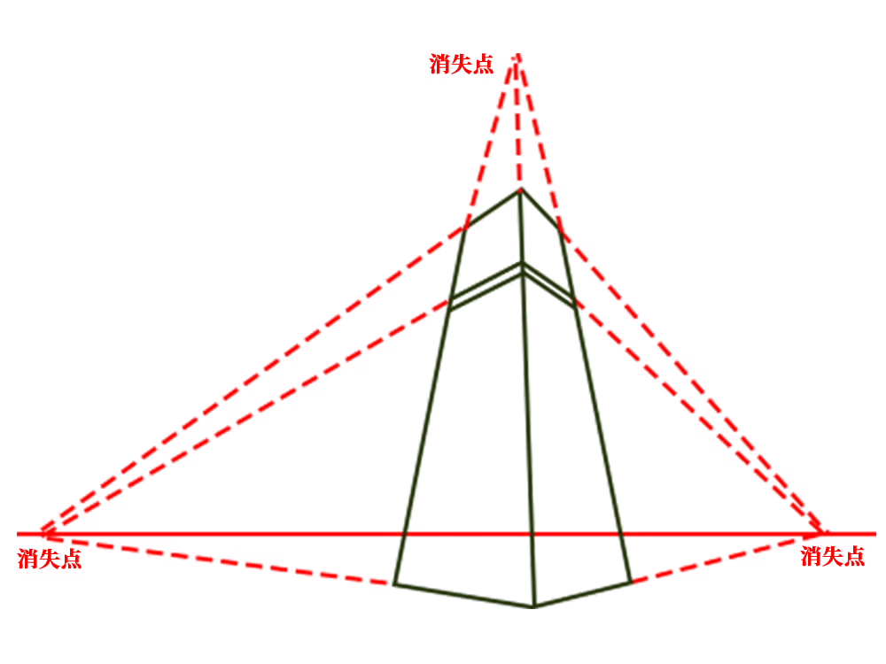

考虑一种特殊情况，正交系中某一点（假设为 $A$）是无穷远点，那么 $O$ 将退化到 $BC$ 上，过 $A$ 的直线与 $BC$ 垂直，并且

$$
OB⋅OC=\lambda^2
$$

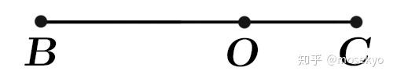

此时我们需要在确定 $BC$ 额外确定 $O$，才能确定 $\lambda$ 的值。我们称这样的情况为**两点透视**。

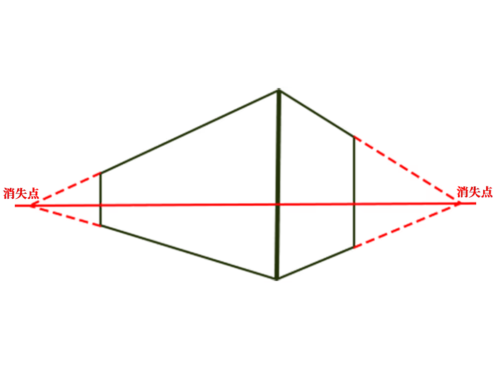

更极端地，我们考虑正交系中有两点是无穷远点（假设为 $A,B$），那么 $O$ 与 $C$ 重合，过 $A$ 与过 $B$ 的直线互相垂直。此时我们要额外自己设定 $\lambda$ 的值，才能构造出一个完整的平面透视。我们称这样的情况为**一点透视**。

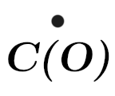

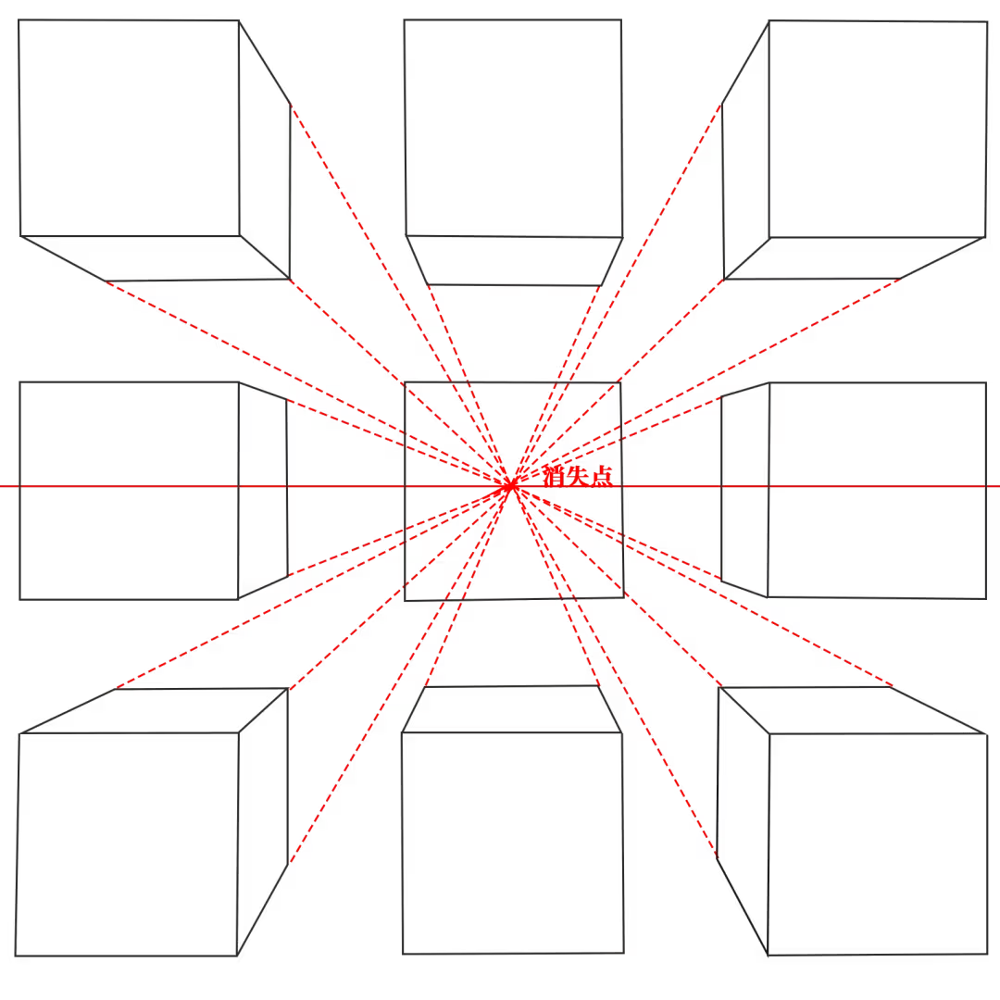

了解了以上知识，我们就可以将叙述一转变为一个三维空间当中的问题。

（根据上文提到的知识）我们可以看出，叙述一其实是一个两点透视的例子。

建立 $\R^3$ 中部分开集到 $\R^2$ 的映射：

$$
\exists\ a_1,a_2,a_3,a_4,\ b_1,b_2,b_3,b_4,\ l^{'}_1,l^{'}_2,l^{'}_3,l^{'}_4\subseteq\R^3, \\a_1\mapsto P_1P,a_2\mapsto P_4P_3,a_3\mapsto Q_1Q,a_4\mapsto Q_4Q_3,\\
 b_1\mapsto P_4P_1,b_2\mapsto P_3P_1,b_3\mapsto Q_4Q_1,b_4\mapsto Q_3Q,\\
 l^{'}_1\mapsto l_1,l^{'}_2\mapsto l_2,l^{'}_3\mapsto l_3,l^{'}_4\mapsto P_4Q_4
$$

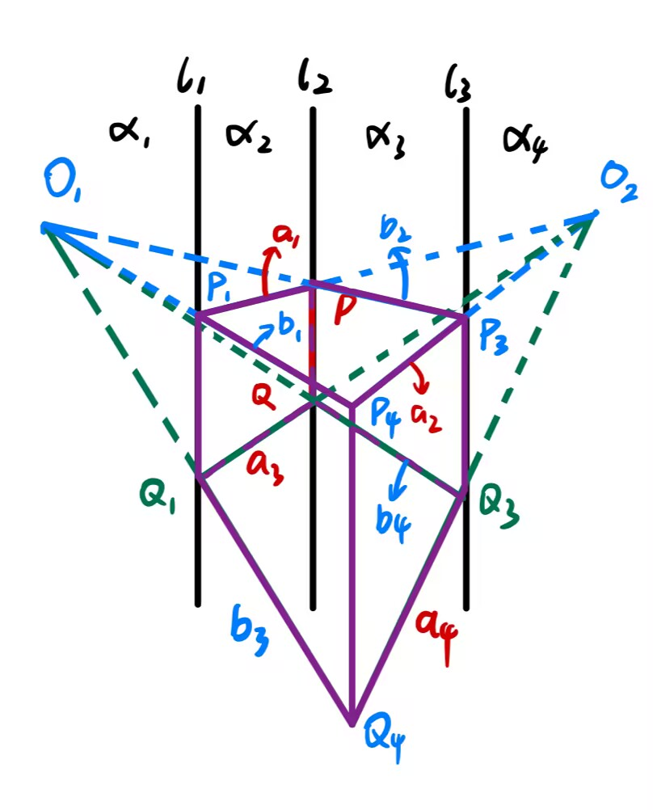

为了便于证明和理解，我们假设原 $\R^3$ 中的直线构成一个六面体（必然能找到这样的映射）：

$$
\begin{gathered}
\exists\ P^{'}_1,P^{'},P^{'}_3,P^{'}_4,\ Q^{'}_1,Q^{'},Q^{'}_3,Q^{'}_4\in\R^3,\\
a_1\cap b_1\cap l^{'}_1=P^{'}_1\mapsto P_1,\ a_1\cap b_1\cap l^{'}_1=Q^{'}_1\mapsto Q_1,\ \\
a_1\cap b_2\cap l^{'}_2=P^{'}\mapsto P,\ a_3\cap b_4\cap l^{'}_2=Q^{'}\mapsto Q,\ \\
a_2\cap b_2\cap l^{'}_3=P^{'}_3\mapsto P_3,\ a_4\cap b_4\cap l^{'}_3=Q^{'}_3\mapsto Q_3,\ \\
a_2\cap b_1\cap l^{'}_4=P^{'}_4\mapsto P_4,\ a_4\cap b_3\cap l^{'}_4=Q^{'}_4\mapsto Q_4\ \\
\end{gathered}
$$

在画布中，有

$$
\begin{gathered}
P_1P\cap P_4P_3\cap Q_1Q\cap Q_4Q_3=O_2\\
P_3P\cap P_4P_1\cap Q_3Q\cap Q_4Q_1=O_1\\
l_1\parallel l_2 \parallel l_3
\end{gathered}
$$

根据“**在射影几何意义上，空间中的直线在画布中必消失于一点，并且空间中的直线平行当且仅当它们在画布中消失于同一点**”，我们得到

$$
\begin{gathered}
a_1\parallel a_2\parallel a_3\parallel a_4,\ b_1\parallel b_2\parallel b_3\parallel b_4,\\
l_1\cap l_2\cap l_3=\infin\Rightarrow l'_{1}\parallel l'_{2}\parallel l'_{3}
\end{gathered}
$$

于是我们成功将**二维平面**上的问题转移到了**三维空间**中：

**叙述三：** $\forall a_1,a_2,a_3,a_4,\ b_1,b_2,b_3,b_4,\ l_1,l_2,l_3,l_4\subseteq \R^3$，12 条线段构成空间中具有 8 个顶点，3 组每组 4 条棱（ $a_1,a_2,a_3,a_4$、$b_1,b_2,b_3,b_4$、$l_1,l_2,l_3,l_4$ 各一组）的六面体，其中 $a_1\parallel a_2\parallel a_3\parallel a_4,\ b_1\parallel b_2\parallel b_3\parallel b_4$：

$$
\begin{gathered}
\text{If}\quad l_1\parallel l_2\parallel l_3\\
\text{Then}\quad l_1\parallel l_2\parallel l_3\parallel l_4
\end{gathered}
$$

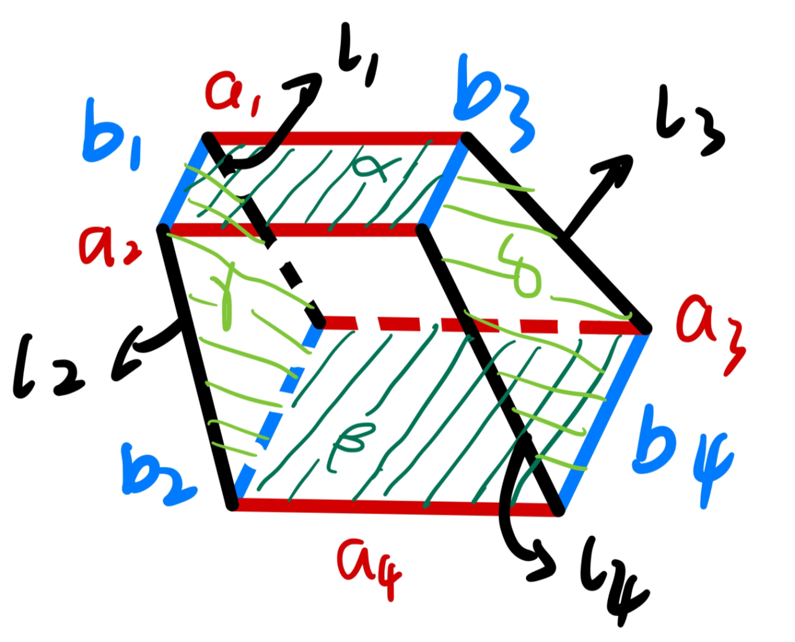

现在问题就变得十分容易解决了：

$$
\begin{gathered}
b_1\parallel b_2,\ l_1\parallel l_2\Rightarrow b_1=b_2\\
b_1\parallel b_3,\ a_1\parallel a_2\Rightarrow b_1=b_3\\
b_2\parallel b_4,\ a_3\parallel a_4\Rightarrow b_2=b_4\\
b_3\parallel b_4,\ b_3=b_4\Rightarrow l_3\parallel l_4
\end{gathered}
$$

我们还能解释为什么 $PQ$ 沿着自己方向平移时，$P_4Q_4$ 也只会在自己方向上平移：

由平行于画布的直线上的距离关系，我们可以得到如下结论：**在平行于画布的直线上的线段沿着该直线方向做平移运动，则它在画布上的投影线段也沿着投影直线做平移运动**。

$PQ$ 沿着它所在直线方向运动时，相当于它所在的六面体沿着沿着 $PQ$ 所在直线方向（平行于画布）运动，因此与 $PQ$ 平行的棱都会沿着它们所在的方向运动。

## 还没结束...

等等，关于叙述三和叙述一之间，我们还差了一个东西：当灭点沿着平行线平移时，$P_4Q_4$ 也会沿着平行线平移。这部分该怎么从三维空间证明呢？

我们的第一想法肯定是：当 $O_2$ 平移时，对应的平行六面体发生了什么变化。在央点不变的情况下（为什么要强调央点不变，可以查看后文“一点透视”部分），由于 $O_1$ 以及 $PQ$ 不变，我们马上就可以得到 $P_3Q_3$ 不变。我们可以首先得到结论：四边形 $PQQ_3P_3$ 不发生变化。

我们肯定还想知道，$l_5$ 这条直线有什么特别之处。根据“**在射影几何意义上，空间中的平面在画布中必消失于一条直线，并且空间中的平面平行当且仅当它们在画布中消失于同一直线**”这个结论，我们可以很自然地猜想：面 $PQQ_1P_1,P_3Q_3Q_4P_4$ 的灭线就是 $l_5$。

怎么证明呢？我们发现这两个面的特殊之处就是它们都过平行于画布的直线。根据立体几何知识可得：**过平行于画布直线的平面，其与画布的交线与该直线平行**。（1）

接下来该研究灭线的性质了。我们知道空间平面上的点与央点连线再和画布的交点就是投影点。将平面无限延伸，相当于央点过投影点的射线与平面相交在无限远处。此时我们可以看作其平行于空间平面。于是有：

$$
\forall\ \alpha,\beta\subseteq\R^3,\ \alpha\parallel\beta,\ \exists\ \gamma\subseteq\R^3,\ \gamma\cap\alpha=l_1,\ \gamma\cap\beta=l_2\Rightarrow l_1\parallel l_2 
$$

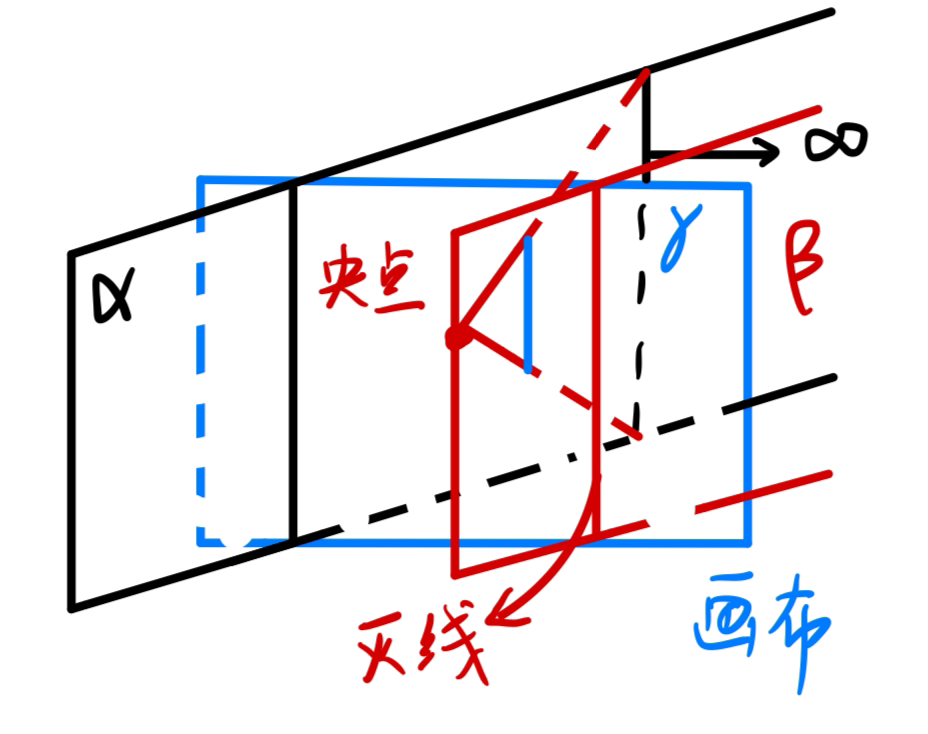

我们得到了另一个结论：**与画布相交的平面，其灭线与交线平行**。（2）

**结论（1）与（2）** 可以导出：**过平行于画布直线的平面，其灭线与该直线平行**。问题就这么解决了！

同样地，我们也可以证明平面 $PQQ_3P_3,P_1Q_1Q_4P_4$ 的灭线就是 $l_4$。

由“面 $PQQ_1P_1,P_3Q_3Q_4P_4$ 的灭线是 $l_5$”这个结论，可以推出 $O_2$ 始终在原来的平面 $PQQ_1P_1,P_3Q_3Q_4P_4$ 上移动，因此 $O_2$ 对 $PQ,P_3Q_3$ 做射线所形成的两个平行面 $PQQ'_1P'_1,P_3Q_3Q'_4P'_4$ 的位置是不会发生变化的。

我们现在已经知道三个面不会改变了，剩下的三个面中还有一对平行的面：$P_1PP_3P_4,Q_1QQ_3Q_4$。显然我们需要找到它们与 $O_1,O_2$ 之间的关系。我们有

$$
P_1PP_3P_4\cap P_3P_4Q_4Q_3=P_4P_3
$$

根据“**在射影几何意义上，若空间中一直线平行于（或属于）一平面，那么直线的消失点位于平面的消失线上**”，我们得到 $P_4P_3$ 的灭点 $O_2$ 同时在两个平面的灭线上。并且“**空间中的平面平行当且仅当它们在画布中消失于同一直线**”，故这两个平面的灭线不同。于是我们得到一个非常重要的结论：

**两不平行平面，其交线的灭点就是其灭线的交点。**$(*)$

因此 $O_2$ 是面 $P_1PP_3P_4,Q_1QQ_3Q_4$ 的灭线上的点。同理，我们可以得到 $O_1$ 也是这两个面的灭线上的点。

这真是振奋人心的时刻：$O_1O_2$ **是面** $P_1PP_3P_4,Q_1QQ_3Q_4$ **的灭线**。

因此，$O_2$ 向下平移，我们可以看作是灭线绕着 $O_1$ 旋转。我们说过，在这个过程中 $O_1$ 不会发生变化。$O_1$ 是面 $P_1PP_3P_4,PQQ_3P_3$ 灭线的交点，逆用**结论** $(*)$，$O_1$ 作为 $P_3P$ 的灭点不变。而我们又知道，在央点不变的情况下，$P_3P$是不会发生改变的。那么：面 $P_1PP_3P_4$ **在此过程中以** $P_3P$ **为轴旋转**。同理，面 $Q_1QQ_3Q_4$ **在此过程中以** $Q_3Q$ **为轴旋转**。

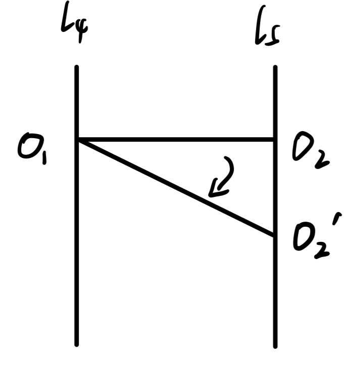

只剩最后一个面 $P_1Q_1Q_4P_4$ 了。这也不是一件难事：

$$
O_2O'_2\parallel PQ\parallel P_1Q_1,\ \triangle O_2PQ\sim\triangle O_2P_1Q_1
$$

由此得到 $P_1Q_1$ **在此过程中沿** $l_1$ **平移**。根据“**在平行于画布的直线上的线段沿着该直线方向做平移运动，则它在画布上的投影线段也沿着投影直线做平移运动**”（这里不是很严谨，但结果很直观），$P_1Q_1$ 对应的三维线段也在进行平移，其所在直线未发生变化。由于面 $PQQ_3P_3$ 未发生变化，而 $P_1Q_1\parallel PQQ_3P_3$，**过平面外一平行直线只能做一个平行面**，我们得到平面 $P_1Q_1Q_4P_4$ 的空间位置也未发生变化。

由“面 $P_1PP_3P_4$以$P_3P$ 为轴旋转，面 $Q_1QQ_3Q_4$ 以 $Q_3Q$ 为轴旋转，$P_1Q_1$ 进行平移”可以得到四边形 $P_1Q_1Q_4P_4$ 形状不发生改变，仍是平行四边形。

我们终于搞清楚了：$O_2$ 平移时，**在央点不变情况下**，对应的平行六面体发生了**错切变换**（**Shear Mapping**）。这相当于保持面 $P_1Q_1Q_4P_4,PQQ_3P_3$ 之间距离不变，将四边形 $P_1Q_1Q_4P_4$ 沿着平行线方向平移。

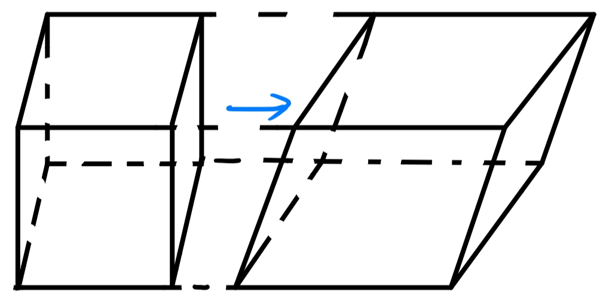

那么，$P_4Q_4$ 就会在此过程中沿着平行线方向进行平移。

最终得证！

## 推论

以上我们讨论的是两点透视的情况。如果是三点透视，或是一点透视呢？我们能得到什么相似的结论？

### 三点透视

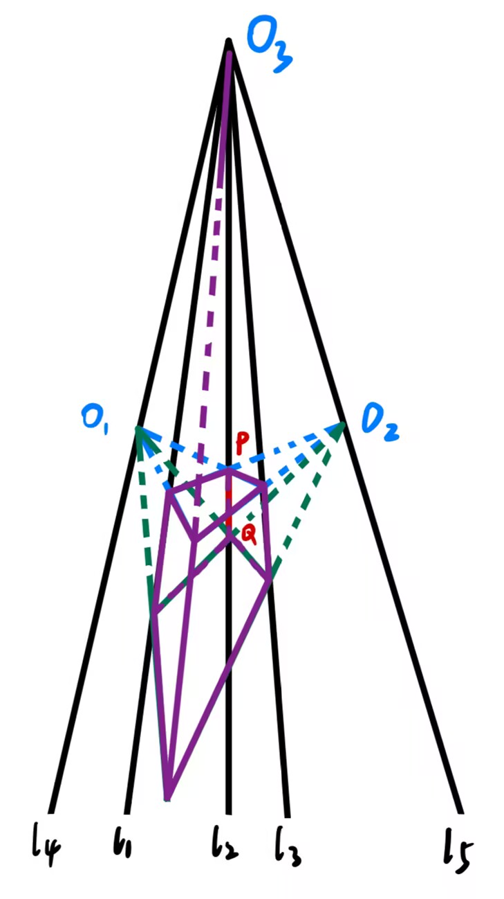

在这种情况下，$P_4Q_4$ 所在的直线会与 $l_1,l_2,l_3,l_4,l_5$ 交于同一个灭点（易得）。但对于不平行于画布方向的移动，我们就需要重新考虑了（以下摘自[透视中的几何原理初步 - 知乎](https://zhuanlan.zhihu.com/p/169448538 "透视中的几何原理初步 - 知乎")）：

我们把视球面投影与球心投影复合，得到

$$
\lambda \pi_{0} \circ \sigma: \begin{bmatrix} x = r \sin \theta \cos \varphi \\ y = r \sin \theta \sin \varphi \\ z = r \cos \theta \end{bmatrix} \mapsto \begin{bmatrix} \theta \\ \varphi \end{bmatrix} \mapsto \begin{bmatrix} x' = \lambda \tan \theta \cos \varphi \\ y' = \lambda \tan \theta \sin \varphi \end{bmatrix}
$$

考虑 $\R^3$ 中一条直线

$$
\begin{cases}
  x = x_0+t\sin\alpha\cos\beta \\ 
  y=y_0+t\sin\alpha\sin\beta\\
  z=z_0+t\cos\alpha
\end{cases}
$$

其中 $t$ 为参数，标注了直线上的点到 $(x_0,y_0,z_0)$ 的距离；直线的方向以球面坐标 $(\alpha,\beta)$ 标示。我们把这条直线投影到画布上，得到

$$
\begin{gathered}
\begin{cases}x' = \lambda \frac{x_0 + t \sin \alpha \cos \beta}{z_0 + t \cos \alpha} = \lambda \tan \alpha \cos \beta + \lambda \frac{x_0 - z_0 \cos \beta \tan \alpha}{z_0 + t \cos \alpha}\\
y' = \lambda \frac{y_0 + t \sin \alpha \sin \beta}{z_0 + t \cos \alpha} = \lambda \tan \alpha \sin \beta + \lambda \frac{y_0 - z_0 \sin \beta \tan \alpha}{z_0 + t \cos \alpha}\\\end{cases}
\end{gathered}
$$

令 $t\rightarrow+\infin$，得到

$$
\begin{cases}
x' \rightarrow \lambda \tan \alpha \cos \beta \\
y' \rightarrow \lambda \tan \alpha \sin \beta
\end{cases}
, (x', y') \rightarrow \lambda \pi_0 [(\theta = \alpha, \varphi = \beta)]
$$

可以看到，**直线在画布中的消失点就是直线所在方向的球面坐标在画布上的投影**。注意到此处当 $\alpha=\pi/2$ 时，方便讨论我们认为 $(x',y')$ 趋向的是一个无穷远点。

现在我们研究这条直线上的点从 $(x_0,y_0,z_0)$ 出发走过 $t$ 的距离之后，它会在画布上走过多长的距离。记这个距离为 $l(t)$，那么我们有

$$
\begin{aligned}
l(t)^2 &= [x'(t) - x'(0)]^2 + [y'(t) - y'(0)]^2 \\
       &= \lambda^2 \left( \frac{1}{z_0 + t \cos \alpha} - \frac{1}{z_0} \right)^2 \left[ x_0^2 + y_0^2 + z_0^2 \tan^2 \alpha - 2z_0 \tan \alpha (x_0 \cos \beta + y_0 \sin \beta) \right]
\end{aligned}
$$

令 $K^2=x_0^2+y_0^2+z_0^2\tan^2\alpha-2z_0\tan\alpha(x_0\cos\beta+y_0\sin\beta)$，则

$$
l(t)=\frac{K\lambda}{z_0}\frac{t}{z_0\sec\alpha+t}\quad (\Delta)
$$

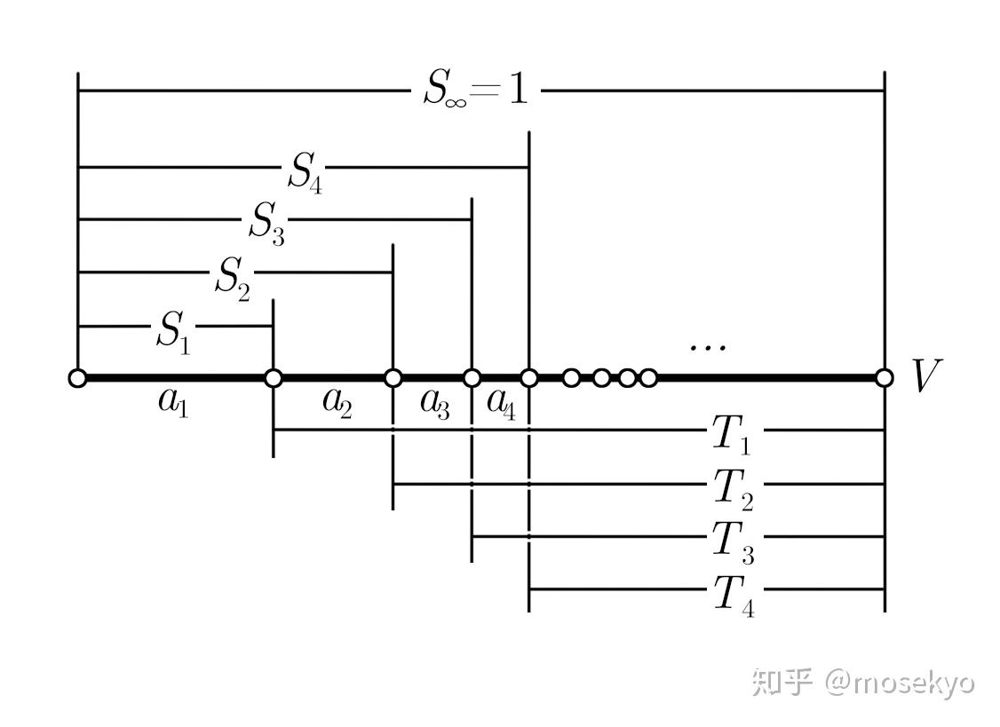

特别指出当 $\alpha=\pi/2$ 时，$K\simeq|z_0|\tan\alpha,\ z_0\sec\alpha+t\simeq z_0\sec\alpha$，得到

$$
l(t)=\frac{\lambda}{|z_0|}t 
$$

因此**当直线与投影面平行时，直线上的等距点的项在画布上也是等距的**。

了解了以上知识后，让我们开始推导吧！

由**结论** $(\Delta)$，令 $t\rightarrow+\infin$，得到

$$
l(t)=\frac{K\lambda}{z_0}
$$

我们设 $P(x_P,y_P,z_P),Q(x_Q,y_Q,z_Q)$，它们在空间中平移，假设两个点各走过的距离为 $t$。猜想 $PQ$ 平移在画布上的距离关系是成比例的，设 $P$ 走过了原 $PO_3$ 距离的 $\omega$ 倍，$\overlinesegment{QO_3}=\Omega\overlinesegment{PO_3}$，则：

$$
t=\frac{z_P^2 l_P(t)\sec\alpha}{K_P\lambda-z_Pl_P(t)}=\frac{z_P^2 \omega\frac{K_P\lambda}{z_P}\sec\alpha}{K_P\lambda-z_P\omega\frac{K_P\lambda}{z_P}}=\frac{z_P\omega\sec\alpha}{1-\omega}
$$

$Q$ 也移动 $t$ 的距离，代入 $(\Delta)$ 式：

$$
l_Q(t)=\overlinesegment{QO_3}\cdot\frac{\omega}{z_Q/z_P(1-\omega)+\omega}
$$

接下来寻找 $z_Q,z_P$ 之间的关系：

$$
\begin{gathered}
\overlinesegment{QO_3}=\Omega\overlinesegment{PO_3}\Rightarrow\frac{|y_Q-y_{O_3}|}{|y_P-y_{O_3}|}=\Omega,\ y_{O_3}=\lambda \tan \alpha \sin \beta\\
\Rightarrow \frac{\lambda \frac{y_0 - z_0 \sin \beta \tan \alpha}{z_0 + t_Q \cos \alpha}}{\lambda \frac{y_0 - z_0 \sin \beta \tan \alpha}{z_0 + t_P \cos \alpha}}=\Omega\Rightarrow\frac{z_0+t_P\cos\alpha}{z_0+t_Q\cos\alpha}=\Omega
\end{gathered}
$$

而我们又知道 $z_0+t_P\cos\alpha=z_P,z_0+t_Q\cos\alpha=z_Q$，那么：

$$
\frac{z_Q}{z_P}=\Omega^{-1}\Rightarrow l_Q(t)=\frac{\omega\Omega}{1-\omega+\omega\Omega}\cdot\overlinesegment{QO_3}
$$

更简洁的形式：

$$
l_Q(\infin)=(1+\omega^{-1}\Omega^{-1}-\Omega^{-1})l_Q(t)
$$

于是，当 $PQ$ 按照满足投影变换沿着 $l_2$ 移动时，相当于它对应的六面体中与它同一组棱沿着各自所在直线方向运动（虽然是很容易联想到的结论，但感觉要证明是很难的）。投影变换要求：$\overlinesegment{PP'}=\omega\overlinesegment{PO_3}$，$\overlinesegment{QO_3}=\Omega\overlinesegment{PO_3}$，则 $\overlinesegment{QQ'}=\frac{\omega\Omega}{1-\omega+\omega\Omega}\overlinesegment{QO_3}$。

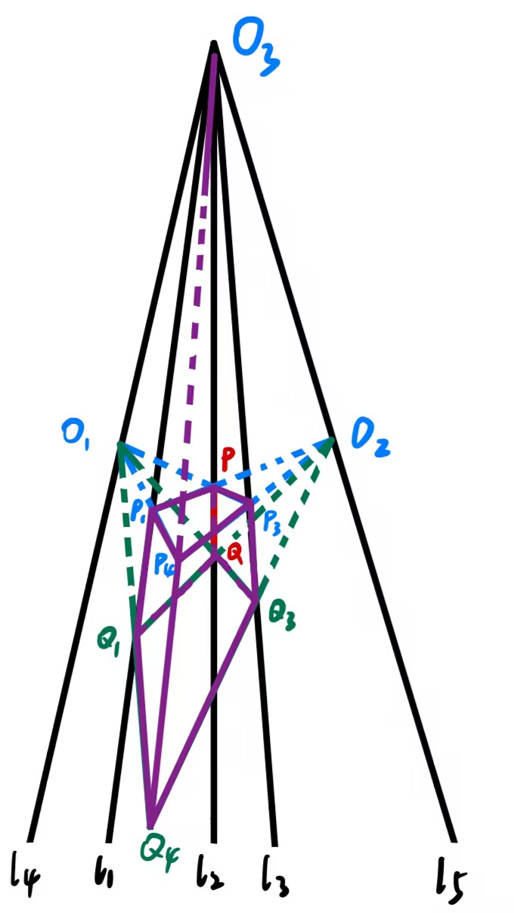

最后是关于 $O_2$ 在 $l_5$ 上移动的问题。

对于两点透视当中结论（1）和（2）的导出结论，我们相对应的结论是：**在射影几何意义上，若空间中一直线平行于（或属于）一平面，那么直线的消失点位于平面的消失线上**。我们有：直线 $Q_4Q_3$ 的灭点是 $O_2$，直线 $Q_3P_1$ 的灭点是 $O_3$。因此我们得到面 $PQQ_1P_1,P_3Q_3Q_4P_4$ 的灭线是 $l_5$，面 $PQQ_3P_3,P_1Q_1Q_4P_4$ 的灭线是 $l_4$。

同样地，$O_1O_2$ **是面** $P_1PP_3P_4,Q_1QQ_3Q_4$ **的灭线**。在央点未发生变化的情况下，面 $P_1PP_3P_4$ **在此过程中以** $P_3P$ **为轴旋转**。面 $Q_1QQ_3Q_4$ **在此过程中以** $Q_3Q$ **为轴旋转**。

接下来与两点透视不同：当 $O_2$ 在 $l_5$ 上移动时，$P_1Q_1$ 会如何变化？

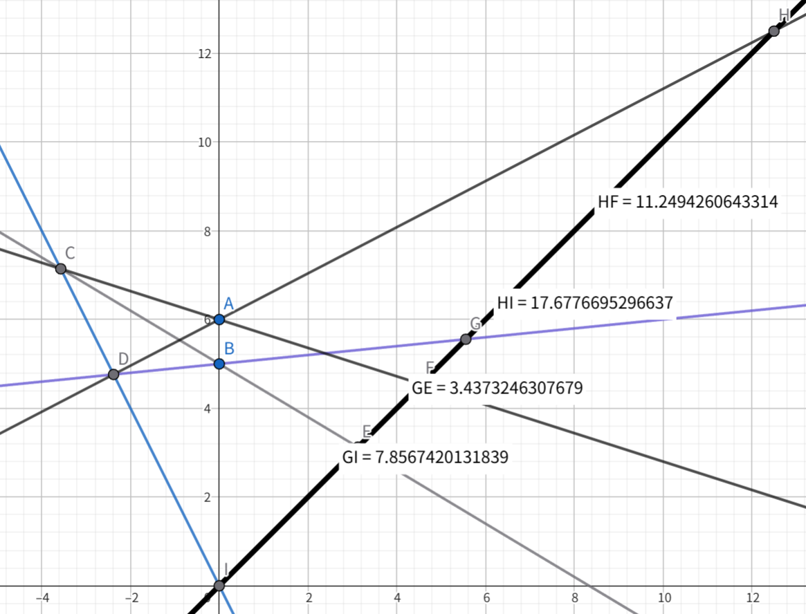

先给自己一点信心：GeoGebra 验证 $\overlinesegment{Q_1Q'_1}=\frac{\omega}{\Omega(1-\omega)+\omega}\overlinesegment{Q_1O_3}$ 成立。这说明 $P_1Q_1$ 确实正在平移。

继续推导！

对于 $\forall\ O_2\in l_5$ 成立，那么说明 $\omega$ 的值不影响结果，联立 $\overlinesegment{P_1P'_1}=\omega\overlinesegment{P_1O_3}$、$\overlinesegment{Q_1Q'_1}=\frac{\omega\Omega}{1-\omega+\omega\Omega}\overlinesegment{Q_1O_3}$ 与 $\Omega=\frac{\overlinesegment{Q_1O_3}}{\overlinesegment{P_1O_3}}$ 得到：

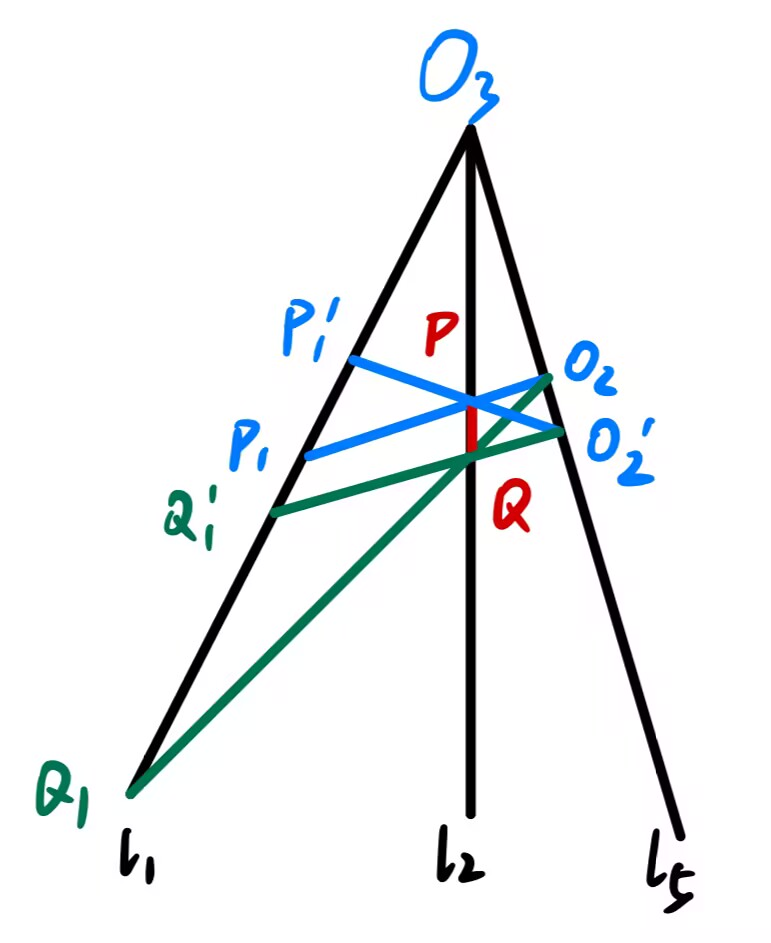

$$
\frac{\overlinesegment{Q_1Q'_1}}{\overlinesegment{P_1P'_1}}=\frac{\overlinesegment{Q_1O_3}^2-\overlinesegment{P_1Q_1}\cdot\overlinesegment{Q_1Q'_1}}{\overlinesegment{P_1O_3}^2}
$$

好吧，原谅我想不出来。那怎么办呢？建系！（

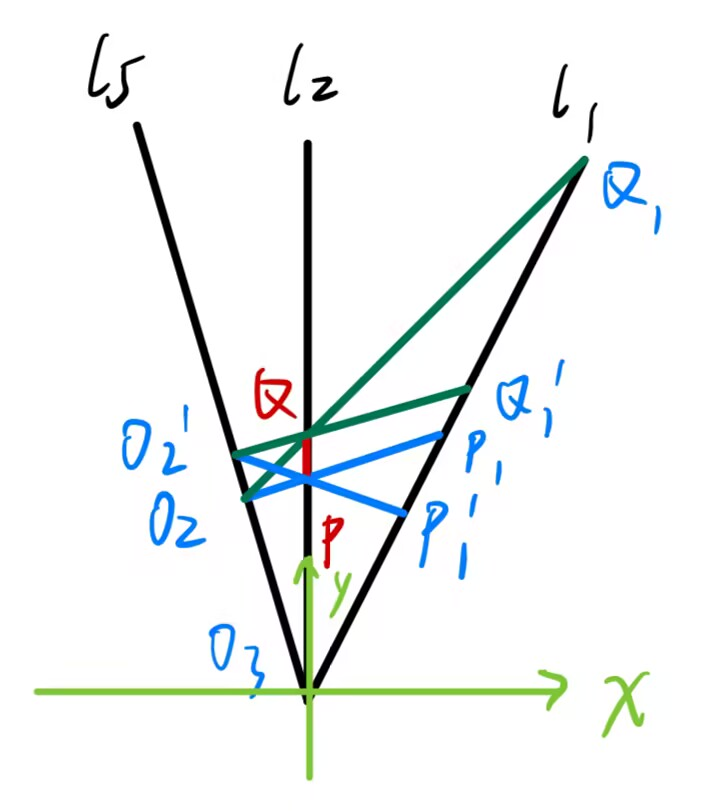

那么问题就转化成了（考虑四点均处于第一象限）：

$$
\frac{1}{x_{P'_1}}-\frac{1}{x_{P_1}}=\frac{1}{x_{Q'_1}}-\frac{1}{x_{Q_1}}
$$

化简之后得到如此简洁的式子是我没有想到的。我认为其中一定有某种普遍的规律。转换回线段形式：

$$
\frac{1}{\overlinesegment{P'_1O}}-\frac{1}{\overlinesegment{P_1O}}=\frac{1}{\overlinesegment{Q'_1O}}-\frac{1}{\overlinesegment{Q_1O}}
$$

运用导出叙述二的思想：$P,Q$ 导出的过程相同。那么问题转换为：

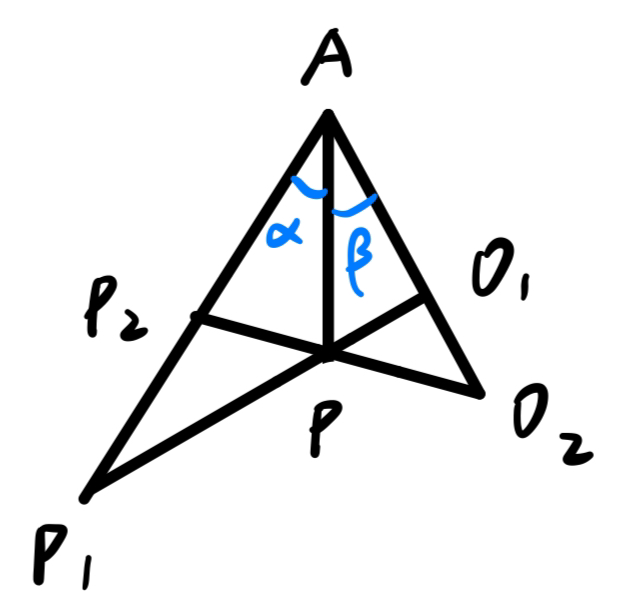

其中 $\angle\alpha,\angle\beta$ 是固定的。这一下子就让我们联想到张角定理：

$$
\begin{gathered}
\frac{\sin\alpha}{AO_1}+\frac{\sin\beta}{AP_1}=\frac{\sin{(\alpha+\beta)}}{AP}\quad(1)\\
\frac{\sin\alpha}{AO_2}+\frac{\sin\beta}{AP_2}=\frac{\sin{(\alpha+\beta)}}{AP}\quad(2)
\end{gathered}
$$

> 张角定理的导出：
>
> $$
> \begin{gathered}
> S_{\triangle{AP_1P}}+S_{\triangle{APO_1}}=S_{\triangle{AP_1O_1}}\\
> \frac{1}{2}AP_1\cdot AP\sin\alpha+\frac{1}{2}AP\cdot AO_1\sin\beta=\frac{1}{2}AP_1\cdot AO_1\sin{(\alpha+\beta)}
> \end{gathered}
> $$

式子（1）和（2）可以导出

$$
\frac{1}{AP_1}-\frac{1}{AP_2}=\frac{\sin\alpha}{\sin\beta}(\frac{1}{AO_2}-\frac{1}{AO_1})
$$

那么，

$$
\begin{gathered}
\text{If}\quad \angle\alpha,\angle\beta,\ AO_1,AO_2=\text{Constant}\\
\text{Then}\quad \frac{1}{AP_1}-\frac{1}{AP_2}=\text{Constant}
\end{gathered}
$$

由于 $P$ 在 $l_2$ 上运动得到 $Q$，$\angle\alpha,\angle\beta,\ AO_2,AO'_2$ 均不发生变化，我们的结论是成立的。

这说明，$P_1Q_1$ **在此过程中沿** $l_1$ **平移**。由此得到四边形 $P_1Q_1Q_4P_4$ 形状不发生改变，仍是平行四边形。

同样地，在央点未发生变化的情况下，当 $O_2$ 移动时，空间中对应的平行六面体发生了**错切变换**。

仍然有此结论：$P_4Q_4$ 在此过程中沿其所在直线方向进行平移。

### 一点透视

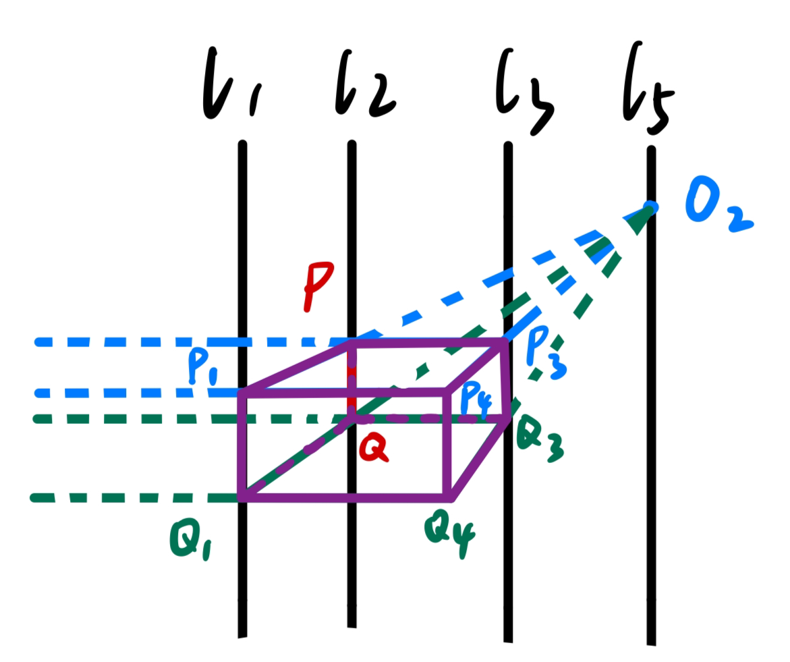

这种情况就更简单了。由于一点透视是两点透视的特殊情况，我们可以直接套用两点透视当中的结论。

但有个结论不同：当 $O_2$ 移动时，六面体发生的不是错切变换，而是平移。原因是在一点透视中，央点始终与 $O_2$ 重合，这使得 $PP_3$ 在 $S^2$ 上的投影发生了变化（相对于观察者，$PP_3$ 的位置发生了变化）。因此，无论 $O_2$ 如何移动，平面 $PP_1P_4P_3$ 的灭线始终过央点，并且与四条平行线的夹角不变。这说明六面体在此过程中发生的是**平移变换**。

我们甚至可以直接使用平面几何方法来解决这个问题：

$$
\begin{gathered}
PP_3\parallel QQ_3,\ l_2\parallel l_3\Rightarrow \overlinesegment{PP_3}=\overlinesegment{QQ_3}\\
PP_3\parallel P_1P_4 \Rightarrow\frac{\overlinesegment{P_1P_4}}{\overlinesegment{PP_3}}=\frac{d_{l_1\rightarrow l_5}}{d_{l_2\rightarrow l_5}}\\
QQ_3\parallel Q_1Q_4 \Rightarrow\frac{\overlinesegment{Q_1Q_4}}{\overlinesegment{QQ_3}}=\frac{d_{l_1\rightarrow l_5}}{d_{l_2\rightarrow l_5}}\Rightarrow \overlinesegment{P_1P_4}=\overlinesegment{Q_1Q_4}\\
\overlinesegment{P_1P_4}=\overlinesegment{Q_1Q_4},\ P_1P_4\parallel Q_1Q_4 \Rightarrow\overlinesegment{P_1P_4}=\overlinesegment{P_4Q_4},\ P_1P_4\parallel P_4Q_4\parallel PQ
\end{gathered}
$$

（这给了我启发，我们是否能通过类似的办法解决两点透视甚至三点透视的问题呢？）

和叙述二相对应地，我们可以用解析几何的办法去定量地描述这个关系：

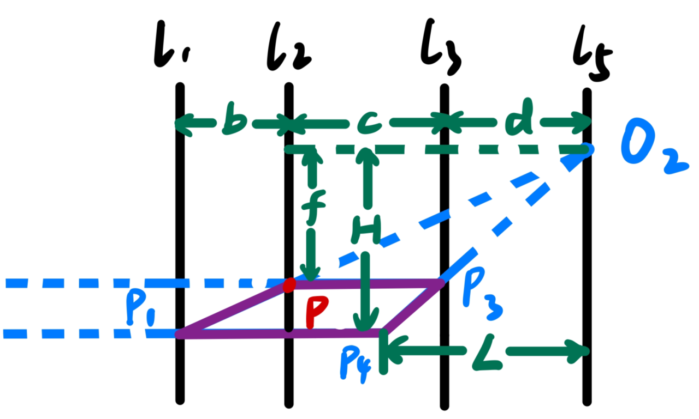

$$
\text{More precisely, Let}\quad d_{l_1\rightarrow l_2}=b,\ d_{l_2\rightarrow l_3}=c,\ d_{l_3\rightarrow l_5}=d,\ k_{O_1}=\alpha,\ |y_{O_2}-y_P|=f\\
\text{Then}\quad d_{P_4\rightarrow l_5}=\frac{b+c+d}{c+d}\cdot\frac{df-\alpha(c+d)}{f-\alpha(c+d)}\\
\alpha=0\Rightarrow d_{P_4\rightarrow l_5}=\frac{b+c+d}{c+d}d\\
|y_{O_2}-y_{P_4}|=\frac{b+c+d}{c+d}\cdot\frac{df^2-\alpha(c+d+cdf)}{df-\alpha(c+d)}\\
\alpha=0\Rightarrow |y_{O_2}-y_{P_4}|=\frac{b+c+d}{c+d}f
$$

### 角度问题

细心的你可能已经发现了，我们在空间中的推导使用的是“平行六面体”这个描述。

什么时候导出的是长方体呢？我们在上文已经提到过，当三组棱的三个消失点构成一个正交系的时候，这个平行六面体就是一个长方体。

由 $\R^3-\{0\}$ 到 $S^2$ 的映射可知，两平面分别消失于两赤道圈，由于赤道所在的平面与原平面平行，所以赤道圈的交角实际上就是空间中对应两平面的交角。

对于三点透视，三组平面的灭线分别为 $l_4,l_5,O_1O_2$。因此构成长方体的充要条件是 $l_4,l_5,O_1O_2$ 各自对应的赤道圈两两正交。如果央点就是以平行六面体三个消失点为顶点的三角形的垂心，那么这个平行六面体就是长方体。换句话说，央点的位置决定了平行六面体顶点的三面角。

对于两点透视，其中三组平面的灭线分别为 $l_4,l_5,O_1O_2$。因此构成长方体的充要条件是 $l_4,l_5,O_1O_2$ 各自对应的赤道圈两两正交。$O_1O_2$ 对应赤道圈与 $l_4,l_5$ 对应赤道圈正交的充要条件是 $O_1O_2\perp l_4(l_5)$。

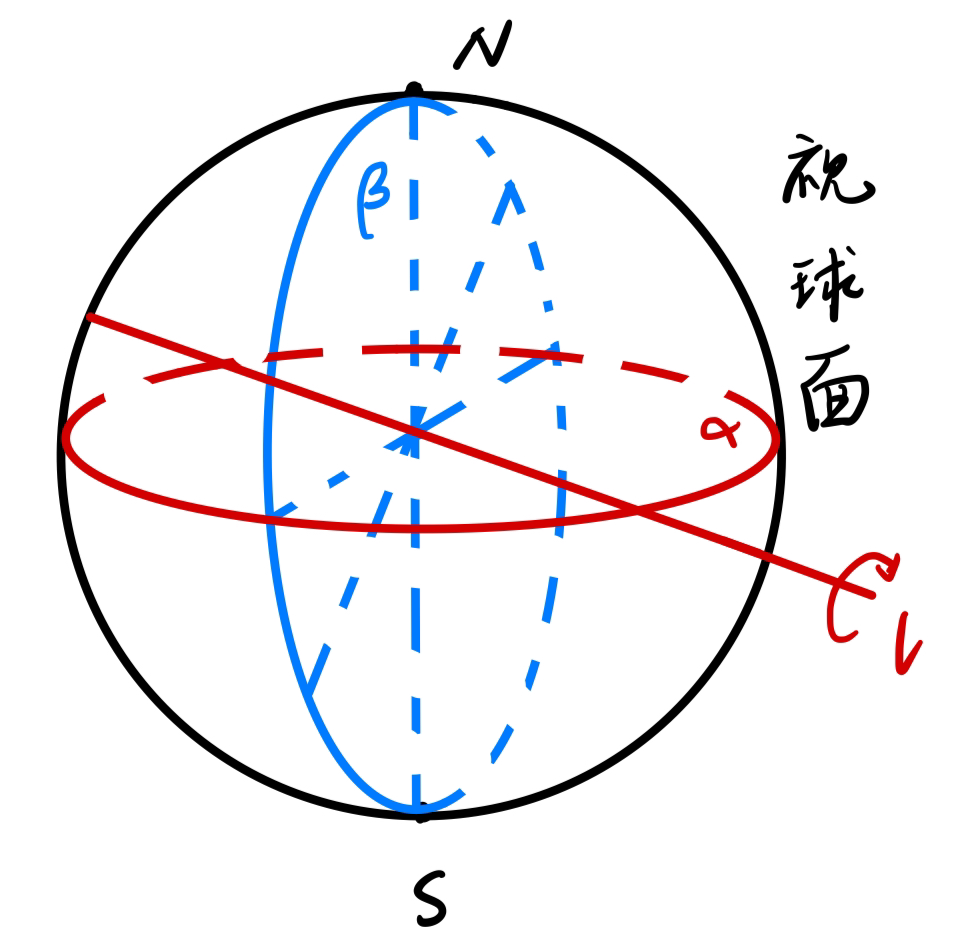

> 如图，与赤道圈 $\beta$ 正交的赤道圈 $\alpha$，可以看作为以 $l(l\perp\beta)$ 为轴进行旋转。在两点透视中，$l_4,l_5$ 过同样的极点（假设对应赤道圈 $\beta$ 和 $\gamma$），因此与赤道圈 $\beta$ 和 $\gamma$ 都正交的赤道圈被限制在 $l_4,l_5$ 极点对应的赤道面。投影到画布上，就有 $O_1O_2\perp l_4(l_5)$。

继续考虑 $l_4,l_5$ 正交的充要条件，即央点 $O$ 在 $O_1O_2$ 上，并且满足：

$$
OO_1⋅OO_2=\lambda^2
$$

这里的 $\lambda$ 由画布上其他正交系导出（如果通过 $l_4,l_5,O_1O_2$ 导出，事实上就是定义它们为正交系）。

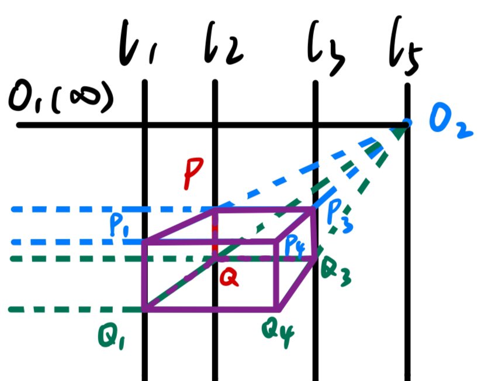

对于一点透视，其中三组平面的灭线分别为 $\{\infin\},l_5,O_1O_2(O_1O_2\parallel PP_3)$。因此构成长方体的充要条件是 $\{\infin\},l_5,O_1O_2$ 各自对应的赤道圈两两正交。此时央点与画面中唯一的灭点重合。

$\{\infin\}$ 对应的赤道面与画布面平行。由于 $l_5,O_1O_2$（平面的灭线）均过央点，可得其对应的赤道面与画布面垂直，自然有 $\{\infin\}$ 对应的赤道圈与 $l_5,O_1O_2$ 对应的赤道圈正交。

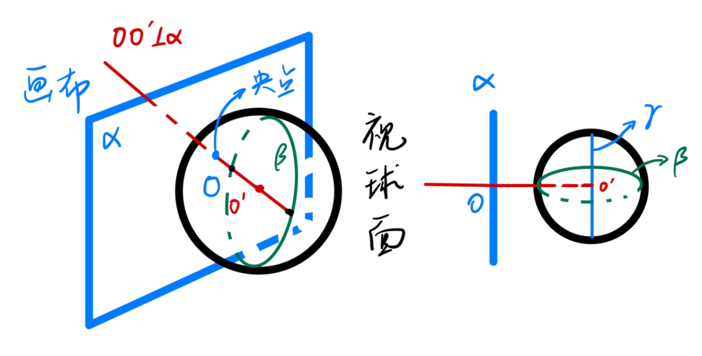

> 如图，平面的灭线过央点，那么灭线对应的赤道圈一定过视中心 $O'$ 与央点 $O$ 的连线与 $S^2$ 的交点（这句话有点绕，可以再看看图）。因此灭线对应的赤道面一定过 $OO'$。图中 $\{\infin\}$ 对应的赤道面为 $\gamma$，灭线对应的赤道面为 $\beta$，画布面为 $\alpha$。
>
> $$
> OO'\perp\alpha,\ OO'\subseteq\beta\Rightarrow\alpha\perp\beta\\
> \alpha\perp\beta,\ \alpha\parallel\gamma\Rightarrow\gamma\perp\beta
> $$

而 $l_5,O_1O_2$ 对应的赤道圈正交的充要条件是 $l_5\perp O_1O_2$。

总结一下构成长方体的充要条件：

- **三点透视:** 央点是以平行六面体三个消失点为顶点的三角形的垂心。
- **两点透视:** $O_1O_2\perp l_4(l_5)$，央点 $O$ 在 $O_1O_2$ 上，且满足 $OO_1⋅OO_2=\lambda^2$。
- **一点透视:** $l_5\perp O_1O_2$。

如果想更详细地了解平面透视中的角度关系，可以继续查看[透视中的几何原理初步 - 知乎](https://zhuanlan.zhihu.com/p/169448538 "透视中的几何原理初步 - 知乎")的剩余部分。

# 写在最后

我在这篇文章当中讨论的是射影几何中有关透视变换的一小部分。由于我的知识和能力不足，不能根据一开始的叙述运用射影几何的知识直接推导出对应的结论，我相信一定存在对应的方法，我推导出的结论也肯定已经被其他人导出过（或者是等价的结论），关于此，就得麻烦看到这篇文章的各位了。

不过，这些限制也使得我能够学习到有关透视变换的很多知识。特别是由几个基本结论证明自己的猜想的过程，真的是很令人激动。

数学太美了。

说了这么一大堆，这些推理到底有什么用呢？我想了很久，可能有一个用处：

1. 有三条平行线和一把没有刻度的直尺，我们就可以得到第四条平行线

感觉听起来挺好笑的，但说实话，可能这些推理对我个人而言意义更大。为什么我会对解析法导出的过程不满意，一直在寻求一种更为直观的解释呢？我想，可以用[这篇博客](https://www.cnblogs.com/edward-bian/p/17731522.html "这篇博客")当中的一段话来表述：

> 不妨先来回顾一下我们关于几何的心路历程：从幼儿时期对周围物体形状的直觉感知，到小学对基础图形的长度面积度量，再到初中陷入点线关系的苦战，高中平面解析几何又总是算不正确、立体几何苦练空间想象力，大学空间解析几何刚开个头就去算微积分了。
> 至此我们对空间图形的掌握好像已经到头了，因为解析几何把逻辑推理基本都交给了方程计算，理论上可以说没有方程计算解决不了的几何问题。但在我们心里还是留下了一点遗憾，就是推理证明的直观性、巧妙构思以及启发性，是单纯的代数计算所不具备的。那是因为代数计算只是手段而不是目的，几何研究的目的除了具体的度量任务外，还在于探究空间元素之间的内在特性和关联。

这几天专注的思考与推理确实带给了我很多全新的体验，也让我回忆起了很多时候。

或许更重要的是，我借此机会走向高中时的自己，告诉他：“你看，你一直想知道的为什么，我终于弄明白了，没让你失望吧！”

期待有一天，未来的我也能这么告诉现在的自己。