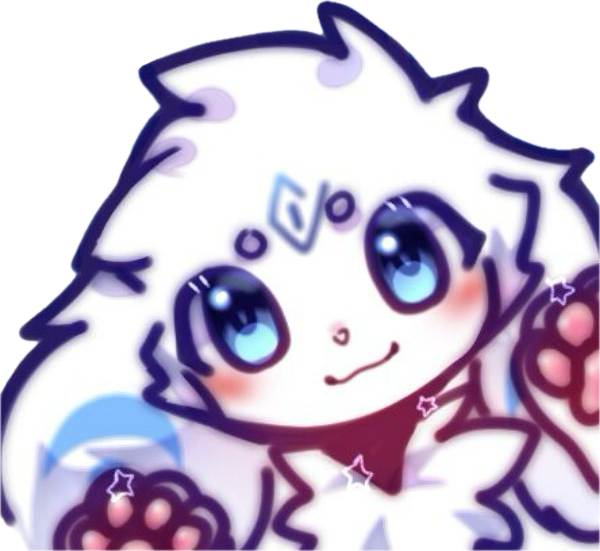
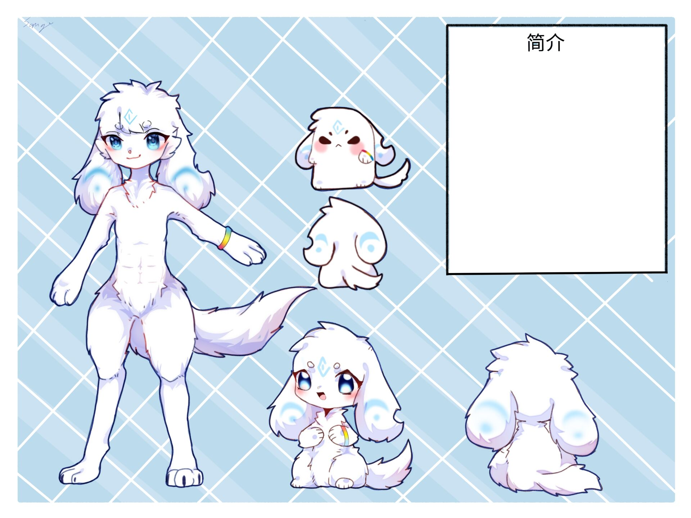
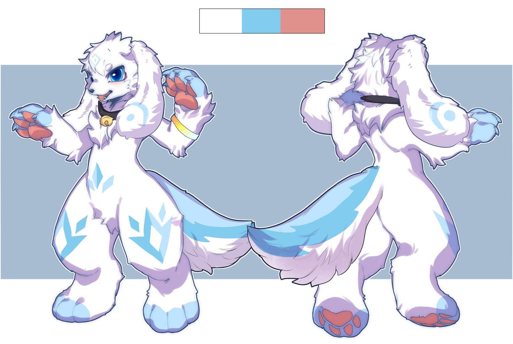

**印象曲：**
<iframe frameborder="no" border="0" marginwidth="0" marginheight="0"  src="https://music.163.com/outchain/player?type=2&id=416552509&height=66"></iframe>

# 资料

**姓名：** 晓洋（Dean）

**擅长：** 以天真乐观的态度去面对生活

**喜欢的事情：** 玩水（之后一定要擦干），美食，笑，音乐，游戏

**讨厌的事情：** 没有声音，没有伙伴，虫子，不好吃的东西，来自外界的恶意

**座右铭：** 有时间绝望的话，还不如去吃个美食然后睡个觉。

**名字的由来：** 在机缘巧合之中与一位来自地球 Online 的玩家心灵相通，纪念之而得

  

| **名字** | 晓洋 |
| :--- | :--- |
| **英文** | Dawn_Ocean |
| **英文昵称** | Dean |
| **种族** | 犬 |
| **性别** | 男 |
| **年龄** | 15 |
| **生日** | 11月2日 |
| **星座** | 天蝎座 |
| **血型** | A |
| **身高** | 1.45m |
| **体重** | 40kg |

 

**设定图：**

# 简介

晓洋也不知道自己是何时成为晓洋的。但他能肯定的是，自己有一个很好很好的朋友，叫做暮泠。

~~晓洋其实很简单纯粹。他有一个天真却近乎不可能实现的愿望：希望这个世界上所有人都能幸福。在他的眼中，这个世界是那么的美好：纯真的大自然，友善的陌生人，真诚的人际关系。他很开心。他真诚地希望所有人都能开心。或许晓洋这么乐观，只是因为他和其他人看待这个世界的角度不同罢了。因此——~~（这里的字被晓洋划掉了）

我有一个愿望（什么叫近乎不可能嘛）：希望大家天天开心！问我为什么？我遇到了那么多有意思的人，还有——哦，你看窗边的樱花，真好看，等我拍张照先！——不好意思，让我继续说吧\~还有哦，我认识了好多好朋友！每天我们在一起的时候都特别开心！我觉得这个世界上好多人都对我特别好，所以我想让他们开心。就这么简单呀。

你还想知道，我是怎么实现我的愿望的？其实我也不知道自己到底能不能做到啦……不过，我一直都有在帮助别人哦！当然不是为了什么回报呀，每次他们感谢我的时候，看见那些真挚的笑容，我就知道自己离目标更进一步啦，真满足！我还挺喜欢和朋友聊天的，对谈的时候，我真的感觉双方之间会有一种奇妙的联系哦！我们什么都说，不管是开心的事还是伤心的事。说起我最自豪的时刻，当然是把朋友们逗笑咯！嘿嘿，你想和我交朋友嘛\~

~~晓洋每晚回家的时候，会把自己一天的见闻和暮泠分享。这是暮泠一天中少有的闲暇时光。说起晓洋与暮泠的相识——~~（这里的字又被晓洋划掉了）

还是我自己来说吧。当我第一次见到暮泠的时候，情况真是特别危险。本来我在沙滩边玩水，却听到一阵扑腾的声音。我朝着声源游了过去，没想到那里有一个身影正不断往下沉。一定是溺水了，我这样想，一边吸了一大口气，潜入水中，就这么把他扯向岸边。听医生说，再晚一些，暮泠可能就……算了，这些事情不谈也罢。暮泠特别感谢我，还拉着我去他家里一起住。其实我也特别感谢他，让我感觉，自己真的在做有意义的事情。你问我在遇到暮泠之前的事情？保密哦。

说起暮泠，其实他是一个有点孤僻的孩子，不怎么爱出门。所以我就想着，把我自己每天遇到的好玩的事情、有趣的朋友，一股脑地都告诉他。我当然知道他不会全部听进去啦，但是，他就这么托着脸，静静地听我讲完，有时候还会被我逗笑。多可爱啊！有的晚上，暮泠会做噩梦，我就这样耐心地安抚着他，直到他又一次睡着。后来，我们就成了无话不谈的好朋友了，尽管他还是不爱出门，但是他晚上惊醒的次数越来越少了。我还成功介绍了我的几个最好的朋友给他！这么说起来，暮泠和我越来越像了呢。真想带他在外面好好玩一玩！

有一天我做了个梦：我们两个在草地上一起看星星。我突发奇想：“欸，你说，如果我站在你身上，我是不是就能摘到星星了？”“你试试呗。”“那我要摘那颗最亮的星星！”“啊，你怎么这么重啊！”“明明是你力气不够好不好！”于是我们两个一起倒在草地上。他也不起来，我也不下去，我们两个就这么趴着，默默地看着满天繁星。真希望这样的情景能一直持续下去呀。

“我一定，会和他一起好好生活下去的。”晓洋坚定地想。（这次的可没被划掉哦）

