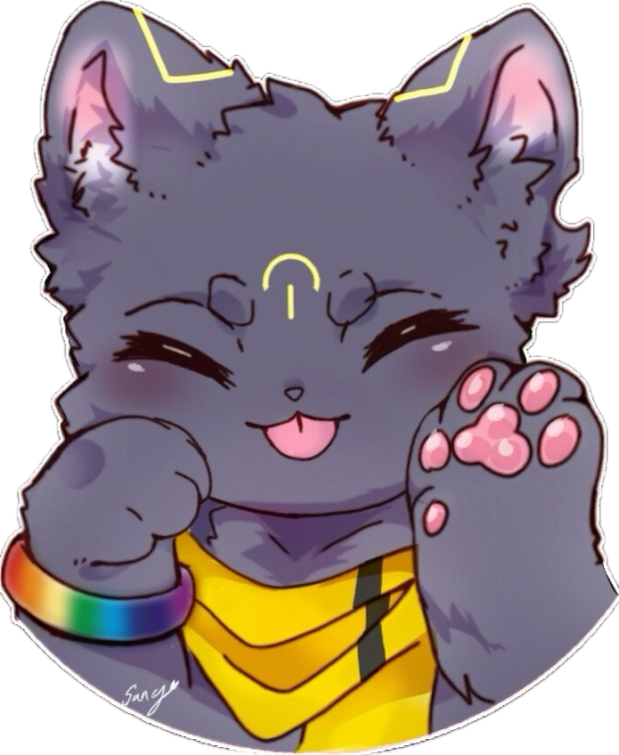
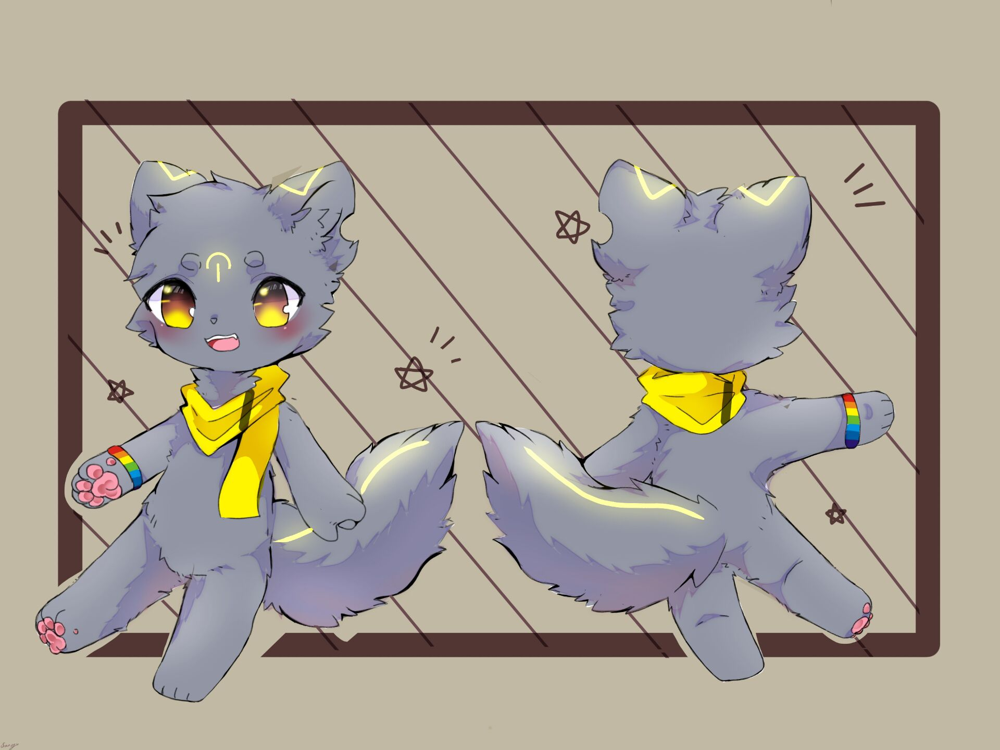

**印象曲：**
<iframe frameborder="no" border="0" marginwidth="0" marginheight="0"  src="https://music.163.com/outchain/player?type=2&id=1441248283&height=66"></iframe>

# 资料

**姓名：** 暮泠（Chusk）

**擅长：** 冷静地审视自己

**喜欢的事情：** 独处、宅、绘画、吐槽、记录灵感

**讨厌的事情：** 脏东西、虫子、杂乱、阴阳怪气、成为聚焦点

**座右铭：** 在爱的记忆消失以前，请记住我。

**名字的由来：** 和晓洋的名字是对称的诶，设定好像也是？或者，其实他们是同一个个体……？

  

| **名字**                                            |  暮泠         |
| :---------------------------------------------: | :-----------: |
| **英文**                                            |  Dusk\_Chill |
| **英文昵称**                                          |   Chusk / Joshua      |
| **种族**                                            |    狼       |
| **性别**                                            |      男      |
| **年龄**                                            |     15      |
| **生日**                                            |   农历九月廿十  |
| **星座**                                            |   处女座       |
| **血型**                                            |       A     |
| **身高**                                            |   1.45m     |
| **体重**                                            |    40kg     |

 

**设定图：**

# 简介

暮泠一直都是暮泠。可是身边人都不知道，暮泠有一个好朋友叫做晓洋。就连暮泠的妈妈春沄也不知道，她自己有时候也会把晓洋当成暮泠。

暮泠喜欢宅在家里，而晓洋则喜欢出去玩。每天晚上，晓洋总会兴冲冲地带着一大堆东西回来和暮泠分享：你看，我今天又交了新朋友，他还送了我礼物！外面又有哪些新的好玩的地方……这时，暮泠总会竖起耳朵仔细地听着，还会和晓洋交流自己的想法。晓洋处理不好的地方，他总能想到更多。

“看来你还是比我要细心得多，没了你，我都不知道自己该怎么办呢！”晓洋总是喜欢像这样称赞暮泠，也不忘记鼓励他，让他也跟着自己一起出去玩。

“其实有你就够啦。”暮泠总是这么想，其实他有点担心外面的环境，大家会不会讨厌我呀......在家里，和晓洋一起，就足够满足啦。

那，在认识晓洋之前呢？

暮泠想起了他的堂哥，早海。早海和晓洋很像，不过比起晓洋，早海更像个古灵精怪的调皮鬼。暮泠很羡慕他，在自己的眼里，早海上知天文下知地理，还有一双巧手，又会绘画，又会拼装各种模型。每当这个时候，暮泠就喜欢当他的小帮手，给他递这递那的，好不快活。虽然早海有的时候也会小小欺负一下自己，但在每周末例行拜访之前，暮泠也会期待着与他的见面。如果把自己的生活比做夜空，暮泠会在二人相伴的时光处放上天狼星。

但后来，这颗天狼星，怎么黯淡下去，一蹶不振了呢？暮泠也不知道。

每当想起这里，暮泠的那片夜空便噤声不语，连带着所有的星星藏匿起它们的微光。黝黑的海洋从天边倾泻而下，裹挟着暮泠，不由分说地将他拖曳进无底深渊。

…………

暮泠无声地流着泪，他在悲伤什么呢？还是说，他所悲伤的，是遗忘本身呢？

他忘记了，他真的忘记了。暮泠心中曾经最重要的那个人，他的音容笑貌，他不记得了。那场摧毁了整个世界的风暴，他也不记得了。

不如就这么沉没下去，直到……

霎时间，暮泠这唯一的意识被一束光芒击中了。他艰难地睁开双眼，在四处涌动的乱流中，他看见一只毛茸茸的手正试图越过这周遭的狼藉，努力地去够着他。

刚刚抓紧这只温暖的手，暮泠就醒了过来，汗湿了枕头一片。手里还没有松开...“怎么啦，又做噩梦了嘛？只是梦哦～”晓洋关切地看着他。

但暮泠一直记得，在那个无底深渊里，晓洋坚定的声音：“从现在开始，我就是你的 Maera。如果追不上天狼星，那我就朝你奔来，只做你怀里的星星。”

