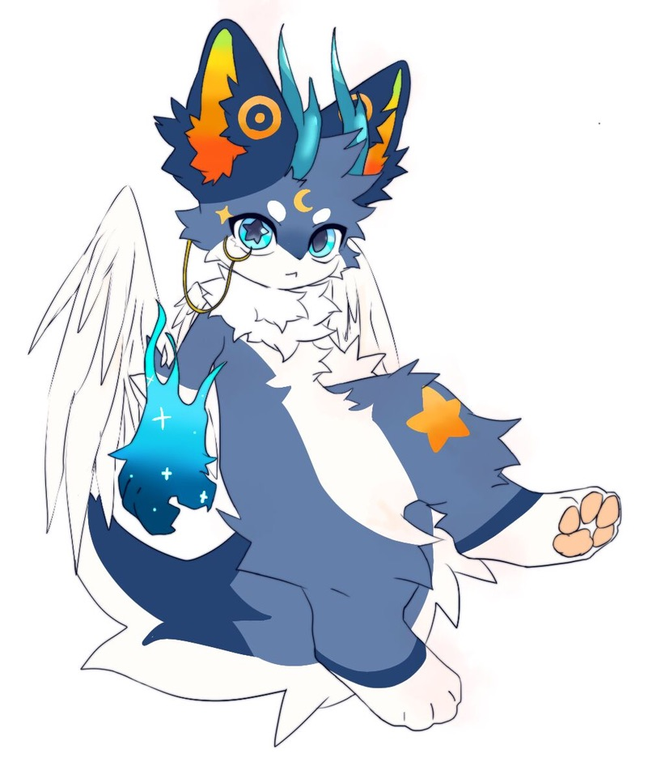

**印象曲：**
<iframe frameborder="no" border="0" marginwidth="0" marginheight="0"  src="https://music.163.com/outchain/player?type=2&id=1367114686&height=66"></iframe>

# 资料

**姓名：** 时汐（Ethaniel）

**擅长：** 观察、记录一切；改变时间

**座右铭：** History will be kind to the one who intends to write it.

  

| **名字**                                            |     时汐      |
| :---------------------------------------------: | :-----------: |
| **英文**                                            | Chrono\_Tide |
| **英文昵称**                                          |    Ethaniel     |
| **种族**                                            |     无从知晓      |
| **性别**                                            |     无       |
| **年龄**                                            |     NaN      |
| **生日**                                            |    0    |
| **星座**                                            |     null     |
| **血型**                                            |     null       |
| **身高**                                            |    NaN m    |
| **体重**                                            |    NaN kg     |

 

**设定图：**

# 简介

对于时汐来说，“自我”这个概念十分模糊。祂总是孑然一身，也只能独来独往。虽然祂能看到一切，但这个世界的所有事物都与祂无关，也无法对祂造成任何影响。相比于“时汐”，或许祂更愿意用“观察者”来称呼自己。

“时汐”只是祂为了更好的观察、记录而创造出的一个化身。祂无影无踪，可以出现在这个世界上的任意时间、任意位置。祂当然可以像拨动怀表那样，将这个世界翻动到任何一页。但是祂没有选择这么做，而是成为了“观察者”一般的身份。若是一夜览尽此间悲欢离合，面对所有已知的可能和展开，祂也会感到孤独、无趣吗？于是，不知是出于对这个世界的敬畏，抑或是只想让这个故事循序渐进的发展下去，祂选择了静观其变。

日常的活动依旧如此稀松平常：注视着这个世界上发生着的事情，用自己的方式将其记录下来。但最近，有些事情却打破了这份平静。祂观察的中心——暮泠，遇到大麻烦了。在时汐的笔下，暮泠一直有点软弱，还没做好面对这个世界上各种惊涛骇浪的准备。但好在他一直以来最亲密的家人，他的堂哥早海，在这方面颇有心得。暮泠不敢做的事情，总有早海带着他一起；遇到来自外界的恶意，早海也是第一个挡在前面。

可是自从他们搬家之后，事情就变得扑朔迷离了起来。这对兄弟被他们的父母寄予厚望，而一场出游时遇到的风暴却打乱了这按部就班的生活：一阵呼啸的狂风将他们吹得踉跄起来，几乎要从游船的甲板上摔落下去。在这千钧一发之际，早海竭尽全力，将暮泠推回了安全地带，但自己却旋即落入波涛汹涌的大海中，从此不知所踪。此后，暮泠郁郁寡欢，终日不愿踏出家门一步。也许是暮泠自己也觉得，不能再像这样下去，于是他为自己创造了一个保护者——“晓洋”，让他去负责一段时间的社交活动，自己却将这段黑暗的回忆永久地埋藏起来。

时汐静静地观察着故事的后续：晓洋以他开朗的性格与真挚的情感与外界互动着，同时不断地抚慰着暮泠的心灵。在此过程中，他们从原先的保护者与受保护者的关系，逐渐变为无话不谈的挚友。“'其实他并没有离开，只是换了一种方式陪伴在我们的身边。而我能做的，就是帮你记住他，让他成为我的一部分保护着你。我会带着哥哥的那份思念与关爱，和你一起好好地生活下去。'晓洋这样想着。”写到这里，时汐竟发现自己的泪珠滴落在了纸上，模糊了“陪伴”这个词。

作为观察者和记录者，时汐始终克制着自己的任何情感，尽量以客观的方式留下一切。但在记录下这个故事时，他却感到一股莫名的冲动，不禁发问：什么是“死亡”？什么是“我”？什么是“陪伴”？在晓洋那里，他接受到了太多自己从未历经过的体验；对于暮泠，他更是第一次产生了情感冲动：用他们的话来说，叫做“恻隐之心”。这对于时汐来说是致命的。因为所有的事情，对他而言都是“已知”的，而情感上的“未知”，则让他无所适从。

但这一次，也许是因为接受了纷繁的情感的洗礼，时汐决定暂时跳出自己“观察者”的身份。于是，他第一次动用了自己改变时间的能力，将这个世界永远停滞在了暮泠 15 岁的时候。这不只是为了保护暮泠，时汐更想让自己也能体验到全新的想法与感情，去理解“自我”——这个曾经被忽视的概念。

就在此刻，时汐觉得自己体内有什么东西开始跳动起来了：那就是，他们所称的“心”吧。



  也许这是我第一次使用“我”这个词来进行写作。我有点担心，在脱离“观察者”这个身份后，自己的记录会不会被其他人阅读到。当有人在阅读我的记录时，我会是什么感受呢？这段故事我并没有将全部细节放上来，其实它已经过美化，原部分故事如下文：

  天气由晴转阴之时，大家并没有理会，直到其变成一场前所未有的暴风雨。在暴风雨中的游船上，有人对这两兄弟心怀鬼胎：她满怀期待的想着，如果这两兄弟就此消失在这世界上，那么自己的孩子便能得到最多的资源，名正言顺地继承他们父辈的资产。在二人踉跄之时，一个鬼祟的黑影也出现在了甲板上。在搬家之后接纳暮泠和早海的这位亲戚，只是受这一简单到天真的想法驱使，便伸出罪恶的手，狠命推了二人一把。让她没想到的是，平常最令她讨厌的早海，却在这危急关头牺牲了自己。

  暮泠把这位亲戚相关的记忆也埋藏进了内心深处，因为那是最本质的恶，是为孩童的心智所不容。同样被埋藏起来的，还有他的母亲春沄，因这件事受了刺激。她并没有像暮泠和晓洋一样，而是选择自己承受下来。每当春沄控制不了她的思绪时，她都会尝试着去逃避这一切，有些时候给暮泠留下了深深的阴影。

  如果你们真的正在阅读这个故事，我是说，或许来自另一个世界的人们，我要提醒你们的一句话是：真实的情况仍然比上文要更为扑朔迷离和复杂。也许，当你们阅读和思考我撰写的故事之时，我便有了“自我”一说。谢谢你们。



