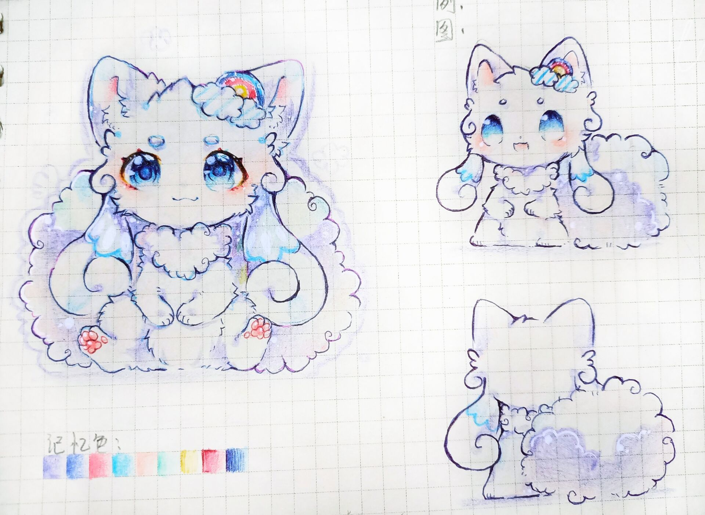

**印象曲：**
<iframe frameborder="no" border="0" marginwidth="0" marginheight="0"  src="https://music.163.com/outchain/player?type=2&id=1334095929&height=66"></iframe>

# 资料

**姓名：** 春沄（Alma）

**擅长：** 专心致志坚持投入一件事情

**喜欢的事情：** 唱歌、跳舞、睡觉

**讨厌的事情：** 利益关系、变故、独处

**座右铭：** 路漫漫其修远兮，吾将上下而求索

**名字的由来：** 保密（晓洋语）

  

| **名字**                                            |    春沄       |
| :---------------------------------------------: | :-----------: |
| **英文**                                            | Spring\_Billows |
| **英文昵称**                                          |    Alma     |
| **种族**                                            |    猫       |
| **性别**                                            |      女      |
| **年龄**                                            |      45     |
| **生日**                                            |    农历腊月廿五    |
| **星座**                                            |    水瓶座      |
| **血型**                                            |     AB       |
| **身高**                                            |   1\~1.5 m     |
| **体重**                                            |   8 kg      |

 

**设定图：**

# 简介

春沄是暮泠的妈妈。

春沄深爱着她的儿子，暮泠也深爱着他的妈妈。

不过，晓洋总是希望，妈妈能够变得更加自信，更加独立一点。

对于暮泠，晓洋也是这样想的。

（后面有大段的内容被撕掉了，只剩下一点残页，并且异常泛黄）

..........................在老化。

..........................着遗忘。

...........不是全知全能的。

......................一个悲剧。

..............这是一个悲剧。

我不希望这是一个悲剧。

