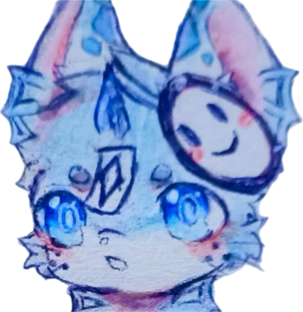
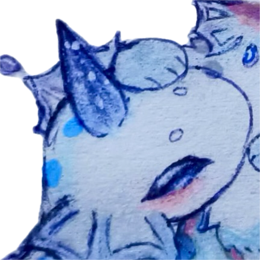
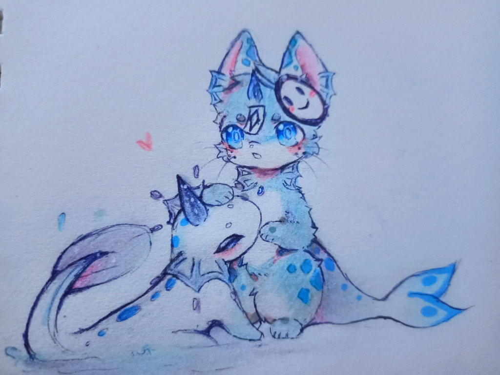

**印象曲：**
<iframe frameborder="no" border="0" marginwidth="0" marginheight="0"  src="https://music.163.com/outchain/player?type=2&id=2078524910&height=66"></iframe>

# 资料

**姓名：** 明涟 / 暗漪（Liple / Rark）

**擅长：** 航海、冲浪、潜水

**喜欢的事情：** 遨游于天地之间

**讨厌的事情：** ...应该有讨厌的事情吗？

**座右铭：**......

**名字的由来：** 世界之海的波动，总能在见者心中泛起一圈又一圈的涟漪。

|  |  |
| :---------------------------------------------: | :-----------: |
| **名字**                                            |    明涟 / 暗漪       |
| **英文**                                            | Light\_Ripple / Dark\_Ripple |
| **英文昵称**                                          |   Liple / Rark      |
| **种族**                                            |    鱼       |
| **性别**                                            |    女 / 男        |
| **年龄**                                            |    5       |
| **生日**                                            |   7 月 12 日     |
| **星座**                                            |    巨蟹座      |
| **血型**                                            |    A        |
| **身高**                                            |  1.45 m / 0.8 m      |
| **体重**                                            |   40 kg / 15 kg      |

 

**设定图：**

# 简介

明涟和暗漪是这片海洋的管理者。很久以前，除了他们，这片海洋里只有名为“暮泠”的个体，但他们仍然乐此不疲。于是，你总能看到这样一副场景：暗漪在水面之下，明涟在水面之上，暗漪载着明涟，在这片海洋中尽情驰骋。他们两个心照不宣，已然一体，从来就是这样。

再说很久以前。很久以前就有这片海。很久以前就有暮泠。但很久以后才有明涟和暗漪。他们诞生于一场骇人的风暴之中，那时的世界处于最混乱、最喧嚣、最接近末日的时刻。与如此狂躁的环境有着天壤之别，明涟和暗漪无比地沉默。他们之间没有语言，更不会对这个世界言语一分。

在日常静寂无声的“巡视”之中，他们总会默契地协作，确保这片海洋不会再次掀起惊涛巨浪。他们能回想起的最初时刻，便是第一次见到“暮泠”之时。“7 月 12 日......”明涟在日历上的这一天画了一个圈，暗漪就立刻明白了她的意思：每年的这个时候，海洋当中的不安定因素就会增多。在最初时刻，他们的力量完全无法与几乎摧毁整个世界的风暴相抗衡。但那时出现了一位他们从未见过的个体。“蓝色的和白色的，发着光”。他所到之处，风平浪静，晴空万里。“他像一个救世主。”明涟和暗漪称他为“海洋之子”。自那次风暴之后，“海洋之子”的身影就此消失。但他们总能不时感受到海洋中的阵阵暖流，饱含着思念与抚慰的洋流。

“发着光的洋流。”

“这片海洋，真是越来越平静了......”

“或许我们把它叫做，'湖'？”

“镜子一般的湖面，真好啊......”

“能照出一颗真心来呢。”

