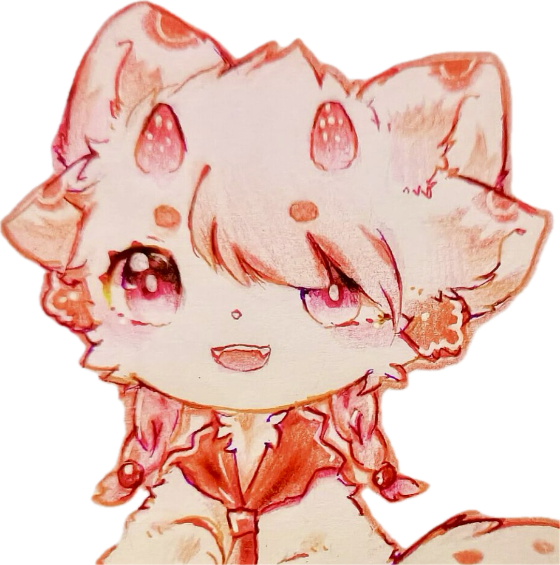
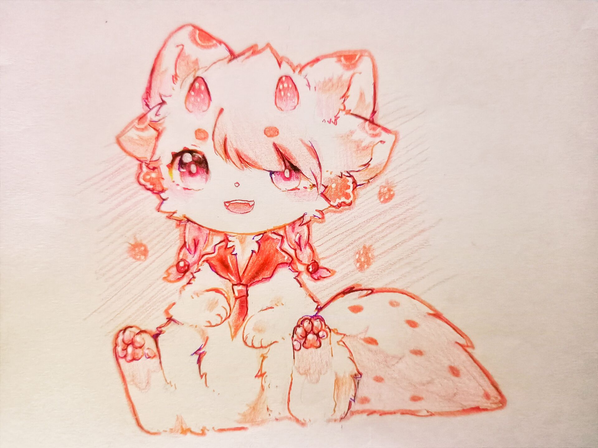

**印象曲：**
<iframe frameborder="no" border="0" marginwidth="0" marginheight="0"  src="https://music.163.com/outchain/player?type=2&id=28912015&height=66"></iframe>

# 资料

**姓名：** 早海（Berry）

**擅长：** 用武力解决问题；全力以赴投入热爱的事物

**喜欢的事情：** 捉弄暮泠，做手工、搞小发明，军事科技，打抱不平，绘画

**讨厌的事情：** 被质疑，无趣

**座右铭：** Just do it.

**名字的由来：** “草莓”去掉偏旁变化而成。英文昵称 Berry 也是同样的意思哦！

  

| **名字**                                            |      早海     |
| :---------------------------------------------: | :-----------: |
| **英文**                                            | Morning\_Sea |
| **英文昵称**                                          |    Berry / Sirius     |
| **种族**                                            |     犬      |
| **性别**                                            |       男     |
| **年龄**                                            |      16.5     |
| **生日**                                            |   ■ 月 ■ 日     |
| **星座**                                            |     ■ 座     |
| **血型**                                            |     ■       |
| **身高**                                            |   1.60 m     |
| **体重**                                            |    60 kg     |

 

**设定图：**

# 简介

早海是暮泠的堂哥。

他在十岁时突发眼疾，因治疗耽误了学业，但也因此和晓洋成为了同班同学。其实早海和暮泠早在孩提时便熟悉了，那时他们两家人经常有来有往。早海只比暮泠大一岁半，因此他们两个有很多共同语言。

早海家里有一个属于自己的“秘密空间”，连暮泠都不能随便涉足的那种。这里存放着他的各种灵感，显得有些杂乱：素描本、模型零件、各种科普书籍，还有临时搭建的“实验室”。但是早海总有办法把它们串联在一起，搭建出自己的“宫殿”。

虽然早海走路一跛一跛的，但大家都不敢欺负他，因为他还学过柔道，而且壮壮的，看起来确实不好惹。于是，你总能看到这副场景：早海挥舞着他的拳头，仿佛这就是问题的最终解决方案。其实他也拿这招吓唬过暮泠，让暮泠帮他做些事情，或者干脆就是宣示自己作为兄长的地位，好让暮泠羡慕羡慕自己。暮泠确实很羡慕他，不过可不是因为屈服于这种暴力，而是一些说不清道不明的魅力。

到底是什么魅力呢？是在美术、手工等方面的特长，还是上知天文下知地理的博闻呢？如果让暮泠来说的话，可能会是在学骑自行车时背后的一双大手，看见自己哭了的时候那张慌张的脸，和大家打成一片的那份热情，看见有人被欺负时挺身而出的那个背影......

还有在那场风暴中，心里只剩下自己弟弟的，真正的哥哥。

早海就那么用力地推了暮泠一把。看见他回到了安全区域，早海脸上露出了难得的微笑。平时，为了哥哥的形象，他可总是绷着一张脸。这时，他才明白，哥哥只有和弟弟一起，才能被称为哥哥。不过，脚下怎么空荡荡的呢？早海仿佛回到了教暮泠骑自行车的时候，自己总是不太放心，一直扶着暮泠的车后座。“哎呀你别扶了，大不了摔一跤嘛！”听到暮泠的话，早海就这么松开了，等着看他的笑话。结果暮泠却就这么有惊无险的学会了。

顾不上那么多了。弟弟，平时我欺负了你那么多，你也从来没记恨过我。这次，可一定不要讨厌我呀。

......

暮泠 /

月生，潮平 /

我愿做夜空中最亮的星 /

伴你从踽踽浮萍 / 至熹熹晨光 /

我仍做夜空中最亮的星 /

日出，涌浪 /

晓洋 /

......

让他带上我的思念，和你一起好好地生活下去吧。

这是早海最后的念想了。

