
 

# 系统调优

## 系统选择

2024 年 9 月 27 日，威联通发布了一则消息称，其经典的企业级操作系统 QuTS hero 已开放更多机型的支持，尤其是针对家用桌面级 NAS，比如最常见的 TS-464C2、TS-466C、TBS-464、HS-264、TS-664 等。

QuTS hero 相比，最大的区别就是采用了 ZFS（详见 ）来管理存储池。而 QTS 采用 Ext4 来管理存储池。QuTS hero 的去重（Deduplication）功能要求至少 16 GB 内存。

## 系统安装

TS-464C2 有一块预装了初始固件（写作时，为 QTS 系统）的闪存。如果不装入固态或机械硬盘，NAS 就无法存储文件，以及安装新的应用程序。

如果要从预装的 QTS 系统切换到 QuTS hero 系统，先确认预装 QTS 系统版本号是否大于等于 5.2.1，如果不符合要求，先安装最新版本的 QTS 固件，再进行完全初始化。

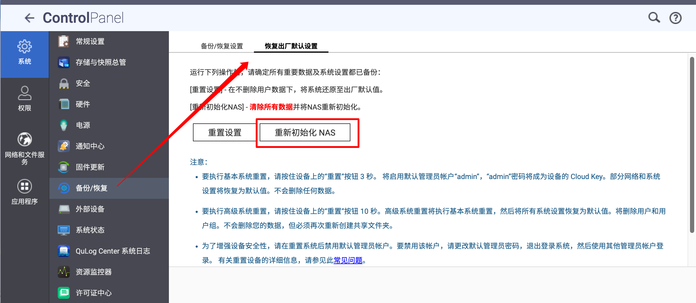

QNAP 提供了多种方式初始安装 NAS 系统，可以直接在浏览器访问 NAS 的 5000 端口，也可以使用 Qfinder Pro 软件，根据手册提示一步步来即可。

## 创建存储池

系统初始化完成后，需要先创建存储池。NAS 默认将第一个初始化的存储池作为系统盘，在其上安装新的应用以及创建 Docker 容器等。如果给 NAS 安装了固态硬盘，建议先初始化固态硬盘的存储池，可以提高应用的安装速度。

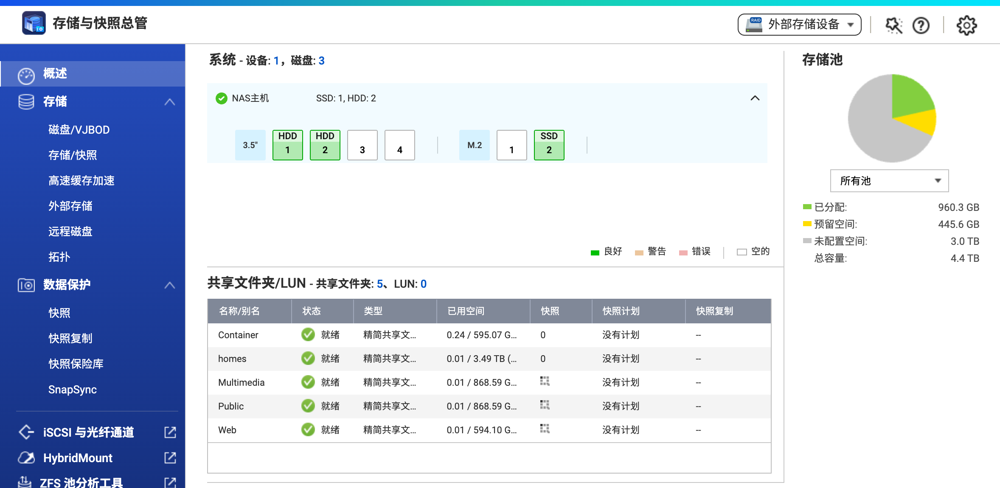

关于存储池的类型以及 RAID 种类，详见 。

## 防火墙

可以在 App Center 当中安装 QNAP 的 QuFirewall 防火墙软件。

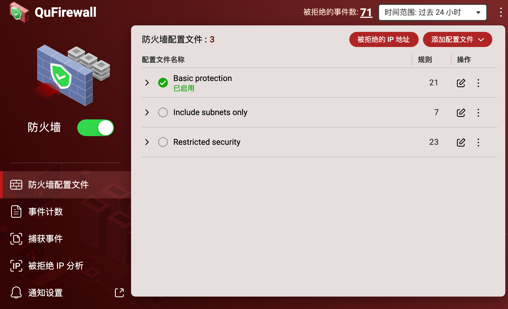

# UPS 不断电系统

关于 UPS 的简介，详见 。

建议购买支持该品牌 NAS 的 UPS，使用 USB Type-B 线与 NAS 连接之后，NAS 会自动识别，可在 `系统 - 外部设备 - UPS` 中更改策略以及其他配置。

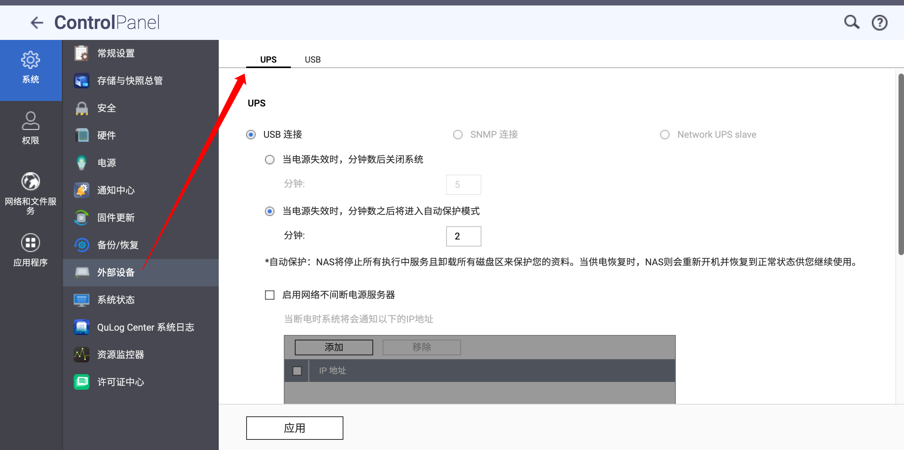

# 远程访问 & SSH

QNAP 官方提供了自己的远程访问服务（myQNAPcloud Link），可以直接通过 QNAP 的服务器远程访问到 NAS 设备。

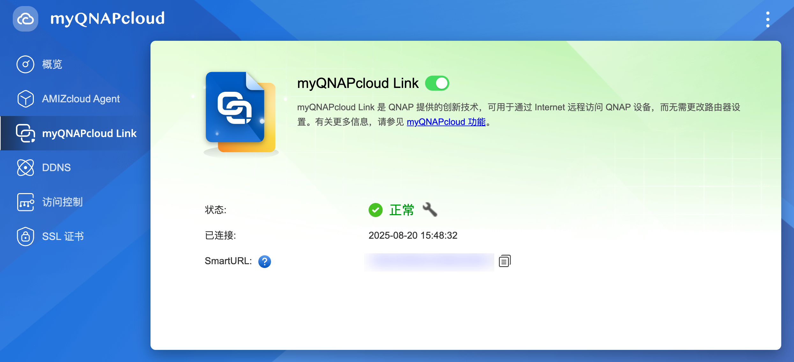

QNAP 官方也提供了 DDNS 服务，我们通过 Let's Encrypt 获取 SSL 证书即可（myQNAPcloud 当中的 `SSL 证书` 页）。关于 HTTPS 与 SSL 证书的更多信息，详见 。

另外，在配置 DDNS 域名解析时，如果需要解析到 IPv6 地址，则先关闭公共 IPv4 地址。出于安全性考虑，将 IPv6 地址暴露在公网要优于将 IPv4 地址暴露在公网。

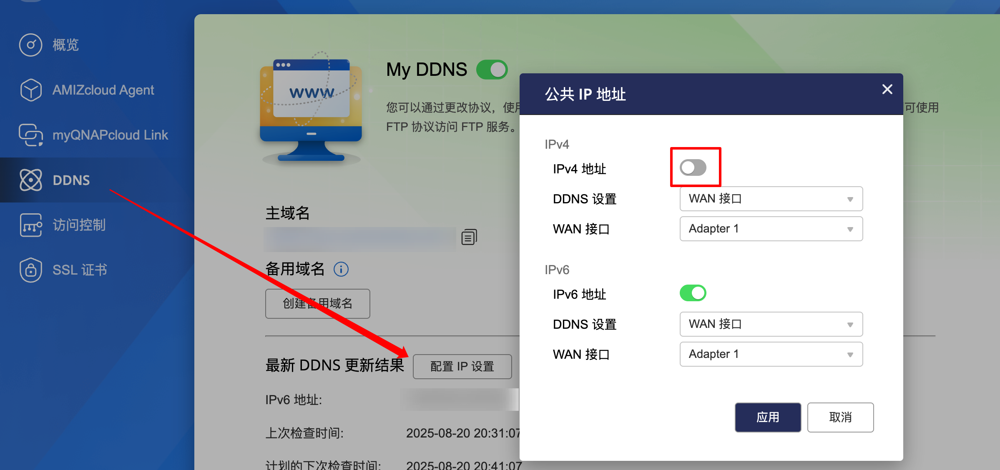

如果需要通过 SSH 访问 QNAP NAS，前往`网络和文件服务 - 网络访问 - Telnet/SSH`，勾选 `允许 SSH 连接`即可。

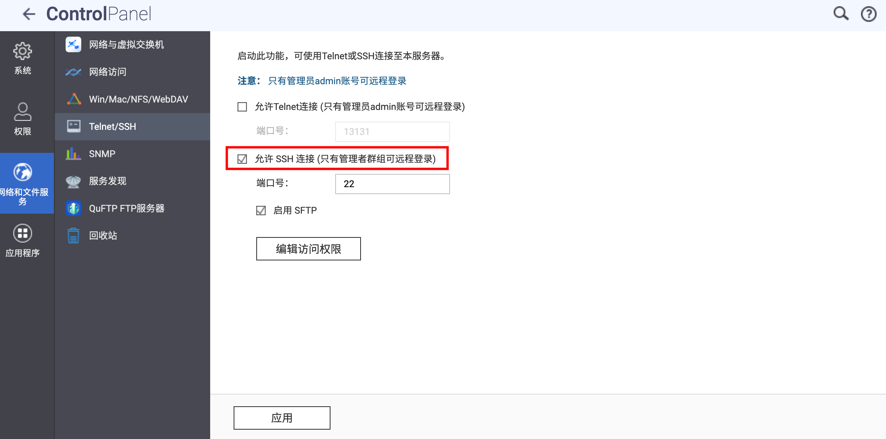

# 反向代理 & HTTPS

有关反向代理的介绍，详见 。

前往 `网络和文件服务 - 网络访问 - 反向代理`，添加规则即可。

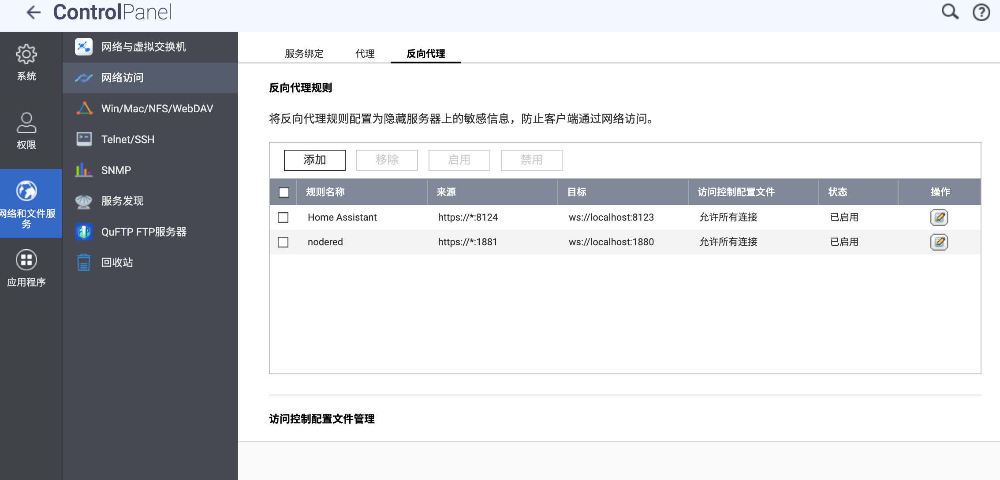

在高级设置中可以添加自定义标头。

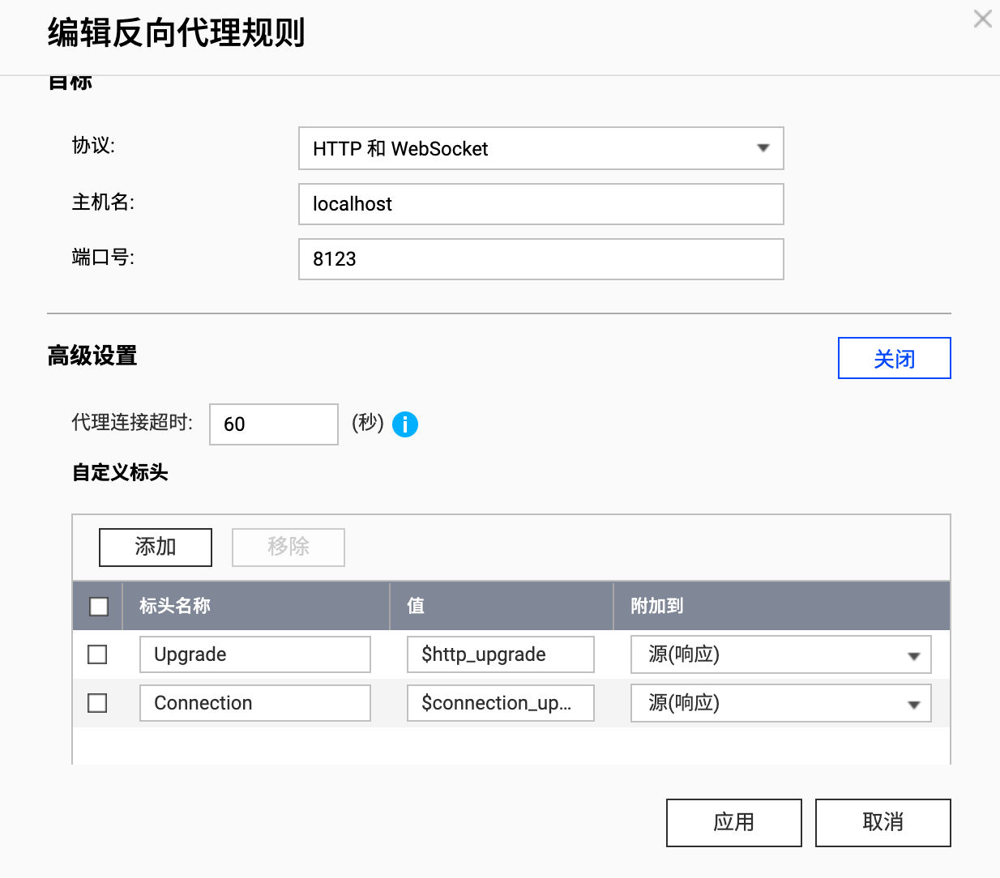

# SMB & WebDAV

关于 SMB 和 WebDAV 的简介，详见 。

要将 QNAP NAS 配置为 SMB 服务器，前往 `网络和文件服务 - Win/Mac/NFS/WebDAV - Microsoft 网络（SMB）`，启用配置即可。

其中的“启用 SMB 多通道”，是将 NAS 的双 2.5G 网口利用起来，达到链路聚合的效果。具体介绍可查看[司波图的视频](https://www.bilibili.com/video/BV1xqbmzeEeG)。

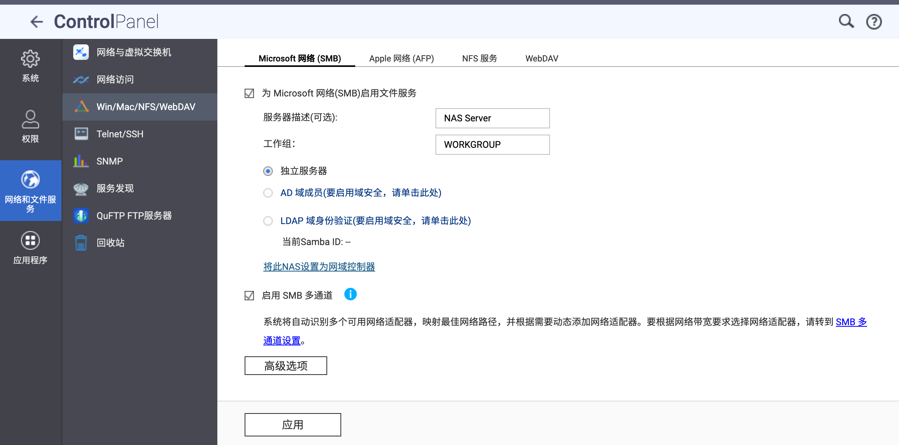

挂载 WebDAV 服务器可以通过 QNAP 官方提供的 Hybrid Mount 文件型云网关应用。

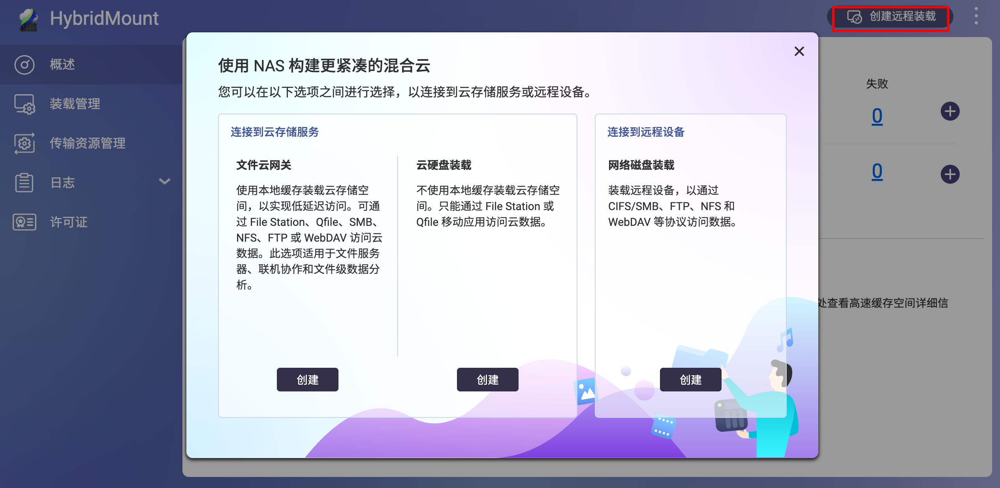

文件云网关支持添加多个平台的云服务，也可以自己手动输入 URL 进行添加。

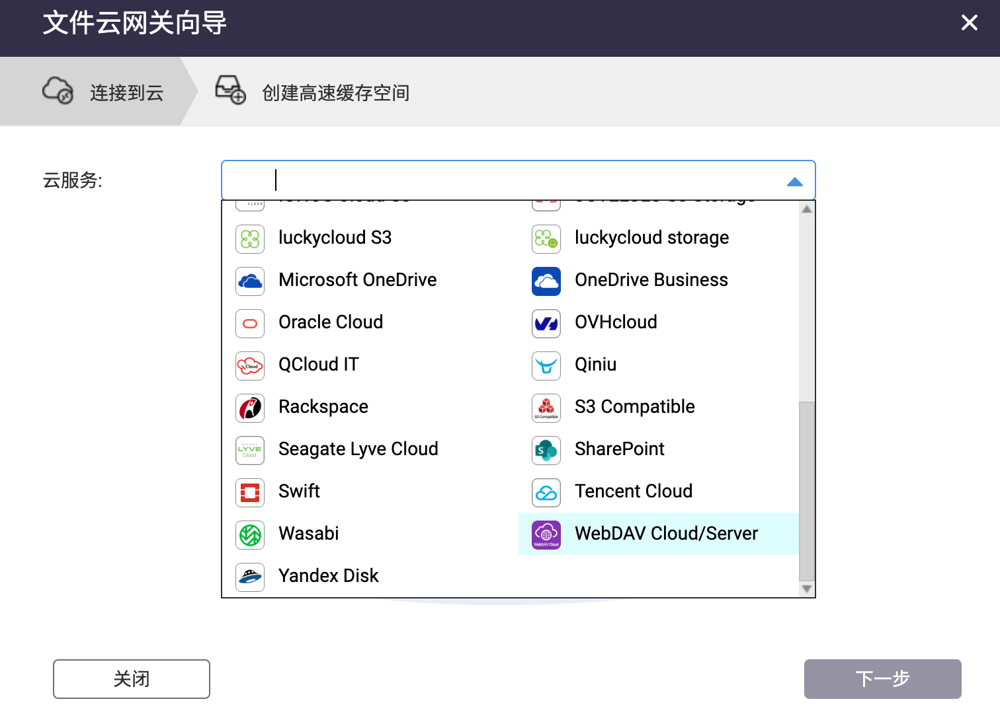

关于高速缓存空间的功能，QNAP 通过在本地存储池上划出写入缓存空间（上传云之前先使用写入缓存空间）与读取缓存空间（优先读取本地缓存，如果没有目标文件再从云下载），来优化挂载云服务的使用体验。

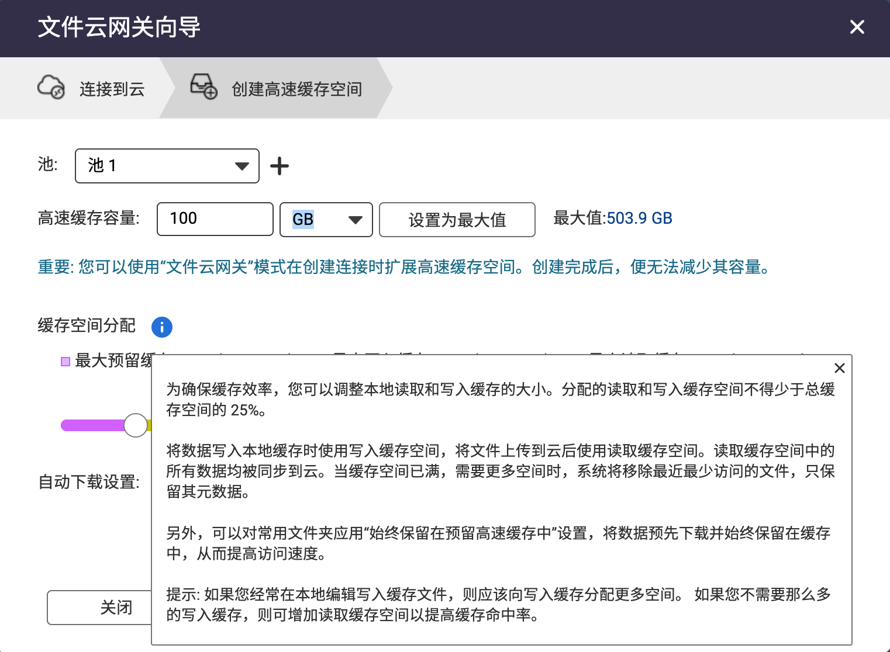

要将 QNAP NAS 配置为 SMB 服务器，前往 `网络和文件服务 - Win/Mac/NFS/WebDAV - WebDAV`，启用配置即可。

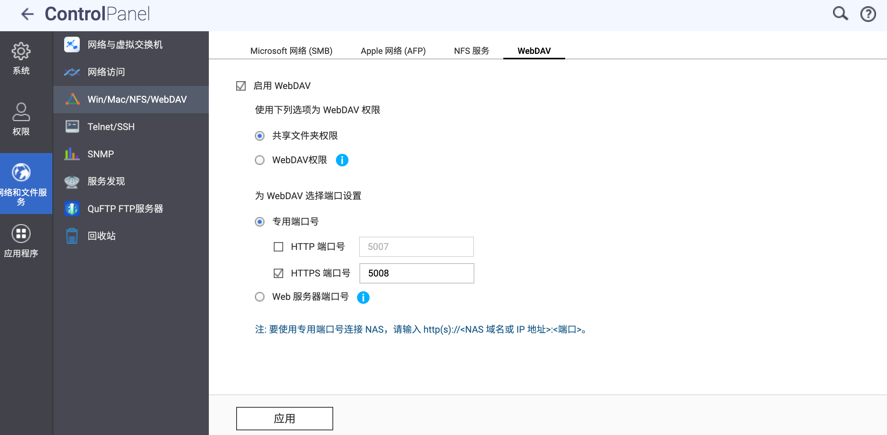

# Docker 服务：Container Station

Container Station 是 QNAP 官方的 Docker 管理应用。

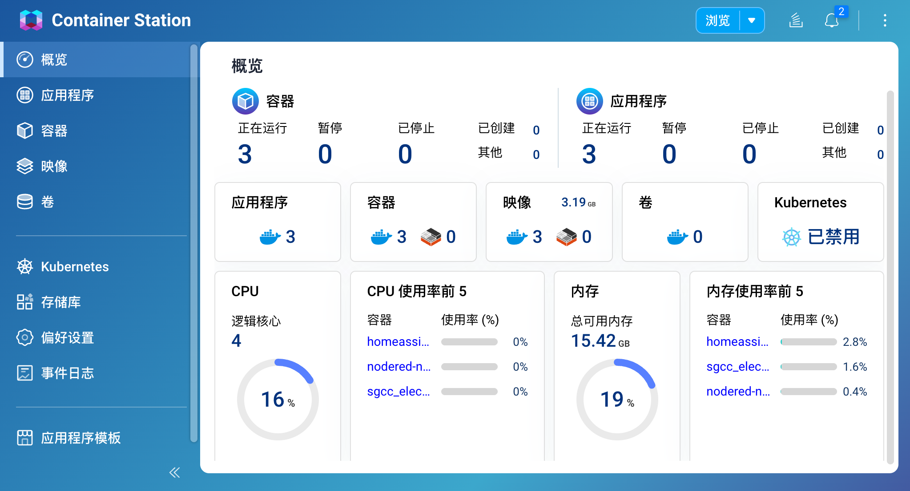

其中的应用程序页对应 Docker Compose 管理，容器与映像分别对应 Docker 当中的 Container 与 Image，上手比较容易。

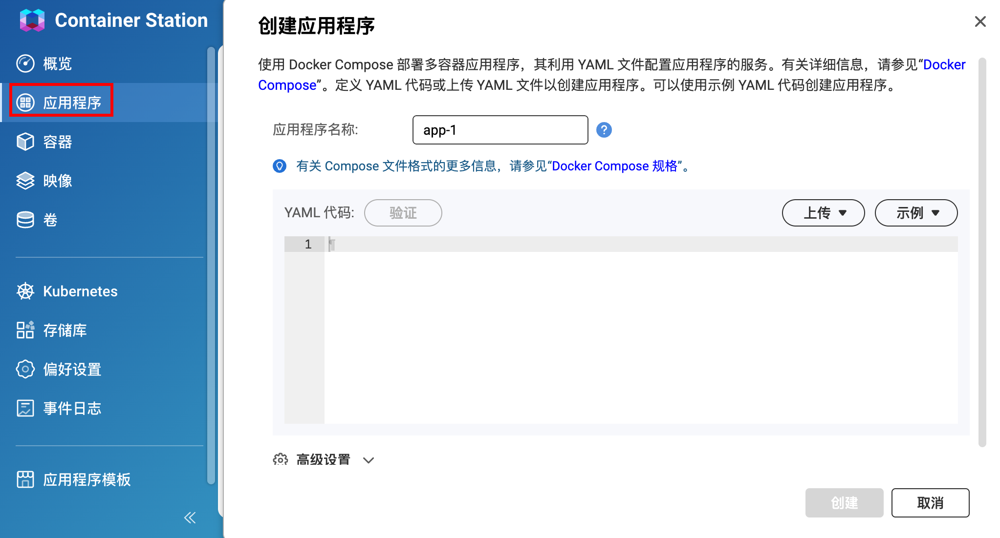

我们也可以通过 SSH 连接 NAS，使用其内置的 Docker 与 Docker Compose CLI 进行管理（需先安装 Container Station）。命令行使用详见 。

# 应用：App Center 与第三方源

App Center 是 QNAP 系统中的一个数字分发和管理平台，您可以在其中浏览、下载和管理为 QNAP NAS 开发的应用程序和实用程序。

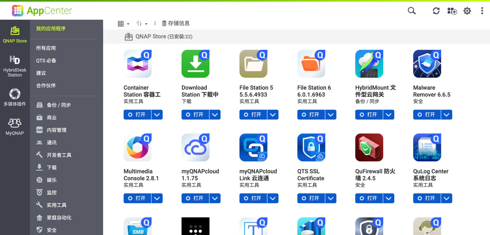

如果想要拓展应用安装源，可以添加第三方源。以下是两个较为常用的第三方源：

- QNAPClub（可能需要代理）：https://www.qnapclub.eu/en/repo.xml
- MyQNAP：https://www.myqnap.org/repo.xml

在 `AppCenter - 设置 - 程序来源` 处添加即可。

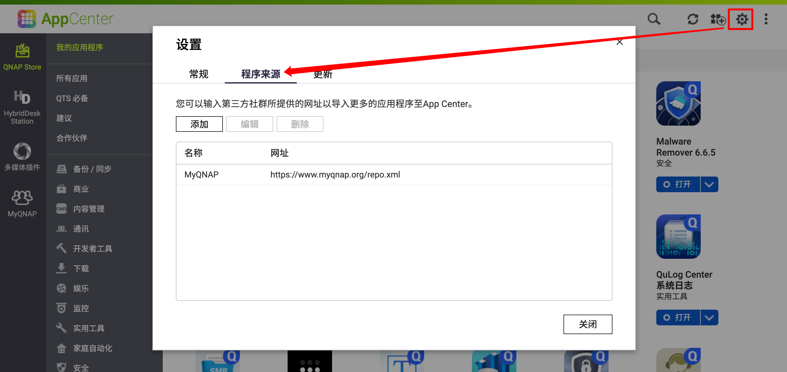

 
