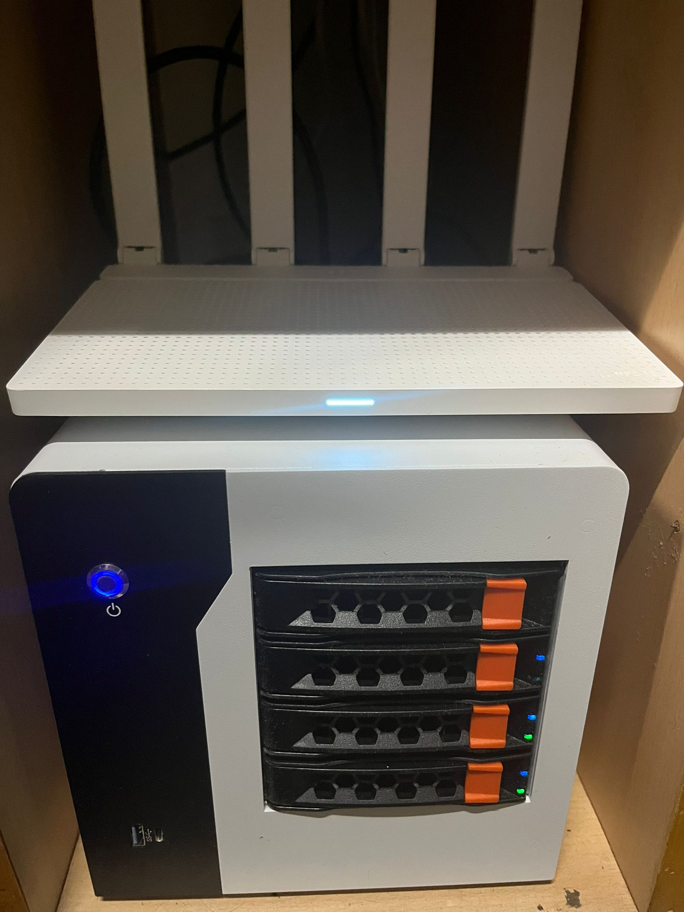
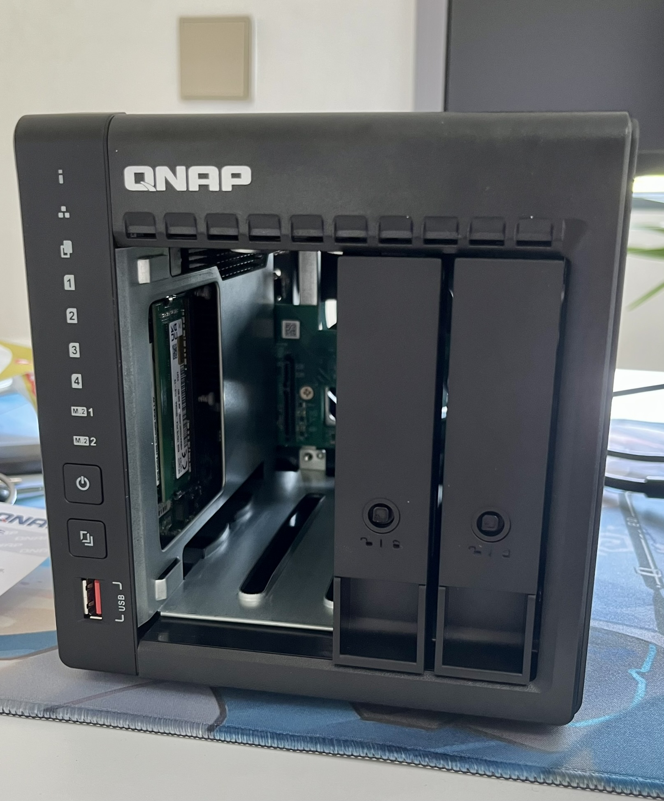


 

# 概述

我们为什么需要一台 NAS？

笔者在组建自己的第一台 NAS 之前，曾购置过一台 N100 的迷你主机准系统，给它装入了 Windows 10 系统，并在上面尝试了 PT、Jellyfin 等服务。

有一天笔者想找到自己 5 年前的一份文件，但是找遍了所有设备都没有。笔者的设备太多了：手机、平板、笔记本、台式机、N100 主机、Switch，还有几个 U 盘......有的时候一份文件需要在多个设备上工作，难以同步，使用 Onedrive 等方式又太慢，等待同步的时间令人着急。这种混乱的文件管理方式让笔者有了自己组装一台 NAS 的想法：不仅需要以稳定的方式存储数据，还能够运行 PT、Jellyfin 等服务。

# DIY NAS

## DIY 与成熟方案的比较

如果你有 DIY 的能力和意愿，或者就是单纯地喜欢折腾，笔者还是很建议采用 DIY 方案的。

DIY NAS 的优点：

- 硬件配置完全由自己挑选
- 性价比高
- 配置后续可升级，扩展性好

DIY NAS 的缺点：

- 组装硬件较为麻烦，需要自己手动接线
- 硬件兼容性未知，可能会出现意想不到的问题
- 如果出现问题，售后较困难
- 软件配置需要耗费时间精力

相对应地，如果你非常明确自己的需求（如：我的数据存储量大概有 8T 左右，都是媒体文件，并且需要使用 PT 以及多媒体管理服务），并且不想花费太多时间精力在配置上，希望能够开箱即用，那么你可以选择威联通、群晖等成熟 NAS 方案。

成品 NAS 的优点：

- 省心、省事、省时间
- 有自带的较好用的同步、多媒体管理等软件
- 完善的售后服务

成品 NAS 的缺点：

- 性价比低
- 大多数机器 CPU 性能羸弱
- 自带系统存在很多限制

## 以笔者的 NAS 为例

### 准系统

笔者的 NAS 主要是参考了 @LeSnow-Ye 的[机器](https://blog.lesnow.top/2023/08/22/first-nas/ "机器")，配置如下：

|         | **型号**                                                                        | **价格**  | **来源** | **备注**                   |
| ------- | ----------------------------------------------------------------------------- | ------- | ------ | ------------------------ |
| **机箱**  | [梵隆 NAS4-200](https://item.taobao.com/item.htm?id=694112714570 "梵隆 NAS4-200") | 236.91  | 拼多多    |                          |
| **CPU** | G4600                                                                         | 47.1    | 拼多多    |                          |
| **主板**  | 纳斯 B365                                                                       | 447.09  | 拼多多    | 选 B365 而不是 B250 其实是因为没货了 |
| **电源**  | 航嘉 HK350-94FP                                                                 | 93.8    | 拼多多    |                          |
| **内存**  | DDR4 16G 2666 \* 2                                                            | 233     | 闲鱼     | 组 ZFS 会比较吃内存             |
| **散热**  | 超频三蜂鸟                                                                         | 27.61   | 拼多多    | 很难扣上去，安装时注意方向            |
| **总计**  |                                                                               | 1085.51 |        |                          |

> Lesnow：机箱选择梵隆 NAS4-200 是因为它达到了价格、做工、外观的三赢，全金属机身的 ITX NAS 机箱，如果不想选择二手机箱，它几乎没有对手。

关于纳斯主板可以看看钱韦德的[这篇文章](https://mp.weixin.qq.com/s/F9g6ynC1DIy_lmmIfOZ8Vg "这篇文章")。

其实 CPU 原来想选择 8100T，但看了价格后实在劝退（写作时 pdd 价格 190+）。而 G4600 只需要 47 块钱，参数为 2C4T 3.6GHz，还有 HD 630 核显，应付 4K 硬解轻轻松松。笔者目前也没有多开虚拟机的需求，理所当然就选择了 G4600，后续也可以升级到 9100T。

由于机箱的限制，电源只能选择 Flex（小 1U）规格的。在这方面最好的选择是益衡的 7025B 250W 电源，静音又稳定，但价格 200+（如果你预算充足，直接上海韵）。笔者选择的是航嘉 HK350-94FP 250W 电源，100 元左右，品牌还是有一些保障的。

### 硬盘

|         | **型号**           | **价格** | **来源** | **备注** |
| ------- | ---------------- | ------ | ------ | ------ |
| **SSD** | 幻隐 HV2000        | 0      | 闲置     |        |
| **HDD** | ST4000VX007      |        | 朋友处购买  |        |
| **HDD** | ST4000VX015 \* 2 | 838    | 淘宝     |        |

相比于 VX015，更推荐 VX016。这两个是同一块盘，而 VX015 是海康 OEM，而且相比 VX016 还要便宜几十块钱，但：

- 如果硬盘出现问题，海康售后可能会发回叠瓦盘
- VX016 会附带一次数据恢复服务，如果平时数据存储习惯不好，更推荐选用 VX016

### 组装

这台机器组装还是需要在理线上花些功夫，毕竟大多数空间都让给了 4 个 HDD 盘位。特别注意，走线时最好要绕过内存，否则盖上主板后可能会导致内存松动无法开机。

装好之后体积还是挺小巧的。

## 以笔者的成品 NAS 为例

笔者搬到新家之后，家里新添置了一些智能家居设备，但它们来自不同的品牌，需要像 Home Assistant 这样的中枢将它们统一起来。同时，也是为了后续可能的监控安装以及存储需求，在稳定性以及易安装性方面考虑，选择了威联通 QNAP 品牌的 TS-464C2 的四盘位 NAS。配置如下：

|         | **型号**                                                                        | **价格**  | **来源** | **备注**                   |
| ------- | -------------------------------------------------------------------- | ------- | ------ | ------------------------ |
| **准系统 + HDD**  | TS-464C2 + ST4000VN006 \*2 | 3219  | 京东    |                          |
| **CPU** | N5095                                                                         | /    | 准系统    |      处理器真不舍得给                    |
| **内存**  | 原装 8G + DDR4 8G 3200                                                            | 91.99     | 京东     | 组 ZFS 比较吃内存             |
| **SSD**  | 西数 SN5000 1T                                                                         | 446.91   | 京东    |              |
| **总计**  |                                                                               | 3757.9  |        |                          |

 

