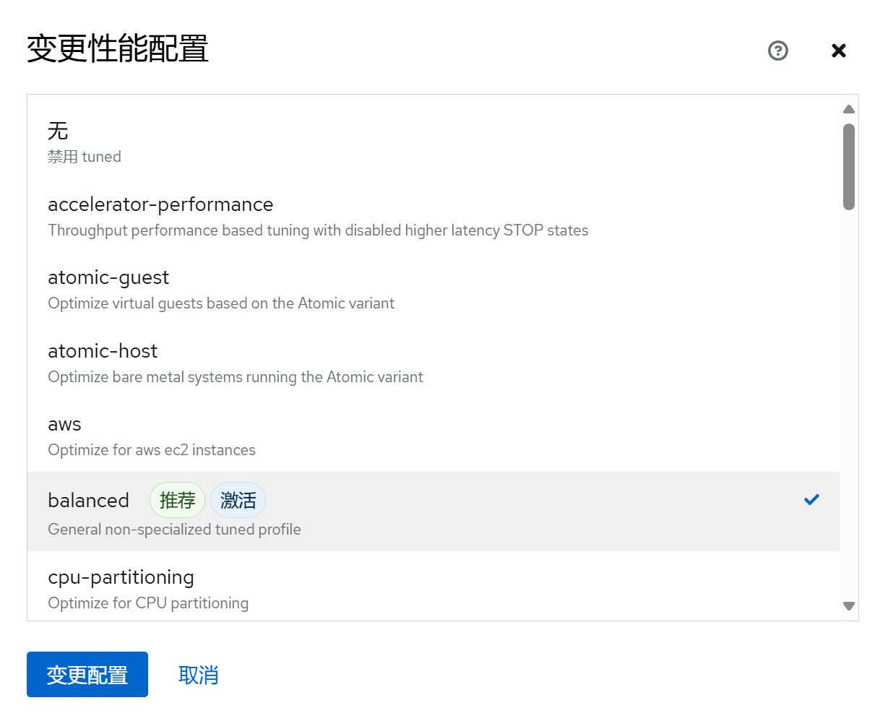
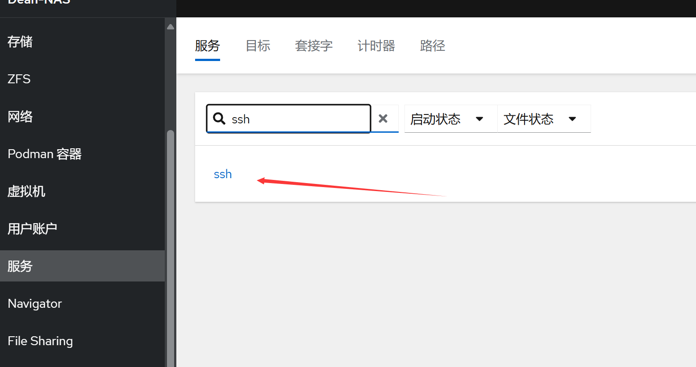


<br/>
<br/>

本篇文章主要来自于[这篇教程](https://docs.qq.com/doc/p/ac7a498302fca24ec7f0d002820ee32eceb03c13 "这篇教程")。

# Debian 初始化

## 安装初始软件

```bash
apt install sudo curl git vim net-tools -y # 以 root 用户运行
```

## 添加用户至 sudo 组

添加安装系统时创建的第一个用户至 sudo 组，以方便我们后续管理系统。

```bash
usermod -aG sudo <user_name> # 请将 <user_name> 替换为要添加的用户名
```

## 更换国内镜像源

Debian 的软件源配置文件是`/etc/apt/sources.list`。将系统自带的该文件做个备份，将该文件替换为下面内容，即可使用 TUNA 的软件源镜像。

```bash
sudo cp /etc/apt/sources.list /etc/apt/sources.list.bak # 备份 /etc/apt/sources.list
sudo vim /etc/apt/sources.list # 修改 sources.list 文件
```

替换为：

```text
# 默认注释了源码镜像以提高 apt update 速度，如有需要可自行取消注释
deb https://mirrors.tuna.tsinghua.edu.cn/debian/ bookworm main contrib non-free non-free-firmware
# deb-src https://mirrors.tuna.tsinghua.edu.cn/debian/ bookworm main contrib non-free non-free-firmware

deb https://mirrors.tuna.tsinghua.edu.cn/debian/ bookworm-updates main contrib non-free non-free-firmware
# deb-src https://mirrors.tuna.tsinghua.edu.cn/debian/ bookworm-updates main contrib non-free non-free-firmware

deb https://mirrors.tuna.tsinghua.edu.cn/debian/ bookworm-backports main contrib non-free non-free-firmware
# deb-src https://mirrors.tuna.tsinghua.edu.cn/debian/ bookworm-backports main contrib non-free non-free-firmware

deb https://mirrors.tuna.tsinghua.edu.cn/debian-security bookworm-security main contrib non-free non-free-firmware
# deb-src https://mirrors.tuna.tsinghua.edu.cn/debian-security bookworm-security main contrib non-free non-free-firmware
```

Debian Buster 以上版本默认支持 HTTPS 源。如果遇到无法拉取 HTTPS 源的情况，请先使用 HTTP 源并安装：

```bash
apt-get install apt-transport-https ca-certificates -y
```

## 更新系统

```bash
sudo apt update && sudo apt upgrade -y
```

# Cockpit Web

Cockpit 使 Linux 易于使用。可以将 Cockpit 理解为 Linux 的网页端图形化界面。在 Web 浏览器中借助 Cockpit 查看服务器，启动容器、管理存储、配置网络和检查日志都很容易。

## 安装 Cockpit

Cockpit 从版本 10 （Buster） 开始在 Debian 中可用。要获取最新版本，建议启用向后移植存储库（以 root 身份）：

```bash
. /etc/os-release
echo "deb http://deb.debian.org/debian ${VERSION_CODENAME}-backports main" > \
    /etc/apt/sources.list.d/backports.list
apt update
```

安装或更新软件包：

```bash
apt install -t ${VERSION_CODENAME}-backports cockpit -y
```

## 安装附属组件

### 虚拟机

在浏览器中创建、运行和管理虚拟机。（按需安装，非必要插件）

```bash
. /etc/os-release
apt install -t ${VERSION_CODENAME}-backports cockpit-machines -y
```

### Podman 容器

在浏览器中下载、使用和管理容器。（按需安装，非必要插件）

```bash
. /etc/os-release
apt install -t ${VERSION_CODENAME}-backports cockpit-podman -y
```

### Cockpit-pcp

Cockpit 面板的历史数据插件。

```bash
. /etc/os-release
apt install -t ${VERSION_CODENAME}-backports cockpit-pcp -y
```

### 45Drives（第三方组件）

45Drives Repo 包含 Navigator、File Sharing、Identities、ZFS 管理器等，推荐拉取并按需安装。

下载并运行 45Drives 脚本：

```bash
curl -sSL https://repo.45drives.com/setup | sudo bash
sudo apt update
```

- Navigator 文件浏览器
  ```bash
  sudo apt install cockpit-navigator -y
  ```
- File Sharing 管理 Samba 与 NFS 文件共享
  ```bash
  sudo apt install cockpit-file-sharing -y
  ```
- Identities 用户和组管理插件
  ```bash
  sudo apt install cockpit-identities -y
  ```
- ZFS 管理器
  先安装 ZFS：
  ```bash
  sudo apt update
  sudo apt install -y zfs-dkms zfsutils-linux
  ```
  安装管理器：
  ```bash
  git clone https://github.com/optimans/cockpit-zfs-manager.git
  sudo cp -r cockpit-zfs-manager/zfs /usr/share/cockpit
  ```

## Cockpit 调优

### 自动注销闲置用户

在`/etc/cockpit/` 目录中创建 `cockpit.conf` 文件：

```bash
sudo vim /etc/cockpit/cockpit.conf
```

在文件中添加以下文本，以分钟为单位，这里表示为 15 分钟后自动退出：

```text
[Session]
IdleTimeout=15
```

保存文件，重启 Cockpit Web 控制台以使更改生效：

```bash
sudo systemctl try-restart cockpit
```

### 在登录页面中添加标题

在您首选的文本编辑器中创建 `/etc/issue.cockpit` 文件。添加要显示的内容作为文件的横幅。

```bash
sudo vim /etc/cockpit/issue.cockpit
```

在文件中添加需要展示的内容：

```text
HomeNAS Based on Debian 12.
```

内容添加完成后，保存这个文件。

在您首选的文本编辑器中创建 `/etc/cockpit/cockpit.conf` 文件。

```bash
sudo vim /etc/cockpit/cockpit.conf
```

在文件中添加以下文本：

```text
[Session]
Banner=/etc/cockpit/issue.cockpit
```

保存文件，重启 Cockpit Web 控制台以使更改生效：

```bash
sudo systemctl try-restart cockpit
```

### Cockpit 面板登陆后首页展示信息

配置文件路径：

```bash
sudo vim /etc/motd
```

原文：

```text
The programs included with the Debian GNU/Linux system are free software;
the exact distribution terms for each program are described in the individual files in /usr/share/doc/*/copyright.

Debian GNU/Linux comes with ABSOLUTELY NO WARRANTY, to the extent permitted by applicable law.
```

### 修改 Web 登陆端口

创建`/etc/systemd/system/cockpit.socket.d/listen.conf`文件：

```text
[Socket]
ListenStream=    # 若第一行留空，则会禁用 Cockpit 的默认端口 9090
ListenStream=443
```

为了使更改生效，请运行以下命令：

```bash
sudo systemctl daemon-reload 
sudo systemctl restart cockpit.socket
```

# 系统调优

## 网络配置

编辑文件网络配置文件，命令：

```bash
sudo vim /etc/network/interfaces
```

部分配置如下。我们在第一部分硬路由的局域网配置中，选择使用路由器来进行静态路由分配，因此对于设备网卡我们设置为 dhcp 即可。如果需要在本地机器上配置静态地址，参照下面注释部分。

- 踩坑记录：对于多网卡设备，不能给两块网卡同时配置网关，否则会导致路由表中出现两个默认路由。
  解决办法：只有连接外网的网卡需要配置网关以及 nameserver。

```text
# The loopback network interface
auto lo
auto enp2s0 # enp2s0 是设备网卡名，可以通过 ifconfig 命令查看
auto enp3s0

iface lo inet loopback
iface enp2s0 inet dhcp
iface enp3s0 inet dhcp

# 静态地址配置
# iface enp2s0 inet static
# address 192.168.xx.xx
# netmask 255.255.0.0
# gateway 192.168.xx.xx
```

如果要使用 Cockpit 接管网络配置，需注释掉`/etc/network/interfaces`文件当中的所有内容，进入`Cockpit - 网络 - 接口 - enp1s0（你网络接口名称）- IPV4 - 编辑 - 手动`，输入你要设置的IP地址及默认网关。


## 调整系统时区/时间

Cockpit - 概览 - 系统时间 - 点击时间进行校准，时区选择 Asia/Shanghai，设置时间选择自动使用 NTP，然后点击变更，系统会自动联网进行校准。


## 交换空间优化

Debian 默认是当内存使用达到 40% 时就向交换空间写入数据，这样会大大地降低电脑运行效率，我们将它改为达到 90% 再向交换空间写入数据

打开 `/etc/sysctl.conf` 文件，执行命令：

```bash
sudo vim /etc/sysctl.conf
```

在文件的末尾添加下面两行配置：

```text
vm.swappiness=10
vm.vfs_cache_pressure=50
```

`vm.swappiness`是用来控制内核在什么时候开始使用交换空间的参数，默认值是 60。将该值调整为 10 表示让内存使用率达到 90% 时才开始使用交换空间。

`vm.vfs_cache_pressure` 是用来控制内核清理缓存的频率的参数，默认值是 100。将该值调整为 50 表示内核会更倾向于清理文件系统缓存以回收内存。

保存修改并退出编辑器，执行命令：

```bash
sudo sysctl -p
```

以重新加载配置。

**修改内核参数可能会影响系统性能和稳定性，请根据自身需要调整，谨慎操作。**

## 安装 Tuned 系统调优工具

Tuned（又称为 tuned-adm）是一个系统调优工具，旨在帮助优化系统的性能和功耗。它允许管理员根据系统的需求选择不同的预定义配置文件或自定义配置文件，以提供最佳的性能和功耗平衡。

安装 Tuned 软件包：

```bash
sudo apt update && sudo apt install tuned
```

以下是Tuned的一些常用命令和其功能：

```bash
sudo systemctl start tuned # 启动 Tuned 服务。
sudo systemctl stop tuned # 停止 Tuned 服务。
sudo systemctl restart tuned # 重启 Tuned 服务。
sudo systemctl status tuned # 查看 Tuned 服务的运行状态。
sudo systemctl stop tuned # 停止 Tuned 服务。
sudo systemctl disable tuned # 禁止 Tuned 服务开机启动。
tuned-adm list # 列出所有可用的 Tuned 配置文件。
tuned-adm active # 查看当前活动的 Tuned 配置文件。
tuned-adm recommend # 根据系统的硬件配置和工作负载推荐一个最佳的 Tuned 配置文件。
```

在 Cockpit Web 管理面板上配置 Tuned：


选择你需要的模式激活使用。



常用 Tuned 配置集

- throughput-performance

  针对高吞吐量优化的服务器配置文件。它禁用节能机制并启用 sysctl 设置，以提高磁盘和网络 IO 的吞吐量性能。CPU 调控器设置为 performance。它将 `energy_performance_preference` 和 `scaling_governor` 属性设置为 performance 配置集。
- accelerator-performance

  包含与 throughput-performance 配置集相同的调整。另外，它会将 CPU 锁定为低 C 状态，以便使延迟小于 100us。这提高了某些加速器的性能，如 GPU。
- network-throughput

  用于吞吐量网络调优的配置集。它基于 throughput-performance 配置集。此外，它还增加了内核网络缓冲区。它继承 latency-performance 或 throughput-performance 配置集，并将`energy_performance_preference` 和 `scaling_governor` 属性改为 performance 配置集。
- Balanced

  默认的节能配置文件。它在性能和功耗之间具有折衷。在可能的情况下尽可能使用自动扩展和自动调整。唯一缺陷是增加延迟。在当前的 Tuned 版本中，它启用了 CPU、磁盘、音频和视频插件，并激活了 conservative CPU 调控器。如果支持，`radeon_powersave` 选项使用 dpm-balanced 值，否则被设置为 auto。它将 `energy_performance_preference` 属性改为 normal 能源设置。它还将 `scaling_governor` 策略属性改为 conservative 或 powersave CPU 调控器。
- powersave

  用于最大节能性能的配置集。它可以对性能进行调整，从而最大程度降低实际功耗。在当前的 Tuned 发行版本中，它为 SATA 主机适配器启用 USB 自动挂起、WiFi 节能和 Aggresive Link Power Management (ALPM) 节能。它还为使用低折率的系统调度多核功耗，并激活 ondemand 监管器。它启用了 AC97 音频节能，或根据您的系统，HDA-Intel 节能时间为 10 秒。如果您的系统包含启用了 KMS 支持的 Radeon 图形卡，配置集会将其配置为自动节能。在 ASUS Eee PC 上，启用了动态超级混合引擎。它将 `energy_performance_preference` 属性改为 powersave 或 power energy 设置。它还会将 `scaling_governor` 策略属性更改为 ondemand 或 powersave CPU 调控器。

## 配置邮件发送服务

安装 Exim4，命令：

```bash
sudo apt install exim4 -y
```

配置 Exim4 服务，命令：

```bash
sudo dpkg-reconfigure exim4-config
```

终端输出配置内容：

```text
Please select the mail server configuration type that best meets your needs.

Systems with dynamic IP addresses, including dialup systems, should generally be
configured to send outgoing mail to another machine, called a 'smarthost' for
delivery because many receiving systems on the Internet block incoming mail from
dynamic IP addresses as spam protection.

A system with a dynamic IP address can receive its own mail, or local delivery
can be disabled entirely (except mail for root and postmaster).

  1. internet site; mail is sent and received directly using SMTP
  2. mail sent by smarthost; received via SMTP or fetchmail
  3. mail sent by smarthost; no local mail
  4. local delivery only; not on a network
  5. no configuration at this time
General type of mail configuration:
```

### 邮件系统类型

选择第三项：用 smarthost 发信；无本地信件。


### 系统邮件名称

填写发邮件的邮件域名，如你的发件邮件地址是 <mymail@qq.com>，则这里填写 qq.com。


### 监听入站 SMTP 连接

监听的 IP 地址填写 127.0.0.1 ; ::1，这里表示只监听本地 IPv4 / IPv6 端口，也就是只有本机能发信，外部不能访问。


### 其他可接收邮件的目的地址

这里留空。


### 本地用户的可见域名

同样填写你的发件邮箱域名，如 qq.com。


### 发邮件使用的 smarthost

填写外部 SMTP 地址。对于 QQ 邮箱，这里填写 QQ 的 SMTP 地址`smtp.qq.com:587`。

### 按需拨号

不保持最小 DNS 查询量，选择 No。


### 分拆设置文件

如不搭建复杂的邮件服务器，这里保持默认选择 No 即可。


### Root 和 postmaster 邮件接收者

这里留空。


### 后续设置

输入命令：

```bash
sudo vim /etc/exim4/passwd.client
```

在末尾加入（注意修改用户名和密码，密码为邮箱授权码，非登录密码）：

```text
qq-smtp.l.qq.com:yourAccountName@qq.com:y0uRpaSsw0RD
*.qq.com:yourAccountName@qq.com:y0uRpaSsw0RD
smtp.qq.com:yourAccountName@qq.com:y0uRpaSsw0RD
```

格式为：`<发件邮箱 SMTP 服务器>:<发件邮箱账号>:<发件邮箱授权码>`，因为上面我们已经设置过 SMTP 服务器地址，所以这里可以填写通配符，当然也可以填 SMTP 地址。

输入命令：

```bash
sudo vim /etc/email-addresses
```

在末尾加入：

```text
root: mymail@qq.com
```

格式：`<系统用户名>: <发件邮箱地址>`

如设置防火墙，请开放 587 端口，然后重启 exim4：

```bash
/etc/init.d/exim4 restart
```

发送邮件测试，首先切换到 root 用户：

```bash
su -
```

输入发送邮件测试命令（修改为你要接收邮件的邮箱地址）：

```bash
echo "test" | mail -s "test" user@example.com
```

如果你的邮箱收到邮件，就说明安装成功了。

# 安全防护

安全的概念：

1. 收紧安全措施有可能达到使系统无法使用的程度。安全性与便利性需要得到平衡。诀窍在于建立一个安全且有用的系统。
2. 最大的威胁是（并且一直都会是）用户。
3. 最小权限原则：系统的每一部分应该只能访问到它确实需要的东西，除此之外的则不可以。
4. 纵深防御：多个独立的层次能带来更好的安全性。当一层防护被攻破时，另一层应该能够阻止攻击。
5. 保持一点点的偏执和多疑。如果有件事看起来太好了，不像是真的，那可能确实如此。
6. 永远无法令系统 100% 安全，除非把机器从网络上断开，关掉电源，锁进保险柜，用混凝土封住并不再使用它。
7. 为失败做好准备。预先为安全措施被攻破的情况制定可供执行的计划。

本章节主要内容参考自 Debian 安全指南和 Arch Linux 安全。

Debian 安全指南：

[https://www.debian.org/doc/manuals/securing-debian-manual/ch04s11.zh-cn.html](https://www.debian.org/doc/manuals/securing-debian-manual/ch04s11.zh-cn.html "https://www.debian.org/doc/manuals/securing-debian-manual/ch04s11.zh-cn.html")

Arch Linux 安全：[https://wiki.archlinuxcn.org/wiki/安全](https://wiki.archlinuxcn.org/wiki/安全 "https://wiki.archlinuxcn.org/wiki/安全")

执行下列操作前，先给系统用户做个检查。检查是否存在空口令和 root 权限的账号，确认是否存在异常账号，确认 UID 为零的账号只有 root 账号。

操作步骤：

查看 root 权限账号，使用命令：

```bash
awk -F: '($3==0)' /etc/passwd # 查看UID为零的账号
```

查看空口令账号，使用命令：

```bash
awk -F: '($2=="")' /etc/shadow # 查看空口令账号
```

加固空口令账号，使用命令：

```bash
passwd <username> # 为空口令账号设定密码
```

## 配置高强度密码策略

为了确保系统的安全性，建议设置的口令复杂度策略为：口令最小长度不小于8，至少包含大写字母、小写字母、数字和特殊字符中的三种。

安装 PAM 的 pwquality 模块，cracklib 模块在 Debian 12 中被 pwquality 替代，pwquality 能提供额外的密码检查能力。

```bash
sudo apt install libpam-pwquality
```

修改文件`/etc/pam.d/common-password`。 一旦修改，策略会马上生效。

```bash
sudo vim /etc/pam.d/common-password
```

找到文件中的以下内容：

```text
password requisite pam_pwquality.so retry=3 minlen=8 difok=3
```

添加参数`minlen`、`dcredit`、`ucredit`、`lcredit`、`ocredit`。如果文件中已有这些参数，直接修改参数值即可，参数说明如表1所示。

示例：

```text
password requisite pam_pwquality.so retry=3 minlen=9 dcredit=-1 ucredit=-1 lcredit=-1 ocredit=-1 difok=3
```

| 参数      | 说明                                                                            | 示例         |
| ------- | ----------------------------------------------------------------------------- | ---------- |
| minlen  | 口令最小长度配置项。PAM 默认使用了“credits”，因此最小口令长度需要加 1，若需要设置最小口令长度为 8，则 minlen 的值应该设置为 9。" | minlen=9   |
| dcredit | 口令数字要求的配置项。值为负数 N 时表示至少有 N 个数字，值为正数时对数字个数没有限制。                               | dcredit=-1 |
| ucredit | 口令大写字母要求的配置项。值为负数 N 时表示至少有 N 个大写字母，值为正数时对大写字母个数没有限制。                         | ucredit=-1 |
| lcredit | 口令小写字母要求的配置项。值为负数 N 时表示至少有 N 个小写字母，值为正数时对小写字母个数没有限制。                         | lcredit=-1 |
| ocredit | 特殊字符要求的配置项。值为负数 N 时表示至少有 N 个特殊字符，值为正数时对特殊字符个数没有限制。                           | ocredit=-1 |

## 用户连续登陆失败锁定

设置在 3 次登录尝试失败后账户将被锁定至少 5 分钟，或者由管理员将其解锁。

在`/etc/pam.d/common-auth`中添加如下绿色字体内容，必须按下面顺序添加，命令：

```bash
sudo vim /etc/pam.d/common-auth
```

```纯文本
#
# /etc/pam.d/common-auth - authentication settings common to all services
#
# This file is included from other service-specific PAM config files,
# and should contain a list of the authentication modules that define
# the central authentication scheme for use on the system
# (e.g., /etc/shadow, LDAP, Kerberos, etc.).  The default is to use the
# traditional Unix authentication mechanisms.
#
# As of pam 1.0.1-6, this file is managed by pam-auth-update by default.
# To take advantage of this, it is recommended that you configure any
# local modules either before or after the default block, and use
# pam-auth-update to manage selection of other modules.  See
# pam-auth-update(8) for details.

# here are the per-package modules (the "Primary" block)
# 这里是可以修改的一行，参数按需添加
auth    required pam_faillock.so preauth audit silent deny=3 fail_interval=900 unlock_time=900 even_deny_root root_unlock_time=900
auth  [success=1 default=ignore]  pam_unix.so nullok
# here's the fallback if no module succeeds
# BEGIN ANSIBLE MANAGED BLOCK
auth    [default=die] pam_faillock.so authfail audit deny=3 fail_interval=900 unlock_time=900 even_deny_root root_unlock_time=900
auth    sufficient pam_faillock.so authsucc audit deny=3 fail_interval=900 unlock_time=900 even_deny_root root_unlock_time=900
auth  requisite      pam_deny.so
# prime the stack with a positive return value if there isn't one already;
# this avoids us returning an error just because nothing sets a success code
# since the modules above will each just jump around
auth  required      pam_permit.so
# and here are more per-package modules (the "Additional" block)
auth  optional      pam_cap.so 
# end of pam-auth-update config
```

参数解析（按需添加）：

```text
audit // 如果用户不存在，则把该用户名记录到系统日志中。

Silent // 不打印信息性的消息

deny=3 // 用户连续认证失败次数超过 3 则锁定

fail_interval=900 // 间隔时间的长度，在这个时间段内连续的

unlock_time=900 // 锁定后 n 秒后，访问将被重新启用，在没有设置 faillock 的情况下，不会重新启用。

even_deny_root // root 账户和普通账户一样可以被锁定。

root_unlock_time=900 // 在 root 账户被锁定后, 允许在 n 秒后访问该账户。
```

接着编辑`/etc/pam.d/common-account`文件，命令：

```bash
sudo vim /etc/pam.d/common-account
```

修改内容：

```text
#
# /etc/pam.d/common-account - authorization settings common to all services
#
# This file is included from other service-specific PAM config files,
# and should contain a list of the authorization modules that define
# the central access policy for use on the system.  The default is to
# only deny service to users whose accounts are expired in /etc/shadow.
#
# As of pam 1.0.1-6, this file is managed by pam-auth-update by default.
# To take advantage of this, it is recommended that you configure any
# local modules either before or after the default block, and use
# pam-auth-update to manage selection of other modules.  See
# pam-auth-update(8) for details.
#

# here are the per-package modules (the "Primary" block)
account  [success=1 new_authtok_reqd=done default=ignore]  pam_unix.so 
# here's the fallback if no module succeeds
account  requisite      pam_deny.so
# prime the stack with a positive return value if there isn't one already;
# this avoids us returning an error just because nothing sets a success code
# since the modules above will each just jump around
account  required      pam_permit.so
# and here are more per-package modules (the "Additional" block)
# end of pam-auth-update config
account    required pam_faillock.so
```

常用操作命令：

查看所有用户的尝试失败登录次数

```bash
sudo faillock
```

主要看 faillock 命令，显示的 valid 值，v 表示有效，i 表示无效。

查看指定用户（test 用户）

```bash
sudo faillock --user test
```

解锁指定用户账户（test 用户）

```bash
sudo faillock --user test --reset
```

解锁所有用户

```bash
sudo faillock --reset
```

重启系统也能解锁所有用户。

## 禁止 root 用户密码登录

建议通过 Cockpit Web 管理面板禁止 root 用户密码登陆，平时保持其处于禁用状态，如有需要时可以很方便就通过此处开启，用完即随手关闭。

通过`Cockpit Web 管理面板 - 用户账户 - root 用户 - 选项 - 禁用交互式密码`，打上勾表示禁止 root 用户使用密码登陆。


## 限制用户 su

限制能 su 到 root 的用户。使用命令：

```bash
sudo vim /etc/pam.d/su
```

修改配置文件，在配置文件中添加行。例如，只允许 sudo 组用户 su 到 root，则添加

```text
auth required pam_wheel.so group=sudo
```

添加后如下所示：

```text
#
# The PAM configuration file for the Shadow `su' service
#
auth required pam_wheel.so group=sudo
# This allows root to su without passwords (normal operation)
auth       sufficient pam_rootok.so
```

## 用户登录邮件通知告警

通过 PAM 模块，就可以实现用户登录，获取 root 权限时，通过邮件等方式进行通知。以实现，预先知道，预先警惕的目标，降低受影响的范围。以下是通过 PAM 模块实现的邮件通知用户登录的功能。

登录终端，切换为 root 用户。

新建脚本：

```bash
vim /etc/pam.d/login-notify.sh
```

（该脚本可以存放在任意位置，但是需要将后续的路径指定好即可），内容如下：

```bash
#!/bin/bash

export LANG="en_US.UTF-8"

[ "$PAM_TYPE" = "open_session" ] || exit 0
{
echo "用户: $PAM_USER"
echo "远程用户: $PAM_RUSER"
echo "远程主机: $PAM_RHOST"
echo "服务: $PAM_SERVICE"
echo "终端: $PAM_TTY"
echo "日期: `date '+%Y年%m月%d日%H时%M分%S秒'`"
echo "服务器: `uname -s -n -r`"
} | mail -s "注意! 用户$PAM_USER正通过$PAM_SERVICE服务登录`hostname -s | awk '{print toupper(substr($0,1,1)) substr($0,2)}'`系统" user@yourdomain.com
```

脚本中的 <user@yourdomain.com> 修改为你要接收通知的邮箱地址。

编辑文件：

```bash
sudo vim /etc/pam.d/common-session
```

在文件最后追加一行：

```text
session optional pam_exec.so debug /bin/bash /etc/pam.d/login-notify.sh
```

至此，每一个用户登录都会发邮件通知给收件人，内容包括用户名以及登录的 IP 地址信息。如果遇到陌生 IP，那么就要注意，该主机是否正在遭受攻击。

## 超时自动注销活动状态

设置系统登录后，连接超时时间，增强安全性：

```bash
sudo vim /etc/profile
```

修改配置文件，在文件末行添加下列内容：

```text
# 超时自动退出
TMOUT=600
```

即超时时间为十分钟。

## 记录所有用户的登录和操作日志

通过脚本代码实现记录所有用户的登录操作日志，防止出现安全事件后无据可查。打开配置文件：

```bash
sudo vim /etc/profile
```

在配置文件末行输入以下内容：

```bash
# 在 history 命令中启用时间戳
export HISTTIMEFORMAT="%F %T "
# 记录所有用户的登录和操作日志
history
 USER=`whoami`
 USER_IP=`who -u am i 2>/dev/null| awk '{print $NF}'|sed -e 's/[()]//g'`
 if [ "$USER_IP" = "" ]; then
 USER_IP=`hostname`
 fi
 if [ ! -d /var/log/history ]; then
 mkdir /var/log/history
 chmod 777 /var/log/history
 fi
 if [ ! -d /var/log/history/${LOGNAME} ]; then
 mkdir /var/log/history/${LOGNAME}
 chmod 300 /var/log/history/${LOGNAME}
 fi
 export HISTSIZE=4096
 DT=`date +"%Y%m%d_%H:%M:%S"`
 export HISTFILE="/var/log/history/${LOGNAME}/${USER}@${USER_IP}_$DT"
 chmod 600 /var/log/history/${LOGNAME}/*history* 2>/dev/null
```

运行命令加载配置生效：

```bash
sudo bash -c "source /etc/profile"
```

注意：`/var/log/history`是记录日志的存放位置，可以自定义。

通过上述步骤，可以在`/var/log/history`目录下以每个用户为名新建一个文件夹，每次用户退出后都会产生以用户名、登录IP、时间的日志文件，包含此用户本次的所有操作（root用户除外）。

## 禁止 SSH 服务开机自启动

为了系统的安全起见，建议 SSH 服务在有需要用的时候通过 Cockpit Web 面板开启，平常则处于关闭状态。开启路径：`Cockpit - 服务 - ssh.service - 启动`



关闭ssh服务开机自动启动，命令：

```bash
sudo systemctl disable ssh
```

设置开机自动启动ssh服务，命令：

```bash
sudo systemctl enable ssh
```

单次开启ssh，命令：

```bash
sudo systemctl start ssh
```

单次关闭ssh，命令：

```bash
sudo systemctl stop ssh
```

## 安装防火墙

推荐使用 firewalld 防火墙的理由是，Cockpit Web 管理面板搭配 firewalld 防火墙可提供一个可视化的防火墙管理界面，对新手友好。

从 apt 存储库安装 firewalld，并在安装成功之后关闭 firewalld，关闭之后进入 cockpit 配置规则。

```bash
sudo apt update && sudo apt install firewalld -y && sudo systemctl stop firewalld
```

登陆`Cockpit - 网络 - 防火墙 - 打开防火墙 - 添加新区 - 信任级别 - public`，`允许的地址 - 整个子网`

检查运行状态：

```bash
sudo systemctl status firewalld
```

在终端输出的内容中将看到：

```text
Active: active (running)
```


## 安装自动封锁软件

### 安装 fail2ban

```bash
sudo apt install fail2ban -y
```

Fail2ban 安装后会自动设置后台服务。但是，默认情况下它是禁用的，因为它的某些默认设置可能会导致不良影响。您可以使用以下 systemctl 命令验证这一点：

```bash
sudo systemctl status fail2ban.service
```

终端中输出的内容：

```text
○ fail2ban.service - Fail2Ban Service
     Loaded: loaded (/lib/systemd/system/fail2ban.service; disabled; vendor preset: enabled)
     Active: inactive (dead)
       Docs: man:fail2ban(1)
```

### 配置 Fail2Ban

Fail2Ban 的配置文件：`/etc/fail2ban/`

Fail2Ban 的安装目录：`/usr/share/fail2ban/`

Fail2Ban 日志文件：`/var/log/fail2ban.log`

达到阈值之后的执行 Fail2Ban 的动作的配置文件：`/etc/fail2ban/action.d/`

包含Fail2Ban所有的过滤规则：`/etc/fail2ban/filter.d/`

fail2ban 服务将其配置文件保存在`/etc/fail2ban`目录中。

将原配置备份：

```bash
sudo cp /etc/fail2ban/jail.{conf,local}
```

开始更改配置：

```bash
sudo vim /etc/fail2ban/jail.local
```

位于文件顶部附近部分下的设置 \[DEFAULT] 将应用于 Fail2ban 支持的所有服务。在文件的其他地方，有用于 \[sshd] 和用于其他服务的标头，其中包含将在默认设置之上应用的特定于服务的设置。

```text
# 全局设置
[DEFAULT]

# 此参数标识应被禁止系统忽略的 IP 地址。默认情况下，这只是设置为忽略来自机器本身的流量，这样您就不会填写自己的日志或将自己锁定。
ignoreip = 127.0.0.1/8 ::1

# 此参数设置禁令的长度，以秒为单位。默认值为 -1，表示将永久禁止 IP 地址，设置值为 1h，则禁止1小时。
bantime  = -1

# 此参数设置 Fail2ban 在查找重复失败的身份验证尝试时将关注的窗口。默认设置为 1d ，这意味着软件将统计最近 1 天内的失败尝试次数。
findtime  = 1d

# 这设置了在禁止之前在窗口内允许的失败尝试次数。
maxretry = 3

# 此条目指定 Fail2ban 将如何监视日志文件。设置 auto 意味着 fail2ban 将尝试 pyinotify, 然后 gamin, 然后基于可用的轮询算法。inotify 是一个内置的 Linux 内核功能，用于跟踪文件何时被访问，并且是 Fail2ban 使用 pyinotify 的 Python 接口。
# backend = auto
# Debian12使用 systemd 才能正常启动 fail2ban
backend = systemd

# 这定义了是否使用反向 DNS 来帮助实施禁令。将此设置为“否”将禁止 IP 本身而不是其域主机名。该 warn 设置将尝试查找主机名并以这种方式禁止，但会记录活动以供审查。
usedns = warn

# 如果将您的操作配置为邮件警报，这是接收通知邮件的地址。
destemail = root@localhost

# 发送者邮件地址
sender = root@<fq-hostname>

# 这是用于发送通知电子邮件的邮件传输代理。
mta = mail

# “action_”之后的“mw”告诉 Fail2ban 向您发送电子邮件。“mwl”也附加了日志。
action = %(action_mw)s

# 这是实施 IP 禁令时将丢弃的流量类型。这也是发送到新 iptables 链的流量类型。
protocol = tcp

# 这里 banaction 必须用 firewallcmd-ipset,这是 firewall 支持的关键，如果是用 Iptables 请不要这样填写
banaction = firewallcmd-ipset

[SSH]

enabled     = true
port        = ssh
filter      = sshd
logpath     = /var/log/auth.log
```

不要忘记在每次配置更改后重新启动 Fail2ban 服务。重启命令：

```bash
sudo systemctl restart fail2ban
```

常用命令：

```bash
# 启动
systemctl start fail2ban
# 停止
systemctl stop fail2ban
# 开机启动
systemctl enable fail2ban
# 查看被ban IP，其中sshd为名称
fail2ban-client status sshd
# 删除被ban IP
fail2ban-client set sshd unbanip 192.168.111.111
# 查看日志
tail /var/log/fail2ban.log
```

### 防止暴力攻击 Web 登陆窗口

编辑`defaults-debian.conf`文件：

```bash
sudo vim /etc/fail2ban/jail.d/defaults-debian.conf
```

将对应部分修改为如下内容：

```text
[sshd]
enabled = true
[pam-generic]
enabled = true
```

保存文件后重启 Fail2ban：

```bash
sudo systemctl restart fail2ban
```

### 配置邮件告警

备份配置文件：

```bash
sudo cp /etc/fail2ban/action.d/mail-whois.{conf,local}
```

编辑配置文件：

```bash
sudo vim /etc/fail2ban/action.d/mail-whois.local
```

替换发送的消息部分：

```text
# Fail2Ban configuration file
#
# Author: Cyril Jaquier
#
#

[INCLUDES]

before = mail-whois-common.conf

[Definition]

# bypass ban/unban for restored tickets
norestored = 1

# Option:  actionstart
# Notes.:  command executed on demand at the first ban (or at the start of Fail2Ban if actionstart_on_demand is set to false).
# Values:  CMD
#
actionstart = printf %%b "你好！\n
              监视到【<name>】服务已成功启动。\n
              敬请注意！\n
              Fail2Ban"|mail -s "[Fail2Ban] <name>: 在 <fq-hostname> 服务器上启动" <dest>

# Option:  actionstop
# Notes.:  command executed at the stop of jail (or at the end of Fail2Ban)
# Values:  CMD
#
actionstop = printf %%b "你好！\n
             监视到【<name>】服务已被停止。\n
             敬请注意！\n
             Fail2Ban"|mail -s "[Fail2Ban] <name>: 在 <fq-hostname> 服务器上停止" <dest>

# Option:  actioncheck
# Notes.:  command executed once before each actionban command
# Values:  CMD
#
actioncheck = 

# Option:  actionban
# Notes.:  command executed when banning an IP. Take care that the
#          command is executed with Fail2Ban user rights.
# Tags:    See jail.conf(5) man page
# Values:  CMD
#
actionban = printf %%b "警告!!!\n
            攻击者IP：<ip>\n
            被攻击机器名：`uname -n` \n
            被攻击机器IP：`/bin/curl ifconfig.co` \n
            攻击服务：<name> \n
            攻击次数：<failures> 次 \n
            攻击方法：暴力破解，尝试弱口令.\n
            该IP：<ip>已经被Fail2Ban加入防火墙黑名单,屏蔽时间<bantime>秒.\n\n
            以下是攻击者 <ip>信息 :\n
            `/bin/curl https://ip.appworlds.cn?ip=<ip>`\n\n
            Fail2Ban邮件提醒\n\n "|/bin/mailx -s "<fq-hostname>服务器:<name>服务疑似遭到<ip>暴力攻击。" <dest>


# Option:  actionunban
# Notes.:  command executed when unbanning an IP. Take care that the
#          command is executed with Fail2Ban user rights.
# Tags:    See jail.conf(5) man page
# Values:  CMD
#
actionunban = 

[Init]

# Default name of the chain
#
name = default

# Destination/Addressee of the mail
#
dest = root
```

通过`curl ifconfig.co`获取服务器的外网 IP 地址，方便知道哪台机报出来的告警。

通过`curl https://ip.useragentinfo.com/json?ip=<ip>`查询获取攻击者的IP信息。

不要忘记在每次配置更改后重新启动 Fail2ban 服务。

## 安装病毒防护软件

ClamAV 是一个开源的防病毒软件，可用于检测木马，病毒，恶意软件和其他恶意威胁。适用于 Linux、macOS 和 Windows 平台。

### 安装 ClamAV

```bash
sudo apt install clamav
```

### 更新病毒数据库

在安装完成后，需要运行以下命令来更新 ClamAV 的病毒数据库：

#### 关闭 ClamAV 病毒数据库更新服务

```bash
sudo systemctl stop clamav-freshclam
```

#### 更新数据库

```bash
sudo freshclam
```

#### 启动 ClamAV 病毒数据库更新服务

```bash
sudo systemctl start clamav-freshclam
```

### 使用 ClamAV

#### 扫描指定目录

```bash
sudo clamscan -r /path/to/directory # 输入 / 以全盘扫描
```

#### 删除被感染的文件

```bash
sudo clamscan --remove /path/to/file
```

#### 扫描压缩文件

```bash
sudo clamscan -r /path/to/archive.zip
```

#### 执行定期扫描

创建一个每天执行一次的定期扫描：

（考虑到 HDD 寿命，若 NAS 部署在内网，可不进行定期扫描）

```bash
sudo crontab -e
```

在打开的文件中添加以下行：

```bash
0 0 * * * clamscan -r / > /var/log/clamav/scan.log
```

这将在每天的午夜（0点）执行全系统扫描，并将扫描结果保存在`/var/log/clamav/scan.log`文件中。

<br/>
