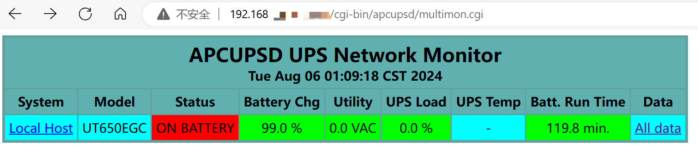


<br/>

# UPS

笔者可以很负责任地说：如果你组建的 NAS 有数据存储需求，那么一定需要一同配备一台 UPS（Uninterruptible Power Supply，不间断电源）。在遇到突发情况导致断电时，UPS 可以保证继续维持一段时间的稳定供电。此时，UPS 可以通过 USB 连接等方式向 NAS 发送低电量（离电）信号，NAS 在接收到这个信号后进行自动关机，从而保护其中的数据。

关于 UPS 选购的部分，本文不作说明，满足以下要求即可：

1. 保证在突然断电时能够维持一段时间的稳定供电
2. 保证处于供电状态时能够向机器发送信号

# 停电告警

## 通过 USB 连接到 UPS

一般在购买时 UPS 会随机器附赠一条 USB Type-B 线，将其与 NAS 连接起来即可。

将 NAS 的电源插头插到 UPS 上，在终端中输入如下命令：

```bash
lsusb
```

以查看连接到 NAS 的 USB 设备。结果如下所示：

```text
Bus 002 Device 001: ID 1d6b:0003 Linux Foundation 3.0 root hub
Bus 001 Device 008: ID 0764:0501 Cyber Power System, Inc. CP1500 AVR UPS
Bus 001 Device 001: ID 1d6b:0002 Linux Foundation 2.0 root hub
```

确保当中有你的 UPS 设备。如果没有，请检查 USB 线连接情况。

## apcupsd

`apcupsd` 是个跨平台的开源 APC UPS 管理工具。它由社区爱好者维护开发，同时也收到了 APC 官方的强力支持。

当然，你也可以使用`NUT`（Network UPS Tools）来管理 UPS 设备，但它与 apcupsd 互斥。

### 安装

使用以下命令安装 apcupsd：

```bash
sudo apt install apcupsd
```

### 配置

编辑`/etc/apcupsd/apcupsd.conf`配置文件：

```bash
sudo vim /etc/apcupsd/apcupsd.conf
```

需要修改以下内容：

```text
UPSNAME <你给 UPS 的名字>
UPSCABLE usb             // 如果无法识别到 UPS，请将 usb 改为 smart
UPSTYPE usb
DEVICE                   // 这里留空，系统会自动检测 USB 连接 UPS

BATTERYLEVEL 5           // 这里的意思是 UPS 剩余电量小于等于 5% 时自动关机
MINUTES 3                // 这里的意思是 UPS 处于供电模式 3 min 后自动关机
                         // 这两个条件满足其一就会自动关机
```

编辑`/etc/default/apcupsd`文件：

```bash
sudo vim /etc/apcupsd/apcupsd
```

修改以下内容：

```text
ISCONFIGURED=yes
```

运行如下命令以检查 UPS 连接情况：

```bash
sudo apcaccess status
```

如果结果中`STATUS`项为 ONLINE，则说明成功连接；如果为 COMMLOST，请检查 USB 线连接情况，或将`/etc/apcupsd/apcupsd.conf`配置文件中的 `UPSCABLE`项改为 smart。

启动 apcupsd 服务：

```bash
sudo systemctl enable apcupsd
sudo systemctl start apcupsd
```

### Web 服务

apcupsd 在运行时，默认设置会在本地的 3551 端口启动一个 CGI 程序，我们可以通过 Apache2 来建立一个服务器，在网页端查看 UPS 状态。

安装 apcupsd-cgi：

```bash
sudo apt install apcupsd-cgi
```

安装 Apache2：

```bash
sudo apt install apache2
```

启用 Apache2 的 CGI 模块：

```bash
sudo a2enmod cgid
```

修改 Apache2 的监听端口，编辑`/etc/apache2/ports.conf`文件：

```bash
sudo vim /etc/apache2/ports.conf
```

将 `Listen 80`改为你需要的端口，并记得在 Cockpit 的防火墙设置中放行这个端口。

启动 Apache2 服务：

```bash
sudo systemctl enable apache2
sudo systemctl start apache2
```

访问这个地址：`http://<NAS IP 地址>:<Apache2 端口>/cgi-bin/apcupsd/multimon.cgi`，成功看到 UPS 管理页面。




### 断电时休眠而不是直接关机

以下内容来自 [Arch Wiki](https://wiki.archlinux.org/title/APC_UPS "Arch Wiki")，未经过笔者测试。

#### 创建休眠脚本

以 root 身份创建`/usr/local/bin/hibernate`文件，并输入以下内容：

```bash
#!/bin/bash
# Hibernate the system - designed to be called via symlink from /etc/apcupsd
# directory in case of apcupsd initiating a shutdown/reboot.  Can also be used
# interactively or from any script to cause a hibernate.

# Do the hibernate
/usr/bin/systemctl hibernate

# At this point system should be hibernated - when it comes back, we resume this script here

# On resume, tell controlling script (/etc/apcupsd/apccontrol) NOT to continue with default action (i.e. shutdown).
exit 99
```

使用`chmod +x`将其变为可执行的。

#### 将休眠脚本链接到 apcupsd

在`/etc/apcupsd`目录创建到这个脚本的软链接。这样在接收到信号后 apcupsd 就会执行休眠脚本。

```bash
ln -s /usr/local/bin/hibernate /etc/apcupsd/doshutdown
```

#### 休眠完成后断开 UPS 电源

在 NAS 休眠完成后，我们可以关闭 UPS 以节约电源损耗，避免 UPS 电量完全耗尽。这可以通过在 systemd 中的电源关闭事件来实现。

创建`/usr/lib/systemd/system-sleep/ups-kill`文件，并输入以下内容：

```bash
#!/bin/bash

case $2 in

  # In the event the computer is hibernating.
  hibernate)
    case $1 in

       # Going into a hibernate state.
       pre)

         # See if this is a powerfail situation.
         if [ -f /etc/apcupsd/powerfail ]; then
           echo
           echo "ACPUPSD will now power off the UPS"
           echo
           /etc/apcupsd/apccontrol killpower
           echo
           echo "Please ensure that the UPS has powered off before rebooting"
           echo "Otherwise, the UPS may cut the power during the reboot!!!"
           echo
         fi
       ;;

       # Coming out of a hibernate state.
       post)

         # If there are remnants from a powerfail situation, remove them.
         if [ -f /etc/apcupsd/powerfail ]; then
           rm /etc/apcupsd/powerfail
         fi

         # This may also exist, need to remove it.
         if [ -f /etc/nologin ]; then
           rm /etc/nologin
         fi

   # Restart the daemon; otherwise it may be unresponsive in a
         # second powerfailure situation.
   systemctl try-restart apcupsd
       ;;
    esac
  ;;
esac
```

使用`chmod +x`将其变为可执行的。

<br/>

