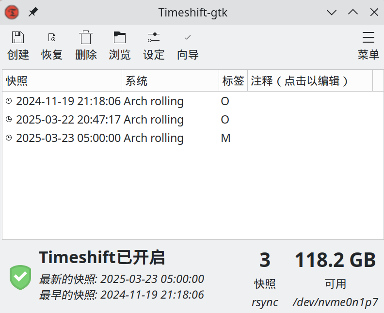
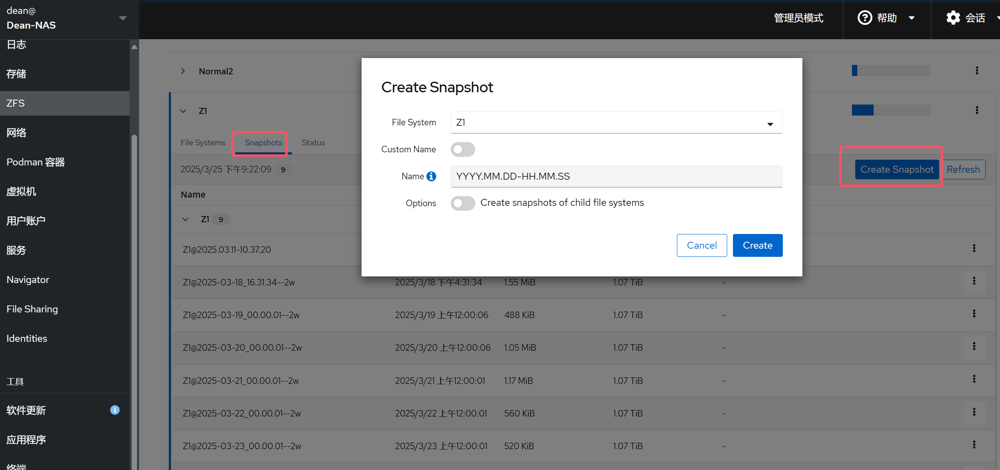
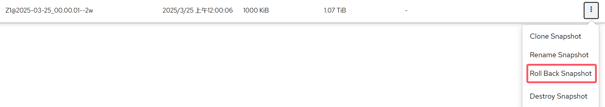


<br/>

# 硬盘健康监测

## SMART

S.M.A.R.T. 代表的是 Self-Monitoring Analysis and Reporting Technology，意思是自我检测、分析及报告技术。可以用来预测和分析硬盘的潜在问题。

对于机械硬盘（HDD）的寿命信息，我们主要关注这几个条目：

- 重新分配扇区系数（05）
- 当前等待中扇区数（C5）
- **无法修正的扇区总数（C6，重要，不为零即建议备份数据、换盘）**

对于固态硬盘（SSD）的寿命信息，我们主要关注这几个条目：

- 可用备用空间（03）
- 已用寿命百分比（05）
- **媒体与数据完整性错误计数（0E，重要，不为零即建议备份数据、换盘）**

在 Windows 系统，我们可以使用 [CrystalDiskInfo](https://crystalmark.info/en/software/crystaldiskinfo/ "CrystalDiskInfo") 这款软件来查看硬盘的 Smart 信息。

在 Linux 系统，我们可以使用`smartmontools`包来查看硬盘的 Smart 信息。

```bash
sudo apt install smartmontools -y
```

要确保您的驱动器支持 SMART，请键入：

```bash
sudo smartctl -i /dev/sda
```

其中`/dev/sda`一般为机械硬盘 / U 盘，固态硬盘如`/dev/nvme0n1p1`，可以通过`lsblk`命令查看各硬盘。

如果您的驱动器未启用 SMART，您可以通过键入以下内容来启用它：

```bash
sudo smartctl -s on /dev/sda
```

检查硬盘整体健康状态：

```bash
sudo smartctl -H /dev/sda
```

此命令应返回：

```text
=== START OF READ SMART DATA SECTION ===
SMART overall-health self-assessment test result: PASSED
```

如果它没有返回 PASSED，您应该立即备份所有数据。您的硬盘驱动器可能出现故障。

## Scrutiny

Scrutiny 是用于smartd 监控硬盘 S.M.A.R.T 信息的 WebUI。


### 通过 Docker 部署

可以先阅读部分，将 NAS 上的 Docker 环境配置完成。

使用 Docker Compose：

```yaml
version: "3.5"
services:
    scrutiny:
      image: ghcr.io/analogj/scrutiny:master-omnibus
      container_name: scrutiny
      cap_add:
        - SYS_RAWIO
      environment:
        - PUID=1001 # PUID 与 PGID 请根据实际情况设置
        - PGID=100
        - TZ=Asia/Shanghai
      volumes:
        - /srv/dockerapps/scrutiny/config:/config
        - /run/udev:/run/udev:ro
        - /srv/dockerapps/scrutiny/influxdb:/opt/scrutiny/influxdb
      ports:
        - "8082:8080" # 端口请根据实际情况设置，8080 为 Web 端口
        - "8086:8086" # 8086 为 InfluxDB 数据库端口
      devices:     
        - "/dev/sda" # 通过 lsblk 命令查看硬盘
        - "/dev/sdb"
        - "/dev/sdc"
        - "/dev/nvme0n1"
      restart: unless-stopped
```

服务启动后访问对应端口即可查看硬盘详细信息。记得开放防火墙对应端口。


# 系统备份

## Snapper - Btrfs

> 关于 Btrfs 的配置笔者还是有很多不清楚的地方，建议除了 snapshots 的更改不要创建任何子卷，手动写 snapper 配置忽略目录（虽然快照还是会保存）。

此部分主要来自于[这篇文章](https://zhiim.github.io/p/arch-linux-configuration-btrfs-and-system-backup)。

Btrfs 默认采用 [CoW](https://en.wikipedia.org/wiki/copy-on-write) 机制，将文件指针存放在 metadata 文件中。在对文件进行更改时，Btrfs 会将新的数据写在新的空闲数据块中，数据写入完成后，更新 metadata 增加将文件指向新的内存块的指针。

Snapper 是一个免费的开源应用程序，我们可以使用它来管理 Linux 上的快照。它最初设计为与 Btrfs 快照一起使用，但已扩展为还支持 LVM 精简配置逻辑卷。

### 安装

```Bash
sudo apt install snapper
```

### 改变快照存储位置

Snapper 默认把快照存储在`@`子卷内的`.snapshots`分卷下，如果`@`子卷损坏，`.snapshots`也可能受影响，所以更好的子卷结构是把快照存储在`@snapshots`子卷下，然后把`@snapshots`挂载在根子卷下，这样`@`和`@snapshots`互不影响。

删除默认的`.snapshots`子卷：

```Bash
❯ sudo btrfs subvolume list /
ID 256 gen 7144 top level 5 path @
ID 257 gen 7144 top level 5 path @home
ID 258 gen 17 top level 256 path var/lib/portables
ID 259 gen 18 top level 256 path var/lib/machines
ID 266 gen 7115 top level 256 path .snapshots
ID 267 gen 6963 top level 266 path .snapshots/1/snapshot
ID 272 gen 6995 top level 266 path .snapshots/2/snapshot
# 如果已经有快照，需要先删除.snapshots里面的快照子卷
❯ sudo btrfs subvolume delete .snapshots/1/snapshot
Delete subvolume (no-commit): '/.snapshots/1/snapshot'
❯ sudo btrfs subvolume delete .snapshots/2/snapshot
Delete subvolume (no-commit): '/.snapshots/2/snapshot'
❯ sudo btrfs subvolume delete .snapshots
Delete subvolume (no-commit): '//.snapshots'
```

在根子卷下并列`@`子卷创建一个`@snapshots`子卷：

```Bash
mkdir ~/rootsub
sudo mount -o subvolid=5 /dev/nvme0n1p6 ~/rootsub  # 挂载根子卷
sudo btrfs subvolume create ~/rootsub/@snapshots  # 在根子卷下创建子卷
```

编辑`/etc/fstab`，将`@subvolume`子卷挂载到`/.snapshots`：

```text
# 仿照 / 的挂载更改，UUID 与根目录的 UUID 一致
UUID=d26ed334-68d4-481d-894f-838783fa4f88  /.snapshots  btrfs  rw,relatime,compress=zstd:3,ssd,discard=async,space_cache=v2,subvol=/@snapshots  0 0
```

挂载`@snapshots`子卷：

```text
sudo mkdir /.snapshots
sudo systemctl daemon-reload
sudo mount -a
sudo chmod 750 /.snapshots  # 阻止非 root 用户访问
```

### 创建快照

第一次创建快照时，我们先要创建配置文件：

```Bash
sudo snapper -c root create-config / # 为挂载在根目录下的子卷创建命名为 root 的快照配置文件
```

此时 Snapper 会在`/etc/snapper/configs`生成配置文件，并且在根目录`/`挂载的子卷即`@`下创建`.snapshots`子卷，所有快照都会存储在`.snapshots`子卷下。

Snapper 可以自动创建和清除快照，默认会每小时创建一个快照，每天清理一次快照，在清理时会保存 10 个每小时快照、10 个每日快照、10 个每月快照、10 个每年快照。

开启 Snapper 自动快照和自动清理：

```Bash
sudo systemctl enable --now snapper-timeline.timer
sudo systemctl enable --now snapper-cleanup.timer
```

手动创建快照：

```Bash
sudo snapper -c <快照配置文件名> create --description=<description> -p 
```

### 回滚快照（仅用于非根目录）

```Bash
snapper -c <快照配置文件名> undochange <num1>..<num0>
```

这条指令向 btrfs 卷施加从 num0 到 num1 的差异。一般用法是 x..0（表示从当前状态回滚到快照 x）。

### 备份到外部存储

我们可以使用 Snapper 自带的 [snbk 工具](https://man.archlinux.org/man/snbk.8.en)。

### 从快照恢复

假设我们已经为`/`创建了快照，如果想要从快照中恢复系统，可以先进入 Live USB，然后挂载 Btrfs 分区。

```Bash
sudo mount /dev/nvmexn1px /mnt
cd /mnt
```

移除旧的`@`子卷：

```Bash
sudo mv /mnt/@ /mnt/@.broken
```

列出所有快照和对应的时间信息：

```Bash
$ sudo grep -r '<date>' /mnt/@snapshots/*/info.xml
/.snapshots/1/info.xml:  <date>2023-07-11 06:21:53</date>  # Snapper 使用 UTC 时间记录快照创建时间
/.snapshots/2/info.xml:  <date>2022-07-11 06:22:39</date>
```

由于 Snapper 创建的快照是只读子卷，所以需要从快照中创建可读写快照作为`@`子卷：

```Bash
sudo btrfs subvolume snapshot /mnt/@snapshots/<number>/snapshot /mnt/@
```

## Timeshift - 所有文件系统

Timeshift 可帮助定期创建文件系统的增量快照，然后在以后恢复到这些快照，以撤销对系统的所有更改。

它支持针对所有文件系统的 [rsync](https://wiki.archlinuxcn.org/wiki/Rsync) 快照，也可使用 [Btrfs](https://wiki.archlinuxcn.org/wiki/Btrfs) 驱动器的内置快照功能，这需要驱动器根目录和`home`目录分别使用`@`和`@home`子卷布局配置。

Timeshift 还附带便于使用的 GUI，使得用户可以通过图形化界面直接进行备份操作。



### 安装

```Bash
sudo apt install timeshift
```

配置 TimeShift 时，可以编辑`/etc/timeshift/timeshift.json`文件，将“备份设备”设置为适合的磁盘，并根据需求修改快照的`exclude`（排除）项。

示例配置文件内容：

```YAML
{
  "backup_device_uuid": "YOUR-DEVICE-UUID",
  "btrfs_mode": "false",
  "schedule_daily": "true",
  "count_daily": "5",
  "exclude": [
    "/home/**",
    "/root/**"
  ]
}
```

### 创建快照

首先执行一次完整快照：

```Bash
sudo timeshift --create --comments "Initial Snapshot" --tags D
```

使用以下命令查看当前快照：

```Bash
sudo timeshift --list
```

可以使用`--delete`参数删除旧快照，释放空间：

```Bash
sudo timeshift --delete --snapshot "Name（时间）"
# 如下：
sudo timeshift --delete --snapshot '2024-11-11_17-23-52'
```

### 从快照恢复

```Bash
sudo timeshift --restore --snapshot "Name（时间）"
# 如下：
sudo timeshift --restore --snapshot '2024-11-11_17-23-52'
```

# RAID

使用 RAID（Redundant Array of Independent Disks，独立磁盘冗余阵列），可以大幅提高硬盘设备的 I/O 读写速度，还有各种数据冗余备份机制供用户选择，能够降低用户数据盘损坏带来的数据丢失的风险。

RAID 技术通过把多个硬盘设备组合成一个容量更大、安全性更好的磁盘阵列，并把数据切割成多个区段后分别存放在各个不同的物理硬盘设备上，然后利用分散读写技术来提升磁盘阵列整体的性能，同时把多个重要数据的副本同步到不同的物理硬盘设备上，从而起到了非常好的数据冗余备份效果。

## 软 RAID 和硬 RAID

软件 RAID 是通过操作系统的软件来实现 RAID 功能。软件 RAID 不需要额外的硬件控制器，而是依赖于操作系统的 RAID 驱动程序，通过 CPU 处理 RAID 相关的计算和数据操作。

硬件 RAID 是通过在独立的硬件控制器上实现 RAID 功能。硬件控制器通常是一块专用的 RAID 卡，通过硬件来管理 RAID 阵列，包括数据读写、磁盘故障检测和数据恢复等。

相比于硬 RAID，软 RAID 有三个明显的缺点：

- 占用内存空间
- 占用 CPU 资源
- 软件的 RAID 程序无法将已经安装了操作系统的磁盘也做成 RAID

最后一点意味着，软 RAID 只有在操作系统成功启动后才能运行，如果运行过程中操作系统崩溃，组成 RAID 的磁盘中的数据将无法读写。

但在实际的使用过程中，硬 RAID 需要配备相应的硬件，配置的时间成本和花费都较高，在日常使用的情况下，我们通常采用软 RAID 方案即可。

## RAID 种类

这一部分主要参考[这篇文章](https://www.cnblogs.com/kuangdaoyizhimei/p/18314827 "这篇文章")。

### RAID 0

RAID 0 技术把多块物理硬盘设备（至少两块）通过硬件或软件的方式串联在一起，组成一个大的卷组，并将数据依次写入各个物理硬盘中。这样一来，在最理想的状态下，硬盘设备的读写性能会提升数倍，但是若任意一块硬盘发生故障，将导致整个系统的数据都受到破坏。通俗来说，RAID 0 技术能够有效地提升硬盘数据的吞吐速度，但是不具备数据误修复能力。

如下图所示，数据被分别写入到不同的硬盘设备中，两块硬盘会分别保存数据资料，最终实现提升读取、写入速度的效果。


- 最少需要的硬盘数：2
- 优点：更快的数据访问
- 缺点：没有硬盘冗余，所以数据丢失的风险会增加。未针对不同容量大小的硬盘进行优化。

### RAID 1

RAID1模式的磁盘阵列的模式为“N+1”，无论有多少个磁盘，它只用其中一个来存储数据，其它每个磁盘都是它的镜像，举个例子：有两个磁盘，那磁盘利用率就是 50%，有 N 个磁盘，那磁盘利用率就是 1/N。


- 最少需要的硬盘数：2
- 优点：N 个硬盘冗余
- 缺点：存储池可用空间被限制为一个硬盘的容量。未针对不同容量大小的硬盘进行优化。

### RAID 5

RAID 5 技术是把硬盘设备的数据奇偶校验信息保存到其他硬盘设备中。RAID 5 磁盘阵列中数据的奇偶校验信息并不是单独保存到某一块硬盘设备中，而是存储到除自身以外的其他每一块硬盘设备上。这样的好处是，其中任一设备损坏后都可以依赖其它几块设备重建丢失的这块硬盘数据。

RAID 5 需要使用至少 3 个驱动器，像 RAID 0 一样跨多个驱动器条带化数据，但也有跨驱动器分布的“奇偶校验”。在单个驱动器发生故障的情况下，使用存储在其他驱动器上的奇偶校验信息将数据拼凑在一起。停机时间为零。读取速度非常快，但由于必须计算奇偶校验，写入速度稍慢。它非常适合数据驱动器数量有限的文件和应用程序服务器。


- 需要的硬盘数：3
- 优点：1 个硬盘的容错机制并将存储空间配置优化
- 缺点：未针对不同容量大小的硬盘进行优化
  - 在磁盘故障的情况下，恢复可能需要更长的时间，因为必须从所有可用驱动器计算奇偶校验
  - 无法承受并发驱动器故障

### RAID 6

RAID 6 使用双奇偶校验块来实现比 RAID 5 更好的数据冗余，这增加了阵列中最多两个驱动器故障的容错能力。每个磁盘都有两个奇偶校验块，它们存储在阵列中的不同磁盘上，RAID 6 是用于维护高可用性系统的非常实用的基础架构。


- 至少需要 4 个驱动器
- 优点：2 个硬盘冗余
- 缺点：由于双重奇偶校验，写入数据需要更长的时间。未针对不同容量大小的硬盘进行优化。

### RAID 10（RAID 1+0）

以上提到的 RAID 均为基本 RAID 级别，而 RAID 10、RAID 50、RAID 60 等属于跨区 RAID 级别。

RAID 10 技术需要至少 4 块硬盘来组建，其中先分别两两制作成 RAID 1 磁盘阵列，以保证数据的安全性；然后再对两个 RAID 1 磁盘阵列实施 RAID 0 技术，进一步提高硬盘设备的读写速度。

这样从理论上来讲，只要坏的不是同一阵列中的所有硬盘，那么最多可以损坏 50%的硬盘设备而不丢失数据。由于 RAID 10 技术继承了 RAID 0 的高读写速度和 RAID 1 的数据安全性，在不考虑成本的情况下 RAID 10 的性能也超过了 RAID 5，因此当前成为广泛使用的一种存储技术。


## 通过 Cockpit 创建软 RAID

如果想使用 ZFS，可以跳过这里直接查看ZFS部分。

通过 Cockpit 创建软 RAID 的过程非常简单，在`存储`栏找到`创建 MDRAID 设备`：


根据自己的需求选择 RAID 级别及对应磁盘即可。


# ZFS

ZFS 被描述为“终极文件系统”，稳定、快速、安全并面向未来。

ZFS 的特点包括：存储池（被称为 "zpool" 的集成卷管理系统）、写时复制、快照、数据完整性校验和自动修复（擦除）、RAID-Z、最大 16 Exabyte 文件大小，以及最大 256×10¹⁵ Zettabyte 存储，且对文件系统（数据集）或文件的数量没有限制 。


- 存储池：与大多数文件系统不同，ZFS 结合了文件系统和卷管理器的特性。这意味着，它与其他文件系统不同，ZFS 可以创建跨越一系列硬盘或池的文件系统。不仅如此，你还可以通过添加硬盘来增大池的存储容量。ZFS 可以进行[分区和格式化](https://www.howtogeek.com/175159/an-introduction-to-the-z-file-system-zfs-for-linux/ "分区和格式化")。
- 写时复制：在大多数文件系统上，当数据被重写时，它将永久丢失。而在 ZFS 中，新数据会写到不同的块。写完成之后，更新文件系统元数据信息，使之指向新的数据块。这确保了如果在写新数据的时候系统崩溃（或者发生其它事，比如突然断电），那么原数据将会保存下来。这也意味着，在系统发生崩溃之后，不需要运行 [fsck](https://en.wikipedia.org/wiki/Fsck "fsck") 来检查和修复文件系统。
- 快照：ZFS 使用快照来跟踪文件系统中的更改。[快照](https://www.freebsd.org/doc/handbook/zfs-term.html "快照")包含文件系统的原始版本（文件系统的一个只读版本），实时文件系统则包含了自从快照创建之后的任何更改。没有使用额外的空间。因为新数据将会写到实时文件系统新分配的块上。如果一个文件被删除了，那么它在快照中的索引也会被删除。所以，快照主要是用来跟踪文件的更改，而不是文件的增加和创建。
- 数据完整性校验和自动修复：当向 ZFS 写入新数据时，会创建该数据的校验和。在读取数据的时候，使用校验和进行验证。如果前后校验和不匹配，那么就说明检测到了错误，然后，ZFS 会尝试自动修正错误。
- RAID-Z：ZFS 不需要任何额外软件或硬件就可以处理 RAID。ZFS 有自己的 RAID 实现：RAID-Z 。RAID-Z 是 RAID-5 的一个变种，不过它克服了 RAID-5 的写漏洞：意外重启之后，数据和校验信息会变得不同步。为了使用[基本级别的 RAID-Z](https://wiki.archlinux.org/index.php/ZFS/Virtual_disks#Creating_and_Destroying_Zpools "基本级别的 RAID-Z")（RAID-Z1），你需要至少三块磁盘，其中两块用来存储数据，另外一块用来存储[奇偶校验信息](https://www.pcmag.com/encyclopedia/term/60364/raid-parity "奇偶校验信息")。而 RAID-Z2 需要至少两块磁盘存储数据以及两块磁盘存储校验信息。RAID-Z3 需要至少两块磁盘存储数据以及三块磁盘存储校验信息。另外，只能向 RAID-Z 池中加入偶数倍的磁盘，而不能是奇数倍的。

ZFS 也存在一些问题：

- ZFS 采用[通用开发与散布许可证](https://zh.wikipedia.org/wiki/CDDL "通用开发与散布许可证")（CDDL）授权，其与 GPL 不兼容，因此 ZFS [不可能](https://sfconservancy.org/blog/2016/feb/25/zfs-and-linux/ "不可能")被纳入 Linux 内核中。然而，这并不妨碍第三方开发者开发并发布原生的 Linux 内核模块，比如 [OpenZFS](https://openzfs.org/ "OpenZFS") (以前被称为 ZFS on Linux)。这使得 OpenZFS 项目必须主动跟上 Linux 内核版本。
- ZFS 使用了自己的 ARC 缓存模型。这带来了更高的缓存命中率，但是这也导致了这部分缓存不在内核的 `cached` 内存内。因此，当内存不够时，这部分缓存无法被及时的释放。因此，推荐使用 ZFS 的系统准备充足的内存。

## 通过 Cockpit 创建 ZFS 池

通过 Cockpit 创建 ZFS 池的过程非常简单，首先确保你已安装了`zfs-dkms`、`zfsutils-linux`包，以及`cockpit-zfs-manager`管理器。确认相关服务已启动并正常运行（安装完成后需重启）。

在`ZFS`栏找到`Create Storage Pool`：


关于 Virtual Device 选项，Disk 代表直接使用这块硬盘，Mirror 代表 RAID 1 级别。


根据自己的需求选择 RAID 级别及对应磁盘即可。

Cockpit 的 ZFS 界面会出现图标不显示的问题。45Drives 表示他们已知晓[此问题](https://github.com/45Drives/cockpit-zfs-manager/issues/15)并选择忽视，但提供了一个解决此问题的脚本。

```Bash
#!/usr/bin/env bash

echo Fixing cockpit fonts

mkdir -p /usr/share/cockpit/base1/fonts

curl -sSL https://scripts.45drives.com/cockpit_font_fix/fonts/fontawesome.woff -o /usr/share/cockpit/base1/fonts/fontawesome.woff
curl -sSL https://scripts.45drives.com/cockpit_font_fix/fonts/glyphicons.woff -o /usr/share/cockpit/base1/fonts/glyphicons.woff
curl -sSL https://scripts.45drives.com/cockpit_font_fix/fonts/patternfly.woff -o /usr/share/cockpit/base1/fonts/patternfly.woff

mkdir -p /usr/share/cockpit/static/fonts

curl -sSL https://scripts.45drives.com/cockpit_font_fix/fonts/OpenSans-Semibold-webfont.woff -o /usr/share/cockpit/static/fonts/OpenSans-Semibold-webfont.woff

echo Done
```

以下内容主要来自[这篇博客](https://szclsya.me/zh-cn/posts/storage/zfs-maintenance/ "这篇博客")以及 [Oracle Solaris ZFS 管理指南](https://docs.oracle.com/cd/E24847_01/html/819-7065/gavwg.html#scrolltoc "Oracle Solaris ZFS 管理指南")。

## ZFS 维护

### 配置定时 Scrub

ZFS 拥有自愈特性，但这仅对热数据有效（即经常被读写的数据）。对于冷数据，ZFS 提供了`scrubing`机制，即定期读取一遍存储池内的所有数据并检验校验和，以发现冷数据中的数据错误。

一般来说，推荐至少每月做一次 scrub。对于消费级硬盘来说，由于数据可靠性相对更低，应考虑更频繁地进行 scrub 操作。很多发行版会随着 ZFS 本身安装定期 scrub 的脚本/服务配置，例如在 Debian 上可以用这些命令开启定期 scrub：

```bash 
# Debian 上启用每周自动 scrub
systemctl enable --now zfs-scrub-weekly@POOL.timer
# Debian 上启用每月自动 scrub
systemctl enable --now zfs-scrub-monthly@POOL.timer
```


对于 Debian 以外的发行版 / OS 则可查询相应的手册或 Wiki。对于使用 systemd 且没有自带脚本的系统，可以使用[systemd-zpool-scrub - GitHub](https://github.com/lnicola/systemd-zpool-scrub "systemd-zpool-scrub - GitHub")。

### 使用快照

由于 ZFS 使用 COW （Copy on Write，写入时复制）策略，对 ZFS 存储池建立快照几乎不需要占用任何空间及计算资源。因此，我们可以频繁建立快照并保留一段时间，这样如果出现了误操作就可以找回之前的版本。注意 ZFS 不仅可以对整个存储池进行快照，也允许对数据集建立快照，因此可以根据数据的用途和重要性建立不同的数据集并选择不同的快照策略，非常实用。

```bash 
# 对 POOL 存储池中的 DATASET 数据集建立名为 test 的快照
zfs snapshot POOL/DATASET@test
# 对所有 DATASET 以内的数据集也递归地建立快照 (-r)
zfs snapshot -r POOL/DATASET@test
# 显示所有快照
zfs list -t snapshots
# 显示 POOL 存储池中的 DATASET 数据集的所有快照
zfs list -t snapshots POOL/DATASET
```


在 Cockpit 当中创建快照更为快捷：



#### 访问快照中的个别文件

如果我们只需要某快照中的个别文件，可以在数据集的根目录进入`.zfs`隐藏目录。这个目录是无法被`ls -a`看见的，但是可以用`cd`进入。这个目录内有个`snapshot`文件夹，其中可直接访问任意快照中的任意文件。

#### 回滚快照

如果我们想放弃所有后续更改并回到数据集一个先前的状态，我们可以整体回滚到一个先前的快照上。注意默认情况下我们只能回到最新的一个快照上，如果想回滚多个快照之前的版本则需要`-r`参数。

> **注意！回滚到多个快照之前会销毁回滚到的快照之后所有之后的快照！**

```bash 
# 回滚到最近的快照
zfs rollback POOL/DATASET@SNAPSHOT
# 回滚到多个快照之前。注意！会销毁所有之后的快照！
zfs rollback -r POOL/DATASET@SNAPSHOT
```


在 Cockpit 当中回滚快照：



#### 自动快照管理

除了手动在一些关键时间节点打快照外，我们也可以使用一些工具自动管理快照。一般这些工具都能实现定期创建快照，删除旧快照以及对于各个时间段保留一定数量的快照（例如本周的快照每天保留一个，更旧的每月保留一个，再旧的每年保留一个等）。

我们可以使用 [Sanoid](https://github.com/jimsalterjrs/sanoid "Sanoid")，ZFS 文件系统的策略驱动型快照管理工具。

安装依赖：

```bash 
sudo apt install debhelper libcapture-tiny-perl libconfig-inifiles-perl pv lzop mbuffer build-essential git
```

打包安装：

```bash 
cd /tmp
git clone https://github.com/jimsalterjrs/sanoid.git
cd sanoid
# checkout latest stable release or stay on master for bleeding edge stuff (but expect bugs!)
git checkout $(git tag | grep "^v" | tail -n 1)
ln -s packages/debian .
dpkg-buildpackage -uc -us
sudo apt install ../sanoid_*_all.deb
```

启用 Sanoid 计时器：

```bash 
sudo systemctl enable --now sanoid.timer
```

配置 Sanoid 任务：

```bash 
sudo vim /etc/sanoid/sanoid.conf
```

```text 
[pool]
    recursive=zfs       # 递归创建快照
    hourly=48           # 保留最近两天的小时级快照
    daily=14            # 保留最近两周的日级快照
    autosnap=yes        # 自动快照
    autoprune=yes       # 过期快照自动销毁
```

创建 crontab 任务：

```bash 
sudo vim /etc/crontab
```

加入如下内容（建议使用 UTC 作为时区，以防止出现夏令时问题）：

```text
TZ=UTC
* * * * * root /usr/local/bin/sanoid --cron
```

#### 备份

> mirror / RAIDz 不是 备份！这些手段被称为冗余，只能确保磁盘损坏不会影响数据，而不能保护类似人为因素/软件崩溃/硬件故障等其他灾害情况。永远不要仅依赖冗余保护数据！

ZFS 上最好的备份方式是定期创建快照，然后把它们发送到备份源中。这种方法最大的优点是快照中的文件历史也能留存下来，且相对而言传输/存储的压力都较小（因为只会传输并存储两个快照中的增量数据）。备份源可以是另一个 ZFS 存储池（可以是本地的，也可以在网络上的），也可以作为文件存储在别的介质上（例如光或磁带存储介质）。一个常见的做法是定期接上一块备份移动硬盘并将最新的快照发送到这块盘的存储池上。

```bash 
# 将快照发送至本地的另一个存储池
zfs send source/dataset@snapshot | zfs recv backup/dataset
# 通过 SSH 将快照发送到网络上的另一个存储池
zfs send source/dataset@snapshot | ssh remote.ip zfs recv backup/dataset
# 仅发送 snap1 和 snap2 中的增量数据
zfs send source/dataset@snap1 source/dataset@snap2 | ssh remote.ip zfs recv backup/dataset
```

和打快照一样，发送快照也可以被自动化。许多快照管理软件要么可以和同步软件协同，要么直接内置了数据同步工具。例如之前提到的 Sanoid 就内置了名为[syncoid](https://github.com/jimsalterjrs/sanoid?tab=readme-ov-file#syncoid "syncoid")的同步工具。如果你用的不是 Sanoid 的话，快照软件的文档里一般也会介绍如何使用他们内置的同步工具，或如何与外部的同步软件协同。

## ZFS 灾难恢复

### 存储池故障

运气不太好，存储池真的坏了。现在怎么办？

首先我们得知道到底发生了什么。我们可以使用`zpool status`命令来查看存储池的状态。

```text 
# 常见的由突然断电导致的读写错误
  pool: data
 state: DEGRADED
status: One or more devices has experienced an unrecoverable error.  An
        attempt was made to correct the error.  Applications are unaffected.
action: Determine if the device needs to be replaced, and clear the errors
        using 'zpool clear' or replace the device with 'zpool replace'.
   see: https://openzfs.github.io/openzfs-docs/msg/ZFS-8000-9P
  scan: none requested

config:

        NAME                      STATE     READ WRITE CKSUM
        data                      DEGRADED     0     0     0
          ata-VOLUME-1            DEGRADED    13     0     0  too many errors

errors: No known data errors
```

最常见的故障有存储盘下线和读写错误过多。有时突然断电就会导致出现读写错误，但这种故障通常是软件层面的，硬盘本身没有问题。如果硬盘本身真的没问题的话，我们仅需让 ZFS 忽略这次事故即可。

```bash 
# 我们仅需清零错误计数器即可
zpool clear data
```

另一种可能则是硬盘的确有问题。在这种情况下就最好在硬盘完全失效前换上一块好硬盘了：

```bash 
# 使用好硬盘 (ata-GOOD) 换下已知有问题的硬盘 (ata-FAULTY)
# 如果是简单卷的话 ZFS 会自动进入重新构建 RAID 的过程（称为 resilvering）并将旧硬盘的数据复制到新盘上
# 如果是在 mirror/RAIDz 中的话 ZFS 会重建阵列
zpool replace POOL ata-FAULTY ata-GOOD
```

### 数据损坏

如果前期冗余留的足够的话，大多数情况下 ZFS 都能从冗余盘中重构数据并正常运行（并如前文所示报告读写错误）。但如果冗余不足以重构数据，我们就遇上了数据损坏。与传统 RAID 不同的是，ZFS 可以精确告诉我们哪些文件卷入了数据损坏中：

```text 
pool: data
 state: ONLINE
status: One or more devices has experienced an unrecoverable error.  An
        attempt was made to correct the error.  Applications may be affected.
action: Restore the file in question if possible.  Otherwise restore the
        entire pool from backup.
   see: https://openzfs.github.io/openzfs-docs/msg/ZFS-8000-8A
  scan: none requested

config:

        NAME                      STATE     READ WRITE CKSUM
        data                      ONLINE       0     0     0
          ata-VOLUME-1            ONLINE       0     0     0

errors: Permanent errors have been detected in the following files:

        [REDACTED]
```

在这种情况下备份（希望有！）就派上用场了。考虑换下出问题的盘并增加冗余量，以防这种事件再次发生。

### 根系统故障 / 存储池迁移

在先前的配置中，我们创建了挂载在根文件系统（非 ZFS，如 Ext4 / Btrfs / XFS 等）下的 ZFS 存储池。如果根文件系统损坏，我们该如何读取 ZFS 存储池当中的数据呢？

首先，应从 LiveCD 启动以尝试直接恢复原系统。尝试从恢复备份、更新软件包、修复引导等方面入手。

如果实在陷入绝境，只能舍弃系统，转而寻求存储池中的数据。基于此，我们可以参考存储池迁移部分。

> 有时，可能需要在系统之间移动存储池。为此，必须将存储设备与原始系统断开，然后将其重新连接到目标系统。可以通过以下方法完成此任务：以物理方式重新为设备布线，或者使用多端口设备（如 SAN 中的设备）。使用 ZFS 可将池从一台计算机中导出，然后将其导入目标系统，即使这该系统采用不同的字节存储顺序 (endianness)。

#### 准备迁移 ZFS 存储池

应显式导出存储池，以表明可随时将其迁移。此操作会将任何未写入的数据刷新到磁盘，将数据写入磁盘以表明导出已完成，并从系统中删除有关池的所有信息。

如果不显式导出池，而是改为手动删除磁盘，则仍可以在其他系统中导入生成的池。但是，可能会丢失最后几秒的数据事务，并且由于设备不再存在，该池在原始系统中可能会显示为处于故障状态。缺省情况下，目标系统无法导入未显式导出的池。为防止意外导入包含仍在其他系统中使用的网络连接存储器的活动池，此条件是必要的。

#### 导出 ZFS 存储池

要导出池，请使用zpool export命令。例如：

```bash 
zpool export tank
```

此命令将尝试取消挂载池中任何已挂载的文件系统，然后再继续执行。如果无法取消挂载任何文件系统，则可以使用`-f`选项强制取消挂载这些文件系统。例如：

```bash 
> zpool export tank
cannot unmount '/export/home/xxx': Device busy
> zpool export -f tank
```

执行此命令后，池 tank 在系统中即不再可见。

如果在导出时设备不可用，则无法将设备标识为正常导出。如果之后将某个这样的设备附加到不包含任何工作设备的系统中，则该设备的状态会显示为“可能处于活动状态”。

如果 ZFS 卷在池中处于使用状态，即使使用`-f`选项，也无法导出池。要导出包含 ZFS 卷的池，请首先确保卷的所有使用者都不再处于活动状态。

#### 确定要导入的可用存储池

从系统中删除池后（通过显式导出或通过强制删除设备），可以将设备附加到目标系统。ZFS 可以处理仅有其中一些设备可用的情况，但池迁移成功与否取决于设备的整体运行状况。此外，没有必要使用相同的设备名称附加设备。ZFS 可检测任何移动的或重命名的设备，并相应地调整配置。要搜索可用的池，请运行不带任何选项的`zpool import`命令。例如：

```bash 
> zpool import
 pool: tank
    id: 11809215114195894163
 state: ONLINE
action: The pool can be imported using its name or numeric identifier.
config:

        tank        ONLINE
          mirror-0  ONLINE
            c1t0d0  ONLINE
            c1t1d0  ONLINE
```

与`zpool status` 命令输出类似，`zpool import` 输出也会包括一个知识文章链接，其中包含有关禁止导入池这一问题的修复过程的最新信息。在此示例中，用户可以强制导入池。但是，如果导入当前正由其他系统通过存储网络使用的池，则可能导致数据损坏和出现紧急情况，因为这两个系统都尝试写入同一存储器。如果池中的某些设备不可用，但是存在足够的冗余数据可确保池可用，则池会显示 DEGRADED 状态。

#### 导入 ZFS 存储池

确定要导入的池后，即可通过将该池的名称或者其数字标识符指定为`zpool import`命令的参数来将其导入。例如：

```bash 
zpool import tank
```

如果池未正常导出，则 ZFS 需要使用`-f`标志，以防止用户意外导入仍在其他系统中使用的池。如果遇到根系统故障无法恢复的情况，我们就需要强制导入。例如：

```bash 
> zpool import dozer
cannot import 'dozer': pool may be in use on another system
use '-f' to import anyway
> zpool import -f dozer
```

关于更多信息，请参考[Oracle Solaris ZFS 管理指南 - 迁移 ZFS 存储池](https://docs.oracle.com/cd/E24847_01/html/819-7065/gbchy.html "Oracle Solaris ZFS 管理指南 - 迁移 ZFS 存储池")。

<br/>
