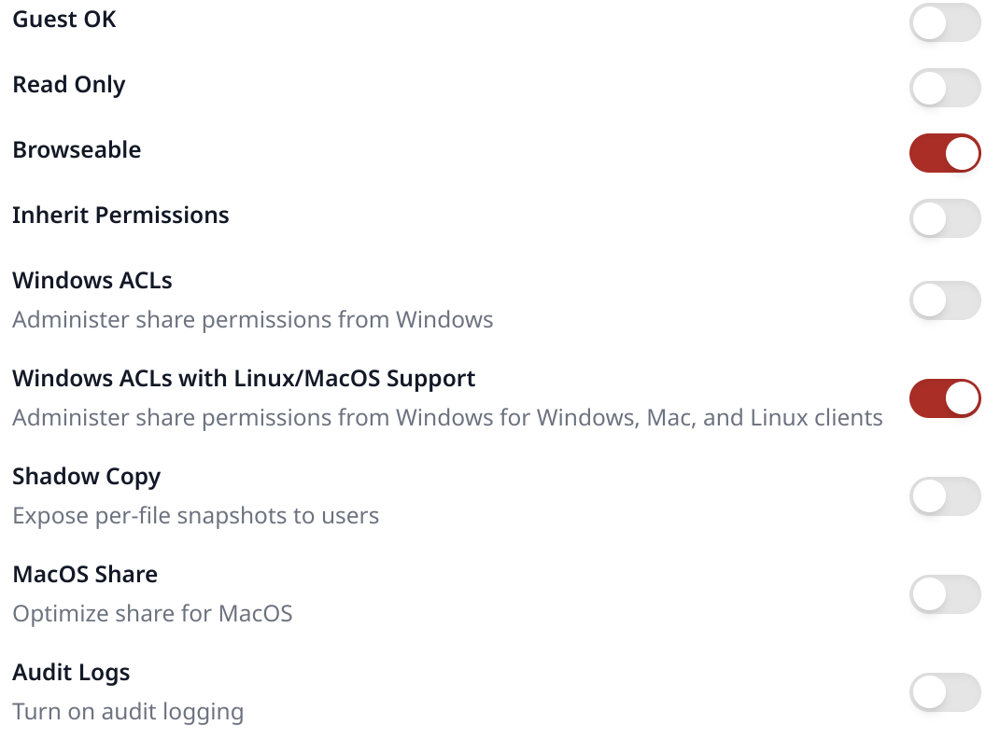
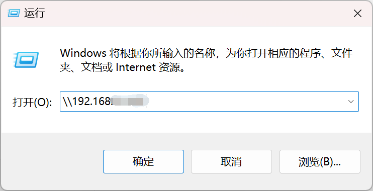
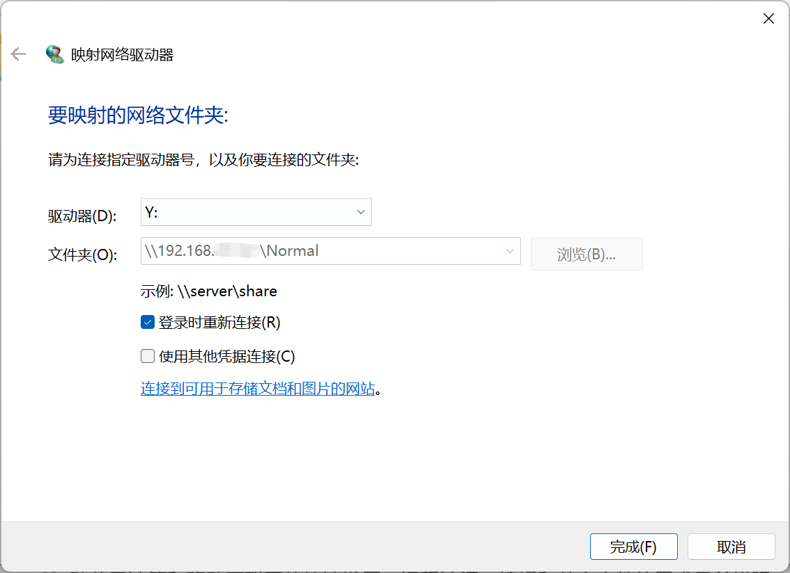


<br/>

# 概述

经过前面几个模块的配置，我们已经能够在 NAS 上存放我们的数据，并且通过组建 RAID 与接入 UPS 等方式加强了数据存储的安全性。在这个部分，我们需要通过配置来实现通过各种设备来访问 NAS 中存储的数据，并且进一步加强数据存储的安全性。

## SMB / Samba

SMB（Server Message Block）可用于在计算机间共享文件、打印机、串口等，电脑上的网上邻居就是靠它实现的。通过 SMB 协议，客户端应用程序可以在各种网络环境下读、写服务器上的文件，以及对服务器程序提出服务请求。此外通过 SMB 协议，应用程序可以访问远程服务器端的文件、以及打印机等资源。

Samba 能让 Linux 服务器实现文件服务器、身份授权和认证、名称解析和打印服务等功能。

Samba 也是 SMB 协议的实现，它允许 Windows 客户访问 Linux 系统上的目录、打印机和文件（就像访问 Windows 服务器时一样）。重要的是，Samba 可以将 Linux 服务器构建成一个域控制器。这样一来，就可以直接使用 Windows 域中的用户凭据，免去手动在 Linux 服务器上重新创建的麻烦。

相比于 NFS，SMB / Samba 对 Windows 系统有着更好的支持，兼容性更优。

但非常值得一提的是，SMB 协议本身是面向局域网连接的，尤其是 SMB1.0/CIFS 协议，它仍使用的 NetBIOS 协议（139 端口）存在很多安全漏洞。并且由于 Wannacry 勒索病毒利用永恒之蓝漏洞造成了巨大威胁，SMB1.0/CIFS 已经逐渐被弃用。即使是后续的 SMBv2 以及 SMBv3，也被报告过 CVE（Common Vulnerabilities and Exposures，公共漏洞和暴露），因此建议**不要在公网使用 SMB 服务**。

如果需要远程文件管理，可以使用 Tailscale 等方案搭建虚拟局域网，或者通过更安全的文件传输协议，如 WebDAV 等。

## 异地容灾

在数据存储与容灾方面，有一条重要的原则，3-2-1 原则：

- **3**：同一数据至少保存 **3** 份，包括原数据；
- **2**：保存到 **2** 种以上存储介质上，如机械硬盘 / 固态硬盘；
- **1**：至少有 **1** 份异地备份，防止本地发生灾难时数据完全丢失，如选择保存到云服务器上。

# SMB 配置

## NAS 端 —— 45Drive's File Sharing

首先确保安装了 45Drive's 库的 File Sharing 包。

在 Cockpit 控制台中`File Sharing - Shares`处添加 SMB 共享：


按照下图进行配置即可。



需要共享多个文件夹，就在 Shares 处创建多个共享配置。

为了让其他设备具有写入权限，请配置共享文件夹的权限为 744。

```Bash
sudo chmod 744 -R /dir
```

在配置了 IPv6 后，我们的 SMB 服务相当于**暴露在公网中**，因此更应做好访问控制。建议在路由器上关闭 IPv6 的 139 与 445 端口。

Samba 有自己的用户系统，但与系统用户名一致的用户拥有相同的访问权限。

我们创建一个与当前用户一致的 Samba 用户：

```Bash
sudo smbpasswd -a <你正在使用的用户名>
```

根据提示设置好密码后（请设置高强度密码），修改共享文件夹及其文件的拥有者以匹配 Samba 用户：

```Bash
sudo chown <你正在使用的用户名>:<所在用户组> -R /dir
```

在 Cockpit 中的防火墙放行 TCP 445 端口的请求。

## 其他设备端

对于 Windows 系统，确认其已连接到 NAS 的局域网中。打开运行，输入`\\<NAS IP>`，回车：



访问对应文件夹，确认能够正常读写其中的文件。


可以将文件夹映射到驱动器，便于访问。右键文件夹，选择映射网络驱动器：



指定驱动器号，即可在此电脑中看到对应文件夹。


# WebDAV

随着云计算和移动互联网的快速发展，远程访问、编辑和共享文件的需求日益增强。为了满足这一需求，WebDAV（Web-based Distributed Authoring and Versioning）应运而生，成为了一种基于 HTTP 协议的通信协议，扩展了 HTTP 1.1，提供了应用程序直接对 Web 服务器进行读写操作的能力。

## 自建 WebDAV 服务

如果你恰好有一台云服务器，并且带宽足够，连接稳定，就可以在上面部署 WebDAV 服务。我们也可以在 NAS 上部署 WebDAV 服务，来实现安全的远程文件访问。远程访问时，请为 WebDAV 配置 HTTPS。

### 绑定挂载

如果我们希望将多个不在同一目录下的不同目录都挂载到 WebDAV，我们可以采用绑定挂载（Bind mount）的方式。绑定挂载是 Linux 提供的一种特殊挂载方式，它可以让一个已有的目录在另一个路径下“出现”。

新建一个用于 WebDAV 访问的目录：

```bash
sudo mkdir -p /path/to/webdav/root       # 创建总根目录

sudo mkdir -p /path/to/webdav/root/data1 # 创建用于挂载数据目录的子目录
sudo mkdir -p /path/to/webdav/root/data2
```

进行绑定挂载：

```bash
sudo mount --bind /path/to/your/data1 /path/to/webdav/root/data1
sudo mount --bind /path/to/your/data2 /path/to/webdav/root/data2
```

可通过 `ls` 命令查看是否成功挂载。确认成功后，将挂载配置写入 `/etc/fstab` 文件中，实现开机自动挂载：

```bash
sudo vim /etc/fstab
```

将以下内容添加到文件末尾：

```
# WebDAV Bind Mounts
/path/to/your/data1     /path/to/webdav/root/data1   none   bind   0   0
/path/to/your/data2     /path/to/webdav/root/data2   none   bind   0   0
```

保存后，运行 `sudo mount -a` 来测试 fstab 配置是否正确。

### Caddy WebDAV

关于 Caddy 的介绍，详见 。

#### 安装 WebDAV 插件

为了在 Caddy 上开启 WebDAV 服务，我们需要先安装 `mholt/caddy-webdav` 插件：

```bash
sudo caddy add-package github.com/mholt/caddy-webdav
```

安装完成后，重启 Caddy：

```bash
sudo systemctl restart caddy
```

#### WebDAV 配置

接下来编辑 Caddy 配置，搭建 WebDAV 服务：

```bash
sudo vim /etc/caddy/Caddyfile
```

```
{
    order webdav before file_server  # 这一部分配置放在文件开头
}

nas.dawnocean.site:6666 {    # WebDAV 服务端口
    rewrite /dav /dav/       # WebDAV 根路径，即以 https://xxx.xx:6666/dav 访问
    basicauth {
       test $2a$14$xxx.xxxx  # bcrypt，使用 caddy hash-password 命令生成
    }
    webdav /dav/* {          # 与 WebDAV 根路径一致
        root /mnt/webdav     # 实际待访问的路径
        prefix /dav          # 与 WebDAV 根路径一致
    }
    request_body {
        max_size 50000MB     # 大文件上传限制
    }
    log {                    # 日志上传配置，请确保 caddy 用户具有读写权限
        output file /etc/caddy/caddy.log {
            roll_local_time
        }
    }
    tls /path/to/your/cert /path/to/your/key # SSL 证书配置，远程访问建议启用
}
```

#### Caddy 权限配置

如果 Caddy 通过 systemd 运行，需要额外编辑 service 配置以确保 Caddy 具有读写权限：

```bash
sudo systemctl edit caddy.service
```

在打开的编辑器中，添加以下内容：

```
[Service]
ReadWriteDirectories=/path/to/your/data /path/to/config/dir  # 多个路径以空格分割
```

完成编辑后，重新加载 systemd 并重启 Caddy：

```bash
sudo systemctl daemon-reload
sudo systemctl restart caddy
```

由于 Caddy 在运行时是通过 caddy 用户来操作，因此我们需要确保 caddy 用户至少对于数据文件具有读写权限，对于目录具有读写执行（进入）权限。

假设数据目录由 `test:test` 用户及用户组所有，我们希望保持数据的归属权：

```bash
sudo chmod 775 -R /path/to/your/data
sudo usermod -aG test caddy            # 将 Caddy 用户加入 test 用户组
```

### Standalone WebDAV（不推荐，基于 hacdias/webdav）

我们采用 Go 语言实现的 [Standalone WebDAV](https://github.com/hacdias/webdav "Standalone WebDAV") 服务。但经过笔者实测，在面对大文件读写时，该方案可能会出现**内存溢出以及卡顿**的问题，因此不推荐使用。

我们使用 Docker Compose 部署。关于 Docker 的介绍，详见 。

先在文件夹下创建配置文件：

```bash
sudo vim config.yml
```

输入以下内容，根据具体情况进行修改：

```yaml
address: 0.0.0.0
port: 6060 # 端口自定，记得在防火墙当中放行

# 是否配置 HTTPS，若更改为 true，请对应更改 cert 以及 key 地址
tls: false
cert: cert.pem
key: key.pem

# WebDAV 访问前缀路径。默认为 '/'
prefix: /

# 用户的默认权限。可选择 CRUD（Create, Read, Update, Delete）
permissions: R

rules: []

# CORS 跨域请求配置
cors:
  enabled: false
  credentials: true
  allowed_headers:
    - Depth
  allowed_hosts:
    - http://localhost:8080
  allowed_methods:
    - GET
  exposed_headers:
    - Content-Length
    - Content-Range

# 建议以 user 的形式单独配置权限以及文件夹位置
users:
  - username: test
    password: "{bcrypt}$2a$10xxxxx.xxxxxxx"
    permissions: CRUD
```

继续创建 `docker-compose.yml` 文件：

```yaml
services:
  webdav:
    image: ghcr.io/hacdias/webdav
    ports:
      - "6060:6060" # 端口自定，记得在防火墙当中放行
    volumes:
      - ./config.yml:/config.yml:ro
      - /path/to/your/data:/data
    command: "-c /config.yml"
    logging:
      driver: journald
    restart: unless-stopped
```

## WebDAV 服务商

目前国内支持 WebDAV 的云盘服务商只有坚果云。不过，阿里云盘通过开放平台接口可以实现 WebDAV 服务。这里是[项目地址](https://github.com/messense/aliyundrive-webdav "项目地址")。

坚果云对于免费用户每月提供 1GB 的上传流量以及 3GB 的下载流量。可以在第三方应用管理处创建应用密码。


## 挂载 WebDAV 为本地磁盘

### 自动挂载

各平台都有较为好用的 WebDAV 图形化客户端，如 Windows 端的 RaiDrive，Linux 端的 Dolphin / Thunar，macOS 端的 Finder（虽然 Finder 可能会出现卡顿问题）。根据软件里的指示进行挂载与登录即可。

当然，也有一些较为方便的命令行自动挂载工具，如 cadaver，rclone 等。

### 命令行手动挂载- davfs2

以下部分来自于[这篇文章](https://www.dujin.org/17037.html "这篇文章")。

#### 安装

```bash
sudo apt install davfs2
```

#### 挂载 WebDAV 磁盘

先在 Linux 系统上创建要挂载的文件目录，名称自定：

```bash
mkdir /Aliyun
```

挂载远端 WebDAV 至本地的`/Aliyun`目录下：

```bash
mount -t davfs http(s)://<服务器地址/域名>:<端口>/ /Aliyun # 请根据实际情况配置
```

回车后输入自己的用户名和密码，完成。可以输入`df -h`指令来查看是否成功。


#### 挂载坚果云 WebDAV

如果使用上述方法挂载坚果云 WebDAV，会出现如下报错信息：

```纯文本
/sbin/mount.davfs: mounting failed; the server does not support WebDAV
```

出现此情况的原因是，mount.davfs 命令在挂载时和 WebDAV 服务器建立连接，并通过 libneon 库的 `ne_options()` 函数发送 HTTP OPTIONS 请求获取 WebDAV 服务器能力，虽然返回成功但判断坚果云 WebDAV 服务器不支持 Class 1 WebDAV，因此直接报错挂载失败。

解决办法：修改`/etc/davfs2/davfs2.conf`：

```bash
sudo vim /etc/davfs2/davfs2.conf
```

将 `ignore_dav_header` 取消注释，并将 0 改为 1，保存并退出。

再次挂载，成功。

#### 开机自动挂载 WebDAV

##### 启用 davfs2 用户锁

编辑`/etc/davfs2/davfs2.conf`文件：

```bash
sudo vim /etc/davfs2/davfs2.conf
```

将 `use_locks` 取消注释，并将 1 改为 0，保存并退出。

##### 记住 WebDAV 账号密码

编辑`/etc/davfs2/secrets`文件：

```bash
sudo vim /etc/davfs2/secrets
```

在末尾增加一行内容：

```纯文本
http(s)://<服务器地址/域名>:<端口>/ <username> <password>
```

这里的 username 和 password 请更改为 webdav.yaml 中对应的用户名和密码。

##### 开机执行挂载

编辑`/etc/rc.local`文件：

```bash
sudo vim /etc/rc.local
```

文件末尾加上挂载指令，与上文一致。

```bash
mount -t davfs http(s)://<服务器地址/域名>:<端口>/ /Aliyun # 请根据实际情况配置
```

保存退出即可。