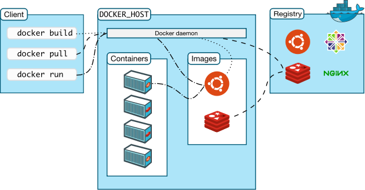


<br/>

# 概述

恭喜你读到了这里！如果你按照前面几篇文章配置下来，那么你的 NAS 已经可以应对各种数据存储需求了。接下来，我们要让 NAS 行使作为一台服务器的功能了。

Docker 是一个开源的应用容器引擎，基于 [Go 语言](https://www.runoob.com/go/go-tutorial.html "Go 语言") 并遵从 Apache 2.0 协议开源。

Docker 可以让开发者打包他们的应用以及依赖包到一个轻量级、可移植的容器中，然后发布到任何流行的 Linux 机器上，也可以实现虚拟化。

容器完全使用沙箱机制，相互之间不会有任何接口，更重要的是容器性能开销极低。

**如果有条件，请务必为你的 NAS 配置科学上网服务，可以使用部署在 OpenWrt 上等方法。由于国内镜像源不全面等原因，部分镜像在拉取时很容易出现超时的问题。尤其是 Docker 的安装过程，在没有代理的情况下很难完成。**

## Docker 架构



- 守护进程 (Docker daemon)：负责管理镜像、容器、容器网络、数据卷等。
- Client：负责发送 Docker 操作指令，日常主要通过 Client 完成镜像和容器的管理。
- 镜像 (Image)：即容器的模版，镜像是可以继承的，镜像主要通过 Dockerfile 文件定义。
- 镜像仓库 (Registry)：类似 Git 仓库, 只不过镜像仓库用于存储镜像和管理镜像的版本。
- 容器（Container）：容器是通过镜像创建的，所以说容器是一个镜像运行的实例，类似面向对象编程中类和对象的关系。

# 安装Docker

最简便的方式是采用官方脚本：

```bash
curl -fsSL https://get.docker.com -o get-docker.sh
sudo sh get-docker.sh
```

关于在 Debian 上手动安装 Docker Engine 的步骤，可以参照[官方文档](https://docs.docker.com/engine/install/debian/ "官方文档")。

# Docker 镜像源配置

Docker 的镜像源文件配置在 `/etc/docker/daemon.json`处：

```bash
sudo vim /etc/docker/daemon.json
```

根据测试情况，酌情在配置文件中添加需要的镜像源链接，如下所示：

```json
{
    "registry-mirrors": [
        "https://registry.docker-cn.com",
        "https://docker.mirrors.ustc.edu.cn",
        "https://hub-mirror.c.163.com",
        "https://mirror.baidubce.com",
        "https://ccr.ccs.tencentyun.com"
    ]
}
```

重启 Docker：

```bash
sudo systemctl daemon-reload    # 重启 daemon 进程
sudo systemctl restart docker   # 重启 docker
```

最后我们再验证一下是否修改成功，运行：

```bash
sudo docker info
```

在长串info信息中如果出现类似下文的内容：

```text
 Registry Mirrors:
  https://docker.mirrors.ustc.edu.cn/
  http://hub-mirror.c.163.com/
  https://mirror.ccs.tencentyun.com/
  https://registry.docker-cn.com/
```

那就说明我们的 Docker 国内镜像源修改成功了。

# 容器管理

## 创建容器专属账户

考虑到将要搭建的容器服务众多，甚至一部分服务还可能对 Internet 开放，为了安全，建议创建一个专用的低权限用户来运行各项容器。

使用命令行新建名为 application 的用户（名称可以自定义）：

```bash
sudo adduser application
```

输入命令：

```bash
id application
```

终端输出内容：

```text
uid=1001(application) gid=1001(application) groups=1001(application)
```

记住对应的 UID 与 GID，如果容器需要使用低权限用户，请在 docker-compose.yaml 文件中如下配置：

```yaml
...
environment:
      - PUID=1001
      - PGID=1001
...
```

## Docker 容器操作常用命令

这里仅列出日常配置涉及到的命令，不涉及容器的迁移等操作。


```bash
sudo systemctl start docker # 启动 docker
sudo systemctl stop docker # 停止 docker
sudo systemctl restart docker # 重启 docker
sudo systemctl status docker # 查看 docker 状态
sudo systemctl enable docker # 开机启动
sudo docker info # 查看 docker 概要信息

sudo docker images # 列出本地所有镜像
sudo docker 镜像名 # 拉取某个镜像

sudo docker ps # 最常用，查看当前所有正在运行的容器
sudo docker start/restart/stop/kill 容器ID/容器名 # 启动/重启/停止/强制停止某个容器
sudo docker rm 容器ID # 删除某个容器
sudo docker logs 容器ID # 查看某个容器的日志
sudo docker exec -it 容器ID bash # 进入某个容器内部
sudo docker cp 容器ID:容器内路径 目的主机路径 # 将文件从容器内部复制到主机上
```

## Docker Compose

Docker Compose 是一种用于定义和运行多容器应用程序的工具。它是实现简化和高效的开发和部署体验的关键。

Compose 简化了对整个应用程序堆栈的控制，使您可以轻松地在一个易于理解的 YAML 配置文件中管理服务、网络和卷。然后，只需一条命令，您就可以从配置文件中创建和启动所有服务。

安装 Compose：

```bash
sudo apt update
sudo apt install docker-compose-plugin
```

验证 Docker Compose 是否已正确安装：

```bash
docker compose version
```

Compose 使用的三个步骤：

- 使用 Dockerfile 定义应用程序的环境。
  - 即指导 docker 构建镜像
- 使用 docker-compose.yml 定义构成应用程序的服务，这样它们可以在隔离环境中一起运行。
  - 即指导 docker 构建容器，如果可以直接拉取现成镜像则无需 Dockerfile
- 最后，执行`docker compose up`命令来启动并运行整个应用程序。

在最新版本的 Compose 中，优先使用`compose.yaml`（首选）或 `compose.yml`，它位于工作目录中。Compose 也支持 `docker-compose.yaml` 和 `docker-compose.yml`，以向后兼容早期版本。如果两个文件都存在，Compose 会优先使用规范的 `compose.yaml`。

`compose.yaml`文件示例：

```yaml
services:
  qbittorrent: # 服务名
    image: lscr.io/linuxserver/qbittorrent:latest # 要拉取的镜像
    container_name: qbittorrent # 容器名
    environment:  # 容器环境变量的配置
      - PUID=1001
      - PGID=1001
      - TZ=Etc/UTC
      - WEBUI_PORT=8080
      - TORRENTING_PORT=41543
    volumes: # 将容器中的路径映射到宿主机的对应路径
      - /srv/dockerapps/qbittorrent/config:/config
      - /Normal/qbittorrent/qBitTorrent:/downloads # 和 qBittorrent 配置一致
    ports: # 将容器中的端口映射到宿主机的端口
      - "8080:8080"
      - "41543:41543"
      - "41543:41543/udp"
    restart: unless-stopped
```

### 主要命令

```bash
sudo docker compose up -d # 启动 compose.yaml 文件中定义的所有服务，-d 选项意为后台启动
sudo docker compose down # 停止并删除正在运行的服务
sudo docker compose logs # 监控运行容器的输出并调试问题
sudo docker compose ps # 列出所有服务及其当前状态
```

**对于大部分可以使用 Docker Compose 部署的服务，配置流程如下：**

1. **在工作目录下创建**\*\*`compose.yaml`\*\***文件，将服务文档中的内容复制进去，并根据实际情况调整配置**
2. **运行**\*\*`sudo docker compose up -d`\*\***命令，等待镜像拉取、服务启动即可**

## Portainer

Portainer是一款**开源的容器管理工具**，旨在简化 Docker 容器和 Kubernetes 集群的管理。通过提供一个直观的 Web 界面，Portainer 可以帮助用户轻松地创建、管理和维护容器，而无需使用复杂的命令行工具。


通过`docker run`命令安装：

```bash
# 请将路径 /path/to/portainer 替换为您的，此路径存储 Portainer 配置文件。
sudo docker run -d -p 8000:8000 -p 9443:9443 -p 9000:9000 --name portainer --restart=always -v /var/run/docker.sock:/var/run/docker.sock -v /path/to/portainer:/data portainer/portainer-ce:latest
```

安装完成后，通过 9443 端口访问即可。

## Dockge

Dockge 是 Uptime Kuma 作者的新作品，因此 UI 风格与 Uptime Kuma 基本一致，如果你正在使用 Uptime Kuma 的话，那么 Dockge 的 UI 设计应该也不会让你失望。Dockge 主打的是简单易上手，与 Potainer 相比界面简洁易用，新手使用不会感到一头雾水。

缺点：

- 与 Portainer 等相比功能没有那么丰富，例如没有单独管理网络、镜像功能
- 无法直接接管现有正在运行的容器
- 只支持通过 `Docker Compose` 来完成所有操作，无法直接管理单个容器


通过 Docker Compose 部署：

```yaml
services:
  dockge:
    image: louislam/dockge:1
    restart: unless-stopped
    ports:
      # Host Port : Container Port
      - 5001:5001
    volumes:
      - /var/run/docker.sock:/var/run/docker.sock
      - ./data:/app/data
        
      # If you want to use private registries, you need to share the auth file with Dockge:
      # - /root/.docker/:/root/.docker

      # Stacks Directory
      # ⚠️ READ IT CAREFULLY. If you did it wrong, your data could end up writing into a WRONG PATH.
      # ⚠️ 1. FULL path only. No relative path (MUST)
      # ⚠️ 2. Left Stacks Path === Right Stacks Path (MUST)
      - /opt/stacks:/opt/stacks
    environment:
      # Tell Dockge where is your stacks directory
      - DOCKGE_STACKS_DIR=/opt/stacks
```

安装完成后，通过 5001 端口访问即可。

<br/>

