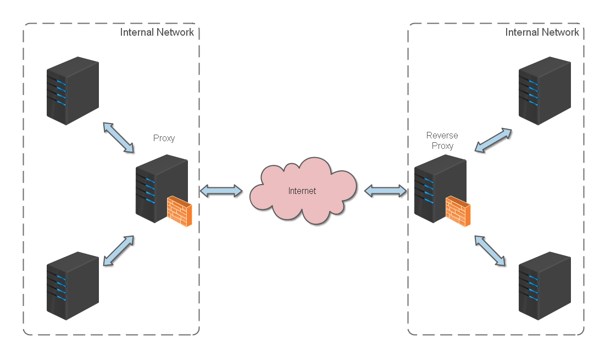
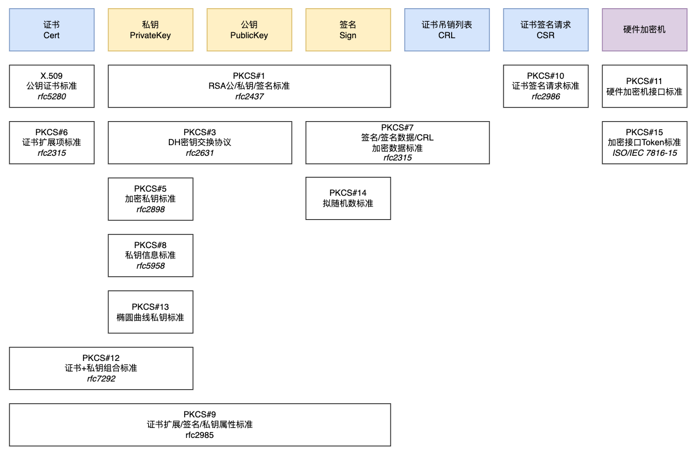
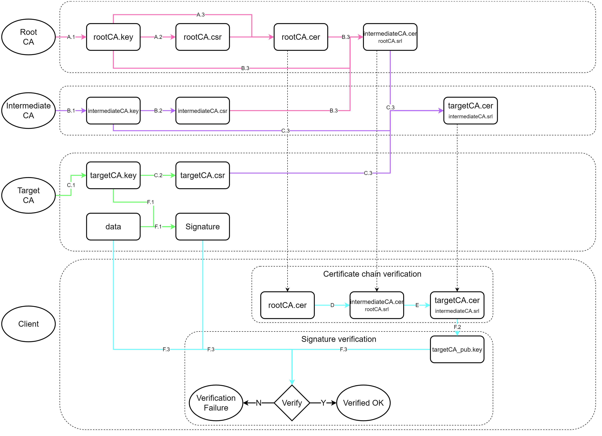


<br/>

# 反向代理

正向代理（Proxy）方式是指内部网络上的服务器通过代理服务器来访问 Internet 上的服务器，并把响应结果返回给内部网络服务器。

反向代理（Reverse Proxy）方式是指以代理服务器来接受 Internet 上的连接请求，然后将请求转发给内部网络上的服务器，并将从服务器上得到的结果返回给 Internet 上请求连接的客户端，此时代理服务器对外就表现为一个反向代理服务器。

通过反向代理功能，我们可以隐藏内部服务器的地址（暴露的是代理服务器），对于客户端而言，此代理是无感知的。通过 Nginx 或 Caddy 等工具，我们可以将发送给不同子域名的请求转发到同一台机器的各个端口；我们还可以更进一步，将客户端的请求转发到不同的内部服务器，这样就实现了负载均衡。



# SSL 证书

我们先来看看 HTTPS 的握手过程：

HTTPS 在传输数据之前需要客户端（浏览器）与服务端（网站）之间进行一次握手，在握手过程中将确立双方加密传输数据的密码信息。TLS/SSL 协议不仅仅是一套加密传输的协议，更是一件经过艺术家精心设计的艺术品，TLS/SSL 中使用了非对称加密，对称加密以及 HASH 算法。握手过程的具体描述如下：


1. 浏览器将自己支持的一套加密规则发送给网站。
2. 网站从中选出一组加密算法与 HASH 算法，并将自己的身份信息以证书的形式发回给浏览器。证书里面包含了网站地址，加密公钥，以及证书的颁发机构等信息。
3. 浏览器获得网站证书之后浏览器要做以下工作：
   1. 验证证书的合法性（颁发证书的机构是否合法，证书中包含的网站地址是否与正在访问的地址一致等），如果证书受信任，则浏览器栏里面会显示一个小锁头，否则会给出证书不受信的提示。
   2. 如果证书受信任，或者是用户接受了不受信的证书，浏览器会生成一串随机数的 Key，并用证书中提供的公钥加密。
   3. 使用约定好的 HASH 算法计算握手消息，并使用生成的随机数 Key 对消息进行加密，最后将之前生成的所有信息发送给网站。
4. 网站接收浏览器发来的数据之后要做以下的操作：
   1. 使用自己的私钥将信息解密取出 Key，使用 Key 解密浏览器发来的握手消息，并验证 HASH 是否与浏览器发来的一致。
   2. 使用密码加密一段握手消息，发送给浏览器。
5. 浏览器解密并计算握手消息的 HASH，如果与服务端发来的 HASH 一致，此时握手过程结束，之后所有的通信数据将由之前浏览器生成的随机密码并利用对称加密算法进行加密。

了解了 HTTPS 握手过程后，你可能会产生如下疑问：如果我在给客户端发送证书的时候进行伪造，选取一对有效的公私钥，伪装成服务器，会产生安全问题吗？这个时候就轮到 CA 机构出马了。

CA（Certificate Authority，证书授权）机构是负责发放和管理数字证书的权威机构。CA 机构在网络安全领域扮演着重要的角色，它们通过验证和颁发数字证书，为网络通信提供身份认证的有效凭据，确保数据的安全性和可信度。


在申请 CA 证书时，服务器端会生成一对有效的公私钥，并将公钥、申请者信息、域名等内容发送到 CA。CA 接收后，通过 HASH 算法生成证书摘要，再用 CA 的私钥对其进行加密，生成签名，最后返回证书。

这样一来，客户端就可以通过签名和公钥验证服务器返回的公钥是否由 CA 机构签发，也就确保了安全性。

但获取 CA 证书是需要成本的。或者在某些情况下，我们正在进行本地开发，需要获得`localhost`等主机名的证书，而这样的私有地址不是被某个人唯一拥有的，因此 CA 机构不会提供证书。在这种情况下，我们可能需要自己生成证书。

自签名证书是由不受信的 CA 机构颁发的数字证书，也就是自己签发的证书。与受信任的 CA 签发的传统数字证书不同，自签名证书是由一些公司或软件开发商创建、颁发和签名的。虽然自签名证书使用的是与 X.509 证书相同的加密密钥对架构，但是却缺少受信任第三方（如 Sectigo）的验证。在颁发过程中缺乏独立验证会产生额外的风险，这就是为什么对于面向公众的网站和应用程序来说，自签名证书是不安全的。

## X.509 与扩展名

以下内容参考[这篇文章](https://zhuanlan.zhihu.com/p/543707056)、[这篇文章](https://www.cnblogs.com/superhin/p/18308302/x509_pkcs_rfc)和[这篇文章](https://www.cnblogs.com/arnoldlu/p/18401403)。

X.509 是密码学里公钥证书的格式标准，也是 TLS/SSL 协议中应用的标准。它基于一种被称为抽象语法表示法（ASN.1）的接口描述语言，这种接口描述语言定义了可以以跨平台方式序列化和反序列化的数据结构。

而关于公钥的加密标准，则由 PKCS（Public Key Cryptography Standards）系列标准确定，其中包括证书申请、证书更新、证书作废表发布、扩展证书内容以及数字签名、数字信封的格式等方面的一系列相关协议。



### 存储、传输密钥和证书

DER（Distinguished Encoding Rules，可分辨编码规则）提供了一种对 ASN.1 值进行编码的方式。在密码学方面，可以简单理解为 DER 就是 ASN.1 的二进制表达，平常使用的后缀名为 `.der` 的密钥 / 证书文件里存储的就是 DER 规则的二进制，这些二进制可以被解析为 ASN.1 抽象结构。

二进制数据格式的一个缺点是不能在文本传输（如电子邮件或文本文档）中交换。基于文本的编码的一个优点是，它们很容易使用通用文本编辑器进行修改；例如，用户可以连接多个证书以形成具有复制和粘贴操作的证书链。

于是，PEM（Privacy Enhanced Mail，隐私增强邮件）格式逐渐发展起来。简单来说，它实际上就是把二进制内容用 Base64 编码，然后加上如下形式的头部和尾部：

```
-----BEGIN <label>-----
Base64Encoding......
-----END <label>-----
```

### 扩展名：`.crt` / `.pem` / `.key` / `.csr`

我们经常会遇到以下四种格式的密钥或证书文件：`.crt` / `.pem` / `.key` / `.csr`，看着有点让人头大。简单解释一下：
- `.crt`：在 Linux 下指证书文件，在 Windows 中为 `.cer` 扩展名
- `.pem`：也是证书文件，强调存储方式
- `.key`：单独存放的 PEM 格式的密钥文件
- `.csr`：证书签名请求文件，包含证书持有人的信息

以腾讯云申请的 Nginx 格式的免费 SSL 证书为例，我们解压文件后就会得到这四个扩展名的证书文件。其中 `.crt` 与 `.pem` 文件的内容是完全一致的，也就是公钥文件。`.key` 文件就是密钥文件，而 `.csr` 文件就是上文提到申请 CA 证书时用于向 CA 发送申请者信息的请求文件，因此申请成功后一般不会再使用。

在 HTTPS 配置中，我们主要使用 `.crt` / `.pem` 与 `.key` 这两类文件。

### CA Bundle

有时我们获取到的 `.crt` / `.pem` 文件当中不止包含一个证书，这样的文件名中通常会包含 `bundle` 字样，这就涉及到 SSL 证书的信任链机制。

一切 SSL 证书信任的根基是**根证书**。根证书由**根证书颁发机构**（Root CA）产生，是证书层级结构中的最顶层。它是一个自签名的证书，用于信任链的起点。Root CA 的公钥被广泛分发，并被操作系统和浏览器预装。

直接使用根证书去签发数以亿计的网站证书风险较高。如果根证书的私钥泄露，整个互联网的信任体系就会崩溃。因此引入了**中间证书**（Intermediate Certificate）与**中间 CA**，如此可以创建一个分层的证书结构，使得根证书不需要直接签发大量的终端实体证书。这种分层管理可以提高证书管理的效率和灵活性。

信任链的最后一环就是**终端实体证书**（End-Entity Certificate），也经常被称为叶子证书（Leaf Certificate）或服务器证书（Server Certificate，在用于网站时）。它被直接颁发给最终使用该证书的实体——比如一个网站服务器、一个电子邮件用户或一台设备——而不是颁发给另一个 CA。



`_bundle.crt` 文件的正确顺序遵循 X.509 证书路径验证 (Path Validation) 逻辑。其核心原则是：服务器在 TLS 握手期间，必须向客户端提供一个有序的证书序列，该序列**从终端实体证书开始，逐级上溯**至一个客户端本地信任库中存在的根证书所直接签发的证书为止。

还是以腾讯云申请的 Nginx 格式证书为例，其中 `xxx.com_bundle.crt` 文件格式如下：

```
-----BEGIN CERTIFICATE-----
( Base64 编码的服务器证书数据 )
( Subject: CN=xxx.com )
( Issuer: CN=TrustAsia TLS RSA CA )
-----END CERTIFICATE-----
-----BEGIN CERTIFICATE-----
( Base64 编码的中级证书数据 )
( Subject: CN=TrustAsia TLS RSA CA )
( Issuer: CN=DigiCert Global Root CA )
-----END CERTIFICATE-----
```

当 TLS 握手开始，服务器发送其证书链时，客户端会严格按照以下程序进行处理：
1. **处理第一个证书** (索引 0)：客户端接收到一个证书列表。它首先处理列表中的第一个证书。这里就是我们申请的 `xxx.com` 域名的终端实体证书。客户端会通过证书的 Subject 等字段，检查其中包含的域名是否与客户端当前正在访问的域名完全匹配。
2. **构建和验证链条**：如果第一个证书的主机名验证通过，客户端会读取该证书的 Issuer（颁发者）字段。然后，它会在列表中寻找下一个证书（索引 1，这里就是 TrustAsia 中间 CA 的证书），并检查该证书的 Subject 字段是否与上一个证书的 Issuer 字段匹配。如果匹配，客户端将使用索引为 1 的证书的公钥来验证索引为 0 的证书的数字签名。
3. 客户端会重复步骤 2，沿着证书列表逐级向上验证，用证书 n+1 的公钥验证证书 n 的签名，前提是证书 n+1 的 Subject 必须等于证书 n 的 Issuer。
4. **链接到信任锚**（Trust Anchor）：当验证到列表中的最后一个证书时，客户端会读取其 Issuer 字段，并在自己本地的、预装的根证书库（Trust Store）中查找一个与该 Issuer 匹配的根证书。如果找到，就用这个本地根证书的公钥验证列表中最后一个证书的签名。如果成功，整个信任链被确认为有效。

这个顺序是**不可颠倒**的。如果顺序错误，客户端的验证算法在第一步就会因为找不到能验证服务器证书签名的证书而失败。

# Nginx

Nginx 是 lgor Sysoev 为俄罗斯访问量第二的 rambler.ru 站点设计开发的。从 2004 年发布至今，凭借开源的力量，已经接近成熟与完善。

Nginx 功能丰富，可作为 HTTP 服务器，也可作为反向代理服务器，邮件服务器。支持 FastCGI、SSL、Virtual Host、URL Rewrite、Gzip 等功能。并且支持很多第三方的模块扩展。


## 安装与配置

```bash
sudo apt install nginx
```

接下来为 Web 应用创建一个新的 Nginx 配置文件：

```bash
sudo vim /etc/nginx/sites-available/app.conf
```

基础 HTTPS 反向代理配置：

```
server {
    listen 80; # 替换为你需要的端口
    # listen 443 ssl; # 若要启用 HTTPS，在端口后添加 ssl
    # ssl_certificate /path/to/cert # 这里是证书的公钥
    # ssl_certificate_key /path/to/key # 这里是证书的私钥
    server_name app.example.com; # 替换为你自己的域名

    location / { # 这里的 “/” 意为网站根目录，请根据实际情况调整
        proxy_pass http://localhost:8080; # 这里是要反向代理转发到的端口
        proxy_set_header Host $host;
        proxy_set_header X-Real-IP $remote_addr;
        proxy_set_header X-Forwarded-For $proxy_add_x_forwarded_for;
        proxy_set_header X-Forwarded-Proto $scheme;
    }
}
```

WebSocket 反向代理配置：

```
server {
    listen 80; # 替换为你需要的端口
    # listen 443 ssl; # 若要启用 HTTPS，在端口后添加 ssl
    # ssl_certificate /path/to/cert # 这里是证书的公钥
    # ssl_certificate_key /path/to/key # 这里是证书的私钥
    server_name app.example.com; # 替换为你自己的域名

    location / { # 这里的 “/” 意为网站根目录，请根据实际情况调整
        proxy_pass http://localhost:8080; # 这里是要反向代理转发到的端口
        proxy_set_header Host $host;
        proxy_set_header X-Real-IP $remote_addr;
        proxy_set_header X-Forwarded-For $proxy_add_x_forwarded_for;
        proxy_set_header X-Forwarded-Proto $scheme;
        
        # 1. 必须将代理协议版本设为 1.1，因为它支持 "Upgrade" 机制
        proxy_http_version 1.1;

        # 2. 传递 "Upgrade" 请求头
        # $http_upgrade 变量包含了客户端请求中的 "Upgrade" 头的值 (例如 "websocket")
        proxy_set_header Upgrade $http_upgrade;

        # 3. 传递 "Connection" 请求头
        # 告诉后端服务器，这个连接需要被升级，而不是像普通 HTTP 一样处理后关闭
        proxy_set_header Connection "upgrade";
    }
}
```

更改请求体大小限制配置：

```
server {
    listen 80; # 替换为你需要的端口
    # listen 443 ssl; # 若要启用 HTTPS，在端口后添加 ssl
    # ssl_certificate /path/to/cert # 这里是证书的公钥
    # ssl_certificate_key /path/to/key # 这里是证书的私钥
    server_name app.example.com; # 替换为你自己的域名
    
    client_max_body_size 50000m;

    location / { # 这里的 “/” 意为网站根目录，请根据实际情况调整
        proxy_pass http://localhost:8080; # 这里是要反向代理转发到的端口
        proxy_set_header Host $host;
        proxy_set_header X-Real-IP $remote_addr;
        proxy_set_header X-Forwarded-For $proxy_add_x_forwarded_for;
        proxy_set_header X-Forwarded-Proto $scheme;
    }
}
```

有关于域名 SSL 证书的申请，这里就不详述了。我们可以采用 [certbot](https://github.com/certbot/certbot "certbot") 向 Let's Encrypt 发送请求。

创建软链接以启用站点：

```bash
sudo ln -s /etc/nginx/sites-available/app.conf /etc/nginx/sites-enabled/
```

测试 Nginx 配置：

```bash
sudo nginx -t
```

如果配置有效，请重新加载 Nginx：

```bash
sudo systemctl reload nginx
```

记得放行防火墙对应端口。

# Caddy 

Caddy 是一个用 Go 语言开发的开源现代化 Web 服务器，因其**自动 HTTPS** 和**简洁配置**而备受欢迎。它支持 HTTP/2 和 HTTP/3，具有跨平台特性，可运行在 Windows、Linux 和 macOS 等系统上。

针对一般的 NAS 需求，我们并不需要高并发的性能。相比之下，Caddy 的配置**远比** Nginx 易上手以及理解，因此笔者非常推荐使用 Caddy 来进行反向代理。

## 安装与配置

```bash
sudo apt install -y debian-keyring debian-archive-keyring apt-transport-https
curl -1sLf 'https://dl.cloudsmith.io/public/caddy/stable/gpg.key' | sudo gpg --dearmor -o /usr/share/keyrings/caddy-stable-archive-keyring.gpg
curl -1sLf 'https://dl.cloudsmith.io/public/caddy/stable/debian.deb.txt' | sudo tee /etc/apt/sources.list.d/caddy-stable.list
sudo apt update
sudo apt install caddy
```

启用并运行 Caddy 服务：

```bash
sudo systemctl enable caddy
sudo systemctl start caddy
```

编辑 `/etc/caddy/Caddyfile`：

```bash
sudo vim /etc/caddy/Caddyfile
```

基础 HTTPS 反向代理配置（自从 Caddy v2 起，`reverse_proxy` 自动支持 WebSocket 协议反向代理）：

```
nas.dawnocean.site:1234 {                    # 外部访问端口
    reverse_proxy localhost:5678             # 本地服务端口
    tls /path/to/your/cert /path/to/your/key # SSL 证书配置，远程访问建议启用
}
```

更改请求体大小限制配置：

```
nas.dawnocean.site:1234 {                    # 外部访问端口
    reverse_proxy localhost:5678             # 本地服务端口
    request_body {
        max_size 50000MB
    }
    tls /path/to/your/cert /path/to/your/key # SSL 证书配置，远程访问建议启用
}
```

配置完成后，重载 Caddy 服务：

```bash
sudo systemctl reload caddy
```

## 自动 HTTPS

Caddy 是第一个也是唯一一个**默认**自动使用 HTTPS 的 Web 服务器。如果在以上的配置中没有手动指定 `tls` 选项，Caddy 会尝试自动申请证书：
- Caddy 使用本地自动信任的自签名证书（如果允许）通过 HTTPS 提供 IP 地址和本地 / 内部主机名，如 localhost、127.0.0.1 等。
- Caddy 使用来自公开的 ACME CA 的证书，通过 HTTPS 提供公共 DNS 名称，例如 Let's Encrypt 或者 ZeroSSL。

Caddy 会自动更新所有托管证书并将 HTTP（默认端口 80）重定向到 HTTPS（默认端口 443）。

**对于本地 HTTPS**：
- Caddy 可能会提示输入密码以将其唯一的根证书安装到你的信任库中。
- 任何在不信任 Caddy 根目录的情况下访问该站点的客户端都会显示安全错误。

**对于公共域名**，需要满足以下要求，以让 Caddy 自动申请 HTTPS 证书：
- 域名的 A / AAAA 记录指向你的服务器
- 端口 80 和 443 对外开放
- Caddy 可以绑定到那些端口（或者这些端口被转发到 Caddy）
- data 目录是可写且持久的
- 域名出现在配置中的相关位置

在国内的网络环境中，可能较难开放 80 与 443 端口。如果 Caddy 申请证书失败，可手动申请，并上传到 NAS 合适的目录中。（目前申请的 SSL 证书期限一般为 90 天，到时手动续期即可）

# 局域网中的 HTTPS

正如前文所提到过的，如果我们的服务都是在局域网中运行的，那么就无法使用 CA 机构签发的证书。如果我们部署的服务有要求必须使用 HTTPS，就需要我们自签名 SSL 证书。

以下部分主要参考[这篇文章](https://sanyers.github.io/blog/web/webrtc/%E6%90%AD%E5%BB%BA%E5%B1%80%E5%9F%9F%E7%BD%91https.html "这篇文章")。

## 自签名 SSL 证书

我们直接在 GitHub [对应仓库](https://github.com/FiloSottile/mkcert "对应仓库")的 Release 处下载软件，放入待生成证书的机器中。

先生成根证书：

```bash
mkcert -install

mkcert -CAROOT # 查看根证书路径
```

会自动生成 `rootCA.pem`与`rootCA-key.pem`两个文件。

再生成自签证书：

```bash
mkcert localhost 127.0.0.1 ::1 <待申请证书的局域网 IP 地址，可多个>
```

返回结果如下：

```纯文本
Using the local CA at "C:\Users\sanye\AppData\Local\mkcert" ✨

Created a new certificate valid for the following names 📜
 - "localhost"
 - "127.0.0.1"
 - "::1"
 - "192.168.xx.xx"

The certificate is at "./localhost+2.pem" and the key at "./localhost+2-key.pem"
```

可以将证书重命名为自己需要的名字比如 `localhost_key.pem` `localhost_cert.pem`。

## 局域网内其他设备安装自签证书

将刚才生成的根证书 `rootCA.pem` 拷贝一个副本，并命名为 `rootCA.crt` (因为 Windows 并不识别 .pem 扩展名，并且 Ubuntu 也不会将 .pem 扩展名作为 CA 证书文件对待)，将 `rootCA.crt` 文件复制给局域网内的其他用户，手工导入。

### Windows

双击这个证书文件，在常规选项卡，点击安装证书证书，在导入向导中将证书导入 `受信任的根证书颁发机构`:


Windows 命令行执行：

```bash
certutil -addstore -f "ROOT" selfsigned.crt
```

### macOS

```bash
sudo security add-trusted-cert -d -r trustRoot -k ~/Library/Keychains/login.keychain "selfsigned.crt"
```

如果想将自签名证书在全系统级别受信任，需要将上面的证书目标路径从 `~/Library/Keychains/login.keychain`替换成`/Library/Keychains/login.keychain`。

注意：在 macOS 下，浏览器和 curl 会自动信任新增的自签名证书，但许多编程语言并没有默认集成 keychain，因此不能自动通过自签名证书。

### Ubuntu

将证书文件（必须是 .crt 后缀）放入 `/usr/local/share/ca-certificates/`，然后执行 `sudo update-ca-certificates`。

```bash
sudo apt install ca-certificates -y
cp selfsigned.crt /usr/local/share/ca-certificates/
sudo update-ca-certificates --verbose
```

<br/>
