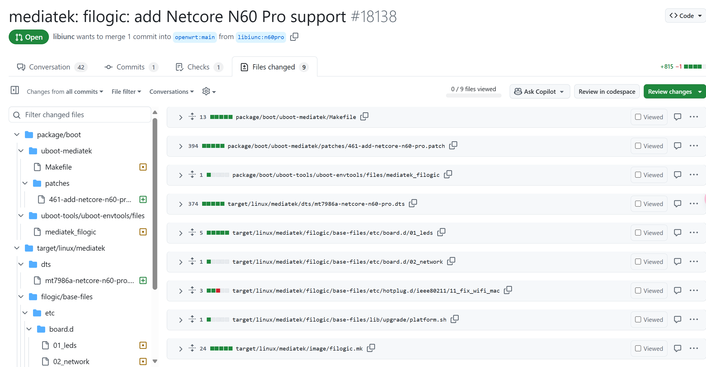
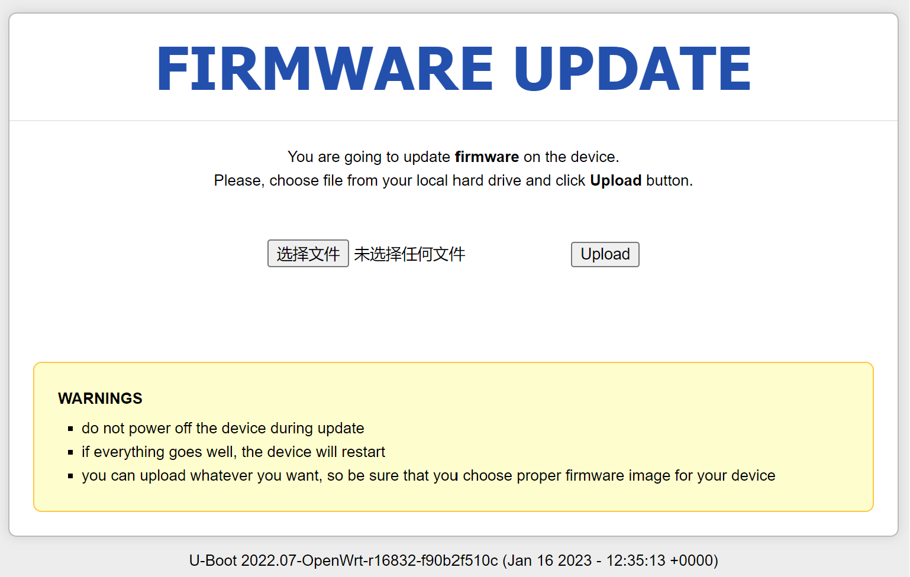
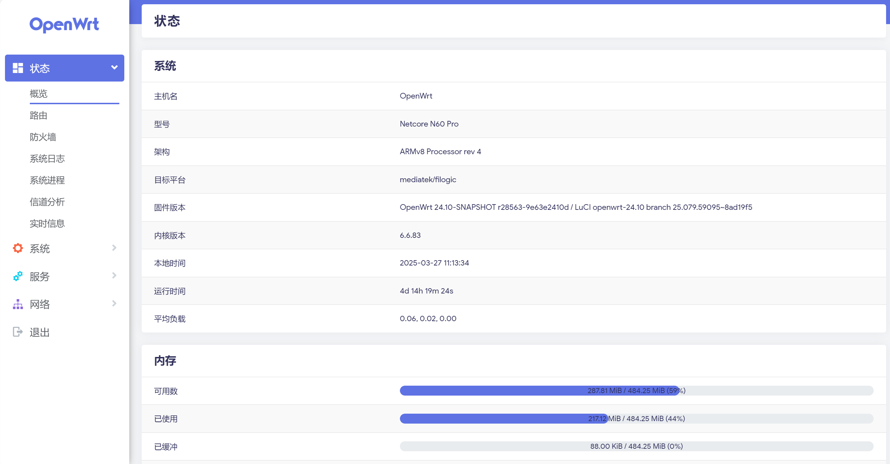
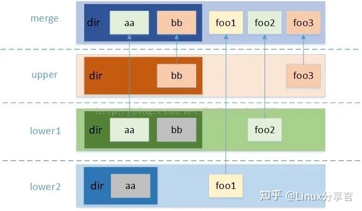
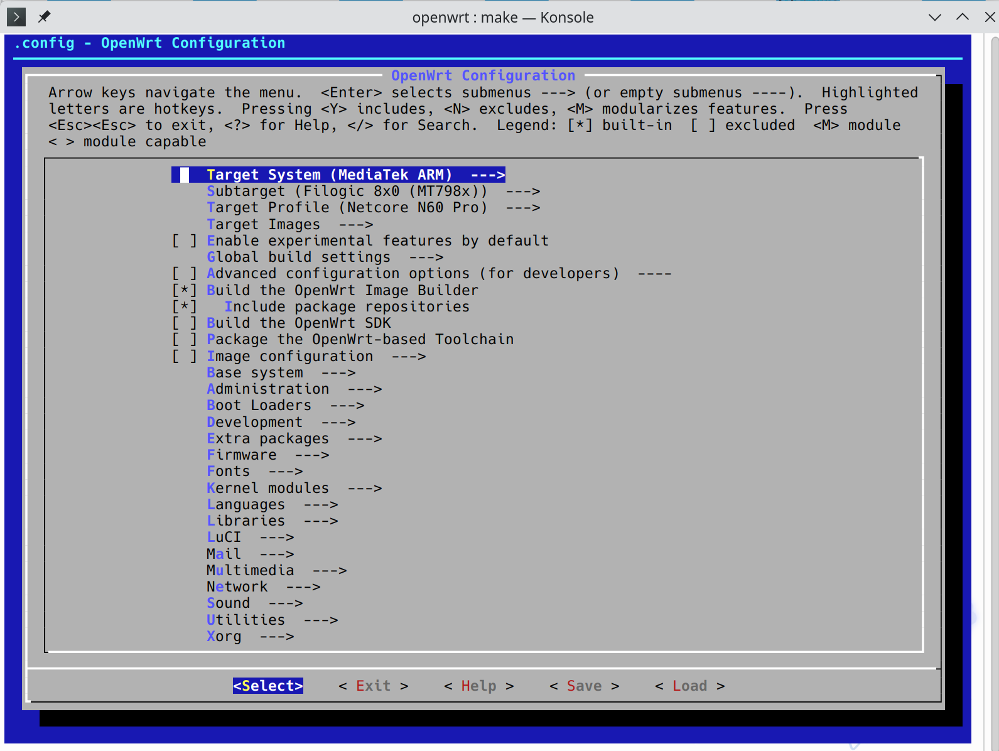
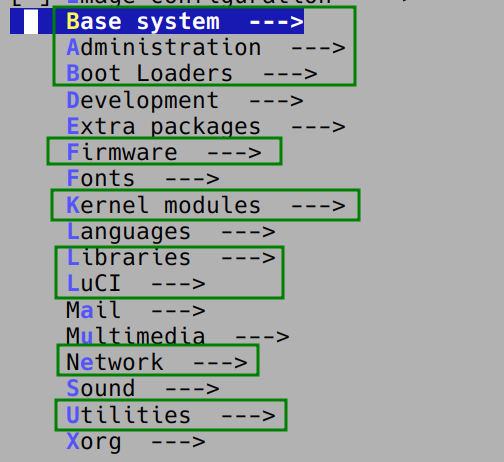
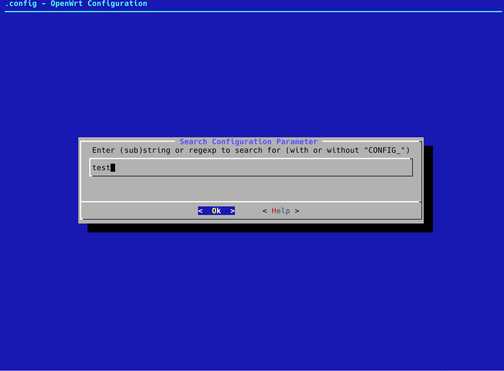
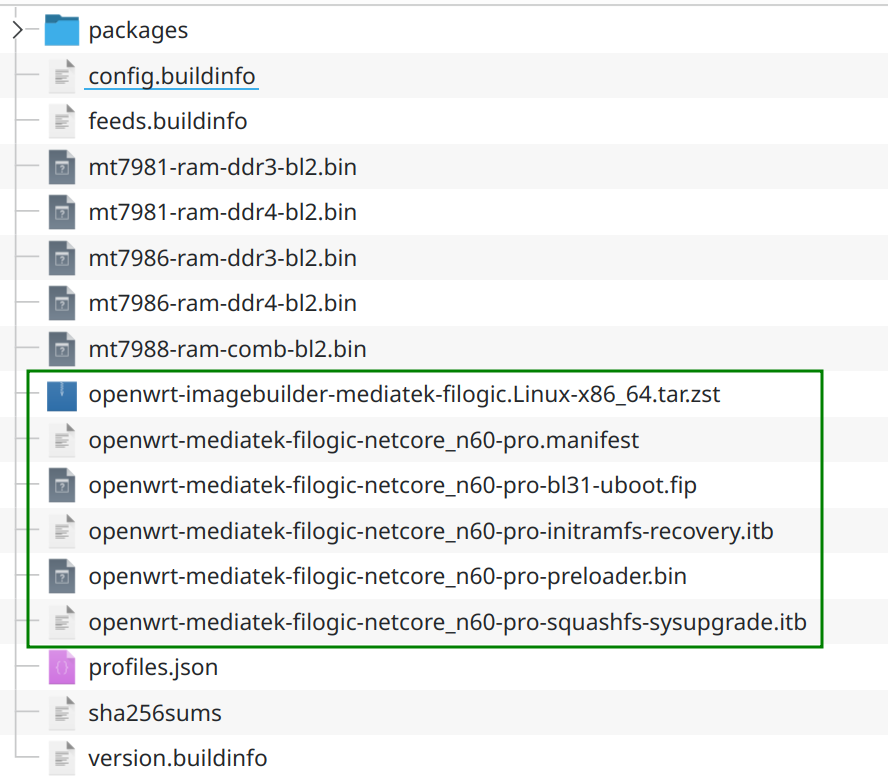


<br/>

# OpenWrt

OpenWrt 项目是针对嵌入式设备的 Linux 操作系统，常用在路由器上。OpenWrt 高度模块化、自动化，不仅占用空间小，而且具有强大的网络组件。

OpenWrt 项目始于 2004 年 1 月，其第一个版本采用了 LinkSys 的源码。在 LinkSys 的代码收费后，改为 Linux 内核集成，并将 OpenWrt 完全模块化，不断推出补丁和驱动。

更多的信息可以在 [OpenWrt Wiki](https://openwrt.org/zh/start "OpenWrt Wiki") 找到。

OpenWrt 有数个民间衍生出的版本，加入了一些官方列表没有，针对国内具体情况定制的插件，且源码和开发规范与官方同步，保证了软件的纯净和稳定，目前网络上的很多固件都是针对这3个固件进行编译。

- [Lienol](https://github.com/Lienol/openwrt "Lienol")：紧跟官方版本进行更新，其编译出来的固件体积比其它版本小，集成的软件少，源码改动少，使用起来稳定性更强。
- [~~Lean~~](https://github.com/coolsnowwolf/lede "Lean")~~：由恩山论坛 Lean 分享了全部开源代码，由于加入了很多中国特色的功能，并告诉所有人怎么通过编译去得到自己想要的 OpenWRT，定制灵活性很强。~~（不推荐）
- [ImmortalWrt](https://github.com/immortalwrt/immortalwrt "ImmortalWrt")：OpenWrt 的一个分支，移植了更多的软件包，支持了更多的设备，更好的性能，并为中国大陆用户进行了特殊的优化。

前两者需要自行编译，ImmortalWrt 可直接选择固件下载。

OpenWrt 的当前稳定版本系列是 24.10，其中 “v24.10.0” 是该系列的最新版本。它于 2025 年 2 月 6 日发布。

> 来自 OpenWrt Wiki：

> 如果您熟悉 Linux 类系统，那么 OpenWrt 对于您就非常简单。如果您不熟悉，那我们就需要首先从一些基础概念开始。

> 您应该已经知道 OpenWrt 是一个针对嵌入式设备的 Linux 发行版，Linux“**发行版**“是一个通过创建和维护一些软件包实现根据用户需求来定制 Linux 系统的项目。一个”**软件包**“是包含一个应用程序或一些脚本的压缩档案，其配置文件中还包含了用于将其集成到操作系统中的信息。软件包可被一个能够下载、打开、安装、卸载的应用程序——**包管理器**（OpenWrt 中为 opkg）处理。所以，一个 OpenWrt 固件是一些围绕 Linux 内核的软件包组装而成。

> 每个软件包都被独立进行编译，当软件包编译完成后，所需的软件包都被“安装”在一个临时文件夹中。其后，该文件夹会被压缩并变为设备固件的只读压缩分区（squashfs）。

> 内核也被当作一个软件包处理，但却通过特殊的方式添加到固件映像中以便设备的引导程序可以发现它。所以，您可以在不触及设备的引导程序（比较危险而且不是总是可行）的情况下替换设备原版的固件。

> 构建程序的最后一步才是生成一个固件文件（也就是您用于安装或升级 OpenWrt 的文件），这个文件通常是一个准备写入内置闪存储存装置磁盘映像，所以您会发现许多开发人员在 IRC 或邮件列表称其为“映像”。

## 为什么不推荐 Lean's LEDE

知乎上的回答：[https://www.zhihu.com/question/635802944](https://www.zhihu.com/question/635802944 "https://www.zhihu.com/question/635802944")。

根据笔者自己使用 Lean's LEDE 及其改版的体验，它对 OpenWrt 主线（老的主线）进行了大量魔改，并且安装了大量臃肿的软件包，导致实际体验很差。由于深度魔改的原因，我们也无法使用一般的软件源，经常运行更新后整个系统都无法使用。

从一个入门者的角度，在一开始就使用这种定制系统是十分不合适的。笔者同时也是 Arch Linux 用户，对这种做法不太赞成。再加上 Lean 等人如此圈地自萌，与官方主线越走越远的行为，无疑是在分裂这个社区，更是开源精神所不能容忍的。

## 自己编译 OpenWrt 的好处

1. 高度定制化。预编译的固件通常包含很多默认的软件包，而自己编译可以去除不需要的组件，节省存储空间，提升性能。比如，如果不需要 IPv6 支持或者某些 VPN 功能，去掉这些可以减少固件大小，可能让旧设备运行得更流畅。
2. 便于刷写固件。如果在使用过程中发现某个内核模块未安装，我们只需加入该模块并重新编译即可，并且相比于第一次编译会减少很多时间。将编译好的 sysupgrade 映像文件直接上传到 LuCI 内，OpenWrt 会完成剩下的工作。
3. 硬件兼容性。不同路由器硬件差异大，官方可能没有针对特定型号的优化。自己编译时可以选择适合的驱动和内核模块，提升稳定性和性能。比如某些无线网卡可能需要特定的驱动，官方固件没包含，自己编译就可以加入。
4. 功能扩展。OpenWrt 的软件仓库有很多第三方包，我们可以添加官方未包含的功能。如内网穿透工具 frp、zerotier，或者网络监控工具如 ntopng。对于开发者来说，可能需要集成调试工具或开发环境，自己编译就能方便地加入这些工具。
5. 学习价值。编译过程涉及 Linux 系统、交叉编译、网络配置等知识，对技术提升有帮助。我们可以通过这个过程更深入了解操作系统的工作原理，或者为将来开发自己的项目打基础。 &#x20;

# 为新设备添加 OpenWrt 支持

此部分主要来自于 [OpenWrt Wiki](https://openwrt.org/zh/docs/guide-developer/adding_new_device "OpenWrt Wiki")。

为了全面了解如何添加新设备支持，我们建议您查看一台新设备相关的最新的 commit，摸清楚哪些文件发生了修改和如何修改它们。我们只需要去 GitHub 仓库找到某设备对应的 PR 查看就能理解。



## 重要文件

最重要的文件一般存放于以下目录：

`/target/linux/<arch_name>/base-files/etc/…`

该目录的文件和文件夹最终将会存放于设备固件的`/etc`目录。

它一般包含下列的文件和文件夹：

- **…board.d/**：定义设备专用的默认硬件的脚本，如 LED 和网络接口。
- **…hotplug.d/**：定义设备专用的，在插入热插拔设备时自动运行的脚本
- **…init.d/**：定义设备专用的在启动时自动运行的脚本
- **…uci-defaults/**：定义设备专用的 UCI 默认设置
- **…diag.sh**：定义设备显示的错误代码

`/target/linux/<arch_name>/base-files/lib/…`

该文件夹下的文件夹和文件对应固件中的`/lib`目录下文件夹和文件。

它的子文件夹和文件有：

- **…\<arch\_name>.sh**：将 *阅读友好的设备名* 转化为 *脚本安全的设备名* 的脚本
- **…preinit/**：通用 \<arch\_name> 预初始化脚本
- **…upgrade/**：通用 \<arch\_name> 升级脚本

`/target/linux/<arch_name>/base-files/sbin`

该文件夹对应固件中的`/sbin`文件夹, 一般为通用的 \<arch\_name> sbin 脚本和工具。

`/target/linux/<arch_name>/dts/`

设备树源文件（Device tree source files，简写为dts）。

`/target/linux/<arch_name>/`

用于构建写入用镜像的设置文件。

`/target/linux/<arch_name>/<board_name>/`

设备专用的设置文件。

`/target/linux/<arch_name>/modules.mk`

*menuconfig* 中使用的架构专用（Arch-specific）配置文件。

### 使新设备出现在 make menuconfig 中

在编辑了上述的文件后, 你需要对 Makefile 使用 touch 命令：

```bash 
touch target/linux/*/Makefile
```


## DTS（设备树）

Linux 内核从 V2.6 开始引入设备树的概念，其起源于`OF:OpenFirmware`， 用于**描述一个硬件平台的硬件资源信息**，这些信息包括：CPU 的数量和类别、内存基地址和大小、总线和桥、外设连接、中断控制器和中断使用情况、GPIO 控制器和 GPIO 使用情况、Clock 控制器和 Clock 使用情况等等。

以下是 DeepSeek 生成的关于 N60 Pro 的部分 DTS 注释，仅供参考。

```c 
// SPDX-License-Identifier: GPL-2.0-or-later OR MIT
// 定义许可证信息，GPL-2.0 或 MIT

/dts-v1/;
#include <dt-bindings/gpio/gpio.h> // 包含 GPIO 绑定定义
#include <dt-bindings/input/input.h> // 包含输入设备绑定定义
#include <dt-bindings/leds/common.h> // 包含 LED 绑定定义

#include "mt7986a.dtsi" // 包含 MT7986A SoC 的基础设备树文件

/ {
    model = "Netcore N60 Pro"; // 设备型号
    compatible = "netcore,n60-pro", "mediatek,mt7986a"; // 设备兼容性列表

    aliases {
        serial0 = &uart0; // 串口0别名
        label-mac-device = &gmac0; // MAC地址关联的设备
        led-boot = &led_power; // 启动时使用的 LED
        led-failsafe = &led_power; // 安全模式时使用的 LED
        led-running = &led_power; // 运行时使用的 LED
        led-upgrade = &led_power; // 升级时使用的 LED
    };

    chosen {
        bootargs = "root=/dev/fit0 rootwait"; // 内核启动参数
        rootdisk = <&ubi_rootdisk>; // 根文件系统设备
        stdout-path = "serial0:115200n8"; // 标准输出路径（串口0，波特率115200）
    };

    memory@40000000 {
        reg = <0 0x40000000 0 0x20000000>; // 内存地址范围
    };

    gpio-keys {
        compatible = "gpio-keys"; // GPIO按键设备

        button-reset {
            label = "reset"; // 按键标签
            linux,code = <KEY_RESTART>; // 按键对应的 Linux 键值
            gpios = <&pio 9 GPIO_ACTIVE_LOW>; // 按键连接的 GPIO
        };
        ...
    };

    gpio-leds {
        compatible = "gpio-leds"; // GPIO LED 设备

        led-0 {
            color = <LED_COLOR_ID_BLUE>; // LED 颜色
            function = LED_FUNCTION_WLAN; // LED 功能（WLAN）
            gpios = <&pio 1 GPIO_ACTIVE_LOW>; // LED 连接的 GPIO
            linux,default-trigger = "phy1tpt"; // 默认触发器（WLAN 活动）
        }
        ...
    };

    reg_3p3v: regulator-3p3v {
        compatible = "regulator-fixed"; // 固定电压调节器
        regulator-name = "fixed-3.3V"; // 调节器名称
        regulator-min-microvolt = <3300000>; // 最小电压
        regulator-max-microvolt = <3300000>; // 最大电压
        regulator-boot-on; // 启动时启用
        regulator-always-on; // 始终启用
    };

    ...
};

&crypto {
    status = "okay"; // 启用加密模块
};

&eth {
    status = "okay"; // 启用以太网模块

    gmac0: mac@0 {
        compatible = "mediatek,eth-mac"; // 以太网 MAC 设备
        reg = <0>; // 寄存器地址
        phy-mode = "2500base-x"; // PHY 模式（2.5Gbps）

        nvmem-cells = <&macaddr_factory_1fef20 0>; // MAC 地址存储单元
        nvmem-cell-names = "mac-address"; // MAC 地址名称

        fixed-link {
            speed = <2500>; // 固定连接速度
            full-duplex; // 全双工模式
            pause; // 启用流控
        };
    };
    ...

    mdio: mdio-bus {
        #address-cells = <1>; // 地址单元数量
        #size-cells = <0>; // 大小单元数量
    };
};

&mdio {
    reset-delay-us = <600>; // 复位延迟（微秒）
    reset-post-delay-us = <20000>; // 复位后延迟（微秒）
    reset-gpios = <&pio 6 GPIO_ACTIVE_LOW>; // 复位 GPIO

    phy5: phy@5 {
        compatible = "ethernet-phy-ieee802.3-c45"; // PHY 设备兼容性
        reg = <5>; // PHY 地址

        leds {
            #address-cells = <1>; // 地址单元数量
            #size-cells = <0>; // 大小单元数量

            led@3 {
                reg = <3>; // LED 寄存器地址
                color = <LED_COLOR_ID_GREEN>; // LED 颜色
                function = LED_FUNCTION_LAN; // LED 功能（LAN）
            };
        };
    };
    ...

    switch: switch@1f {
        compatible = "mediatek,mt7531"; // 交换机设备兼容性
        reg = <31>; // 交换机地址
        reset-gpios = <&pio 5 GPIO_ACTIVE_HIGH>; // 复位 GPIO
        interrupt-controller; // 中断控制器
        #interrupt-cells = <1>; // 中断单元数量
        interrupt-parent = <&pio>; // 中断父设备
        interrupts = <66 IRQ_TYPE_LEVEL_HIGH>; // 中断引脚和类型
    };
};

&switch {
    ports {
        #address-cells = <1>; // 地址单元数量
        #size-cells = <0>; // 大小单元数量
        ...

        port@5 {
            reg = <5>; // 端口地址
            label = "lan1"; // 端口标签
            phy-mode = "2500base-x"; // PHY 模式（2.5Gbps）
            phy-handle = <&phy5>; // 关联的 PHY 设备
        };

        port@6 {
            reg = <6>; // 端口地址
            ethernet = <&gmac0>; // 关联的以太网设备
            phy-mode = "2500base-x"; // PHY 模式（2.5Gbps）

            fixed-link {
                speed = <2500>; // 固定连接速度
                full-duplex; // 全双工模式
                pause; // 启用流控
            };
        };
    };
};

&spi0 {
    pinctrl-names = "default"; // 引脚控制名称
    pinctrl-0 = <&spi_flash_pins>; // 引脚控制配置
    status = "okay"; // 启用 SPI0

    flash@0 {
        compatible = "spi-nand"; // SPI NAND 闪存设备
        #address-cells = <1>; // 地址单元数量
        #size-cells = <1>; // 大小单元数量
        reg = <0>; // 寄存器地址

        spi-max-frequency = <20000000>; // SPI 最大频率
        spi-tx-bus-width = <4>; // SPI 发送总线宽度
        spi-rx-bus-width = <4>; // SPI 接收总线宽度

        partitions {
            compatible = "fixed-partitions"; // 固定分区
            #address-cells = <1>; // 地址单元数量
            #size-cells = <1>; // 大小单元数量
            ...

            partition@180000 {
                label = "factory"; // 分区标签
                reg = <0x180000 0x200000>; // 分区地址范围
                read-only; // 只读分区

                nvmem-layout {
                    compatible = "fixed-layout"; // 固定布局
                    #address-cells = <1>; // 地址单元数量
                    #size-cells = <1>; // 大小单元数量

                    eeprom_factory_0: eeprom@0 {
                        reg = <0x0 0x1000>; // EEPROM 地址范围
                    };

                    macaddr_factory_1fef20: macaddr@1fef20 {
                        compatible = "mac-base"; // MAC 地址基础
                        reg = <0x1fef20 0x6>; // MAC 地址存储位置
                        #nvmem-cell-cells = <1>; // NVMEM 单元数量
                    };
                    ...
                };
            };

            partition@380000 {
                label = "fip"; // 分区标签
                reg = <0x380000 0x200000>; // 分区地址范围
                read-only; // 只读分区
            };
            ...
        };
    };
};

&pio {
    spi_flash_pins: spi-flash-pins-33-to-38 {
        mux {
            function = "spi"; // 引脚功能（SPI）
            groups = "spi0", "spi0_wp_hold"; // 引脚组
        };
        conf-pu {
            pins = "SPI2_CS", "SPI2_HOLD", "SPI2_WP"; // 引脚名称
            drive-strength = <8>; // 驱动强度
            mediatek,pull-up-adv = <0>; // 上拉配置（禁用）
        };
        ...
    };

    wf_2g_5g_pins: wf_2g_5g-pins {
        mux {
            function = "wifi"; // 引脚功能（WiFi）
            groups = "wf_2g", "wf_5g"; // 引脚组
        };
        conf {
            pins = "WF0_HB1", "WF0_HB2", "WF0_HB3", "WF0_HB4",
                   "WF0_HB0", "WF0_HB0_B", "WF0_HB5", "WF0_HB6",
                   "WF0_HB7", "WF0_HB8", "WF0_HB9", "WF0_HB10",
                   "WF0_TOP_CLK", "WF0_TOP_DATA", "WF1_HB1",
                   "WF1_HB2", "WF1_HB3", "WF1_HB4", "WF1_HB0",
                   "WF1_HB5", "WF1_HB6", "WF1_HB7", "WF1_HB8",
                   "WF1_TOP_CLK", "WF1_TOP_DATA"; // 引脚名称
            drive-strength = <4>; // 驱动强度
        };
    };
};

&trng {
    status = "okay"; // 启用随机数生成器
};

&ssusb {
    vusb33-supply = <&reg_3p3v>; // USB 3.3V 电源
    vbus-supply = <&reg_5v>; // USB 5V 电源
    status = "okay"; // 启用 USB 模块
};

&uart0 {
    status = "okay"; // 启用串口0
};

&usb_phy {
    status = "okay"; // 启用 USB PHY
};

&watchdog {
    status = "okay"; // 启用看门狗
};

&wifi {
    nvmem-cells = <&eeprom_factory_0>; // WiFi EEPROM 存储单元
    nvmem-cell-names = "eeprom"; // EEPROM 名称
    pinctrl-names = "default"; // 引脚控制名称
    pinctrl-0 = <&wf_2g_5g_pins>; // 引脚控制配置
    status = "okay"; // 启用 WiFi 模块
};
```

## 补丁

子目录`patches-xxx` 是对一个目标版本为 xxx 的内核补丁。
它包含的文件名称（`3个数字-全小写字母的简介.patch`）含义如下:

**0xx** - 上游需要回退的内容补丁
**1xx** - 等待上游合并的代码补丁
**2xx** - 内核构建、配置和头文件的补丁
**3xx** - 用于特定体系结构的补丁
**4xx** - MTD相关的补丁（系统和设备方面）
**5xx** - 文件系统相关的补丁
**6xx** - 网络通用补丁
**7xx** - 网络物理层驱动补丁
**8xx** - 其他设备补丁
**9xx** - 未分类的其他补丁

# Uboot

先让我们来看看更常见的 PC 机的启动过程：

- BIOS / UEFI 程序部署在主板特定芯片上，操作系统部署在硬盘上
- 上电后，PC 先执行 BIOS 程序，由 BIOS 程序负责初始化内存、硬盘，将 OS 镜像读取到内存中，最后跳转到内存中执行 OS 直至启动

相对应地，嵌入式系统的启动过程：

- Uboot 程序部署在能作为启动设备的 Flash 上，操作系统部署在 Flash 上
- 上电后，嵌入式系统先执行 Uboot 程序，由 Uboot 程序负责初始化内存、Flash，将 OS 镜像读取到内存中，最后跳转到内存中执行 OS 直至启动

因此，可以将 Uboot 程序类比成 PC 中的 BIOS，引导系统启动。对于这一类程序，更通用的描述是 BootLoader，Uboot 只是其中一种。



不死 Uboot（Breed）是路由器刷机常见的 Uboot 之一，由国内个人[hackpascal](https://github.com/hackpascal "hackpascal") 开发。

为什么会被称为“不死鸟”？有些官方升级固件自带 Bootloader，如果从官方固件升级，会导致现有 Bootloader 被覆盖。而当 Breed 更新固件时，它会自动删除固件附带的引导加载程序，因此可以防止 Breed 被覆盖。

# UCI

`UCI`是一个用 C 语言编写的功能组件，为了 *集中化* 管理运行 OpenWrt 系统的设备的配置文件。

UCI 是在 OpenWrt 历史版本 [White Russian](https://openwrt.org/about/history "White Russian") 中存在的基于 NVRAM 的配置文件的 *替代版本* 和 *其附带的标准配置文件程序* 的封装，例如`/etc/network/interfaces`，`/etc/exports`，`/etc/dnsmasq.conf`，`/etc/samba/samba.conf`等。

他们可以通过任何文本编辑器、命令行功能组件`uci`、各种编程API（如 Shell，Lua 和 C）实现更改。

# LuCI

LuCI 建立于 2008 年 3 月，最初名为“FFLuCI”，作为将 OpenWrt 分支 White Russian 的 Freifunk-Firmware 移植到其继任分支 Kamikaze 的努力的一部分。这个项目的起因是在嵌入式设备上缺乏一个免费、干净、可扩展且易于维护的 Web 用户界面。虽然大多数类似的配置界面都大量使用了 Shell 脚本语言，但 LuCI：

- 使用 Lua 编程语言
- 将接口分割成逻辑部分，如模型和视图，使用面向对象的库和模板。

这确保了更好的性能、更小的安装体积、更快的运行时间和简单的可维护性。

同时，LuCI 从 MVC 框架发展成为一个包含多个库、应用程序和用户界面的集合，适用于 Lua 程序员，同时仍然专注于 Web 用户界面，这也成为了 OpenWrt Kamikaze 8.09 以来的 OpenWrt 官方发布的一部分。



# SquashFS

**Squashfs（.sfs）**是一套供 Linux 核心使用的 GPL 开源**只读**压缩文件系统。Squashfs 能够为文件系统内的文件、inode 及目录结构进行压缩，并支持最大 1024k 字节的块大小，以提供更大的压缩比。

Squashfs 常被用于各 Linux 发行版的 LiveCD 中，也用于 OpenWrt 和 DD-WRT 的路由器固件。Chromecast 也是该文件系统的用户。在 LiveCD 中，Squashfs 通常与 UnionFS，OverlayFS 和 aufs 等联合挂载文件系统结合使用，以便在 LiveCD 系统中提供可读写支持。Appimage 项目也使用 Squashfs 作为镜像。

# OverlayFS

此部分来源于[这篇文章](https://zhuanlan.zhihu.com/p/436450556 "这篇文章")。

OverlayFS，顾名思义是一种堆叠文件系统，可以将多个目录的内容叠加到另一个目录上。OverlayFS 并不直接涉及磁盘空间结构，看起来像是将多个目录的文件按照规则合并到同一个目录。且对多个源目录具体使用文件系统类型没有要求，即使各个源目录的文件系统类型不同也不影响使用。



在使用如上 mount 进行 OverlayFS 合并之后，遵循如下规则：

- lowerdir 和 upperdir 两个目录存在同名文件时，lowerdir 的文件将会被隐藏，用户只能看到 upperdir 的文件。
- lowerdir 低优先级的同目录同名文件将会被隐藏。
- 如果存在同名目录，那么 lowerdir 和 upperdir 目录中的内容将会合并。
- 当用户修改 mergedir 中来自 upperdir 的数据时，数据将直接写入 upperdir 中原来目录中，删除文件也同理。
- 当用户修改 mergedir 中来自 lowerdir 的数据时，lowerdir 中内容均不会发生任何改变。因为 lowerdir 是只读的。用户想修改来自 lowerdir 数据时，overlayfs 会首先拷贝一份 lowerdir 中文件副本到 upperdir 中（这也被称作 OverlayFS 的 copy-up 特性）。后续修改或删除将会在 upperdir 下的副本中进行，lowerdir 中原文件将会被隐藏。
- 如果某一个目录单纯来自 lowerdir 或者 lowerdir 和 upperdir 合并，默认无法进行 rename 系统调用。但是可以通过 mv 重命名。

一般 lowerdir 为只读文件系统，upperdir 为可写文件系统，这形成了一个有趣的机制，似乎我们可以修改 lowerdir 下的文件或目录，lowerdir 看上去变成了一个可读写的文件系统。

### 删除文件和目录

为了支持 rm 和 rmdir 而又不修改 lower 文件系统，需要在 upper 文件系统中记录文件或目录已经被删除。OverlayFS 引入了 whiteout 文件的概念。如果需要删除 lower 层的文件或目录，需要在 upper 层创建一个 whiteout 文件。因此会导致删除文件反而会导致占用空间增加的特性。

OverlayFS 以其独特的优势正得到越来越广泛的应用，OpenWrt 系统也利用 OverlayFS 减少擦写闪存的次数，延长闪存的使用寿命。

# 编译 OpenWrt

以下操作请使用普通用户，不要使用 root 以及 sudo。

## 拉取官方源码

```bash 
git clone https://github.com/openwrt/openwrt.git
cd openwrt
git pull
```

切换分支，一般选择最新的稳定版本：

```bash 
git branch -a
git tag
git checkout v24.10.0
```

## 更新并安装软件包列表

可能需要使用代理。

```bash 
./scripts/feeds update -a
./scripts/feeds install -a
```

## 选取设备文件

终端输入：

```bash 
make menuconfig
```

在出现的菜单中按照目标设备依次选择`Target System`，`Subtarget`与`Target Profile`。



## 挑选内核模块与软件包

这是 OpenWrt 编译过程中最激动人心的时刻。你可以随意挑选自己所需的软件包与内核模块。



我们可能会加入如下类别的软件包：

- **Base system**：基础包，如`dnsmasq`、`firewall4`等
- **Administration**：权限相关以及数据监控等管理功能
- **Boot Loaders**
- **Firmware**：固件支持，请根据设备芯片选择
- **Libraries**：支持库文件
- **LuCI**：包括 LuCI 模块、应用、主题等
- **Network**：网络相关包
- **Utilities**：其他基础工具软件

别忘了选择对应的内核模块（在 **Kernel modules** 中）：


我们还可以在界面中键入`/`（和 Vim 一样）以查询软件包。



### 可能会安装的内核模块 / 软件包

- `kmod-tun`：TUN 模块
- `luci-theme-argon`：这是一个较为用户友好的 LuCI 主题，需要[手动安装](https://github.com/jerrykuku/luci-theme-argon "手动安装")。
- `wpad`：是`wpad-basic`的完整版，支持 WPA 企业热点（PEAP 认证）登录。
- `odhcp6c`：轻量级 DHCPv6 和 RA 客户端
  - 如选用`dnsmasq-full`请不要加入`odhcpd`与`odhcpd-ipv6only`包
- `ca-bundle`与`ca-certificate`：SSL 支持

## 编译前操作

### 安装依赖

以 Debian 系为例：

```bash 
sudo apt update 
sudo apt install build-essential clang flex bison g++ gawk gcc-multilib g++-multilib gettext git libncurses-dev libssl-dev python3-distutils rsync unzip zlib1g-dev file wget
```

### 预下载

使用`make download`在最终构建前下载所有依赖，并激活多线程编译。可能需要使用代理。

## 正式编译

经过了这么多的准备工作，我们终于要迎来最后一步了：

```bash 
make -jN V=s
```

- `-jN`: make 命令可以加上`-j`参数用于指定使用多少 CPU 核编译，可以加速编译过程。例如：`make download -j4`，`make -j5`。
- `V=s`：make命令可以加上`V=s`以输出更多的编译错误信息。

在实际的编译过程中，可能会出现一些错误和警告。例如某个包没有安装，package 依赖冲突等等。根据提示的信息进行查询和解决即可。

编译完成后，我们可以在`bin/targets/xxx`目录下找到我们最终需要的文件。



其中，

- **...imagebuilder...tar.zst**：Image Builder
- **...uboot.fip**：Uboot FIP（Firmware Image Package）分区映像
- **...initramfs-recovery.itb**：临时的 InitramFS 恢复镜像（用于安装到内存中）
- **...preloader.bin**：Flash BL2 分区映像
- **...squashfs-sysupgrade.itb**：SquashFS 构建的系统升级镜像

## 关于 Image Builder

Image Builder（以前称为 Image Generator）是一个预编译环境，适用于创建自定义映像，而无需从源代码编译它们。它下载预编译的软件包并将它们集成到单个可闪存映像中。

在以下情况下，这样做很有用：

- 您想在较小的闪存中容纳更多的封装
- 您想关注开发快照
- 您的设备具有 32MB 或更少的 RAM 并且 opkg 无法正常工作
- 您想批量刷新几十个设备，并且需要一个特定的映像设置

使用 Image Builder 进行编译的速度相比从零开始很快，但定制性会下降。

为了生成 Image Builder，我们在`make menuconfig`中勾选`Build the Openwrt Image Builder`即可。

### 使用 Image Builder

解压存档并更改工作目录：

```bash 
tar -J -x -f openwrt-imagebuilder-*.tar.xz
cd openwrt-imagebuilder-*/
```

选择适当的配置文件，插件和自定义文件夹，将其传递给`make image`命令。

```bash 
make image \
PROFILE="profile-name" \ # 选择配置文件
PACKAGES="pkg1 pkg2 pkg3 -pkg4 -pkg5 -pkg6" \ # 选择插件
FILES="files" \ # 自定义文件夹
DISABLED_SERVICES="svc1 svc2 svc3" # 要禁用的 /etc/init.d 中服务的名称
```

`make`命令完成后，生成的镜像存放在`bin/<设备架构>`目录下，就像编译一样。

<br/>


