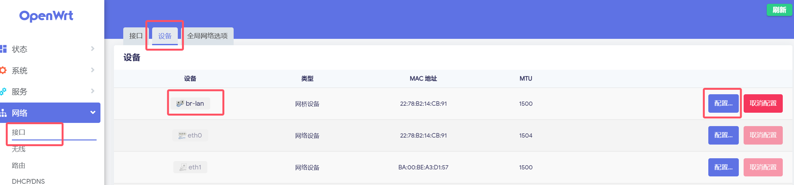
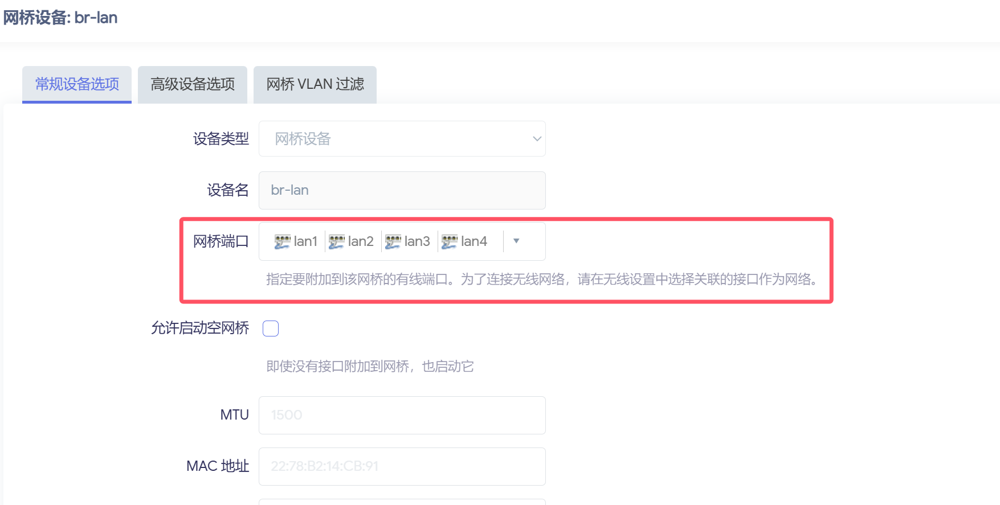
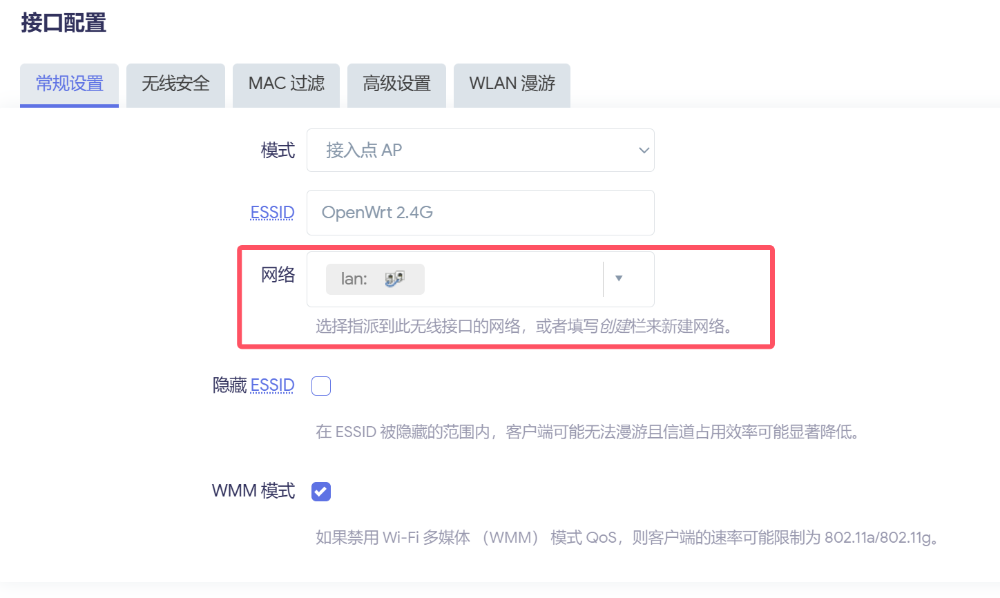
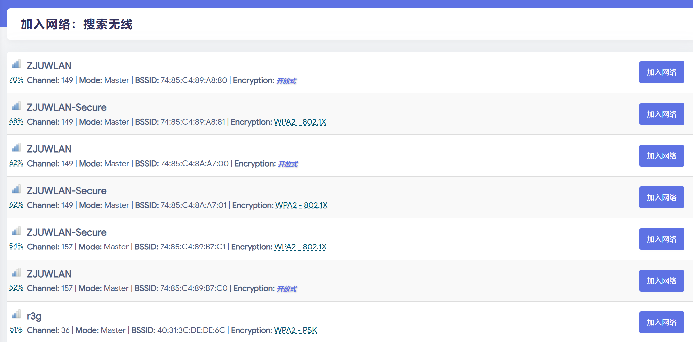
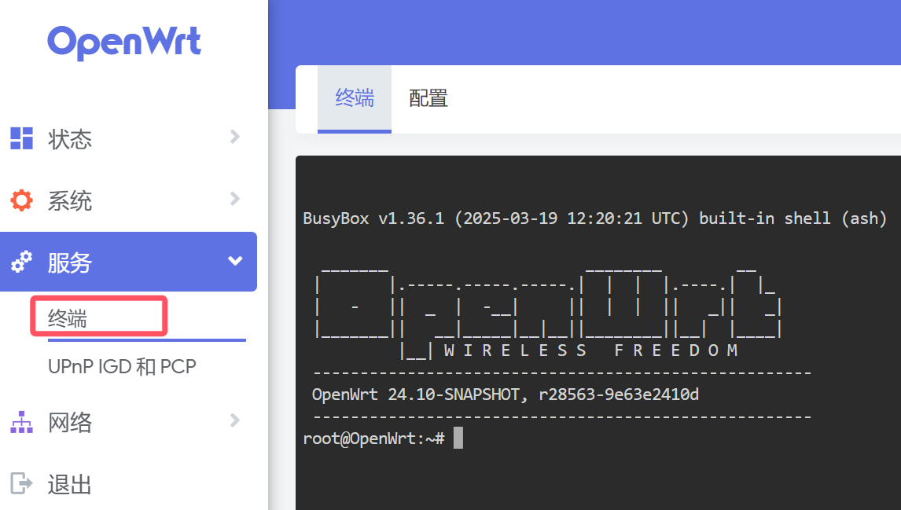


<br/>

# 写在前面

有些固件会自带 Turbo ACC 网络加速软件包，请保持默认配置，不要勾选`MTK 无线硬件加速`、`BBR 拥塞控制算法`以及`DNS 缓存`选项，否则会导致路由器无法行使正常功能。

**重要提示：** 安装的固件当中预装的软件包一般与内核版本与固件绑定，相互的依赖关系十分复杂，更新软件包前请慎重。**请勿更新 OpenWrt 内核。** 如果你的 OpenWrt 系统因软件包更新与内核等依赖出现了问题，建议将系统恢复出厂设置，这样是最快并且最简洁的解决方式。

如果还能通过 SSH 等方式打开路由器终端，请输入以下命令：

```bash
firstboot
reboot
```

重启后路由器即恢复原样，按照说明重新配置一遍即可。

# 基础配置

为了安全起见，建议在`系统 - 管理权`处重新设置管理员密码。


由于`192.168.1.1`地址可能会与运营商设备产生冲突，建议在`网络 - 接口 - LAN`处设置协议为静态协议，IPv4 地址为其他地址。


同时在`系统 - Web 管理`处将 HTTP 监听地址更改为新的 LAN 口地址。


OpenWrt 采用的包管理器为 opkg。在执行后续操作时，请先根据 WAN 接口配置以及部分，确保路由器能够访问公网。在`服务 - 终端`处登录`root`，输入：

```bash
opkg update
```

来进行包的更新。如果无法更新，请尝试更换镜像源。

更换镜像源的方法：在`服务 - 终端`处登录`root`，输入：

```bash
cd /etc/opkg
vi disfeeds.conf
```

根据软件版本替换镜像源。笔者的配置：

```text
src/gz openwrt_core https://mirrors.tuna.tsinghua.edu.cn/openwrt/releases/24.10.0/targets/mediatek/filogic/packages
src/gz openwrt_base https://mirrors.tuna.tsinghua.edu.cn/openwrt/releases/24.10.0/packages/aarch64_cortex-a53/base
src/gz openwrt_luci https://mirrors.tuna.tsinghua.edu.cn/openwrt/releases/24.10.0/packages/aarch64_cortex-a53/luci
src/gz openwrt_packages https://mirrors.tuna.tsinghua.edu.cn/openwrt/releases/24.10.0/packages/aarch64_cortex-a53/packages
src/gz openwrt_routing https://mirrors.tuna.tsinghua.edu.cn/openwrt/releases/24.10.0/packages/aarch64_cortex-a53/routing
src/gz openwrt_telephony https://mirrors.tuna.tsinghua.edu.cn/openwrt/releases/24.10.0/packages/aarch64_cortex-a53/telephony
```

如果遇到无法拉取 HTTPS 源的情况，请先使用 HTTP 源更新包列表，并安装：

```bash 
opkg install ca-bundle ca-certificates
```

同时确保内核模块中有对 SSL 的支持（如 mbedtls 或 openssl）。

替换完成后，再次输入

```bash
opkg update
```

以更新 opkg 源。

# LAN 接口配置

在`网络 - 接口 - 设备 - br-lan - 配置`处确认网桥端口是否包括了所有有线端口。





在无线 Master 模式配置中确认网络是否被指派到 lan 接口。



# WAN 接口配置

在`网络 - 接口 - WAN - 基本设置`处

如果没有给路由器预先分配好的静态 IP，一般采用 DHCP 客户端协议。本文不涉及 PPPoE 拨号上网。


# 无线配置

常用的无线模式有以下两种：

1. 接入点 AP（Access Point）：最常见的模式，能将有线信号转变为无线 WiFi 信号，能够设置 WiFi 的 SSID，认证方式等
2. 客户端（Client）：将路由器当成无线网卡使用，能接收无线信号，通过有线方式传递出去，可以在路由器配置阶段临时使用，较为方便

在`网络 - 无线 - 对应无线网络`处配置。在`无线安全`处设置认证方式。


# 临时给路由器共享网络

## 有线方式

使用网线连接电脑与路由器。将电脑的有线网卡与路由器 WAN 口均配置为静态地址。

有线共享网络方法：

1. 在路由器的`网络 – 接口 - WAN`页面中修改为静态 IP，IP 地址是 192.168.3.2，子网掩码 255.255.255.0，网关 192.168.3.1，其它留空即可，保存应用。
2. 电脑的有线口连接路由器的 Wan 口，电脑的无线连接其它可以上网的 Wi-Fi（不能是一会要使用的手机的热点，否则还需要一个设备）。
3. 进入`控制面板 - 网络和共享中心 - 更改适配器设置`，在弹出的窗口中右击`WLAN – 属性`，在上面点击`共享`，首先在下面的下拉框中选择你的有线网卡（一般是`以太网`），再勾选`允许其他网络用户通过此计算机的 Internet 连接`来连接。如果弹出任何对话框请确定。

   
4. 在网络连接的窗口右击`以太网–属性`，往下找到 Internet 协议版本 4，双击，点击“使用下面的 IP 地址”，修改地址为192.168.3.1，子网掩码 255.255.255.0，确定即可。

   

## 无线方式

在`网络 - 无线 - 无线概况`中点击对应频段的扫描按钮，并连接对应无线网络即可。对于路由器连接校内 WiFi，请参照对应部分。




# 静态地址分配

对于长期处于路由器下局域网的设备，如果我们希望该设备在局域网中的 IP 地址不发生改变，而对于其他临时加入局域网的设备采取 DHCP 方式分配 IP 地址，我们可以在路由器端设置静态地址分配，即对于同一个物理设备（MAC 地址相同），我们创建一个无限期（infinite）的 DHCP 租约，即可实现需求。

在`网络 - DHCP/DNS - 静态地址分配`处添加静态租约，填写主机名，MAC 地址，IPv4 地址，租期。


如果设备已经被 DHCP 分配地址，可以重新连接路由器以获得永久（或自定义时长）租约。

# 软件包

这里是一些比较推荐安装的软件包。可以选择在编译时加入或是通过 opkg 安装。

## TTYD 终端

TTYD 是一个简单的命令行工具，用于在网络上共享终端。



安装`luci-app-ttyd`（汉化包为`luci-i18n-ttyd-zh-cn`）。

### 设置自动登录

编辑`/etc/config/ttyd`文件：

```bash 
vim /etc/config/ttyd
```

修改为如下内容：

```text 
config ttyd
        option interface '@lan'
        option command '/bin/login -f root' # 修改这一行
```

保存后重启 TTYD 生效：

```bash 
/etc/init.d/ttyd reload
```

## UPnP

通用即插即用（Universal Plug and Play），UPnP 规范是基于 TCP/IP 协议和针对设备彼此间通讯而制定的新的 Internet 协议。一个 UPnP 设备能够自动连接上网络，并自动获取一个 IP 地址，传送出自己的权限并获得其他已经连接上的设备及权限，控制网络设备及在他们之间传输信息。还可以自动顺利切断网络连接，不会干扰到其他设备的连接。（支持零设置、网络连接过程中可见、自动查找各种不同类型的设备、没有设备驱动程序，取而代之的是普通的协议）

UPnP 为 NAT（网络地址转换）穿透带来了一个解决方案：互联网网关设备协议（IGD）。NAT 穿透允许 UPnP 数据包在没有用户交互的情况下，无障碍的通过路由器或者防火墙（假如那个路由器或者防火墙支持 NAT）。后来还发展出了 NAT-PMP（NAT Port Mapping Protocol，NAT 端口映射协议）以及 PCP（Port Control Protocol，端口控制协议）。现在我们统称为 UPnP IGD & PCP/NAT-PMP。


安装`luci-app-upnp`（汉化包为`luci-i18n-upnp-zh-cn`）。如果出现内核依赖不满足，请在编译时加入缺失的内核模块。

### 无法添加端口转发规则问题

`miniupnpd` 的 2.2 版本及以后，会检测外部接口上的 IP 地址。如果不存在公网 IP，则会拒绝添加端口转发规则。以下方案来源于[这篇文章](https://www.bilibili.com/opus/1031119698162352136 "这篇文章")。

我们可以添加真实的外部 IP，使用 Hotplug 脚本，在每次网络接口更新时，自动检测外部 IP 并添加至 `/etc/config/upnpd`：

```bash 
vim /etc/hotplug.d/iface/05-miniupnpd-external-ip
```

粘贴入以下内容：

```bash 
[ "$ACTION" = "ifup" ] && [ "$INTERFACE" = "wan" ] && \
uci set upnpd.config.external_ip=$(curl -Ls 4.ipw.cn) && \
uci commit upnpd
```

MiniUPnPd 本身会创建一个文件名为 **50-miniupnpd** 的 Hotplug 脚本，其最后会重启 MiniUPnPd，因此把指定外部 IP 的脚本放在其之前执行，可以减少一次 MiniUPnPd 的重启。

Hotplug 脚本的执行顺序基于文件名，因此使用**05-miniupnpd-external-ip**。示例脚本仅在**wan**接口更新时才执行检测和添加，请改成你实际的外部接口名称。也可以把`[ "$INTERFACE" = "wan" ] &&`部分删除，则会在任意接口更新时都执行脚本。

示例脚本使用`curl -Ls 4.ipw.cn`检测外部 IP，请确保你的 OpenWrt 有安装`curl`。如有必要，`4.ipw.cn`可以更换成其他可获得外部 IP 的 URL。

以上命令仅添加 Hotplug 脚本，需在 **wan** 接口更新时才触发。如要马上启用 MiniUPnPd 的端口转发规则，请执行：

```bash 
/etc/init.d/miniupnpd restart
```

以上 Hotplug 脚本在刷写固件后会被删除。如要保留，请打开`系统 - 备份与升级 - 配置`，把`/etc/hotplug.d/iface/05-miniupnpd-external-ip`添加至列表中。


<br/>

