
<br/>

# Tricks

这里是一些笔者在配置网络中遇到并解决的问题，由于暂时无法归类到其他页面所以存放在此处。

## Q：发现路由器带不动 NAS + 台式机组合，总是断流怎么办？

以下是笔者使用 AX3000T 的自述：

这大半年来配置并使用 AX3000T，我的感受是：能用，但是一点也不好用。它的配置如下：

- Filogic 820（MT7981B）
- WiFi 6
- 256 MB RAM + 128 MB Flash

虽然它支持解锁 SSH、刷入 OpenWrt（我的固件为 qwrt 改），但我为了它做了一次次妥协。

起初，我希望它能够实现以下功能：

- Tailscale 远程组网
  - 安装时发现空间不足，使用脚本装入了`/tmp`
    - 导致路由器频繁 OOM 重启
  - 最终将 Tailscale 安装在了 NAS 上
- 科学上网
  - 使用自带的 OpenClash 插件时会崩溃
  - 改用 Shellcrash
- 无线组网（5G + 2.4G）
  - 5G 频段同时开启 Client 和 Master 模式导致性能下降
  - 关闭 5G 频段的 Master 模式

即便如此，在台式机和 NAS 连接到路由器后，还是会出现时常断流（表现为网速极慢，< 1MB/s）的情况。于是我想出了如下办法：

### Windows 双网卡分流

一般电脑都具有有线网卡与无线网卡。为了节省路由器的开销，同时最大限度地利用校园网，我们可以通过有线网卡连接路由器，无线网卡连接校园网。整体上是一种类似于多拨的做法。

为了实现双网卡分流，我们需要解决几个问题：

#### 保持双网卡常开

由于 Windows 策略，在连接以太网后，系统倾向于断开无线网的连接。我们需要保证无线网卡不断连。

首先，确保 WLAN 打开了“自动连接”选项。

使用`Win + R`打开“运行”，输入`gpedit.msc`以启动“编辑组策略”应用（本地组策略编辑器）。

打开`计算机配置 > 管理模板 > 网络 > Windows 连接管理器 > 最小化到 Internet 或 Windows 域的同时连接数`：

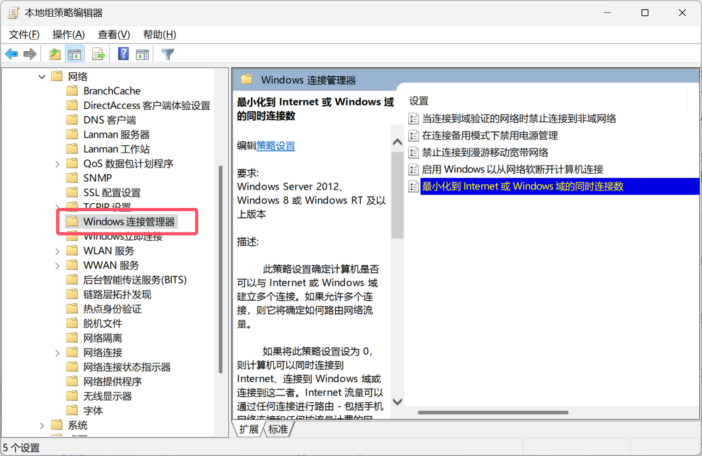

勾选“已启用”，最小化策略选择`0 = 允许同时连接`即可。

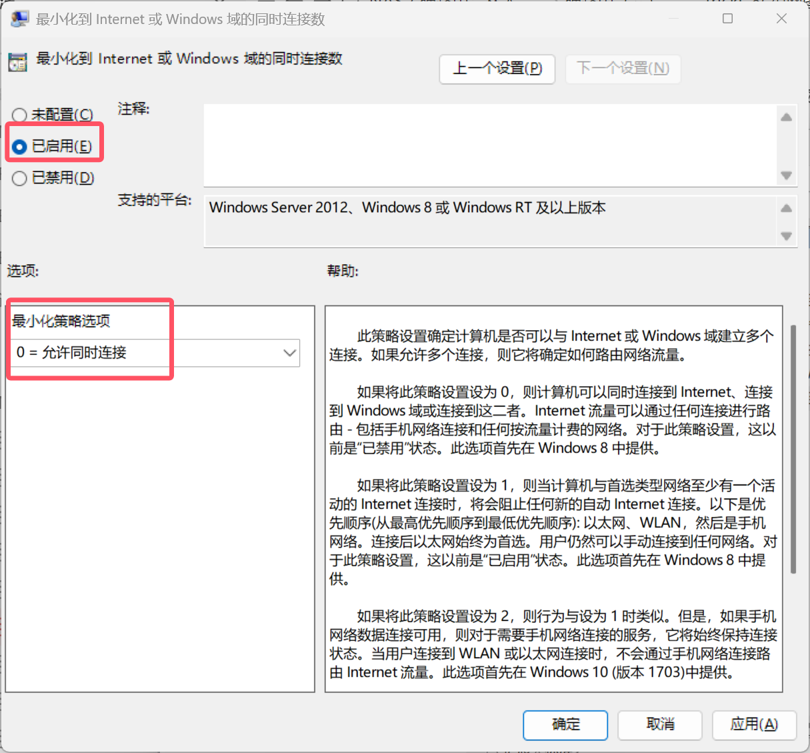

#### 配置网卡跃点数

跃点数（Metric）代表跳出路由的成本，通常情况下代表到达目标地址所需要经过的跳跃数量，一个跃点数代表经过一个路由器。跃点数越低，代表路由成本越低，优先级越高。因此，我们可以通过修改网卡的跃点数来更改不同网卡间的优先级。

进入`控制面板 - 网络和共享中心 - 更改适配器设置`，在弹出的窗口中右击`WLAN – 属性`，打开`Internet 协议版本 4 (TCP/IPv4) - 高级`：

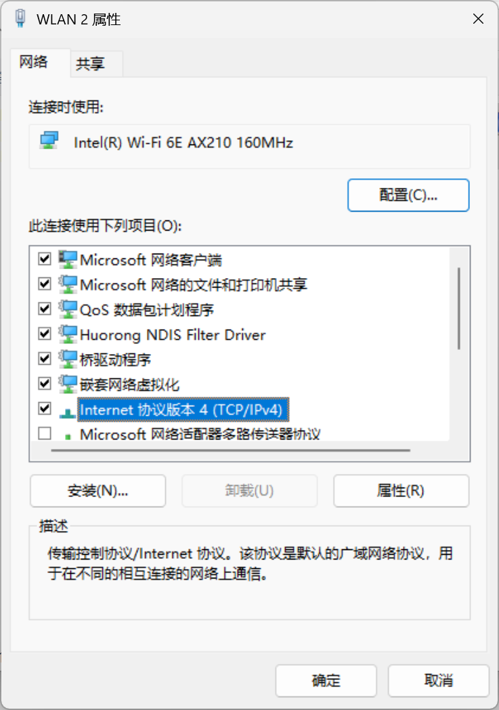

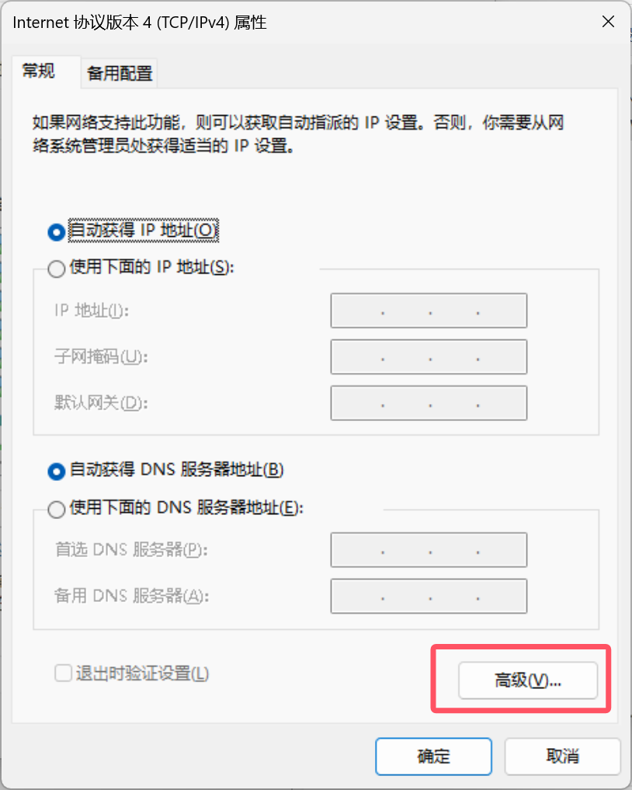

取消勾选“自动跃点”，填入一个较小的数值（建议为 10）。

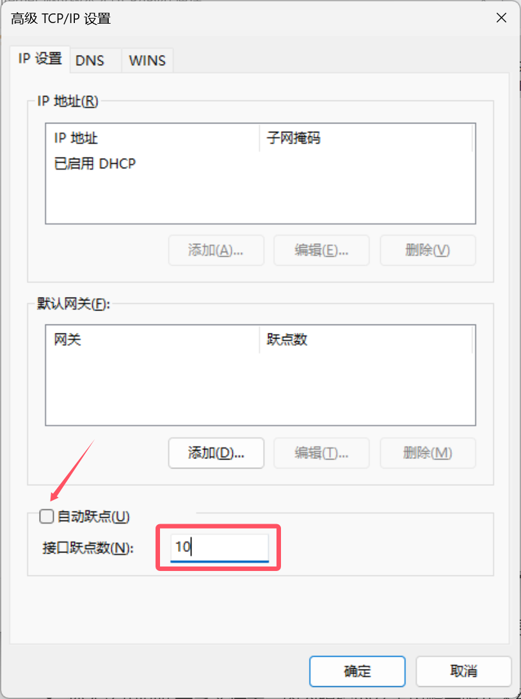

对于有线网卡的设置类似，将跃点数设置为比无线网卡跃点数稍大的一个值（建议为 20）。

打开`终端（管理员）`，输入`route print`查看路由表：

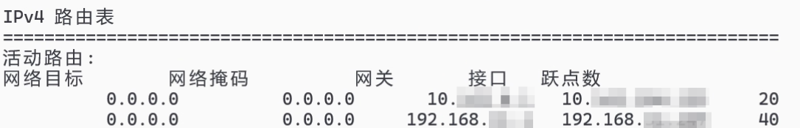

我们可以看到无线网卡的跃点数已经低于有线网卡的跃点数。

#### 写入局域网永久路由

为了只通过有线网卡访问局域网，我们可以写入局域网永久路由。打开`终端（管理员）`，输入：

```powershell 
route add -p <你的内网网段> mask 255.255.255.0 <有线网默认网关（即路由器地址）>
```


其中`-p`参数的含义是永久写入，在系统重启后不会消失。如果想删除这条路由，输入：

```powershell 
route delete <你的内网网段>
```


输入`route print`查看路由表：


我们可以看到永久路由已经被添加到路由表中。

#### IPv6 部分

我们刚刚配置的均为 IPv4 网络部分。对于 IPv6 网络，我们没有访问局域网的需求，因此直接禁用有线网卡的 IPv6 功能即可。

进入`控制面板 - 网络和共享中心 - 更改适配器设置`，在弹出的窗口中右击`以太网 – 属性`，取消勾选`Internet 协议版本 6 (TCP/IPv6)`。至此配置结束。

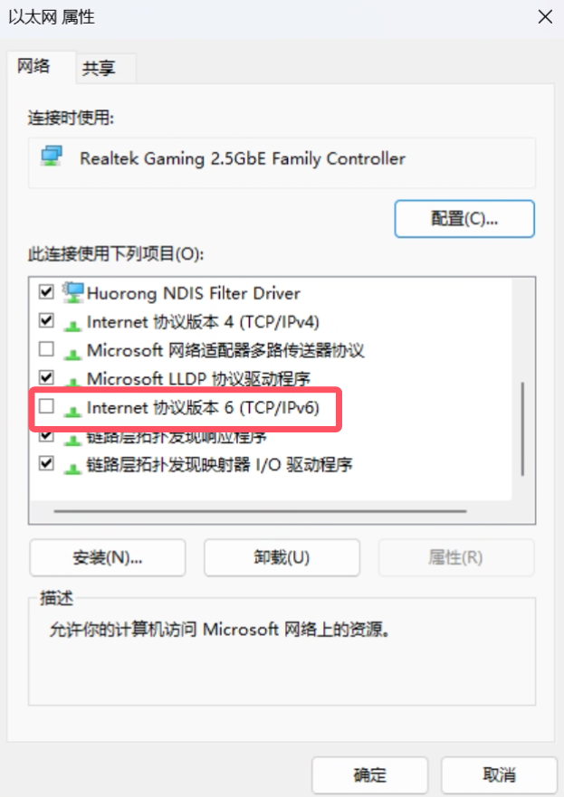

### Mac 双网卡分流

#### 调整网卡优先级

由于我们的需求是使用无线网卡访问外网，使用以太网卡访问内网，因此需要将无线网卡作为默认的网络接口。

在 `网络 - 设定服务顺序` 中改变顺序，确保 Wi-Fi 接口的排序在以太网之上。

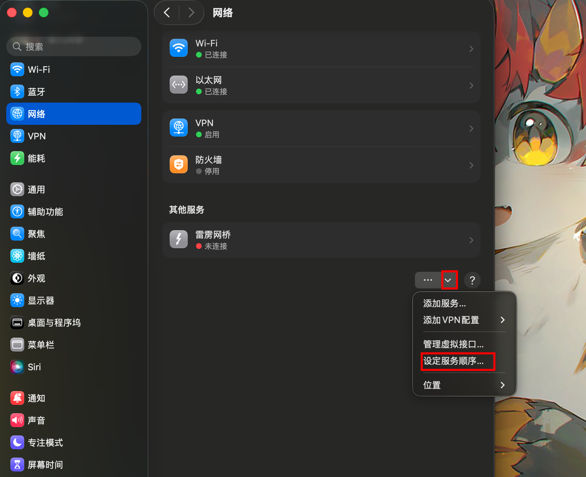

#### 添加路由表

如果使用 `route add` 命令，在重启之后设置会重置。因此我们需要采取其他的永久配置方法。

先查询可用的路由出口：

```bash
networksetup -listallnetworkservices
```

可能会出现以下结果：

```
An asterisk (*) denotes that a network service is disabled.
Wi-Fi
Ethernet
Thunderbolt Bridge
Tailscale
```

接着查询指定路由出口的路由表配置，我们要修改以太网接口，就查询它的路由表：

```bash
networksetup -getadditionalroutes Ethernet
```

默认情况下我们没有添加路由表，此处应不会有显示。最后添加新的路由表：

```bash
networksetup -setadditionalroutes Ethernet <目标 IP> <子网掩码> <网关 IP>
```

例如我们要实现通往 `192.168.1.0/24` 的网络全部走 `192.168.1.1`，可以这样配置：

```bash
networksetup -setadditionalroutes Ethernet 192.168.1.0 255.255.255.0 192.168.1.1
```

### 后续

即便如此，在仅 NAS 连接到路由器后，还是会出现时常断流（表现为网速极慢，< 1MB/s）的情况。于是我没有办法了。我把不必要的启动项全部关闭，依然如此。我开始怀疑是不是固件问题，但当我正准备重刷 ImmortalWrt 时，我想明白了：

我是一个喜欢折腾的人，因为折腾的过程能给我带来许多新知识。但是在一次次对路由器的妥协当中，我只学到了一点：不要因为省钱而委屈自己去做一些没有意义的事情。

看到这里的朋友，希望你能挑选一个适合你的路由器，而不是一个便宜的路由器。或者，要不试试软路由？

## Q：24H2 更新后，访问 SMB 提示错误代码 0x800704f8 怎么办？

在 Windows 11 24H2 版本中，微软将对网络访问规则进行更改。在默认情况下，所有的连接都需要 SMB 签名，导致我们访问共享文件的时候可能会收到以下报错信息，包括但不限于：

- 你无法访问此共享文件夹，因为组织的安全策略会阻止未经身份验证的来宾访问，这些策略有助于保护您的电脑免受网络上不安全或恶意设备的威胁
- 0x80070035
- 0x800704f8
- 找不到网络路径（The network path was not found）
- 发生系统错误3227320323（System error 3227320323 has occurred）

我们可通过以下两个临时性的办法解决：

### 禁用 SMB 客户端签名要求

使用`Win + R`打开“运行”，输入`gpedit.msc`以启动“编辑组策略”应用（本地组策略编辑器）。

选择`计算机配置 > Windows 设置 > 安全设置 > 本地策略 > 安全选项`，在右侧窗口中找到`Microsoft网络客户端：对通信进行数字签名(始终) `选项。

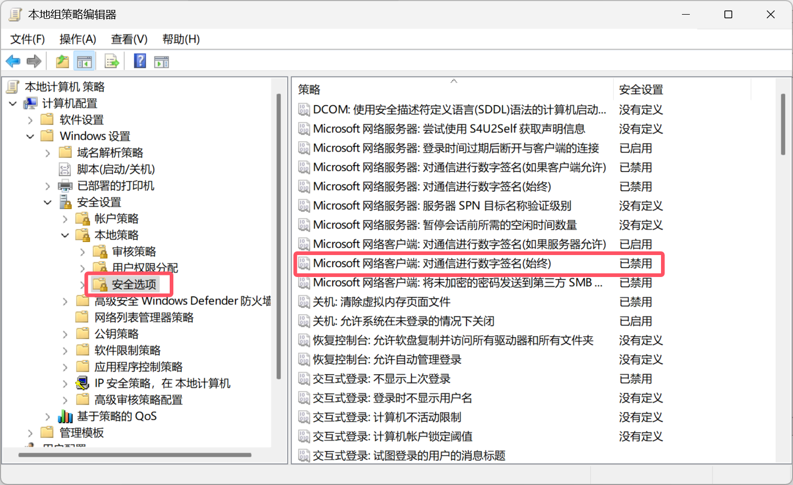

在弹出的窗口中，选择`已禁用 > 确定`。

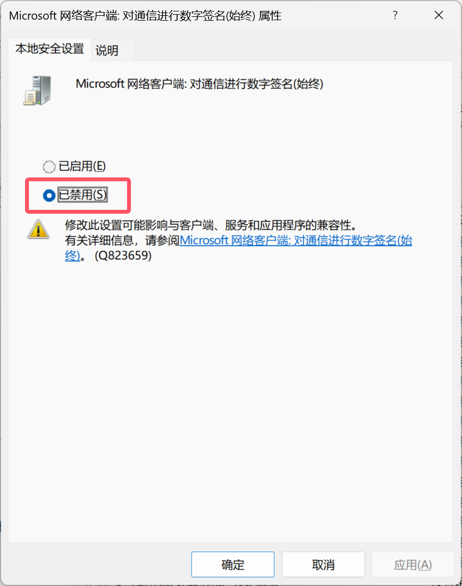

### 启用不安全的来宾登录

在本地组策略编辑器中，选择`计算机配置 > 管理模板 > 网络 > Lanman 工作站`，双击`启用不安全的来宾登录`。

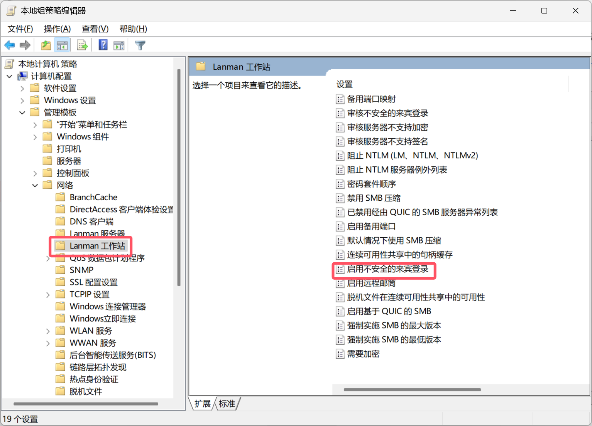

在弹出的窗口中，选择`已启用 > 确定`。

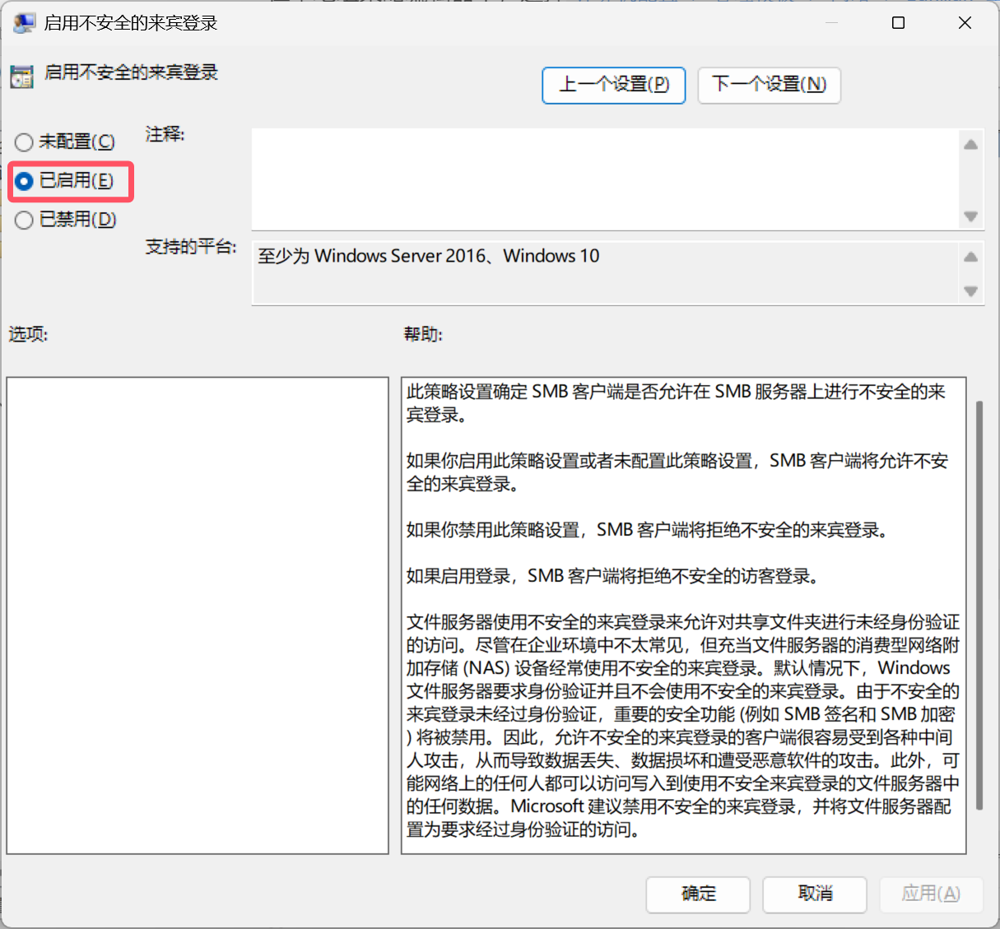

## Q：24H2 更新后，RDP 无法连接 / 登录过程中卡死怎么办？

首先可以按照当中提到的方法更换 RDP 端口。

如果仍然无法连接（特别是在能够连接，但用户登录过程中无响应这种情况），可尝试对组策略编辑器进行以下更改：

1. 在被控电脑上使用“运行”打开`gpedit.msc`，转到`本地计算机策略 > 计算机配置 > 管理模板 > Windows 组件 > 远程桌面服务 > 远程桌面会话主机 > 连接 > 在服务器上选择网络检测`。
2. 将此策略设置为已启用，然后选择关闭“连接时间检测”和“连续网络检测”。

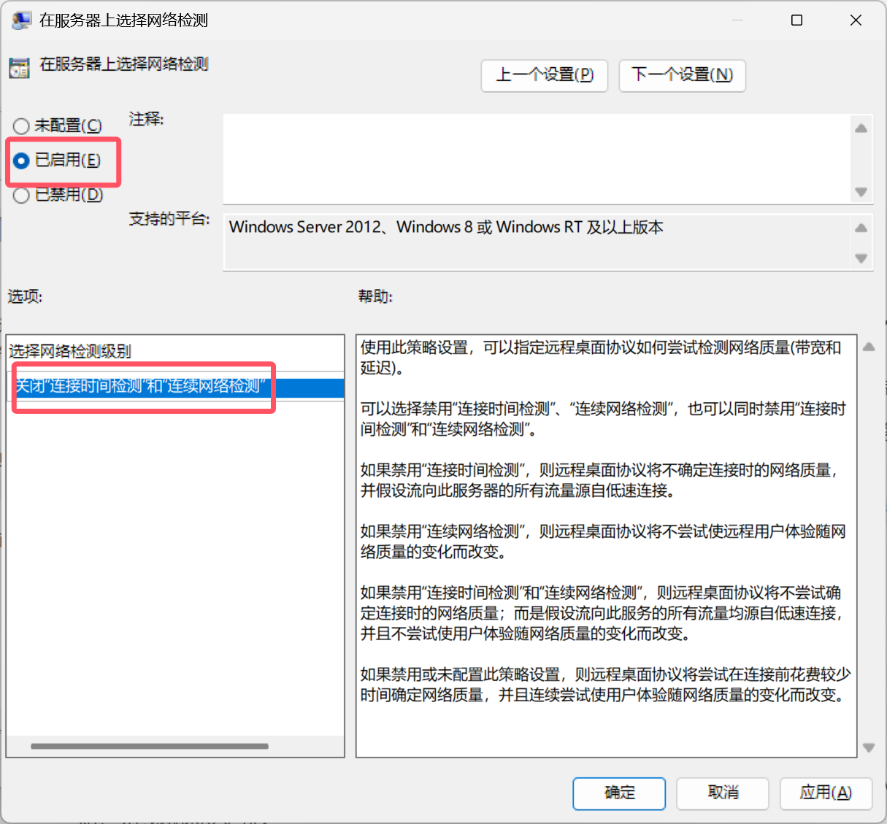

很多用户报告在经过以上设置后能够解决问题。但此方法对于笔者的设备不适用。因此更好的方法是暂缓更新 24H2。

# 组网图景

## 网络环境

- 有线网弃用 L2TP，改用 Web 认证
- 无线网（ZJUWLAN-Secure）采用 PEAP 认证方式
- 玉泉宿舍有线网限百兆，IPv6 限速情况未知，无线网速度更快

## 设备配置

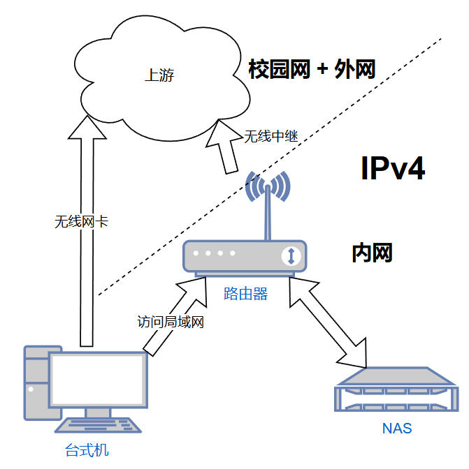

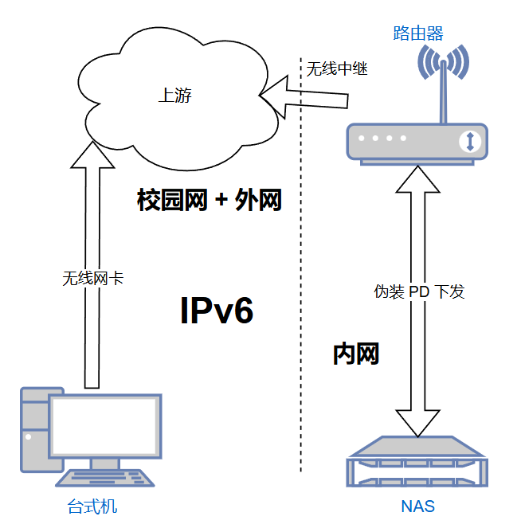

### 路由器

- 5GHz 无线 Client 中继 ZJUWLAN-Secure
- WWAN + WWAN6
- IPv6 使用中继模式下发，伪装 PD 前缀（校园网特殊操作）

### NAS

- 网络由路由器管理
- 配置域名指向其长期的 v6 地址
- 其上安装 Tailscale 实现异地访问
  - 安装在 NAS 上减轻路由器负担

### 台式机

- 设置无线网与以太网均常开

  通过配置路由表来实现：
  - 无线网卡访问外网
  - 有线网卡访问内网
  - （另一种意义上的多拨，减轻路由器负担）
  - 关闭以太网的 IPv6 部分，防止路由器给自己分配 IPv6 地址

### 其他设备

- 连接到 2.4GHz WiFi

### 效果

- 在局域网内能够实现设备间稳定的传输速度以及对外网较快速度的访问
- 在校园网内能够通过 IPv6 连接到 NAS，避免 Tailscale 中继不稳定
- 在校外能够通过 Tailscale 连接到局域网实现简单的访问与配置

<br/>

