
 

# 家庭无线组网

当遇到大户型、结构较为复杂的建筑时，单一路由器可能无法实现全屋 Wi-Fi 的覆盖，此时就需要规划家庭无线组网方案。

为了可持续性以及更易维护的目的，家庭组网应尽量遵循以下原则：
- **网络拓扑扁平化**：不在网络下新设子网（即不添加行使路由功能的子路由器），减小 NAT 开销
- **基础设施一步到位**：合理规划预埋管线（装修完成后不可更改），并保证预埋管通畅
- **任务分配合理**：把开销更大的任务（路由、防火墙等）交给更高性能的机器

家庭无线组网要达到的目的：
- **全屋 Wi-Fi 覆盖**
- **无线终端设备的无缝漫游**：基于 802.11 k/v/r 协议
- **整合各 AP 与路由器（狭义上的组网）**：FTTR / AC + AP / Mesh 方案以及它们的结合方案等

# Wi-Fi 标准

无线通信是指电磁波经过空间传播传递信息的通讯方式。国内无线网络通信主要使用 2.4GHz 与 5GHz 两个频段。物理学知识告诉我们，电磁波的频率越高，波长就越短。因此波长更长的 2.4GHz 信号更容易绕过障碍物继续传播。

> Wi-Fi 以 IEEE 802.11 为标准，Wi-Fi 联盟在 2018 年发起“Generational Wi-Fi”营销项目，基于主要的 Wi-Fi 技术（PHY）版本，引入了更容易让消费者了解的“Wi-Fi 世代名称”（Wi-Fi generation names），格式为“Wi-Fi”后跟一个整数，并鼓励采用世代名称作为行业术语。

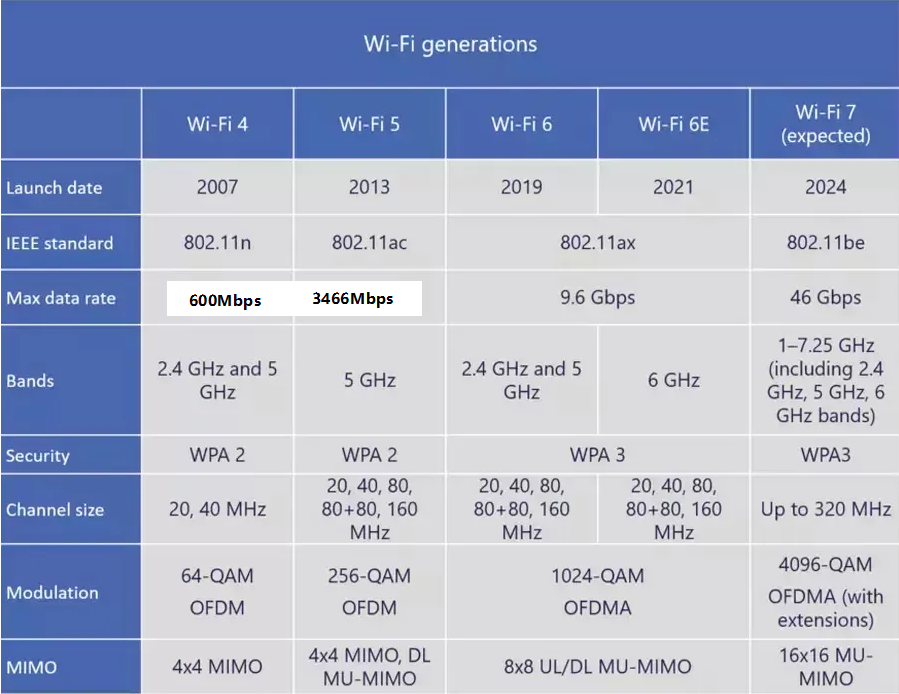

在选购无线路由器时，我们常常会看到 AC2100、AX3000、BE6500 等型号，它们具体是什么意思呢？事实上，前面的字母就对应着 802.11 的对应标准，而后面的数字就代表路由器的最大无线传输速率（但这里是指 2.4GHz 与 5GHz 两个频段的传输速率之和），单位为 Mbps。因此，AX3000 就代表支持 Wi-Fi 6（802.11ax）标准，两个频段传输速率和为 3000Mbps 的无线路由器。

一个 Wi-Fi 网络，通常包含至少 1 个无线接入点（Access Point，AP）、1 个或多个无线终端，无线接入点允许无线终端连接到 Wi-Fi 网络，无线路由器（集成了无线接入点功能）和无线接入点等 Wi-Fi 设备都具备这些功能。AP 为无线终端提供了基于 802.11 标准的无线接入服务，起到有线网络和无线网络的桥接作用。

## SSID、BSS、BSSID、ESS 与 ESSID

服务集（Service Set）是无线局域网中的一个术语，用以描述 802.11 无线网络的构成单位（一组互相有联系的无线设备），使用服务集标识符（Service Set Identifier，SSID）作为识别。

基本服务集（Basic Service Set，BSS）是无线网络的基本服务单元，通常由一个 AP 和若干无线终端组成，使用基本服务集标识符（Basic Service Set Identifier，BSSID）作为识别。BSSID 可标识一个 ESS 中不同的 BSS。

在扩展服务集（Extended Service Set，ESS）中，无线设备关联到一个或多个访问点上。ESS 实质上是多个 BSS 通过各种手段互相连接得来，ESS 使用用户指定的扩展服务集标识符（Extended Service Set Identifier，ESSID）作识别。

也就是说，多个共用同一个 SSID 的 BSS 形成了一个 ESS，在这个 ESS 下每个 BSS（也就是不同的 AP）都具有自己的 BSSID，它们共用的相同 SSID 就是这个 ESS 的 ESSID。

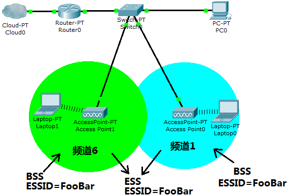

## Wi-Fi 信道

Wi-Fi 信道是指无线局域网络（WLAN）中用于无线数据传输的特定频段。一个信道中最大频率与最小频率的差，就叫做信道带宽，这个值体现了信道覆盖的频率范围的大小。

单个 AP 的覆盖范围有限，通常需要部署多个 AP 才能完成完整的网络覆盖。多个 AP 的组网中，相邻 AP 间通常会存在同频干扰问题，需要通过规划无线信号工作的频段和信道来减少同频干扰问题。另外，通过信道捆绑可以提高无线终端的网络速率。

### 2.4G 信道

2.4G 频段被分为 14 个交叠的、错列的 20MHz 信道，信道编码从 1 到 14，邻近的信道之间存在一定的重叠范围。

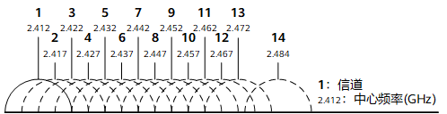

### 5G 信道

5G 频段资源更丰富，比 2.4G 频段拥有更多的 20MHz 信道。且相邻信道之间是不重叠的。

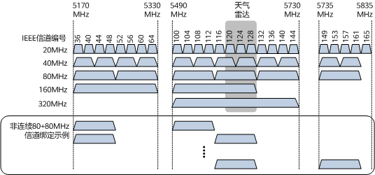

某些地区的雷达系统工作在 5G 频段，与工作在 5G 频段的 AP 射频信号会存在干扰。雷达信号可能会对 52、56、60、64、100、104、108、112、116、120、124、128、132、136、140、144 信道产生干扰（其中120、124、128是天气雷达信道）。如果射频工作的信道是手动指定的，在规划信道时注意避开雷达信道，如果射频工作的信道是系统动态调整的，系统检测到工作的信道有干扰时，会自动切换工作信道。

### 信道捆绑

为了提高无线网络速率，可以增加射频的信道工作带宽。如果把两个 20MHz 信道捆绑在一起成为 40MHz 信道，同时向一个无线终端发送数据，理论上数据的通道加宽了一倍，速率也会增加一倍。如果捆绑两个 40MHz 信道，速率会再次加倍，以此类推。

- **40MHz+** 和 **40MHz-**：两个相邻的互不干扰的信道捆绑成一个 40MHz 的信道，其中一个是主信道，一个是从信道。如果主信道的中心频率高于从信道的中心频率，则为 40MHz-，反之则为40MHz+。
- **80MHz**：两个连续的 40MHz 信道捆绑在一起成为 80MHz，80MHz 内的四个 20MHz 可以选择任一个作为主信道。
- **80 + 80MHz**：两个不连续的 80MHz 捆绑在一起成为 80+80MHz。
- **160MHz**：两个连续的 80MHz 捆绑在一起成为 160MHz。160MHz 内的八个 20MHz 可以选择任一个作为主信道。

### 国家码

不同的国家和地区规定了在本国或本地区可以使用的信道、射频信号在信道中的最大发射功率。中国的国家代码是 CN。

| 国家码 | CN |
| :-----:| :----: |
| **2.4G 20M 信道** | 1-13  |
| **2.4G 40M+ 信道** | 1-7 |
| **2.4G 40M- 信道** | 5-11 |
| **5G 20M 信道** | 36, 40, 44, 48, 52, 56, 60, 64, 149, 153, 157, 161, 165 |
| **5G 40M+ 信道** | 36, 44, 52, 60, 149, 157 |
| **5G 40M- 信道** | 40, 48, 56, 64, 153, 161 |
| **5G 80M 信道** | 36, 52, 149 |
| **5G 160M 信道** | 36 |
| **雷达信道** | 52, 56, 60, 64 |

（任意支持的两个不连续的 80M 信道都可组合为 80 + 80M，因而不列出；80M 与 160M 仅列出第一个 20M 为主信道情况）

### OpenWrt 中配置

在 OpenWrt 系统中，我们可以前往 `状态 - 信道分析` 来查看当前路由器环境中各无线网络所占用的信道、频宽以及强度等信息。

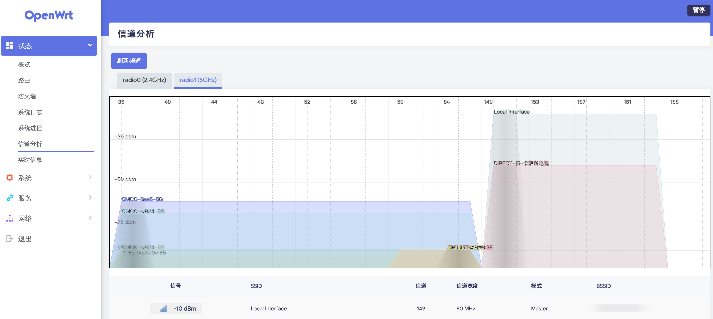

在 `网络 - 无线` 中可以对各 AP 的信道、频宽以及传输功率进行调整。注意应结合硬件实际支持以及国家代码规定信道配置，否则可能会出现无法连接等问题。

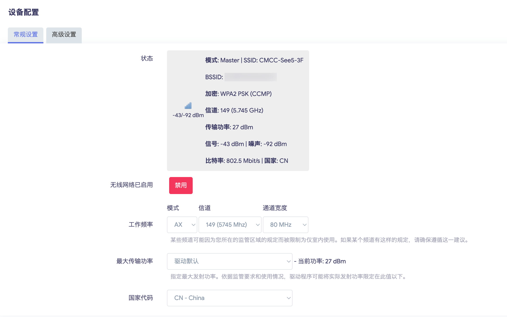

## Wi-Fi 空间流

空间流（Spatial Stream）指的是通过使用多个天线（例如，MIMO 技术中的多个天线）同时传输多个独立的数据流。每个空间流可以看作是一个独立的数据通道，通过增加空间流的数量，可以增加无线信道的容量，提高数据传输速度。

### MIMO

MIMO（Multiple-Input Multiple-Output）是指在无线通信领域使用多天线发送和接收信号的技术。MIMO 技术主要应用在 Wi-Fi 领域和移动通信领域，可以有效提高系统容量、覆盖范围和信噪比。通常讲的 M×N MIMO 是指发送端有 M 个天线，接收端有 N 个天线。

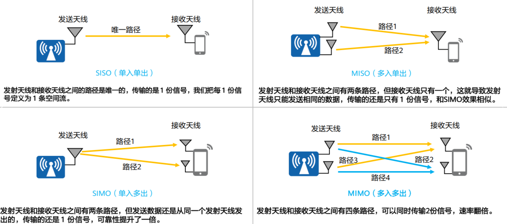

MIMO 带来的好处是增加单一设备的数据传输速度，同时不占用额外的频谱资源。可以说，无线传输的理论速率从 802.11g 时代的 54Mbps，到 802.11n 时代的 300Mbps，甚至是更高的 600Mbps，MIMO 技术功不可没。

### MU-MIMO

在 MIMO 系统中，同一时间 AP 仅能和 1 个终端通信，所以也称为 SU-MIMO（Single-User Multiple-Input Multiple-Output），即单用户 MIMO。当终端的天线数和 AP 的天线数相同时，可以充分使用 AP 的空间资源。但在实际应用中，通常 AP 和终端的收发天线数是不对等的，AP 多是 3 根或者 4 根天线，甚至更多，但是终端（比如手机）通常只有 1-2 根天线，这会造成 AP 一部分空间资源的浪费。

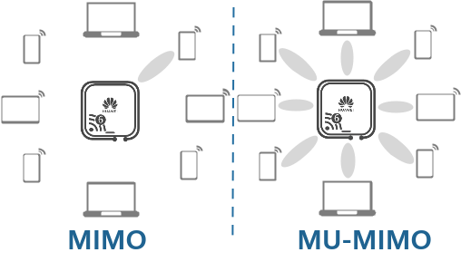

而 MU-MIMO 技术使 AP 同一时间和多个终端进行通信，这样就能充分利用 AP 的总容量。MU-MIMO 在 MIMO 基础上增加了 MU（多用户）数量的指标项，一般用 M×N:U 表示。其中的 M×N 仍是指 MIMO 的天线数，U 则表示 MU 数量，即同时通信的终端数量。

## Wi-Fi 安全、认证与加密

Wi-Fi 网络在为我们带来便利的同时，其安全性也至关重要。一个开放的、未加密的 Wi-Fi 网络，意味着任何人都可能接入，不仅会占用网络带宽，还可能窃听网络通信，带来严重的安全风险。因此，对无线网络进行认证与加密是保障网络安全的第一道防线。

> 如果你学习过计算机网络的相关知识，你就会知道，基于 802.11 标准的 Wi-Fi 主要研究的是物理层与数据链路层（Layer 1 与 Layer 2）。
> 
> 对于无线局域网的加密过程，具体来说，就是要加密介质访问控制（MAC）子层从逻辑链路控制（LLC）子层那里接收到的、并且即将传输的数据包。这样的数据包可能就是一个完整的 IP 包，也通常会包含用户即将发送的数据，我们将其称为 MSDU（MAC Service Data Unit，MAC 服务数据单元）。
> 
> 接下来我们介绍的 WEP、TKIP、CCMP 都是针对 MSDU 进行加密。
> 
> 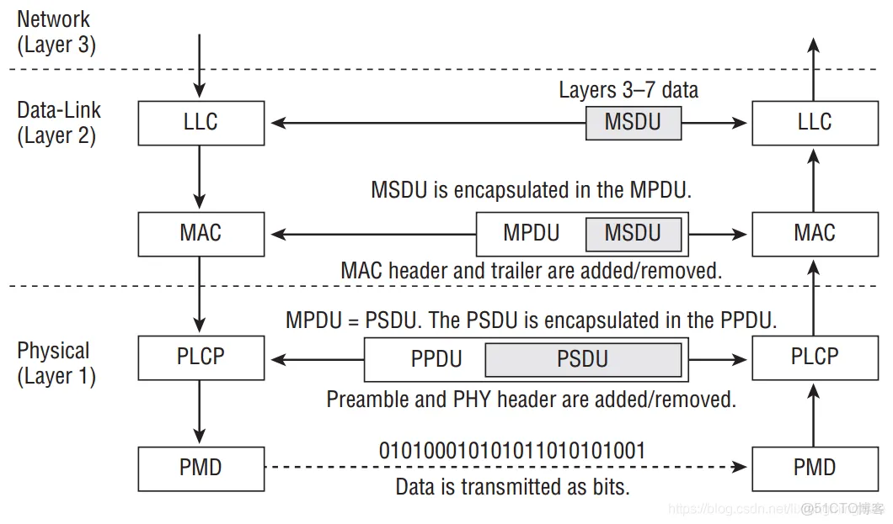

以下内容主要参考[这篇文章](https://www.cnblogs.com/liwen01/p/18564835) 与 802.11i / 802.1X 等标准文件。

### WEP

**WEP**（Wired Equivalent Privacy，有线等效加密）是 802.11 标准的一部分，旨在为 Wi-Fi 提供与有线网络类似的安全性。 它使用 RC4 流密码进行加密，并采用静态的、在 AP 和所有客户端之间共享的密钥。WEP 的认证过程主要有两种模式：开放系统认证和共享密钥认证。

- **开放系统认证**：这是一种非常简单的认证方式，实际上并不进行加密认证。任何客户端都可以请求连接到 AP，无论其是否知道 WEP 密钥。
- **共享密钥认证**：这种方式要求客户端和 AP 配置相同的 WEP 密钥。认证过程如下：
    1. 客户端发送一个认证请求帧，表明它希望通过共享密钥认证加入网络。请求帧中包含客户端的 MAC 地址等信息，但不包含任何加密数据。
    2. AP 向客户端以**明文**形式发送一个随机的挑战文本，要求客户端使用 WEP 密钥对该文本进行 RC4 加密并返回给 AP。
    3. AP 接收到加密后的挑战响应后，使用相同的 WEP 密钥对挑战文本加密，并将结果与客户端的响应进行对比。如果两者匹配，则说明客户端知道正确的 WEP 密钥，认证成功。

WEP 加密的关键在于 **IV**（Initialization Vector，初始化向量）。IV 是一个 24 位的值，用于确保即使重用相同的共享密钥，不同数据包的加密结果也会不同。

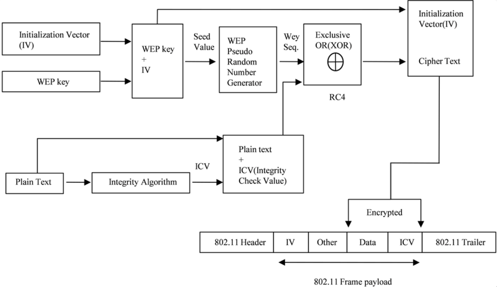

共享密钥认证本身存在严重的设计缺陷。由于挑战文本是明文发送的，而加密后的响应可被拦截，这意味着攻击者可以通过分析多个认证过程，逆向推算出 WEP 密钥。并且由于 IV 只有 24 位长度，导致很有可能发生重复使用（碰撞）的情况。

由于 WEP 的安全性较低（例如使用 `aircrack-ng` 工具即可破解），2004 年，IEEE 发布 802.11i 标准，正式淘汰 WEP 标准。

### WPA-PSK：TKIP

为了取代不安全的 WEP，Wi-Fi 联盟推出了 **WPA**（Wi-Fi Protected Access，Wi-Fi 保护访问）作为过渡方案。WPA 有两大模式：
- **WPA-Enterprise**（面向企业）：使用 802.1X 认证服务器来分发不同的密钥给各个终端用户。
- **WPA-Personal**（面向个人），使用 **PSK**（Pre-shared Key，预共享密钥模式），让连接到同一无线路由器的每个用户都使用同一把密钥。

#### PSK

1. 网络管理员在 AP 上配置 PSK。连接到此网络的设备也需要输入相同的密码。
2. 当终端设备尝试连接到 Wi-Fi 网络时，首先输入 PSK，然后发起连接请求。
3. AP 接收到客户端的请求后，检查客户端提供的 PSK 是否匹配。如果 PSK 匹配，认证通过。
4. 为了防止 PSK 匹配时数据被窃听，双方需要通过一个**四次握手协议**生成独立的加密密钥（即会话密钥），用于加密无线数据传输。

#### 四次握手

1. **消息 1**： **AP（Authenticator）** 生成一个随机数，称为 ANonce（Nonce 即 Number Once，意为在一个加密通信中只使用一次的数字），并将其发送给客户端。
2. **消息 2**：**客户端（Supplicant）** 收到 ANonce 后，生成自己的随机数 SNonce，并计算出 **PTK**（Pairwise Transient Key，成对临时密钥），这个密钥用于加密客户端和 AP 之间的通信。客户端随后将它的 SNonce 发送给 AP。
    $$
    \text{PTK} = \text{PRF} (\text{PMK},\ \text{ANonce},\ \text{SNonce},\ \text{MAC}_{A},\ \text{MAC}_{S})
    $$
    其中，$\text{PRF}(\cdot)$ 是一个伪随机函数，$\text{MAC}_{A},\ \text{MAC}_{S}$ 是客户端与服务端的 MAC 地址。
    **PMK**（Pairwise Master Key，成对主密钥）是 PTK 生成所依赖的更高级的密钥。**在 PSK 认证过程中，PMK 就是当前网络的 PSK**。在 802.1X 认证过程中，PMK 是由 **MSK**（Master Session Key，主会话密钥）生成的。
3. **消息 3**：AP 收到 SNonce 后，生成与客户端相同的 PTK。同时，AP 还生成一个 **GTK**（Group Temporal Key，组临时密钥），用于加密网络中的广播和组播通信。AP 接着将加密后的 GTK 和 **MIC**（Message Integrity Check，消息完整性校验）发送给客户端，以确认握手数据的完整性。
    $$
    \text{GTK} = \text{PRF} (\text{GMK},\ \text{GNonce},\ \text{MAC}_{A})
    $$
    其中，$\text{GNonce}$ 是 AP 生成的用于广播组播通信的随机数，由于面向广播组播通信，因此不需要客户端的 MAC 地址。
    **GMK**（Group Master Key，组主密钥）是 GTK 生成所依赖的更高级的密钥。它是 AP 生成的一个**密码学安全**的随机数。
    > The Group Master Key (GMK) for the Group key hierarchy should be initialized using a
    cryptographically secure random number. If this is not possible it shall be initialized to
    the first PMK the Group key master receives (since there is no need to send broadcast
    traffic unless there is at least one station associated).
    
    MSK、GMK、PMK、GTK、PTK 之间的层级关系如下图所示：
    
    
    
4. **消息 4**：客户端收到加密的 GTK 和 MIC 后，使用之前生成的 PTK 进行解密和验证。如果验证通过，客户端会向 AP 发送一个确认消息，表示握手成功。此时，客户端和 AP 都拥有相同的 PTK 和 GTK，从而可以开始加密的通信。

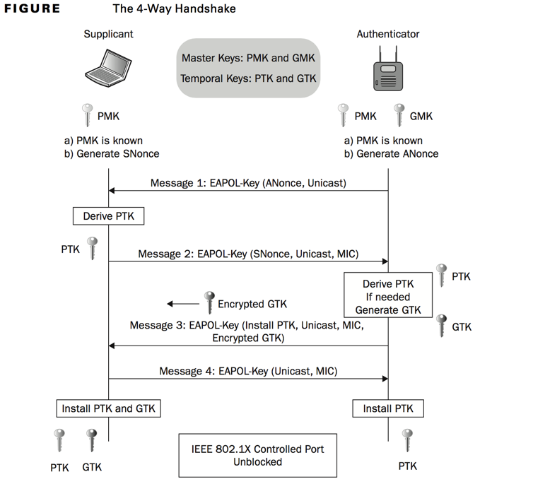

#### TKIP

WPA 的核心改进是引入了 **TKIP**（Temporal Key Integrity Protocol，临时密钥完整性协议）。 TKIP 仍然使用 RC4 算法，但通过动态生成密钥的方式，为每个数据包使用不同的密钥，大大增强了安全性。 此外，它还引入 MIC 以防止数据包被篡改。TKIP 作为 WEP 到 WPA 过渡期间的一项重要技术，为提升无线网络安全性做出了贡献。随着时间的推移和计算能力的提升，TKIP 逐渐暴露出其安全性和性能上的局限性，在 802.11 标准的 2012 年修订版中已被弃用。

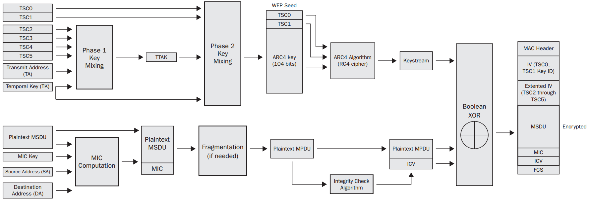

### WPA2-PSK：CCMP

WPA2 是 WPA 的升级版本，它成为了 Wi-Fi 安全的长期标准。 WPA2 强制使用更强大的加密标准 AES（Advanced Encryption Standard，高级加密标准），并配合 **CCMP**（Counter Mode Cipher Block Chaining Message Authentication Code Protocol，计数器模式密码块链消息完整码协议）进行工作。 与 TKIP 不同，AES-CCMP 是一种专门为提供高强度加密而设计的协议，它提供了更可靠的数据机密性、完整性和源认证。

AES 是目前应用最广泛的对称加密算法，因此就不在此详述了。WPA2-PSK 与 WPA-PSK 的 PSK 四次握手过程相同，但 PTK、GTK、MIC 的计算方式不同。

#### CCMP

顾名思义，CCMP 由两个核心部分组成：
- **计数器模式**（Counter Mode）：通过一个唯一的计数器（Nonce）将每个数据包的内容进行加密，AES 使用该计数器加密分组数据块，通过分组加密生成伪随机流，最终与明文数据按位异或得到密文，从而确保数据的唯一性和机密性。
- **消息验证码**（Message Authentication Code）：使用密码块链消息完整码（CBC-MAC）生成 MIC，并将其附加到数据包尾部，接收端再进行 MIC 计算并对比，以确保数据的完整性。

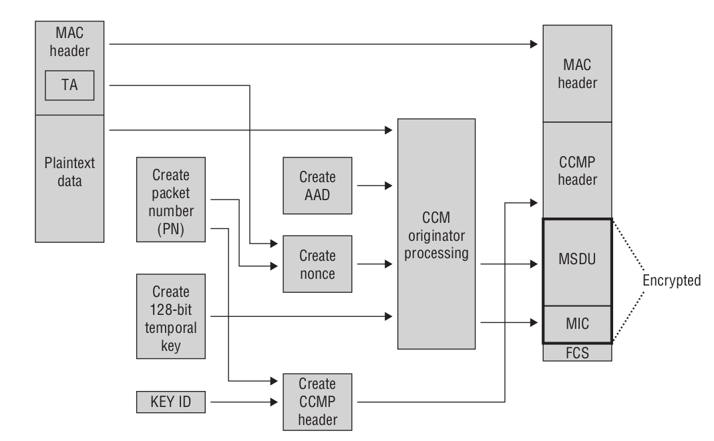

#### 密钥重装攻击（KRACK）

2017 年，比利时的两位信息安全研究员发表了一篇 WPA2 弱点研究，提出了名为 **KRACK**（Key Reinstallation Attack，密钥重装攻击）的攻击方式，我们先来看看其中一种：
1. 攻击者允许消息 1 和消息 2 正常交换。此时，客户端和 AP 都已生成了相同的 PTK。
2. AP 发送消息 3。客户端正常接收并处理：验证消息 3 的 MIC 码，确认其合法性；安装 PTK，并初始化 Nonce / PN（Packet Number，数据包序号）计数器为 1。从此刻起，客户端就可以使用这个 PTK 和从 1 开始递增的 Nonce 来加密数据帧了。
3. 客户端向 AP 发送消息 4，表示确认。
4. **攻击者拦截并重放**：攻击者作为中间人，拦截并阻止消息 4 到达 AP。由于 AP 没有在规定时间内收到消息 4，根据 802.11 协议的可靠性机制，它会认为消息 3 在传输中丢失了，因此它会重传一个内容完全相同的消息 3 给客户端。
5. **客户端二次接收消息 3（漏洞触发点）**：一个存在 KRACK 漏洞的客户端，在收到这个被重传的消息 3 时，其状态机处理出现错误。它本应忽略这个重复的消息，因为它已经安装了密钥。但是，它却再次处理了这个消息。它重新安装了同一个 PTK，而这个动作的致命副作用是：它将与该 PTK 关联的 Nonce / PN 计数器也重置回了其初始值 1。

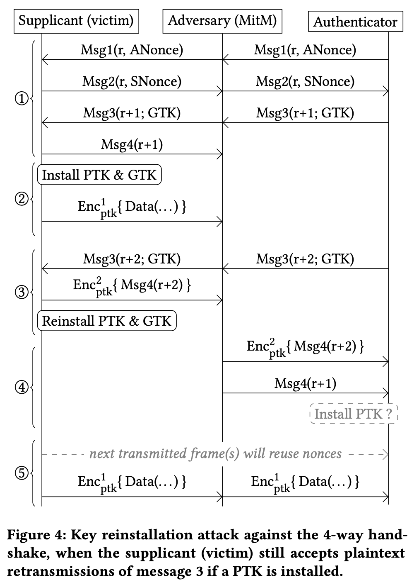

客户端的状态被破坏，它内部的 Nonce 计数器回到了 1。在第一次安装密钥后，它可能已经发送了一个或多个数据帧，使用的 Nonce 分别是 1, 2, 3...

但在第二次安装密钥后，它将要发送的新数据帧，会再次从 Nonce = 1 开始使用。攻击者因此可以捕获到两个使用相同 PTK 和相同 Nonce 加密的不同明文数据包的密文。

KRACK 漏洞大部分都是需要在客户端处进行修补，以 OpenWrt 为例，修补方式就是直接禁止安装密钥帧的重传。但是有一个漏洞需要在服务端处修补，它涉及到我们下文将要介绍的 [802.11r](#802.11r)（快速基本服务集转换）协议。

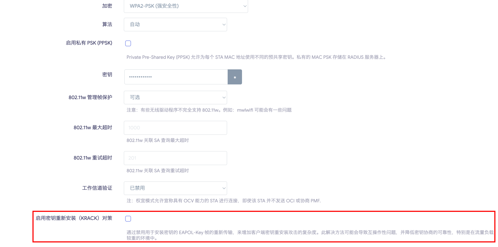

关于 KRACK 更详细的介绍，可前往[这个网站](https://www.krackattacks.com/)。

### WPA3-SAE

随着 KRACK 被发现，并且 PSK 仍然易受到字典攻击等原因，Wi-Fi 联盟推出了新一代安全标准 WPA3。 WPA3 的主要改进在于认证方式，它用 **SAE**（Simultaneous Authentication of Equals，对等实体同步验证）协议取代了 WPA2 中使用的 PSK 认证。 此外，WPA3 还具备**前向安全性**（Forward Secrecy），确保即使密码泄露，过去的通信数据也不会被解密。 

#### SAE

SAE 最初是为 IEEE 802.11s（也就是我们后文将要讲到的 Mesh 组网 [802.11s](#802.11s) 部分）中的 Peers 之间通信使用而提出的。当 Peers 发现彼此（并且安全功能已启用）时，它们会参与 SAE 交换。如果 SAE 成功完成，每个 Peers 都会知道另一方拥有 Mesh 密码。

 SAE 协议是 Dragonfly 协议的一种变体，是一种基于零知识证明的密码认证密钥交换。

> 零知识证明的三个性质：
> - **完备**（complete）：若一个证明方确实掌握了某论断的答案，则他肯定能找到方法向验证方证明他手中掌握的数据的正确性。
> - **健全**（sound）：若一证明方根本不掌握某论断的答案，则他无法（或只能以极低概率）说服验证方他手中所谓答案的准确性。
> - **零知识**（zero-knowledge）：验证方除了知道证明的结果外，对其他信息一无所知。

相比于 PSK 直接使用共享密钥作为会话的 PMK（易受到字典攻击），SAE 将 PSK 映射到有限循环群的一个元素，我们称之为 **PWE**（Password Element，密码元素）。在 SAE 过程中，PWE 就是将密码（Passphrase）映射到椭圆曲线（目前 Wi-Fi 联盟规定，基于 IANA 第 19 号 ECC Group）上的一个点，这是整个认证过程的基础。

> 有关 **ECC**（Elliptic curve cryptography，椭圆曲线密码学）的简单介绍：
> - 和 RSA 等类似，ECC 也是基于单向计算简单而逆向计算非常困难的数学函数。
> - 针对密码学应用上的椭圆曲线是在有限域（不是实数域）的平面曲线，其方程式如下：
>     $$ y^2=x^3+ax+b $$
>     
> - 我们在符合要求的椭圆曲线上定义群，满足规定：
>     - 群的**元素**是椭圆曲线上的点
>     - **加法单位元**是曲线上无穷远点，记作 0
>     - 点 A 的**加法逆元**是其关于 x 轴对称的点
>     - 定义**加法运算**：曲线上三点 P, Q, R 过同一直线，则 P+Q+R=0
>         - 在几何意义上，点 A 与点 B 的加法结果就是连接 A, B 的直线与椭圆曲线的第三个交点 P' 关于 x 轴的对称点 P
>         - 由极限思想可得，点 A 与点 A 的加法结果就是椭圆曲线在 A 点处的切线与椭圆曲线的交点关于 x 轴的对称点，我们将其记作 2A，由此可以推出 3A, 4A, ...，这样便定义了**标量（Scalar）乘法**
> - 如此定义的群是一个**阿贝尔群**。
> - 给定标量 n 与群上的点 P，我们可以通过**翻倍和累加**（Double and add）的方式，在 $O(\log n)$ 复杂度内计算出 Q=nP 的结果。
> - 该群上的一个对数问题：已知 P、Q，求 n，使得 Q=nP 成立。
> - 为了保证加密的安全性，将椭圆曲线定义在有限域 $GF(p^n)$ 上。我们仍然能通过翻倍和累加的方式计算出标量乘法，并且 P 的标量乘积的集合是该有限域椭圆曲线群的**循环子群**。
> - 但在有限域椭圆曲线上的对数问题，也就是离散对数问题，成为了一个经典计算机无法在多项式时间内解决的问题，也就是 ECC 的数学基础。
> - 基于 ECC 的 **ECDH**（Elliptic Curve Diffie-Hellman）算法：
>     1. 双方确定**领域参数**：相同的有限域内定义的相同的椭圆曲线上的相同的**基准点 P**
>     2. 双方随机生成 $n_{A},\ n_{B}$（大整数）作为私钥，通过基准点 P，计算出自己对应的公钥 $Q_{A},\ Q_{B}$，通过不安全的渠道交换公钥
>     3. 双方都可以得到某个共享的秘密信息 S：
>         $$ S=n_{A}Q_{B}=n_{A}(n_{B}P)=n_{B}(n_{A}P)=n_{B}Q_{A} $$
>     4. 攻击者即便截获基准点、$Q_{A},\ Q_{B}$，也无法解决离散对数问题得到私钥
>
> 有关 ECC 更详细的介绍，请前往 Datacruiser 的[知乎文章](https://zhuanlan.zhihu.com/p/102807398)。

SAE 过程与 ECDH 过程稍有不同，双方会根据 PSK、双方的 MAC 地址，生成相同的 PWE（也就是上文介绍的基准点），再生成两个随机大整数 rand（作为私钥）与 mask。设备根据这两个值生成**Scalar**，与标量乘积 **FFE**（Finite Field Element，有限域元素）。

$$ \text{Scalar}=(\text{rand}+\text{mask})mod\ p $$

$$ \text{FFE}=\text{mask}\cdot\text{PWE} $$

SAE 过程由两次消息交换组成：
1. **提交交换**（Commitment Exchange）：其中一方向对方发送自己采用的领域参数，以及自己计算出的 Scalar 与 FFE；另一方接收后，采用同样的领域参数进行计算，也向对方发送自己计算得到的 Scalar 与 FFE。
    
    $$ \begin{aligned} K_{1}&=\text{rand}_{1}\cdot(\text{Scalar}_{2}\cdot \text{PWE}-\text{FFE}_{2})\\ &=\text{rand}_{1}\cdot(\text{rand}_{2}\cdot \text{PWE}+\text{mask}_{2}\cdot \text{PWE}-\text{mask}_{2}\cdot\text{PWE})\\ &=\text{rand}_{1}\cdot \text{rand}_{2}\cdot \text{PWE} \end{aligned} $$ $$\begin{aligned} K_{2}&=\text{rand}_{2}\cdot(\text{Scalar}_{1}\cdot \text{PWE}-\text{FFE}_{1})\\ &=\text{rand}_{2}\cdot(\text{rand}_{1}\cdot \text{PWE}+\text{mask}_{1}\cdot \text{PWE}-\text{mask}_{1}\cdot\text{PWE})\\ &=\text{rand}_{2}\cdot \text{rand}_{1}\cdot \text{PWE} \end{aligned} $$
    
2. 双方由此独立地计算出了共享的秘密点 K。之后通过 Hash(K) 来得到通信的 PMK，与 PSK 直接用作 PMK 相比，SAE 方式得到的 PMK 的熵明显更高（更随机更混乱），因此能很好地抵御字典攻击。
    
3. **确认交换**（Confirmation Exchange）：为了确认双方的计算结果是否一致，双方互相发送 Confirm 信息（双方交互过的信息的 HASH），来验证协商过程是否正确。

在成功协商出 PMK 之后，双方再进行**四次握手**过程，生成 PTK 等密钥。

### 802.1X

与上述 WPA / WPA2 / WPA3 的个人模式使用单一共享密码不同，802.1X 是一种企业级的认证机制。 它不依赖共享密码，而是为每个用户提供独立的身份凭证。 当用户尝试接入网络时，AP 会将认证请求转发给专门的认证服务器。服务器验证用户的身份后，才授权其接入网络。这种方式提供了更精细的访问控制和更高的安全性，广泛应用于企业、校园等对安全要求较高的环境中。

#### EAP

施工中...

# 无线漫游基础：802.11 k/v/r

无线漫游是指在相同 SSID 的无线网络中，确保手机、电脑等无线终端设备在移动过程中能够保持不间断网络连接的技术。

无线终端用户在通信过程中，可能会从一个 AP 信号覆盖区进入到另一个 AP 覆盖区，为了避免用户在不同的 AP 之间切换时网络通讯中断，需要借助无线漫游技术，确保用户设备与新的 AP 自动关联，与原有 AP 断开关联，同时保持网络连接的连续性，使用户在移动通信的过程中自由切换且无感知地保持对网络的持续访问。

802.11 k/v/r 是三个由 IEEE（电气和电子工程师协会）制定的 Wi-Fi 标准补充协议，也是实现无缝漫游的关键技术协议。

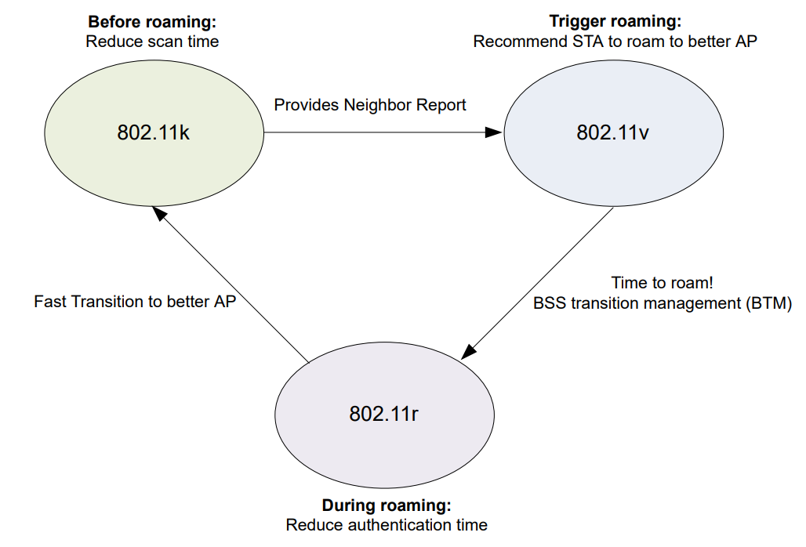

## 802.11k

**无线局域网的无线电资源测量**（RRM，Radio Resource Measurement of Wireless LANs），可提前告知无线终端可以选哪些 AP，在设备要进行漫游时能够快速选择漫游 AP。

1. **客户端发起请求**：当一个支持 802.11k 的无线终端连接到一个 AP 后，它可以向当前所连接的 AP 发送一个请求，询问附近有哪些可用的 AP 作为潜在的漫游目标。
2. **AP 提供邻居报告**：收到请求后，AP 会回复一个“邻居报告”。这份报告中包含了由网络侧提前收集好的周边 AP 的信息。这份报告通常包含 BSSID、信道号、可达性、安全信息以及支持的物理层标准（如 802.11ac / 802.11ax）等。
3. **请求其他客户端的信标（Beacon）报告**：无线终端还可以通过向其他无线终端发送主动扫描 / 被动扫描 / 信标表请求，后者扫描后会回复一个“信标报告”。
4. **终端优化扫描，智能决策**：终端设备检测到当前 AP 信号减弱需要漫游时，无需再盲目地扫描所有信道，而是可以直接、快速地扫描邻居报告、信标报告中列出的信道和 AP。这极大地缩短了扫描时间，帮助设备更快地找到最佳的漫游目标 AP。

## 802.11v

**无线网络管理协议**（WNM，Wireless Network Management），可帮助终端设备更长时间睡眠，以及允许 WLAN 主动发送信息给无线终端，来确保终端能连接更好的 AP。

### BSS 过渡管理 (BSS Transition Management)

1. **AP 持续监控网络状态**。当它发现以下情况时，可能会触发 BSS-TM：
    - 某个客户端的**信号强度**（RSSI，Received Signal Strength Indication）过低
    - 某个 AP 的**负载**过高，连接了太多的设备
    - 管理员希望将客户端**频段引导**（Band Steering）到支持更高速度的 5GHz 频段上
2. **发送引导请求**：当网络决定需要引导某个客户端时，AP 会向该客户端发送一个“BSS 过渡管理请求”帧。这个帧包含以下内容：
    - BSS 过渡候选列表（BSS Transition Candidate List Entries）：包含一个或多个邻居报告
    - Preferred Candidate List Included 位：如果置为 1，说明 AP 希望客户端处理此帧；如果置为 0，则客户端可以忽略 BSS 过渡候选列表。
    - Abridged 位：如果置为 1，说明 AP 让客户端忽略没有出现在 BSS 过渡候选列表中的 BSSID；如果置为 0，则客户端可以自行处理。
    - 强制漫游位（Disassociation Imminent）：如果置为 1，则说明 AP 稍后将强制断开连接。
3. **客户端响应决策**：支持 802.11v 的客户端在收到这个请求后，会进行响应。
    - 接受建议：客户端会评估候选列表中的 AP，并尝试漫游到最优的一个。然后向原 AP 回复BSS-TM Response 帧。
    - 拒绝建议：客户端也可以选择拒绝这个建议，并回复响应帧。

### WNM 睡眠模式 (WNM-Sleep Mode)

该模式是一种客户端扩展的省电模式，该特性让客户端可以通知 AP，它将休眠特定的时长，在此期间 AP 将维持其连接，这有助于其减少功耗。

### 定向组播服务 (Directed Multicast Service, DMS)

在传统 Wi-Fi 中，组播 / 广播帧会发送给所有连接的设备。对处于省电模式的设备，这意味着它必须被频繁唤醒来接收这些它可能并不需要的帧。DMS 允许 AP 将组播数据包缓冲起来，然后为每个需要它的客户端转换成单播帧进行发送。这大大减少了设备的唤醒次数，显著延长了电池续航时间。

## 802.11r

**快速基本服务集转换**（FT，Fast Basic Service Set Transition），可极速完成切换过程中的“身份验证”环节，实现快速漫游。

FT 协议分为两种工作模式，即 FT over the Air（FT/OTA）和 FT over the DS（FT/DS），这两者都旨在加速漫游过程。

施工中...

## 在 OpenWrt 上配置

首先确保 OpenWrt 路由器已安装完整版 wpad（一般预装的是 `wpad-basic`，请安装 `wpad-openssl` 或 `wpad-wolfssl`）。

这里有一篇讲解得很详细的文章，笔者就不在此赘述了，详见 [OpenWRT 路由器快速漫游（802.11r）配置教程以及深度解析](https://post.smzdm.com/p/a6lr03wg/)。

# AC + AP 方案

AC（Access Controller，接入控制器）+ AP 是较为传统但同时很有效的一种组网方案。AC 把无线局域网接入控制设备，负责把来自不同 AP 的数据进行汇聚并接入 Internet，同时完成 AP 设备的配置管理、无线用户的认证、管理及宽带访问、安全等控制功能。

AC + AP 方案的拓扑一般为星型，从 AC 由网线连接到各个房间的 AP，从而实现全屋 Wi-Fi 覆盖。

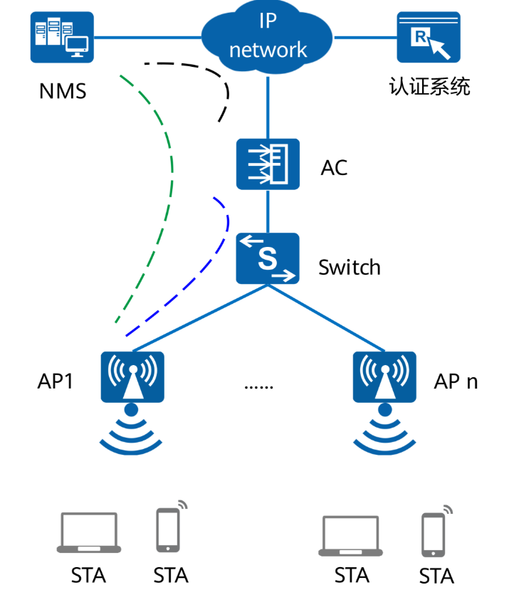

## 胖 AP 与瘦 AP

无线 AP 可以分为胖 AP（Fat AP）和瘦 AP（Fit AP）两类，主要从其工作原理和功能上来区分。

胖 AP 除了无线接入功能外，一般还同时具备 WAN、LAN 端口，支持 DHCP 服务器、DNS 和 MAC 地址克隆、VPN 接入、防火墙等安全功能。胖 AP 通常有自带的完整操作系统，是可以独立工作的网络设备，可以实现拨号、路由等功能，一个典型的例子就是我们常见的无线路由器。

瘦 AP，就是去掉路由、DNS、DHCP 服务器等诸多加载的功能，仅保留无线接入的部分的 AP 设备。我们常说的 AP 就是指这类瘦 AP，它相当于无线交换机或者集线器，仅提供一个有线 / 无线信号转换和无线信号接收 / 发射的功能。瘦 AP 作为无线局域网的一个部件，是不能独立工作的，必须配合 AC 的管理才能成为一个完整的系统。

## PoE 与面板 AP：让布线更简单

随着网络中 IP 电话、网络视频监控以及无线以太网设备的日益广泛，通过以太网本身提供电力支持的要求也越来越迫切。多数情况下，终端设备需要直流供电，而终端设备通常安装在距离地面比较高的天花板或室外，附近很难有合适的电源插座。

PoE（Power over Ethernet）则解决了这个问题。它借助现有以太网，通过网线同时为 IP 终端设备（IP 电话、AP、IP 摄像头等）进行数据传输和供电。

在家庭组网中，我们可以将光猫连接到支持 PoE 功能的交换机，再由交换机通往各房间。

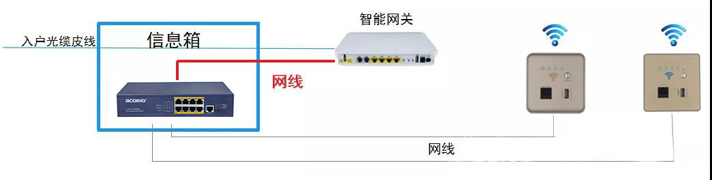

面板 AP 是将瘦 AP 设备隐藏在以太网面板中，替换墙壁的原以太网面板，不外露走线，十分美观。不过，面板 AP 虽然隐藏性极佳，但和一般的吸顶 AP 等相比，信号覆盖能力更弱，并且相同性能下的价格更贵，需要根据实际情况规划采用。

## 将 OpenWrt 配置为 AP

1. 确保主路由能正常行使路由与 DHCP 功能。
2. 将 OpenWrt 路由设备 **LAN 口**接到主路由 LAN 口。
3. 访问 OpenWrt 管理页面，前往 `网络 - 接口 - lan`，协议设置为静态地址，IPv4 地址填入目前网段未被使用的地址，IPv4 网关设置为主路由的 IP 地址。
    
    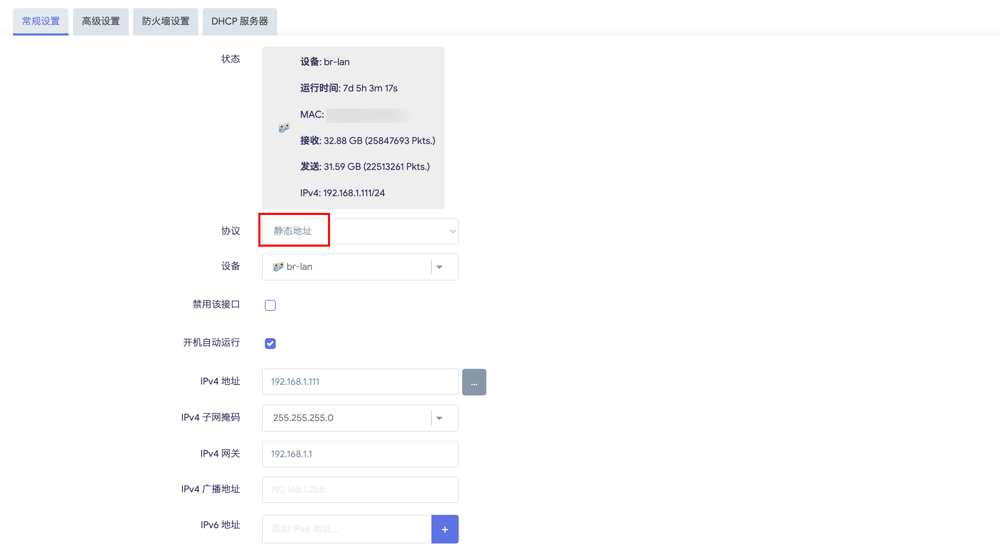
    
4. 在 `DHCP 服务器 - 常规设置` 中勾选 `忽略此接口`，关闭 DHCP 服务。
    
    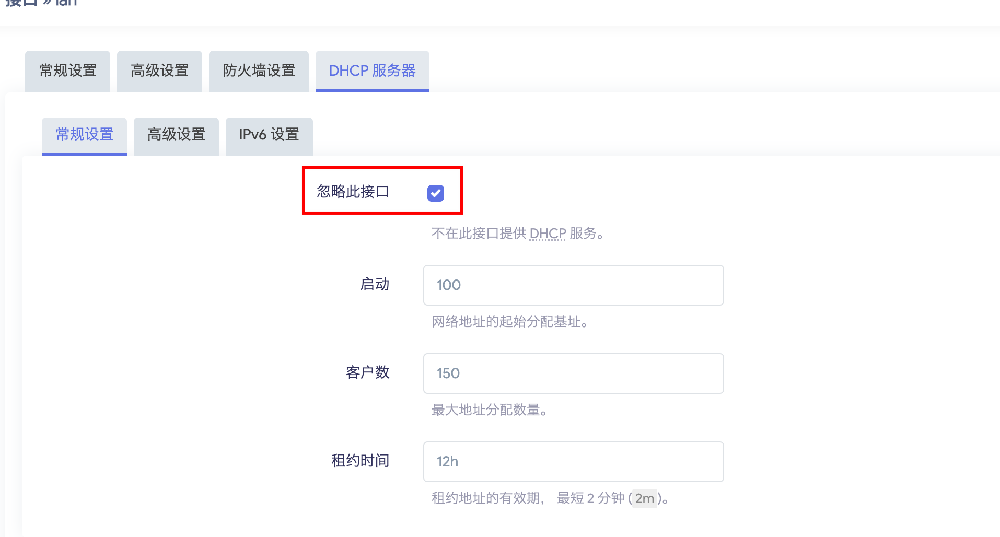
    
5. 在 `高级设置 - 使用自定义的 DNS 服务器` 中填入主路由 IP 地址。保存并应用前几步更改（可能会弹出是否强制应用的选项，请确保配置完全正确后再强制应用）。
    
    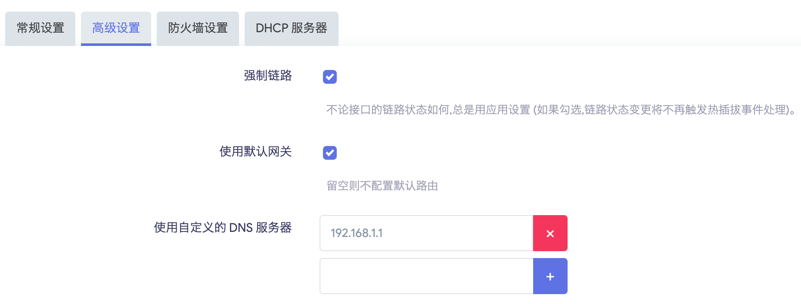
    
6. 一段时间后通过新设置的静态地址访问 OpenWrt 管理页面，在 `网络 - 防火墙 - 常规设置` 中取消勾选 `启用 SYN-flood 防御` 以及 `丢弃无效数据包` 选项，并将`入站数据` `出站数据` `转发` 项全部设置为接受，关闭防火墙。
    
    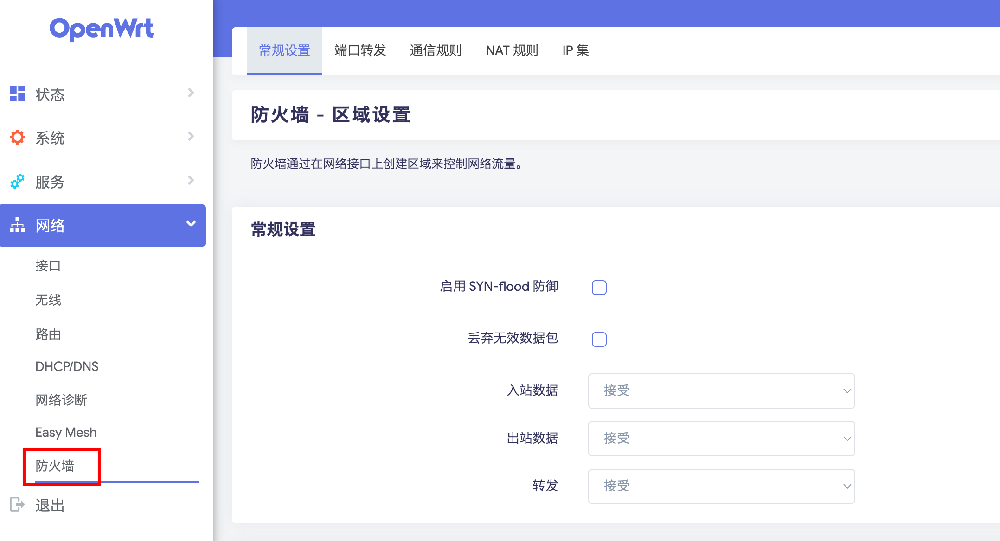
    
7. 按照自己的规划更改并启用 OpenWrt 设备的无线配置，选用默认 Master 模式即可。

# Mesh 方案

Mesh，顾名思义，就是呈现网状拓扑结构的网络。Mesh 网络在网络节点间透过动态路由的方式来进行资料与控制指令的传送。这种网络可以保持每个节点间的连线完整，当网络拓扑中有某节点失效或无法服务时，这种架构允许使用“跳跃”的方式形成新的路由后将讯息送达传输目的地。

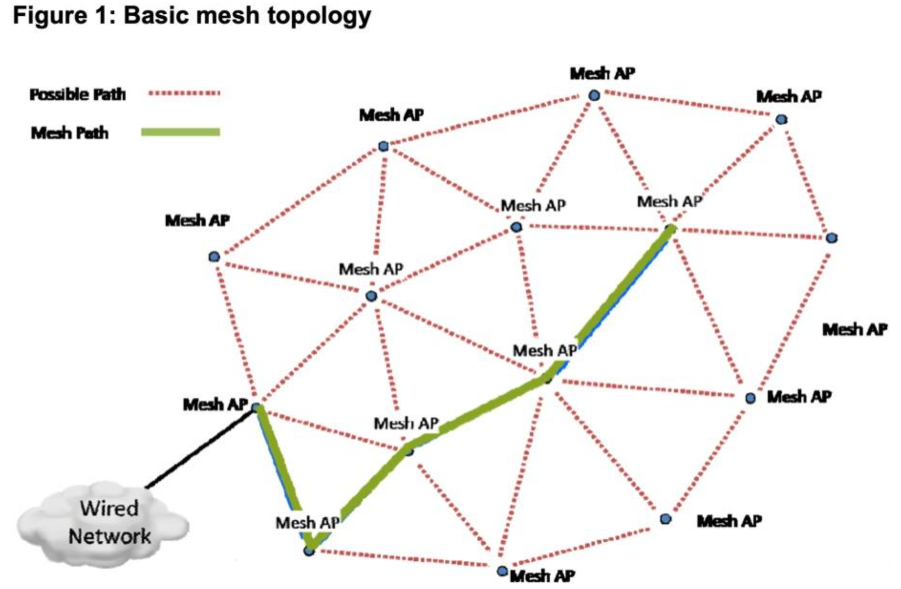

目前无线 Mesh 组网有两个主流标准，一个是由 IEEE 制定的 802.11s 无线局域网（WLAN）标准修正案，一个是由 Wi-Fi 联盟（Wi-Fi Alliance）提出的 EasyMesh 标准。后者并不是严格意义上的 Mesh 网络，其拓扑仍是树型的。

我们目前在家庭组网当中提到的 Mesh 大多指 EasyMesh，而目前各厂商的 Mesh 方案基本是基于 EasyMesh 开发的自定标准，因而不能实现不同品牌之间的互通。（只有通过 EasyMesh 认证的设备能够互通，但这样的设备寥寥无几）

以下内容部分来自 [Ethan-J's Wi-Fi 自组网方案调研](https://www.zheyu.ink/article/mesh-research)。

## 802.11s

> 来自 Linux Wireless documentation：
> 
> IEEE 802.11s 是 IEEE 802.11 标准的扩展，它允许多个无线节点相互连接，而无需它们之间有 AP。如果您家里有一个 AP，并且您想将文件复制到另一台笔记本电脑 B 上，该笔记本电脑 B 与您自己的笔记本电脑（笔记本电脑 A）连接到同一 AP，则 A 将数据传输到 AP，而 AP 又将其传输到笔记本电脑 B。所以 A 和 B 之间的所有通信都是通过 AP 完成的。
> 
> 然而，IEEE 802.11s 允许 A 和 B 之间直接通信，而无需 AP。使用 802.11s 网状标准，节点可以形成一个多跳网络，其中网络的所有链路都是无线的。这意味着不需要有线基础设施来设置网络。这在很多情况下都非常方便，例如，救灾队可以携带支持 IEEE 802.11s 的笔记本电脑。这将使他们能够与该地区的其他笔记本电脑交换信息，即使这些笔记本电脑不在直接范围内。

802.11s 定义了三种类型的节点：
- **Mesh Point（MP）**：支持对等链路管理协议，该协议用于发现相邻节点并跟踪它们。MP 在无线 Mesh 网络中负责数据转发，支持 Mesh 网络互连的路由功能，并通过多跳互联的方式组成了 Mesh 骨干网。
- **Mesh Portal（MPP）**：连接到 Mesh 网络的用户可以通过 MPP 网关节点访问互联网，它们同时连接到 Mesh 网络和互联网。它可以连接两个 Mesh 网络，或者将 Mesh 网络与不同网络（如以太网）相连的 MPP 节点。
- **Mesh Access Point（MAP）**：通过 Mesh 功能增强的传统 AP。它可以充当 AP，同时成为 Mesh 网络的一部分。

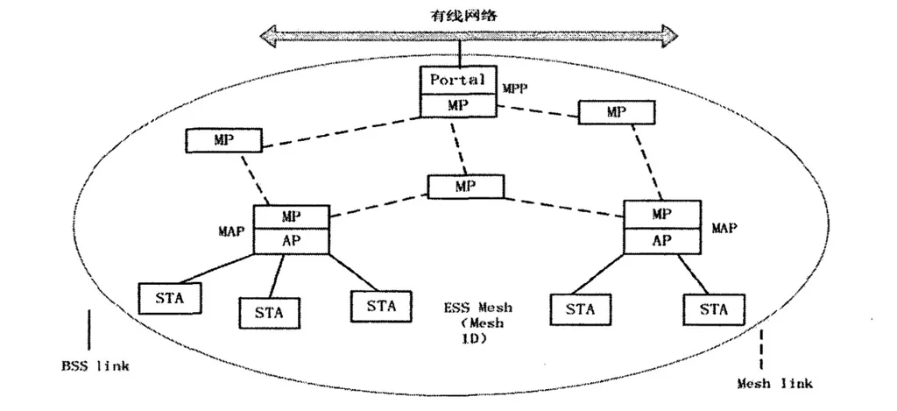

802.11s 一个关键点是，要求所有接入的节点预先设置相同的 Profile，这样才能保证正常接入。Profile 中含有如 MESH ID 等信息。

IEEE 802.11s 是通过扩展 IEEE 802.11 MAC 层实现的六地址数据交换，在 Wi-Fi MAC 层实现路由，实现比较复杂，对终端能力要求高，开发和维护的成本比较高，普通家庭无线 AP 终端性能无法保障，故产业链高通、博通、MTK 等大的芯片厂商对 IEEE 802.11s 支持力度不大。

## EasyMesh

Wi-Fi EasyMesh 是 Wi-Fi 联盟推出的一项认证规范，旨在定义和规范家庭和小型办公室中多接入点 Wi-Fi 网络的使用，具体包括：
- **简易安装和使用**：Wi-Fi EasyMesh 网络易于安装和使用，支持自适应功能。
- **多厂商互操作性**：它为消费者和服务提供商在选择家庭部署的 Wi-Fi EasyMesh 设备时提供了更多的灵活性。
- **统一的网络**：Wi-Fi EasyMesh 网络可调整其拓扑结构，平衡其接入点（APs）的负载，形成一个统一、可适应的网络。
- **扩展覆盖和性能**：该技术使用来自不同厂商的多个接入点，扩展统一 Wi-Fi 覆盖范围，并提高整个服务区域的性能。
EasyMesh 提供了一种基于标准的方法来部署由不同厂商的多个接入点（Multi-AP）组成的可适应网络，从而延伸均匀的 Wi-Fi 覆盖并增强性能，特别适用于超出单个接入点覆盖范围的更大区域。

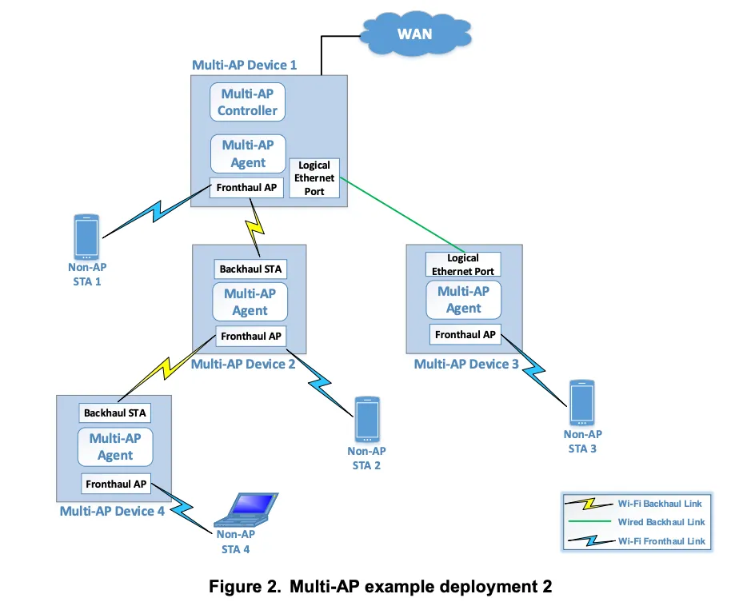

EasyMesh 网络中主要包含两种类型的设备：
- **Controller**：为其它支持 EasyMesh 的设备提供了接入到它的网络中的功能。Controller 通过接收网络度量、设备能力信息，通过一定的分析和计算，来统一操作整个 Mesh 网络的功能，如信道、拓扑结构、客户端漫游等。Controller 也会发送控制命令给 Agent，来提升网络中的负载均衡或控制其它功能的管理。
- **Agent**：在 EasyMesh 网络中，所有的 AP 点都是 Agent 角色。Agent 是一个逻辑实体，它需要执行 Controller 发过来的命令，周期给 Controller 上报网络度量和能力信息。某个 Agent 相对于其它 Agent，它也提供接入的无线接口，即其它 Agent 通过此 Agent 连接到 Controller。

简单来说，EasyMesh 仍然类似 AC + AP 方案，但是可以自动地配置网络中的 AP 设备，如 SSID 与加密等，从而实现自动组网。

### 有线回程与无线回程

我们常说的有线回程与无线回程就是指 EasyMesh 中的 Wired Backhaul 与 Wireless Backhaul。

- **回程（Backhaul）**：Controller 和 Agent 之间连接起来的，用于交换网络度量、设备信息，发送控制命令等的数据通路。
- **有线回程**：子路由 WAN 口与主路由 LAN 口之间通过网线连接，在 Controller 和 Agent 之间形成有线链路。
- **无线回程**：Agent 通过一个特殊的隐藏 BSS 连接到 Controller，形成无线链路。
- **去程（Fronthaul）**：指的是终端设备与 AP 之间的无线连接。它通过 Fronthaul BSS（即我们在终端设备上搜索到的 Wi-Fi 信号）的无线网络，为终端设备提供 Wi-Fi 接入。在一个 EasyMesh 网络中，无论终端设备连接到哪个物理 AP，通常都使用相同的 SSID 和密码，实现了全屋统一的 Wi-Fi 体验。

## 在 OpenWrt 上配置 802.11s

由上文的介绍我们知道，802.11s 用于个人网络时，仅支持 WPA3-SAE 加密方式。

1. 确保 OpenWrt 路由器已安装支持 WPA3-SAE 加密方式的 wpad（一般预装的是 `wpad-basic`，请安装 `wpad-openssl` 或 `wpad-wolfssl`）。
2. 确保网络中只有唯一的 DHCP 服务器。
3. 打开 OpenWrt 管理页面，在 `网络 - 无线` 中编辑无线接口，确保：
    - 模式为 802.11s
    - 所有参与 802.11s 组网的路由器设备采用**相同信道**
    - 所有参与 802.11s 组网的路由器设备使用**相同 Mesh ID**
    - `无线安全` 加密方式只能为 **WPA3-SAE**
    
4. 保存并应用后，确认 Mesh 网络内的路由器能否相互 ping 通即可。

关于配置 Mesh 网络中的无线漫游，请参考上文[无线漫游基础：802.11 k/v/r](#无线漫游基础：802.11%20k/v/r) 部分。

 
