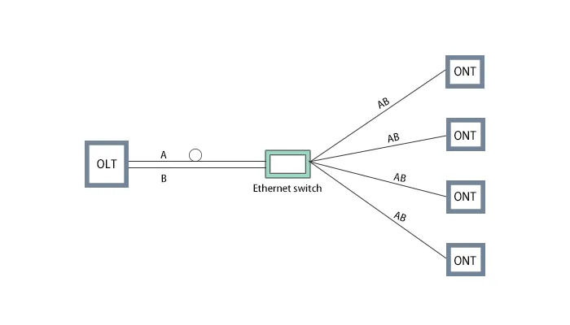
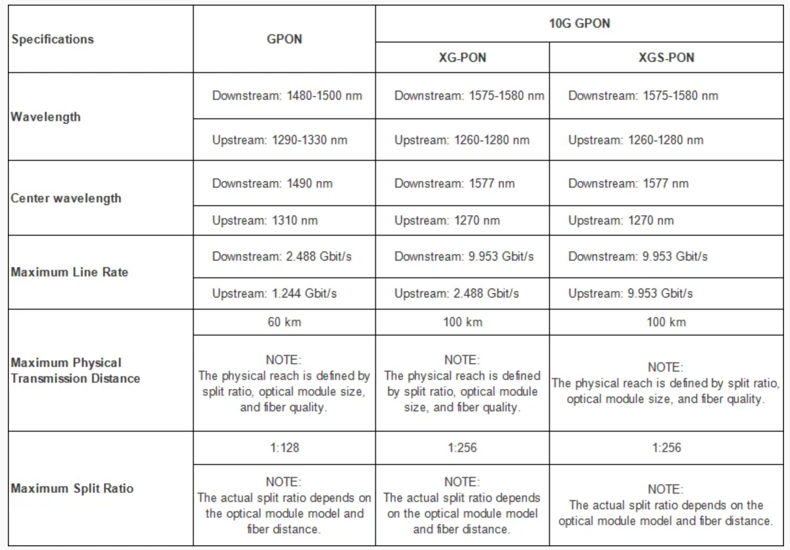
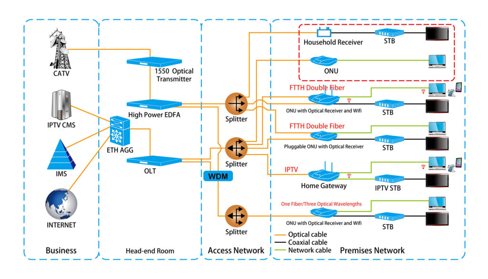


<br/>

# 上行：去往外网

## PPPoE

如果你学习过计算机网络的相关知识，你就会知道，用户的计算机与互联网服务提供商（ISP）之间的通信使用最广泛的数据链路层协议就是点对点协议（Point to Point Protocol，PPP），它也广泛应用于广域网路由器之间的专用线路。

PPP 协议有如下特点：
- 支持同步与异步传输，而 X.25、FR 等协议仅支持同步传输， SLIP 仅支持异步传输。
- 提供了认证协议：CHAP（Challenge-Handshake Authentication Protocol）、PAP（Password Authentication Protocol），更好地保证了网络的安全性。
- 无重传机制，网络开销小，速度快。

而在局域网中，设备之间的通信使用的数据链路层协议通常是以太网（Ethernet）协议。数据在发送前要被封装为以太网的数据帧。但以太网的广播特性，使得其通信双方无法相互验证对方的身份，因而通信是不安全的。

为了保留以太网的简单易用、成本低的优点，结合 PPP 协议的身份验证功能，PPPoE（Point to Point Protocol over Ethernet）诞生了。


PPPoE 具有以下特点：
- 集成了 PPP 协议，实现了传统以太网不能提供的身份验证、加密等功能。
- 通过唯一的 Session ID 可以很好地保障用户的安全性。
- PPPoE 拨号上网作为一种最常见的方式，让终端设备能够连接 ISP（Internet Service Provider），从而实现宽带接入。
- 可用于缆线调制解调器（Cable Modem）和数字用户线路（Digital Subscriber Line）等以太网线，通过以太网协议向用户提供接入服务。

### OpenWrt 路由模式拨号

1. 确保光猫已设置成**桥接模式**（仅负责光电信号转换，不参与路由和拨号功能，需要联系运营商修改）。
2. 将路由器的 WAN 口连接到光猫的 LAN 口。在这种情况下，由于路由器负责 DHCP 以及拨号上网的工作，其他设备不能接到光猫剩余 LAN 口，只能接到路由器的 LAN 口。
3. 使用其他设备连接到 OpenWrt 路由器的 LuCi 界面，修改 `网络 - 接口 - wan` 的协议为 `PPPoE`。填入 PAP/CHAP 用户名与密码（即宽带账户与密码）。
    
4.  确认 `网络 - 接口 - lan` 的协议为 `静态地址`。为路由器选择合适的 IPv4 地址与对应的子网掩码即可。最后确认两个接口的防火墙区域配置是否正确。

#### IPv6

OpenWrt 路由器会自动创建一个名为 `wan6` 的接口，用于处理 WAN 口上的 IPv6 通信（如果没有自动创建，可以创建 WAN 口的别名 `@wan` 接口）。如果运营商能够通过 PD 下发 IPv6 地址，我们就可以很容易地配置 IPv6。

1. 确认 `网络 - 接口 - wan6` 的协议为 `DHCPv6 客户端`。
    
2. 前往 `网络 - 接口 - lan - DHCP 服务器 - IPv6 设置`，将 `RA 服务` 与 `DHCPv6 服务` 设置为 `服务器模式`，将 `NDP 代理` 设置为 `已禁用`。关于这么设置的原因，请参考 。
    
    如果运营商无法通过 PD 下发 IPv6 地址，请参考  伪装 PD 的配置部分，一般而言都配置为 `中继模式` 即可。
3. 确认各接口防火墙区域配置正确。
4. 前往 `网络 - DHCP/DNS - 过滤器`，确认 `过滤 IPv6 AAAA 记录` **未勾选**。
    
5. 参考 a5 校园网 & 远程访问（IPv6）#IPv6 防火墙]] 部分，配置通信规则。
6. 前往 https://ipw.cn 查看自己是否成功获取到 IPv6 地址。

# 下行：在到达住户之前

## 光信号与电信号

自从人类发明电报与电话之后，信号的远距离传输都是通过电缆完成的。但通过电缆传输的电信号也存在很多问题：
- **电阻问题**：在传输交流信号中，随着频率的增加，由于趋肤效应和介质损耗，特别是趋肤效应导致信号能量集中在导体表面，有效截面积大大减小，同轴电缆中信号的衰减将成倍增长。
- **损耗问题**：电信号在传输的过程中易受到电磁场的干扰，损耗较严重。
- **成本问题**：电缆需要消耗大量的金属，主要是铜和铅。
- **安全问题**：在屏蔽双绞线被应用前，由于电信号的变化会产生磁场，就可能通过发出的磁场信号逆向分析出网络里传输的数据。

为了解决这些问题，华裔科学家高锟提出了使用光导纤维（高纯度二氧化硅）作为传输介质。光纤传输的光信号相比电信号有很多优点：
- **通信容量巨大**：从理论上讲，一根光纤可以同时传输 100 亿个话路，比传统同轴电缆、微波等高出几千乃至几十万倍。
- **中继距离长**：光纤具有极低的衰耗系数，配以适当的光发送、光接收设备、光放大器、前向纠错与 RZ 编码调制技术等，可使其中继距离达数千公里以上，而传统电缆只能传送 1.5km，微波 50km，根本无法与之相比拟。
- **保密性好、适应能力强**：具有不怕外界强电磁场的干扰、耐腐蚀等优点。因为光纤的基本成分是石英，只传光，不导电，不受电磁场的作用，在其中传输的光信号不受电磁场的影响，故光纤传输对电磁干扰、工业干扰有很强的抵御能力。也正因为如此，在光纤中传输的信号不易被窃听，因而利于保密。


## 有源光网络（AON）与无源光网络（PON）

有源光网络依赖于中间有源设备（如交换机和路由器）来放大和分配光信号。



AON 系统中，每个用户都有独立的光纤连接到中心交换机或路由器，这样可以实现更高的带宽和更灵活的服务质量管理。虽然 AON 系统的初始建设成本较高，维护也较为复杂，但其性能和服务质量优势使其在某些高端应用中具有竞争力。

相比之下，无源光网络是一种无需中间有源设备（如放大器、交换机等）的光纤网络。


PON 系统中，光线路终端（OLT，Optical Line Terminal）位于服务提供商端，通过光纤连接到多个光网络单元（ONU）或光网络终端，中间通过无源分光器（Splitter）分配光信号。由于无需中间放大和转发设备，PON 系统具有成本低、维护简单的优点。

PON 系统通常采用时分多址（TDMA，Time Division Multiple Access）技术进行数据传输。OLT 在下行链路中将数据分割成多个时间片，每个时间片分配给不同的 ONU；在上行链路中，各 ONU 根据 OLT 的调度在不同时间片上传输数据。

### 光线路终端（OLT）

OLT（Optical Line Terminal，光线路终端）是无源光网络（PON）的核心设备，主要用于连接光纤并管理信号传输。它负责将电信号转换为光信号向下传输至客户终端，同时将上行光信号转换为电信号进行处理。

### 光网络单元（ONU）

ONU（Optical Network Unit）具有两点作用：对 OLT 发送的广播进行选择性接收，若需要接收该数据要对 OLT 进行接收响应；对用户需要发送的以太网数据进行收集和缓存，按照被分配的发送窗口向 OLT 端发送该缓存数据。

在下文我们将要讲到的几个 FTTx 网络，不同的部署 ONU 接入方式也有所不同：
- **FTTC**（Fiber to the Curb）：ONU 放置在小区的中心机房
- **FTTB**（Fiber to the Building）：ONU 放置在楼道的接线箱
- **FTTH**（Fiber to the Home）：ONU 放置在家庭用户中
- **FTTR**（Fiber to the Room）：ONU 仍在家庭用户中，但光纤通往每个房间的子网关

### PON 技术标准

目前，PON 技术有多个标准，其中最主要的是 GPON（Gigabit-capable PON）和 EPON（Ethernet PON）。这两种标准在技术特点、应用场景和性能指标等方面存在一定差异。我们主要介绍 GPON 系列的技术。

> GPON（Gigabit Passive Optical Network，千兆比特无源光网络）是由国际电信联盟电信标准化部门（ITU-T）制定的一种高速无源光网络技术。GPON 网络采用点对多点（P2MP）的网络结构来接入大量终端设备，利用无源光器件降低信号传输过程中的能耗。其中，Gigabit 表明单个接口提供速率可达千兆级别。
> 
> XG(S)-PON 是在 GPON 标准基础上演进的新一代技术标准，其中，“X”代表10 Gigabit-capable，表示单个接口可提供万兆级别传输速率，“S”代表 Symmetric，表示上下行速率相同。XG(S)-PON包含了上下行速率非对称的 XG-PON 和上下行速率对称的 XGS-PON 两种标准。

其中，GPON 的上行速率为 2.5Gbit/s，下行速率为 1.25Gbit/s；XG-PON 的上行速率为 10Gbit/s，下行速率为 2.5Gbit/s；XGS-PON 的上行速率为 10Gbit/s，下行速率为 10Gbit/s。



# 光纤入户

## 光猫（ONT）

光猫（Optical Network Terminal，光网络终端）是猫（Modem，调制解调器）的一种。调制解调器顾名思义，是一种用于将数字信号转换成模拟信号（调制）和将模拟信号转换成数字信号（解调）的设备。它主要用于将计算机或其他设备产生的数字信号转换成适合传输的模拟信号，并将接收到的模拟信号转换成数字信号供计算机使用。


相对应地，光猫就是负责将光信号转换成电信号的设备，主要用于光纤网络的接入和转换。它使得用户可以通过光纤网络接入互联网。光猫一般由光接收模块、光发射模块和电子信号处理单元组成。在物理层面，就是将光纤接入的上行光信号，转换为以太网线当中的下行电信号，与终端设备连接。

随着设备的更新换代，光猫也集成了路由以及无线网络等附加功能，成为了家庭的网络接入设备。

## FTTB

FTTB（Fiber To The Building），即光纤到楼，是一种基于优化高速光纤局域网技术的宽带接入方式。楼宇内设专用“网络中转箱”，光纤接入后再通过铜缆或局域网分配信号至各户。

FTTB 方案成本低，适合老旧小区改造，可以利用楼内原有的电缆。但用户共享带宽，所以网速和稳定性会较差一些，多人并发使用时容易出现卡顿的情况。

## FTTH

光纤到户是指通过光纤将通信信号直接传输到用户家庭的一种接入技术。与传统的铜缆接入方式相比，FTTH 能够提供更高的带宽、更快的传输速度和更长的传输距离。近年来，随着互联网应用的迅猛发展和用户对高速宽带的需求不断增加，FTTH 技术逐渐成为宽带接入的主流选择。

FTTH 的网络典型拓扑是由运营商光纤接入用户家中的光猫，再由光猫通过网线连接其他路由器以及设备组成的星型 / 树型拓扑。



## FTTR：A Lie

光纤到房间是指运营商要把光纤铺设到用户的每个房间，更彻底地解决网络问题。具体来说，FTTR 方案中，运营商要做更加多的线路铺设和设备安装工作。首先，需要在用户的房子里铺设光纤路线；其次，要根据实际情况铺设数台光路由器，一般包括一台主路由和多台从路由。


听起来似乎没什么坏处，但其实根本不是这样。

### 谎言一：并不是你想象中的 To the Room

和我们之前介绍的 FTTx 网络不同，光纤通往用户的终点并不是 ONU。对于 FTTR 方案而言，ONU 仍然是用户的主光猫，光纤从光猫通往的各房间设备，只是子路由，在网络中只起到桥接作用，路由器行使的路由、DHCP、防火墙等功能仍然是由主光猫完成的，而各个房间里的从设备统一受到主光猫的管理，类似我们提到的 AP 或者 EasyMesh 中的 Agent 设备。

### 谎言二：失去自主权的设备

相比于 FTTH 方案，FTTR 的所有网络设备都由运营商负责，并且受到运营商的严格管控。如今运营商们正在进一步收紧光猫的管理权限，将光猫的超级密码修改为动态的，并且和设备商一起封堵所有获取超级密码的可能途径。

为什么用户一直想要获取光猫的超级密码？因为普通用户甚至无法修改以下路由器的基本设置：
- 光猫从路由模式改为桥接模式（由其他路由器进行 PPPoE 拨号）
- 对防火墙规则的精细控制（如开放某端口）
- 更改默认网关
- 关闭 IPv6 防火墙
    
- 调整 Mesh 组网
- 开启 UPnP 等功能

这相当于堵死了公网 IPv6 地址访问的途径。

### 谎言三：失去自主权的布线

现在很多建筑在装修前，会规划好房屋内的预埋网络管线，并将网线穿入其中以便连接设备。但 FTTR 方案的第一步，就是要将这些网线抽出来，更换成光纤。

相比于用户可以自己购买网线钳，对线器，水晶头来进行网线的安装与连接，光纤以及熔接和接线头安装等技术可不是一般用户能够掌握的。

通往各房间的光纤意味着什么：你必须在此处接入支持 GPON 协议的设备，也就只有运营商提供的 FTTR 设备可选。

### 谎言四：成本、成本和成本

光纤走线只能请专业人员上门，设备只能选用运营商提供的，并且需要绑定电话套餐，这一套组合拳下来，早就超过 FTTH + 自购路由 / AP 以及布线走线的成本。更别提光纤相比网线相比更易断裂，进一步增加了维护成本。

如果你意识到不对，想放弃 FTTR 方案？对不起，提前取消宽带需要缴纳违约金。

### 谎言五：设备商的傲慢

以某设备商的 V175 光猫为例，采用 GPON 协议进行光通信，我们知道 GPON 的上行速率可达 2.5Gbit/s，下行速率可达 1.25Gbit/s。请各位读者猜想 V175 主光猫以及 K155 从设备的所有电口中最高带宽可以达到多少？

没错，它们都只有千兆电口。即使用光通信，也根本跑不满双 2.5G 的 NAS。

做个简单的对比，超五类线在短距离（20m 内）能跑到万兆的速率。即使是同一个设备商，闲鱼上价格再上涨二三十块，我们就可以拿到万兆网口的设备，但运营商只会给你提供千兆的设备。或者说，设备商，你们为什么要生产这种瘸腿设备？

再来看无线方案，清一色的 AX3000。这种垃圾配置连千兆宽带都吃不满，更别提 2000M 了。

# 旁路由

由于一般家庭当中的光猫默认为路由模式，普通用户能修改的设置太少，因此我们可以采用旁路由的配置方式，也就是在主路由器旁边接入一台额外的路由设备，专门负责特定的网络任务，如代理、广告过滤等。

旁路由不直接连接互联网，而是通过主路由访问网络。它的工作原理是在主旁路由构成的网络架构中，分担一部分路由器的功能，从而实现网络带宽的合理分配利用，并提供更强的扩展性。


我们采用仅修改旁路由的默认网关和 DNS 服务器为主路由的方式。这样配置，需要让有需要的终端设备（如手机、PC）手动指定默认网关和 DNS 服务器为旁路由，但可以避免出现当旁路由出现问题时，整个网络瘫痪的情况。

## 在 OpenWrt 上配置

1. 先。参照当中的配置方案即可。
2. 在 `系统 - 启动项 - 本地启动脚本` 中添加规则，以解决部分主路由校验导致无法上网的问题：
    ```bash
    iptables -t nat -I POSTROUTING -o <接口名，如 br-lan> -j MASQUERADE
    ```
3. 将走旁路由通路设备的默认网关与 DNS 服务器都修改为旁路由 IP 地址，测试网络是否正常。

### IPv6

1. 给设备添加 IPv6 接口，前往 `网络 - 接口 - 添加新接口`。
2. 协议选择 `DHCPv6 客户端`，由于 LAN 口已经有一个接口，因此我们选择 LAN 口的别名 `@lan`。
    
3. `请求 IPv6 地址` 与 `请求 IPv6 前缀` 选项保持默认即可。
    
4. 高级设置也保持默认选项。
    
5. 防火墙区域勾选 `lan`。
    

# 家庭远程访问

## 方案一：虚拟局域网

我们可以基于 Wireguard、Zerotier、Tailscale 等服务搭建虚拟局域网。这是最为安全的方案，但对中转服务器提出了较高的网络与性能需求。

关于虚拟局域网的配置，详见 。

## 方案二：公网 IPv6

一般不建议家庭用户在 IPv4 网络配置公网访问。由于 IPv4 地址较少，并且公网上始终有恶意扫描 IP 与端口，开放了公网 IPv4 的机器**极容易暴露**，很可能遭受各种攻击。

关于 IPv6 的介绍，详见 。一般来说，光猫在路由模式下，如果运营商能够正常通过 PD 分发 IPv6 地址，那么家庭网络设备无需特别配置即可获取到 IPv6 地址。

由于运营商限制，我们可能无法调整路由器光猫的 IPv6 防火墙设置，导致设备虽获取到公网 IPv6 地址，但来自外网的请求被光猫防火墙拦截。

这种情况下，我们只能联系管理人员，拿到（临时的）光猫管理员密码。使用超级用户登录后，我们有两种方式配置公网 IPv6：
- 关闭光猫的 IPv6 防火墙。关闭后，网络中所有获取到公网 IPv6 地址的设备都暴露在公网中，请**务必**在设备端配置好防火墙设置。
- 将光猫改为桥接模式，让 OpenWrt 路由器承担拨号、DHCP 等任务。这对路由器的性能有较高要求。关于具体的配置，请参考 [OpenWrt 路由模式拨号](#openwrt-路由模式拨号) 部分。

