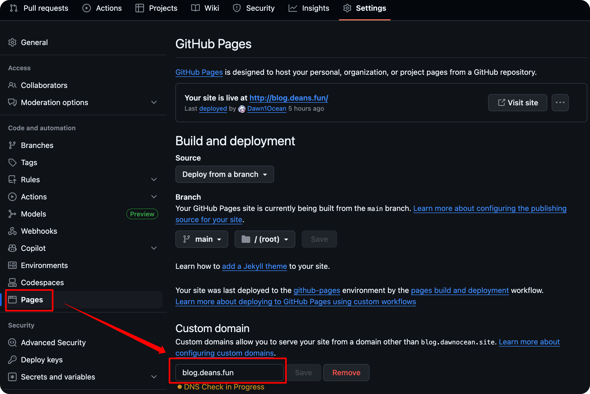

# 迁移原因

这次是因为域名续费比较贵……并且 DNSPod 有一个十年长期域名活动，于是花了 230 元购买了十年的域名。大概是不会再迁移了！

自 2025 年 6 月 22 日起，本博客已迁移至`dawnocean.site`域名下。原域名`deans.fun`在 7 月 27 日到期前可继续访问。

由于需要将原域名逐渐转移到新域名去，在双域名共存的配置情况下也有了一些经验，就在这里分享一下吧。

# GitHub Pages CNAME

Github Pages 对应的 Repository 下包含一个 CNAME 文件，它表明了你的自定义域名。在仓库的 Page 配置页面，只能选择一个自定义域名。

直接在域名 DNS 服务商进行 DNS 配置也是不可以的，会出现“404 There is not a GitHub Pages site here.”的错误信息。

# 解决办法

我们可以在自己账户下新建一个同样支持 GitHub Pages 的仓库，再绑定自己的另一个自定义域名就可以了。

首先，需要在 DNS 服务商处建立从新域名到 username.github.io 以及原域名到 username.github.io 的 CNAME 解析。

根据 GitHub Pages 的要求，我们需要以下页面：

```
.
├── _config.yml
├── 404.html
├── CNAME
└── index.html
```

我们在`_config.yml`当中填入 GitHub Pages 的配置：

```yml
title: xxx
author: xxx
```

我们在`index.html`以及`404.html`当中设置重定向：

```html
<!-- index.html -->
<!DOCTYPE html>
<html>
<head>
    <meta charset="utf-8">
    <title>正在重定向……</title>
</head>
    <script language="javascript">
        var domain = "destination.domain";
        var current = window.location.href;
        var target = current.substring(current.indexOf('/', current.indexOf(':') + 3));
        window.location.href = "//" + domain + target;
        location.href = "//" + domain + target;
    </script>
    <body>
        正在重定向……
    </body>
</html>
```

```html
<!-- 404.html -->
<script src="http://cdn.bootcss.com/purl/2.3.1/purl.min.js"></script>

<script>
var url = purl();
if (url.attr('host') == 'source.domain') {
    var old_url = url.attr('source');
    var new_url = old_url.replace('source.domain', "destination.domain");
    window.location.replace(new_url); 
} else {
    window.location.href = "https://destination.domain";
}
    
</script>
```

最后，在 GitHub 仓库的 Settings - Pages 页面填入原来的域名即可。

