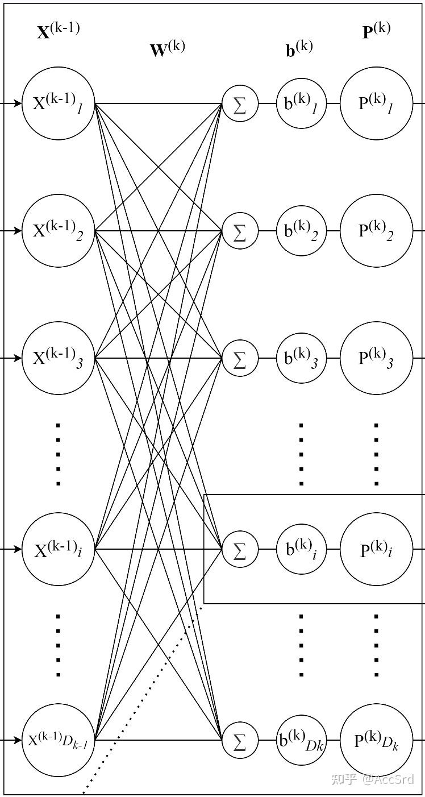
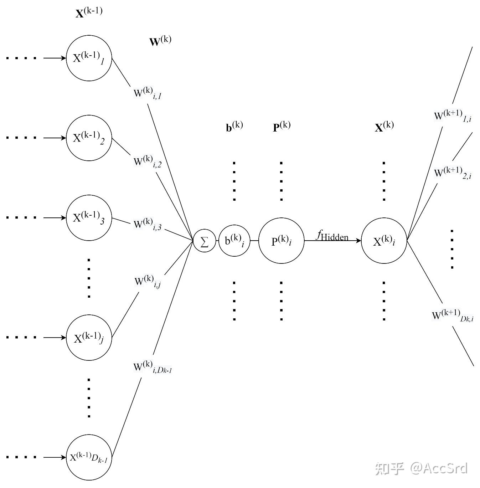
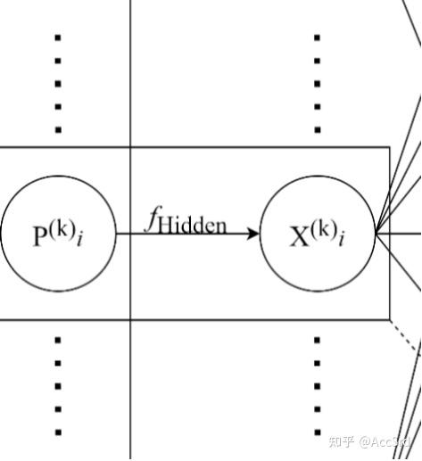
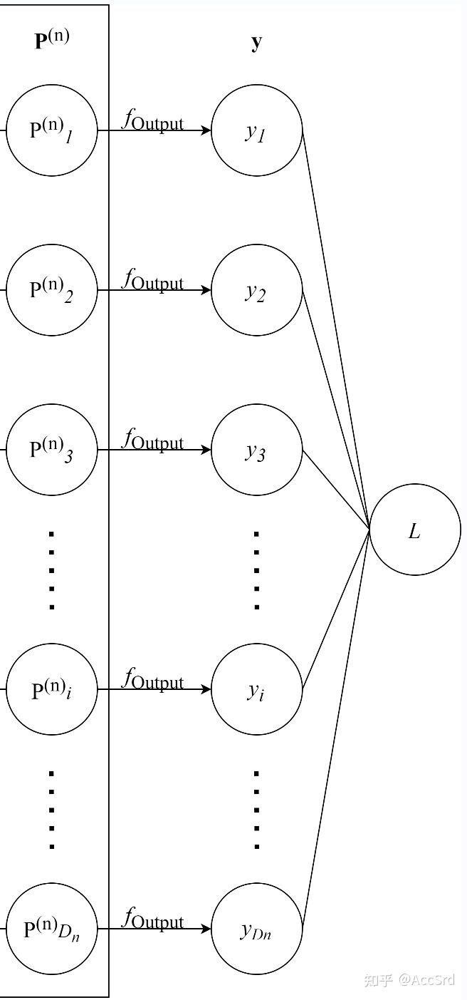
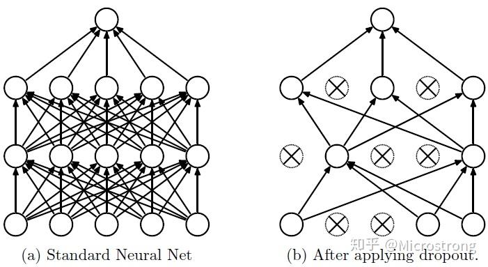
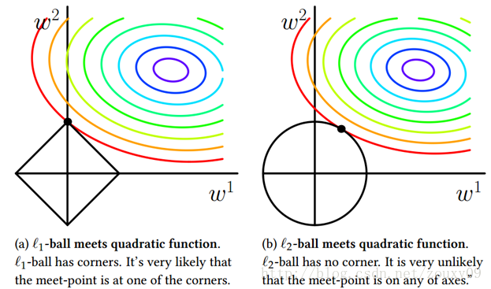

# 神经网络学习笔记

# MLP

对于 $n$ 层全连接神经网络（MLP），



- $\mathbf{X}^{k-1},\mathbf{W}^k,\mathbf{b}^k,\mathbf{P}^k$ 分别表示第 $k$ 层全连接网络的输入向量、权重矩阵、偏置向量与隐藏层中间向量

$$
\mathbf{X}^k:=\begin{bmatrix}
X_1^k\\
X_2^k\\
\vdots\\
X_{D_k}^k\\
\end{bmatrix}_{D_k\times1},\ 
\mathbf{W}^k:=\begin{bmatrix}
W_{1,1}^k&W_{1,2}^k&\cdots&W_{1,D_{k-1}}^k\\
W_{2,1}^k&W_{2,2}^k&\cdots&W_{2,D_{k-1}}^k\\
\vdots&\vdots&\ddots&\vdots\\
W_{D_k,1}^k&W_{D_k,2}^k&\cdots&W_{D_k,D_{k-1}}^k\\
\end{bmatrix}_{D_k\times D_{k-1}},\ 
\mathbf{b}^k:=\begin{bmatrix}
b_1^k\\
b_2^k\\
\vdots\\
b_{D_k}^k\\
\end{bmatrix}_{D_k\times1}
$$

当采用 Batch（同时训练多个数据）进行训练时：

$$
\mathbf{X}^k:=\begin{bmatrix}
X_{1b_1}^k&X_{1b_2}^k&\cdots&X_{1b_{D_b}}^k\\
X_{2b_1}^k&X_{2b_2}^k&\cdots&X_{2b_{D_b}}^k\\
\vdots&\vdots&\ddots&\vdots\\
X_{D_kb_1}^k&X_{D_kb_2}^k&\cdots&X_{D_kb_{D_b}}^k\\
\end{bmatrix}_{D_k\times D_b}
$$

## 隐藏层内传递



$$
\mathbf{P}^k=\mathbf{W}^k\mathbf{X}^{k-1}+\mathbf{b}^k=
\begin{bmatrix}
\sum_{j=1}^{D_{k-1}}W_{1,j}^kX_j^{k-1}+b_1^k\\
\sum_{j=1}^{D_{k-1}}W_{2,j}^kX_j^{k-1}+b_2^k\\
\vdots\\
\sum_{j=1}^{D_{k-1}}W_{i,j}^kX_j^{k-1}+b_i^k\\
\vdots\\
\sum_{j=1}^{D_{k-1}}W_{D_k,j}^kX_j^{k-1}+b_{D_k}^k\\
\end{bmatrix}_{D_k\times1} 
=\begin{bmatrix}
P_1^k\\
P_2^k\\
\vdots\\
P_i^k\\
\vdots\\
P_{D_k}^k\\
\end{bmatrix}_{D_k\times1} 
$$

当采用 Batch 进行训练时：

$$
\begin{aligned}
\mathbf{P}^k=\mathbf{W}^k\mathbf{X}^{k-1}+\mathbf{b}^k&=
\begin{bmatrix}
\sum_{j=1}^{D_{k-1}}W_{1,j}^kX_{jb_1}^{k-1}+b_1^k&\cdots&\sum_{j=1}^{D_{k-1}}W_{1,j}^kX_{jb_{D_b}}^{k-1}+b_1^k\\
\sum_{j=1}^{D_{k-1}}W_{2,j}^kX_{jb_1}^{k-1}+b_2^k&\cdots&\sum_{j=1}^{D_{k-1}}W_{2,j}^kX_{jb_{D_b}}^{k-1}+b_2^k\\
\vdots&\vdots&\vdots\\
\sum_{j=1}^{D_{k-1}}W_{i,j}^kX_{jb_1}^{k-1}+b_i^k&\cdots&\sum_{j=1}^{D_{k-1}}W_{i,j}^kX_{jb_{D_b}}^{k-1}+b_i^k\\
\vdots&\vdots&\vdots\\
\sum_{j=1}^{D_{k-1}}W_{D_k,j}^kX_{jb_1}^{k-1}+b_{D_k}^k&\cdots&\sum_{j=1}^{D_{k-1}}W_{D_k,j}^kX_{jb_{D_b}}^{k-1}+b_{D_k}^k\\
\end{bmatrix}_{D_k\times D_b}\\ 
&=\begin{bmatrix}
P_{1b_1}^k&\cdots&P_{1b_{D_b}}^k\\
P_{2b_1}^k&\cdots&P_{2b_{D_b}}^k\\
\vdots&\vdots&\vdots\\
P_{ib_1}^k&\cdots&P_{ib_{D_b}}^k\\
\vdots&\vdots&\vdots\\
P_{D_kb_1}^k&\cdots&P_{D_kb_{D_b}}^k\\
\end{bmatrix}_{D_k\times D_b}
\end{aligned} 
$$

## 隐藏层间传递



$$
\mathbf{X}^k=f(\mathbf{P}^k)=\begin{bmatrix}
f(P_1^k)\\
f(P_2^k)\\
\vdots\\
f(P_{D_k}^k)\\
\end{bmatrix}_{D_k\times1} 
$$

当采用 Batch 进行训练时：

$$
\mathbf{X}^k=f(\mathbf{P}^k)=\begin{bmatrix}
f(P_{1b_1}^k)&f(P_{1b_2}^k)&\cdots&f(P_{1b_{D_b}}^k)\\
f(P_{2b_1}^k)&f(P_{2b_2}^k)&\cdots&f(P_{2b_{D_b}}^k)\\
\vdots&\vdots&\ddots&\vdots\\
f(P_{D_kb_1}^k)&f(P_{D_kb_2}^k)&\cdots&f(P_{D_kb_{D_b}}^k)\\
\end{bmatrix}_{D_k\times D_b} 
$$

其中 $f(\cdot)$ 为两隐藏层间的激活函数（一般是 Element-wise 的）。

## 输出层

输出层（第 $n$ 层）的参数向量 $\mathbf{P}^n$ 通过 $f_{\text{output}}$ 得到结果。



- $\mathbf{y}$ 为网络预测的分类结果，$\mathbf{Y}$ 为输入数据标注的真实标签

$$
\mathbf{y}=f_{\text{output}}(\mathbf{P}^n),\ \mathcal{L}=\text{Loss}(\mathbf{Y},\mathbf{y})
$$

## 反向传播（BP）与梯度下降

### 反向传播

$$
\frac{\partial\mathcal{L}}{\partial\mathbf{P}^n}=\frac{\partial\mathcal{L}}{\partial\mathbf{y}}\odot f'_{\text{output}}(\mathbf{P}^n)^T
$$

$$
\begin{dcases}
\frac{\partial\mathcal{L}}{\partial\mathbf{P}^k}=\left(\frac{\partial\mathcal{L}}{\partial\mathbf{P}^{k+1}}\cdot\mathbf{W}^{k+1}\right)\odot f'(\mathbf{P}^k)^T\\
\frac{\partial\mathcal{L}}{\partial\mathbf{W}^k}=\mathbf{X}^{k-1}\cdot\frac{\partial\mathcal{L}}{\partial\mathbf{P}^k}\\
\frac{\partial\mathcal{L}}{\partial\mathbf{b}^k}=\frac{\partial\mathcal{L}}{\partial\mathbf{P}^k}
\end{dcases} ,\quad 0\le k<n
$$

当采用 Batch（同时训练多个数据）进行训练时，偏置梯度更新为以下式子：

$$
\frac{\partial\mathcal{L}}{\partial\mathbf{b}^k}=\mathbf{J}_{1\times D_b}\cdot\frac{\partial\mathcal{L}}{\partial\mathbf{P}^k}
$$

### 梯度下降

$$
\begin{dcases}
\mathbf{W}^k_{(s+1)}=\mathbf{W}^k_{(s)}-\alpha\cdot\frac{\partial\mathcal{L}}{\partial\mathbf{W}^k_{(s)}}^T\\
\mathbf{b}^k_{(s+1)}=\mathbf{b}^k_{(s)}-\alpha\cdot\frac{\partial\mathcal{L}}{\partial\mathbf{b}^k_{(s)}}^T
\end{dcases} ,\quad 0\le k<n 
$$

其中：

- $(s)$ 和 $(s+1)$ 分别表示当前状态和下一状态
- $\alpha$ 为学习率（Learning rate）
- $D_k$ 为第 $k$ 层网络中的神经元个数



描述反向传播与梯度下降更新过程：

1. 计算输出层的 $\frac{\partial\mathcal{L}}{\partial\mathbf{P}^n}$ 作为初始状态
   1. 计算本层的 $\mathbf{P}^n$（前向传播），代入输出函数的导数得到一个列向量，将其转置为行向量
   2. 计算 $\frac{\partial\mathcal{L}}{\partial\mathbf{y}}$（相当于行向量中对每个 $y_i$ 分别求偏导）
      1. MSE（均方误差）的梯度为：

         $$
         \mathcal{L}=\frac{1}{D_n}\sum^{D_n}_{i=1}(Y_i-y_i)^2
         $$

         $$
         {\frac{\partial\mathcal{L}}{\partial\mathbf{y}}}=\left[
         \begin{darray}{ccc}
         \frac{-2Y_1+2y_1}{D_n}&\frac{-2Y_2+2y_2}{D_n}&\cdots&\frac{-2Y_{D_n}+2y_{D_n}}{D_n}
         \end{darray}\right]
         $$
      2. Cross-Entropy Error（交叉熵损失）的梯度为：

         $$
         \mathcal{L}=\sum^{D_n}_{i=1}Y_i\log{y_i}
         $$

         $$
         {\frac{\partial\mathcal{L}}{\partial\mathbf{y}}}=\left[
         \begin{darray}{ccc}
         \frac{Y_1}{y_1}&\frac{Y_2}{y_2}&\cdots&\frac{Y_{D_n}}{y_{D_n}}
         \end{darray}\right]
         $$
   3. a. 与 b. 点乘得到 $\frac{\partial\mathcal{L}}{\partial\mathbf{P}^n}$
2. 递推计算上一层的 $\frac{\partial\mathcal{L}}{\partial\mathbf{P}^k}$
   1. 计算本层的 $\mathbf{P}^k$（前向传播），代入激活函数的导数
   2. 下一层的 $\frac{\partial\mathcal{L}}{\partial\mathbf{P}^{k+1}}$ 与下一层的权值 $\mathbf{W}^{k+1}$ 相乘，再与 $f'(\mathbf{P}^k_{(s)})^T$ 点乘得到本层 $\frac{\partial\mathcal{L}}{\partial\mathbf{P}^k}$
3. 递推计算上一层的权值梯度 $\frac{\partial\mathcal{L}}{\partial\mathbf{W}^k}$
   1. 本层输入 $\mathbf{X}^{k-1}$ 乘以 $\frac{\partial\mathcal{L}}{\partial\mathbf{P}^k}$&#x20;
4. 递推计算上一层的偏置梯度 $\frac{\partial\mathcal{L}}{\partial\mathbf{b}^k}$
   1. 单数据训练时，为本层 $\frac{\partial\mathcal{L}}{\partial\mathbf{P}^k}$&#x20;
   2. Batch 训练时，为本层 $\mathbf{J}_{1\times D_b}\cdot\frac{\partial\mathcal{L}}{\partial\mathbf{P}^k}$（相当于 $\frac{\partial\mathcal{L}}{\partial\mathbf{P}^k}$ 每行求和）
5. 梯度下降更新上一层的权值 $\mathbf{W}^k_{(s+1)}$ 与偏置 $\mathbf{b}^k_{(s+1)}$
   1. 权值更新为原权值减去学习率乘以权值梯度的转置 $\frac{\partial\mathcal{L}}{\partial\mathbf{W}^k_{(s)}}^T$
   2. 偏置更新为原偏置减去学习率乘以偏置梯度的转置 $\frac{\partial\mathcal{L}}{\partial\mathbf{b}^k_{(s)}}^T$
6. 重复 2. - 5. 直至更新至第一层
7. 重复 1. - 6. 直至损失函数小于事先给定的阈值 / 达到迭代次数

## Numpy 实现

```python 
import numpy as np
import matplotlib.pyplot as plt

MSE = lambda y, t : np.mean((y - t) ** 2)
MSE_f = lambda y, Y : 2 * (y - Y) / Y.shape[0]
CEE = lambda y, t : np.sum(y * np.log(t))
CEE_f = lambda y, Y : Y / y

class Layer:
    def __init__(self, input_n, param):
        self.input_n = input_n
        self.n = param['n']
        self.weights = np.random.uniform(size = (self.n, input_n)) * 0.01 # Uniform Initialization
        self.biases = np.zeros((self.n, 1))
        self.learning_rate = param['learning_rate']
        self.sigma = param['sigma']
        self.sigma_d = param['sigma_d']

    def forward(self, input):
        self.output = self.sigma(self.weights @ input + self.biases)

    def update(self, input):
        self.weights -= self.learning_rate * (input @ self.error_term).T
        self.biases -= self.learning_rate * (np.ones((1, self.error_term.shape[0])) @ self.error_term).T 

class All_Connect_Layer(Layer):
    def __init__(self, input_n, param):
        super().__init__(input_n, param)

    def calc_loss(self, next_error_term, next_weights):
        error = next_error_term @ next_weights
        self.error_term = error * self.sigma_d(self.output).T

class Output_Layer(Layer):
    def __init__(self, input_n, param):
        super().__init__(input_n, param)

    def calc_loss(self, y, error_f):
        error = error_f(self.output, y).T
        self.error_term = error * self.sigma_d(self.output).T

class MLP:
    def __init__(self, layer_array, x, y, error_f, seed):
        assert y.shape[0] == layer_array[-1]['n']
        self.x = x
        self.y = y
        self.layers = []
        self.output_n = y.shape[0]
        self.error_f = error_f
        self.batch_size = 1

        np.random.seed(seed)

        self.layers.append(All_Connect_Layer(x.shape[0], layer_array[0]))
        if len(layer_array) > 2:
            for i in range(1, len(layer_array) - 1):
                self.layers.append(All_Connect_Layer(layer_array[i-1]['n'], layer_array[i]))
        self.layers.append(Output_Layer(layer_array[-2]['n'], layer_array[-1]))

    def iterate(self):
        random_indices = np.random.permutation(self.x.shape[1])
        x_random, y_random = self.x[:, random_indices], self.y[:, random_indices]
        for x, y in zip([x_random], [y_random]):
            # Forward
            self.layers[0].forward(x)
            for i in range(1, len(self.layers)):
                self.layers[i].forward(self.layers[i-1].output)
            # Calc_loss
            self.layers[-1].calc_loss(y, self.error_f)
            for i in range(len(self.layers) - 2, -1, -1):
                self.layers[i].calc_loss(self.layers[i+1].error_term, self.layers[i+1].weights)
            # Update
            self.layers[0].update(x)
            for i in range(1, len(self.layers)):
                self.layers[i].update(self.layers[i-1].output)
            # Output
            self.output = self.layers[-1].output
        return x_random, y_random

    def training(self, epochs, test, label, loss_f):
        plot_epoch, plot_training, plot_test = [], [], []
        for epoch in range(epochs):
            x_random, y_random = self.iterate()
            plot_epoch.append(epoch)
            output = self.test(x_random)
            train_loss = loss_f(y_random, output)
            plot_training.append(train_loss)
            result = self.test(test)
            test_loss = loss_f(label, result)
            plot_test.append(test_loss)
            print(f"Epoch {epoch}, Train Loss: {train_loss:.4f}, Test Loss: {test_loss:.4f}")

        plt.plot(plot_epoch, plot_training, label = 'Train')
        plt.plot(plot_epoch, plot_test, color = 'orange', label = 'Test')
        plt.title('Loss')
        plt.legend()
        plt.show()

    def test(self, x):
        self.layers[0].forward(x)
        for i in range(1, len(self.layers)):
            self.layers[i].forward(self.layers[i-1].output)
        return self.layers[-1].output
```


## 优化策略

### Xavier 初始化

为了尽量达到输入、输出方差一致的目标而采用的初始化办法。

| 激活函数           | Sigmoid                                | ReLU                                    | Tanh                                    |
| -------------- | -------------------------------------- | --------------------------------------- | --------------------------------------- |
| 均匀分布  （取值上下限）  | $\pm\sqrt{\frac{6}{D_{n-1}+D_n}}$  | $\pm\sqrt{\frac{12}{D_{n-1}+D_n}}$  | $\pm4\sqrt{\frac{6}{D_{n-1}+D_n}}$  |
| 高斯分布  （取值标准差）  | $\sqrt{\frac{2}{D_{n-1}+D_n}}$     | $\sqrt{\frac{4}{D_{n-1}+D_n}}$      | $4\sqrt{\frac{2}{D_{n-1}+D_n}}$     |

### 数据标准化

$$
\mathbf{X}'=\frac{\mathbf{X}-\vec{\mu}}{\vec{\sigma}}
$$

### Batch Normalization

通过归一化手段，将每层输入强行拉回均值 0 方差为 1 的标准正态分布，这样使得激活输入值分布在非线性函数梯度敏感区域，从而避免梯度消失问题，大大加快训练速度。

### 优化激活函数



### Dropout

在前向传播的时候，让某个神经元的激活值以一定的概率 $p$ 停止工作，可以使模型泛化性更强。



$$
\begin{gathered}
\mathbf{r}^{k-1}=\text{Bernoulli}(p),\quad \dim{\mathbf{r}^{k-1}}= \dim{\mathbf{X}^{k-1}}\\
\mathbf{X'}^{k-1}=\frac{\mathbf{r}^{k-1}\odot\mathbf{X}^{k-1}}{1-p}\\
\mathbf{P}^k=\mathbf{W}^k\mathbf{X'}^{k-1}+\mathbf{b}^k
\end{gathered}
$$

反向传播时，只更新本轮正在工作的神经元权值。

为了维持权重参数，在前向传播时对剩下的神经元乘以补偿系数$1/(1-p)$。

测试时不进行 Dropout。

### 权重衰退（L2 正则化）

权重衰退的目的是让模型权重减小（控制在某一个范围内），以此来减小模型的复杂性，从而抑制过拟合。



$$
\begin{aligned}
\mathcal{L}&=\mathcal{L}_0+\frac{\lambda}{2}||\mathbf{W}||^2\\
\Rightarrow\mathbf{W}^k_{(s+1)}&=\mathbf{W}^k_{(s)}-\alpha\cdot\frac{\partial\mathcal{L}}{\partial\mathbf{W}^k_{(s)}}^T\\
&=\mathbf{W}^k_{(s)}-\alpha\cdot\left(\frac{\partial\mathcal{L}_0}{\partial\mathbf{W}^k_{(s)}}^T+\lambda\mathbf{W}^k_{(s)}\right)
\end{aligned} 
$$

### Numpy 实现

```python 
import numpy as np
import matplotlib.pyplot as plt

MSE = lambda y, t : np.mean((y - t) ** 2)
MSE_f = lambda y, Y : 2 * (y - Y) / Y.shape[0]
CEE = lambda y, t : np.sum(y * np.log(t))
CEE_f = lambda y, Y : Y / y

class Layer:
    def __init__(self, input_n, param):
        self.input_n = input_n
        self.n = param['n']
        self.weights = np.random.randn(self.n, input_n) * np.sqrt(4. / (input_n + self.n)) # Xavier Initialization
        self.biases = np.zeros((self.n, 1))
        self.learning_rate = param['learning_rate']
        self.sigma = param['sigma']
        self.sigma_d = param['sigma_d']
        self.weight_decay = param['weight_decay']
        self.dropout_rate = param['dropout']
        self.dropout_array = np.tile(np.random.binomial(1, 1 - self.dropout_rate, input_n), (self.n, 1)) # Neuron-wise Dropout

    def forward(self, input, is_final = False):
        dropout_param = 0 if is_final else self.dropout_rate
        self.output = self.sigma((self.weights * self.dropout_array / (1 - dropout_param)) @ input + self.biases)

    def update(self, input):
        self.weights -= self.learning_rate * (self.weights * self.weight_decay + (input @ self.error_term).T) * self.dropout_array
        self.biases -= self.learning_rate * (np.ones((1, self.error_term.shape[0])) @ self.error_term).T
        self.dropout_array = np.tile(np.random.binomial(1, 1 - self.dropout_rate, self.input_n), (self.n, 1))

class All_Connect_Layer(Layer):
    def __init__(self, input_n, param):
        super().__init__(input_n, param)

    def calc_loss(self, next_error_term, next_weights):
        error = next_error_term @ next_weights
        self.error_term = error * self.sigma_d(self.output).T

class Output_Layer(Layer):
    def __init__(self, input_n, param):
        super().__init__(input_n, param)

    def calc_loss(self, y, error_f):
        error = error_f(self.output, y).T
        self.error_term = error * self.sigma_d(self.output).T

class MLP:
    def __init__(self, layer_array, x, y, error_f, batch_size, seed):
        assert y.shape[0] == layer_array[-1]['n']
        self.x = x
        self.y = y
        self.layers = []
        self.output_n = y.shape[0]
        self.error_f = error_f
        self.batch_size = batch_size

        np.random.seed(seed)

        self.layers.append(All_Connect_Layer(x.shape[0], layer_array[0]))
        if len(layer_array) > 2:
            for i in range(1, len(layer_array) - 1):
                self.layers.append(All_Connect_Layer(layer_array[i-1]['n'], layer_array[i]))
        self.layers.append(Output_Layer(layer_array[-2]['n'], layer_array[-1]))

    def gen_batch(self, x, y):
        x_batch, y_batch = [], []
        for i in range(self.batch_size):
            indices = np.arange(i, x.shape[1], self.batch_size)
            x_batch.append(x[:, indices])
            y_batch.append(y[:, indices])
        return x_batch, y_batch

    def iterate(self):
        random_indices = np.random.permutation(self.x.shape[1])
        x_random, y_random = self.x[:, random_indices], self.y[:, random_indices]
        x_batch, y_batch = self.gen_batch(x_random, y_random)
        for x, y in zip(x_batch, y_batch):
            # Forward
            self.layers[0].forward(x)
            for i in range(1, len(self.layers)):
                self.layers[i].forward(self.layers[i-1].output)
            # Calc_loss
            self.layers[-1].calc_loss(y, self.error_f)
            for i in range(len(self.layers) - 2, -1, -1):
                self.layers[i].calc_loss(self.layers[i+1].error_term, self.layers[i+1].weights)
            # Update
            self.layers[0].update(x)
            for i in range(1, len(self.layers)):
                self.layers[i].update(self.layers[i-1].output)
            # Output
            self.output = self.layers[-1].output
        return x_random, y_random

    def training(self, epochs, test, label, loss_f):
        plot_epoch, plot_training, plot_test = [], [], []
        for epoch in range(epochs):
            x_random, y_random = self.iterate()
            plot_epoch.append(epoch)
            output = self.test(x_random)
            train_loss = loss_f(y_random, output)
            plot_training.append(train_loss)
            result = self.test(test)
            test_loss = loss_f(label, result)
            plot_test.append(test_loss)
            print(f"Epoch {epoch}, Train Loss: {train_loss:.4f}, Test Loss: {test_loss:.4f}")

        plt.plot(plot_epoch, plot_training, label = 'Train')
        plt.plot(plot_epoch, plot_test, color = 'orange', label = 'Test')
        plt.title('Loss')
        plt.legend()
        plt.show()

    def test(self, x, is_final = False):
        if is_final:
            for layer in self.layers:
                layer.dropout_array = np.ones((layer.n, layer.input_n))
        self.layers[0].forward(x)
        for i in range(1, len(self.layers)):
            self.layers[i].forward(self.layers[i-1].output, is_final)
        return self.layers[-1].output
```