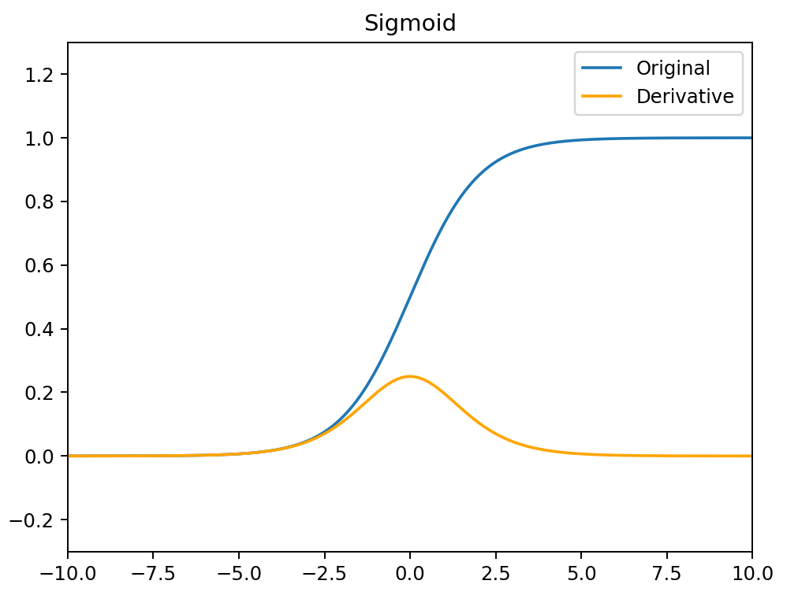
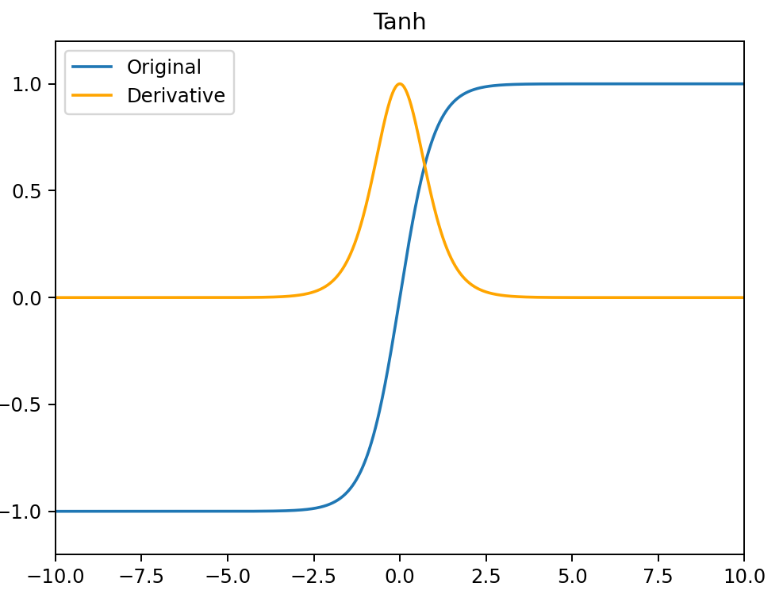
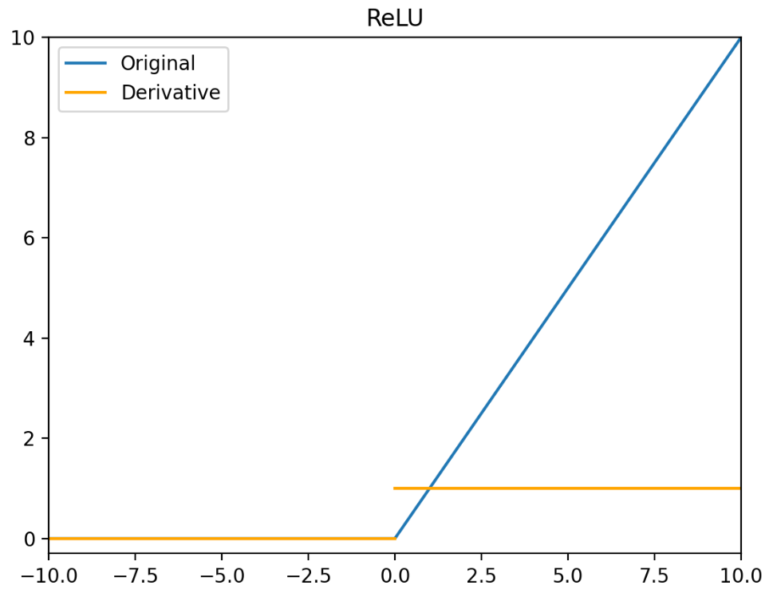
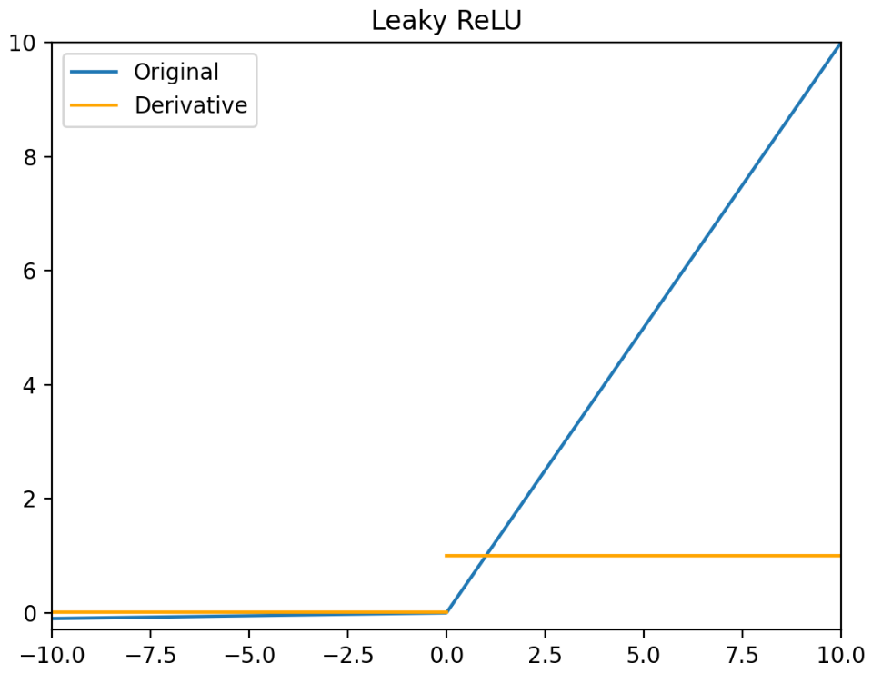
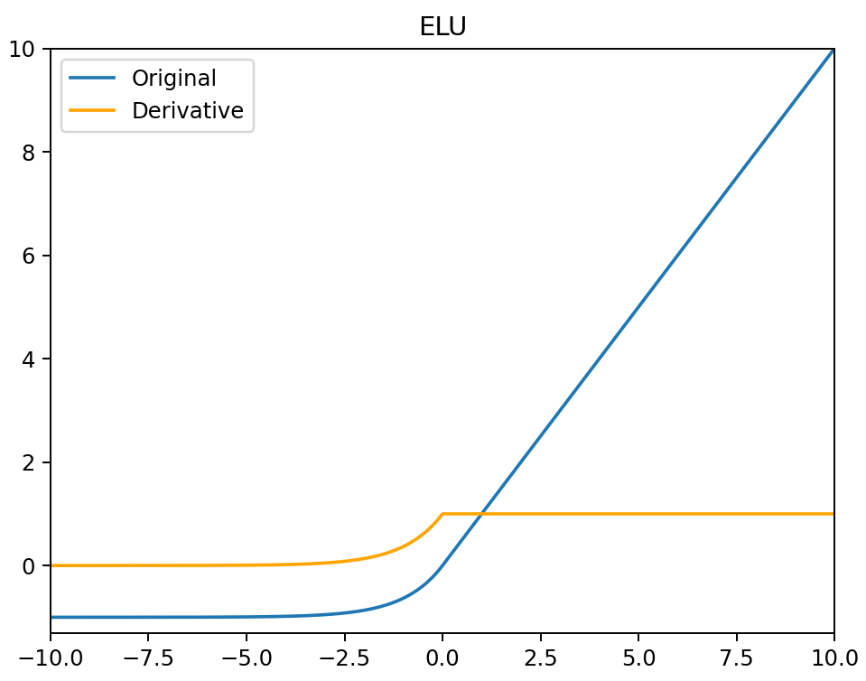
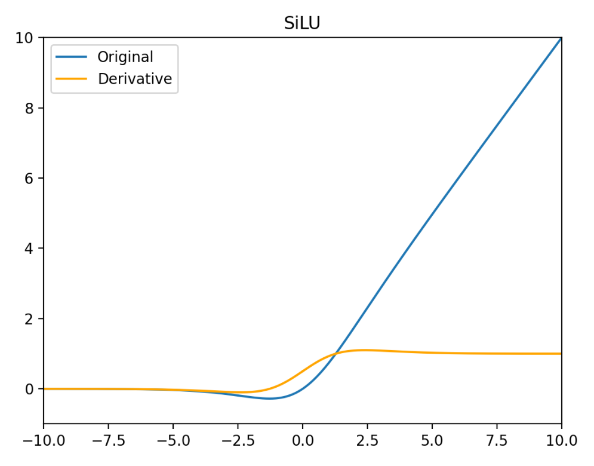
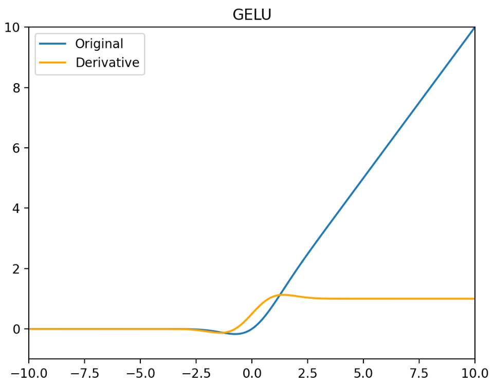
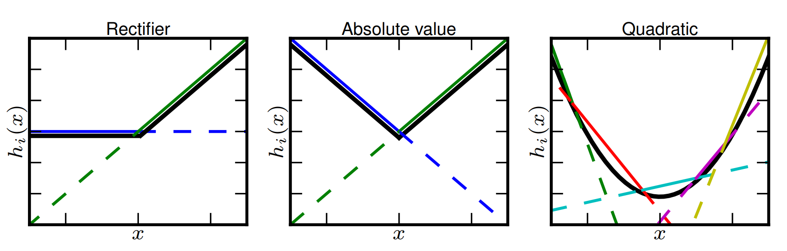
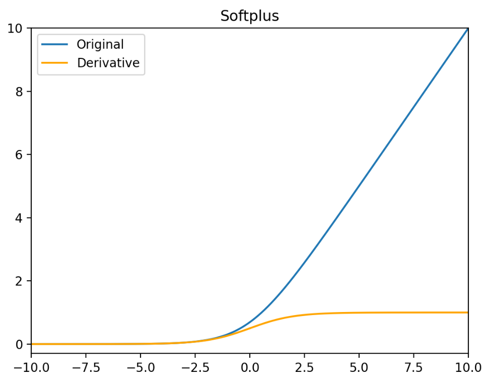
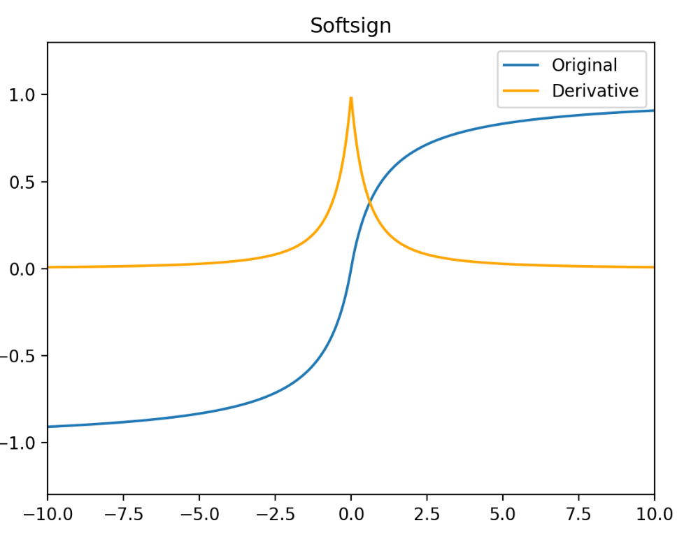

# Sigmoid

$$
\sigma(x)=\frac{1}{1+e^{-x}}
$$

$$
\sigma'(x)=\frac{e^{-x}}{(1+e^{-x})^2}=\sigma(x)(1-\sigma(x))
$$

- Sigmoid函数的输出范围是0到1。因此它对每个神经元的输出进行了归一化
- 用于将预测概率作为输出的模型。由于概率的取值范围是0到1，因此Sigmoid函数非常合适
- 梯度平滑，避免跳跃的输出值
- 函数是可微的。这意味着可以找到任意两个点的Sigmoid曲线的斜率
- 明确的预测，即非常接近1或0。
- 函数输出不是以0为中心的，这会降低权重更新的效率
- Sigmoid函数执行指数运算，计算机运行得较慢。



# Tanh

$$
\tanh(x)=\frac{e^x-e^{-x}}{e^x+e^{-x}}
$$

$$
\tanh'(x)=1-\tanh^2(x)
$$

- 它解决了 Sigmoid 函数不以 0 为中心输出问题，然而，梯度消失的问题和幂运算的问题仍然存在。



# PReLU / LeakyReLU / ReLU

$$
\text{PReLU}(x)=
\begin{dcases}
x,&\quad x>0\\
\alpha_ix,&\quad x\le0
\end{dcases} 
$$

$$
\text{PReLU}'(x)=
\begin{dcases}
1,&\quad x>0\\
\alpha_i,&\quad x\le0
\end{dcases} 
$$

PReLU（Paramatic Rectified Linear Units）函数中，$\alpha$ 通常为 0 到 1 之间的数字，并且通常相对较小。

- 如果 $\alpha_i=0$ ，则 PReLU(x) 变为  ReLU。
- 如果 $\alpha_i>0$ ，则 PReLU(x) 变为 Leaky ReLU。
- 如果 $\alpha_i$ 是可学习的参数，则PReLU(x) 变为 PReLU 函数。

PReLU 函数的特点：

- 在负值域，PReLU 的斜率较小，这也可以避免 Dead ReLU 问题。
- 与 ELU 相比，PReLU 在负值域是线性运算。尽管斜率很小，但不会趋于 0。

$$
\text{ReLU}(x)=
\begin{dcases}
x,&\quad x>0\\
0,&\quad x\le0
\end{dcases} 
$$

$$
\text{ReLU}'(x)=
\begin{dcases}
1,&\quad x>0\\
0,&\quad x\le0
\end{dcases} 
$$



ReLU 函数的特点：

- 当输入为正时，不存在梯度饱和问题。
- 计算速度快。ReLU 函数中只存在线性关系，因此它的计算速度比 Sigmoid 函数和 tanh 函数更快。
- Dead ReLU 问题。当输入为负时，ReLU 完全失效，在正向传播过程中，这不是问题。有些区域很敏感，有些则不敏感。但是在反向传播过程中，如果输入负数，则梯度将完全为零，Sigmoid 函数和 tanh 函数也具有相同的问题。
- ReLU 函数的输出为 0 或正数，这意味着 ReLU 函数不是以 0 为中心的函数。

$$
\text{Leaky ReLU}(x)=
\begin{dcases}
x,&\quad x>0\\
0.01x,&\quad x\le0
\end{dcases} 
$$

$$
\text{Leaky ReLU}'(x)=
\begin{dcases}
1,&\quad x>0\\
0.01,&\quad x\le0
\end{dcases} 
$$



Leaky ReLU 函数的特点：

- Leaky ReLU 函数通过把 $x$ 的非常小的线性分量给予负输入 $0.01x$ 来调整负值的零梯度问题。
- Leaky 有助于扩大 ReLU 函数的范围，通常 $\alpha$ 的值为 0.01 左右。
- Leaky ReLU 的函数范围是负无穷到正无穷。

# ELU

$$
\text{ELU}(x)=
\begin{dcases}
x,&\quad x>0\\
\alpha(e^x-1),&\quad x\le0
\end{dcases} 
$$

$$
\text{ELU}'(x)=
\begin{dcases}
1,&\quad x>0\\
\alpha e^x,&\quad x\le0
\end{dcases} 
$$

- 没有 Dead ReLU 问题，输出的平均值接近 0，以 0 为中心。
- ELU 通过减少偏置偏移的影响，使正常梯度更接近于单位自然梯度，从而使均值向零加速学习。
- ELU 函数在较小的输入下会饱和至负值，从而减少前向传播的变异和信息。
- ELU 函数的计算强度更高。与 Leaky ReLU 类似，尽管理论上比 ReLU 要好，但目前在实践中没有充分的证据表明 ELU 总是比 ReLU 好。



# Swish / SiLU

$$
\text{Swish}(x)=x\cdot\sigma(\beta x)
$$

$$
\text{Swish}'(x)=\sigma(\beta x)+\beta x\sigma(\beta x)-\beta x\sigma^2(\beta x) 
$$

Swish函数中，参数 $\beta$ 是一个**可学习参数或固定常数**。$β$$=1$ 时，Swish 激活函数就是 SiLU 激活函数。

Swish 函数的特点：

- 有助于防止慢速训练期间，梯度逐渐接近0并导致饱和。
- 导数恒大于0。
- 平滑度在优化和泛化中起了重要作用。

$$
\text{SiLU}(x)=x\cdot\sigma(x)
$$

$$
\text{SiLU}'(x)=\frac{1+e^{-x}+xe^{-x}}{1+2e^{-x}+e^{-2x}}=\sigma(x)+x\sigma(x)-x\sigma^2(x)
$$




SiLU 的特点：

- 非单调性：当 x < 0 时，输出先减小后增大（极小值约在 x ≈ −1.278 处），增强了非线性表达能力
- 负区间梯度保留：即使 x < 0，梯度仍非零避免 ReLU 的神经元死亡问题
- 自适应激活：通过 Sigmoid 权重动态调整激活强度，平衡信息保留与稀疏性
- 计算成本略高于 ReLU（需计算 Sigmoid）
- 输出非零中心化，需配合 BatchNorm 使用

# GELUs

激活函数 GELU 的灵感来源于 ReLU 和 Dropout，在激活中引入了**随机正则**的思想。GELU 通过输入自身的概率分布情况，决定抛弃还是保留当前的神经元。

$$
\text{GELU}(x)=x\Phi(x)=\frac{x}{2}(1+\text{erf}(\frac{x}{\sqrt2}))=x\int_{-\infty}^{x}\frac{e^{\frac{-t^2}{2}}}{\sqrt{2\pi}}dt
$$

$$
\text{GELU}'(x)=\Phi(x)+x\Phi'(x)=\frac{1}{2}+\frac{1}{2}\text{erf}(\frac{x}{\sqrt2})+\frac{x}{2\sqrt2}\text{erf}'(\frac{x}{\sqrt2})=\int_{-\infin}^{x}\frac{e^{\frac{-t^2}{2}}}{\sqrt{2\pi}}dt+\frac{x}{\sqrt{2\pi}}e^{-\frac{x^2}{2}}
$$



GELU 在最近的 Transformer 模型中（包括 BERT，RoBertA 和 GPT2 等）得到了广泛的应用。

优点：

- 似乎是 NLP 领域的当前最佳；尤其在 Transformer 模型中表现最好
- 能避免梯度消失问题。

# Softmax

Softmax 函数是用于多类分类问题的激活函数，在多类分类问题中，超过两个类标签则需要类成员关系。对于长度为 $K$ 的任意实向量，Softmax 函数可以将其压缩为长度为 $K$，值在 $[0,1]$ 范围内，并且向量中元素的总和为1的实向量。

$$
\text{Softmax}(x)=\frac{e^{x_i}}{\sum_ie^{x_i}}
$$

$$
\text{Softmax}(x)=\frac{e^{x_i}}{\sum_ie^{x_i}}
$$

- 在零点不可微。
- 负输入的梯度为零，这意味着对于该区域的激活，权重不会在反向传播期间更新，因此会产生永不激活的死亡神经元。

# Maxout

Maxout 激活函数并不是一个固定的函数，它是一个可学习的激活函数，因为 W 参数是学习变化的。它是一个分段线性函数：



**优点**：Maxout 的拟合能力非常强，可以拟合任意的凸函数。Maxout 具有 ReLU 的所有优点，线性、不饱和性。同时没有 ReLU 的一些缺点。如：神经元的死亡。

**缺点**：从上面的激活函数公式中可以看出，每个神经元中有两组(w,b)参数，那么参数量就增加了一倍，这就导致了整体参数的数量激增。

# Softplus

Softplus 函数可以看作是 ReLU 函数的平滑。相比于早期的激活函数，Softplus 和 ReLU 更加接近脑神经元的激活模型。

$$
\text{Softplus}(x)=\ln(1+e^x)
$$

$$
\text{Softplus}'(x)=\sigma(x)
$$



# Softsign

Softsign函数反对称、去中心、可微分，并返回 -1 和 1 之间的值。其更平坦的曲线与更慢的下降导数表明它可以更高效地学习，比 Tanh 函数更好的解决梯度消失的问题。但 Softsign 函数的导数的计算比 Tanh 函数更麻烦。

$$
\text{Softsign}(x)=\frac{x}{1+|x|}
$$

$$
\text{Softsign}'(x)=\frac{1}{(1+|x|)^2}
$$



# Numpy 实现

```python 
import numpy as np
from scipy.special import erf

sigmoid = lambda x : 1 / (np.exp(-x) + 1)
sigmoid_d = lambda x : sigmoid(x) * (1 - sigmoid(x))
scaled_sigmoid = lambda x : 4 / (np.exp(-x) + 1) - 2
scaled_sigmoid_d = lambda x : 4 * sigmoid(x) * (1 - sigmoid(x))
tanh = lambda x : 2 * np.exp(2 * x) / (np.exp(2 * x) + 1) - 1
tanh_d = lambda x: 1 - tanh(x) ** 2
relu = lambda x : np.maximum(0, x)
relu_d = lambda x : np.heaviside(x, 0)
leaky_relu = lambda x : np.maximum(0.01 * x, x)
leaky_relu_d = lambda x : np.where(x < 0, 0.01, 1)
elu = lambda x : np.where(x < 0, np.exp(x) - 1, x)
elu_d = lambda x : np.where(x < 0, np.exp(x), 1)
softplus = lambda x : np.log(1 + np.exp(x))
softplus_d = sigmoid
softsign = lambda x : x / (1 + np.fabs(x))
softsign_d = lambda x : 1 / (1 + np.fabs(x)) ** 2
silu = lambda x : x * sigmoid(x)
silu_d = lambda x : sigmoid(x) + x * sigmoid(x) - x * sigmoid(x) ** 2
gelu = lambda x : 0.5 * x * (1 + erf(x / np.sqrt(2)))
gelu_d = lambda x : 0.5 * (1 + erf(x / np.sqrt(2))) + x / np.sqrt(2 * np.pi) * np.exp(-x ** 2 / 2)
```
