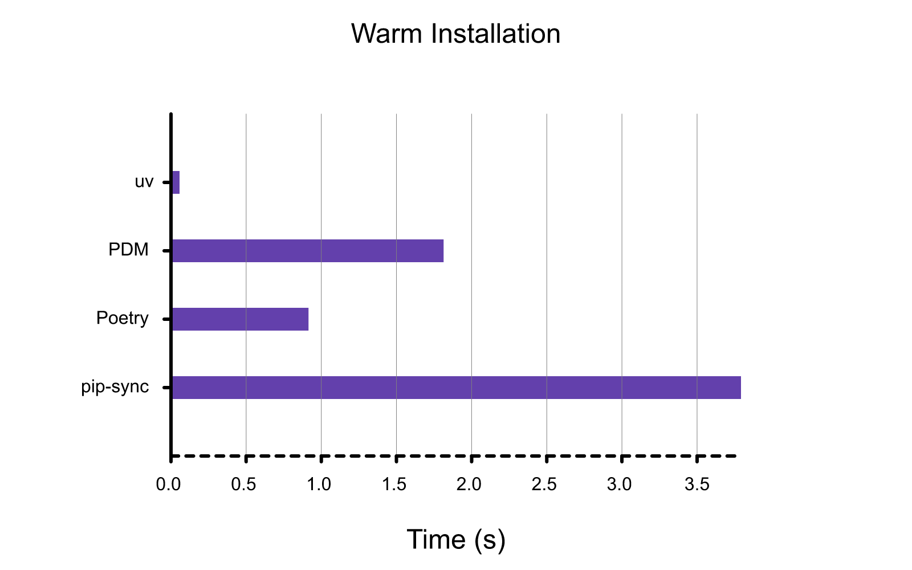
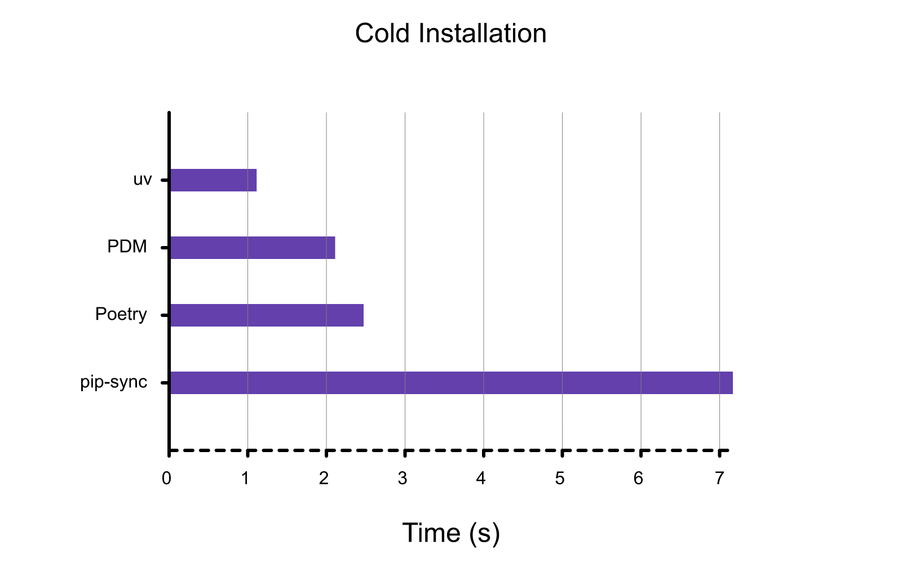
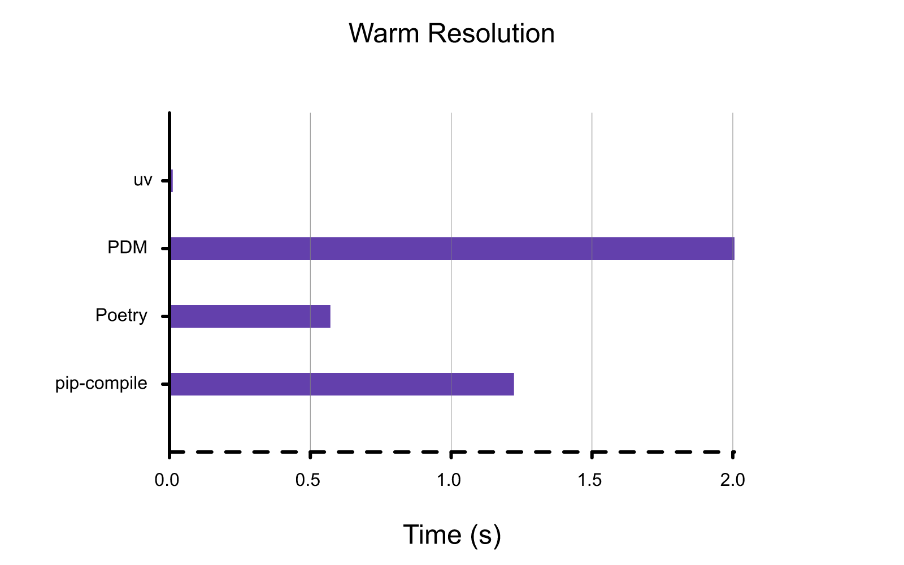
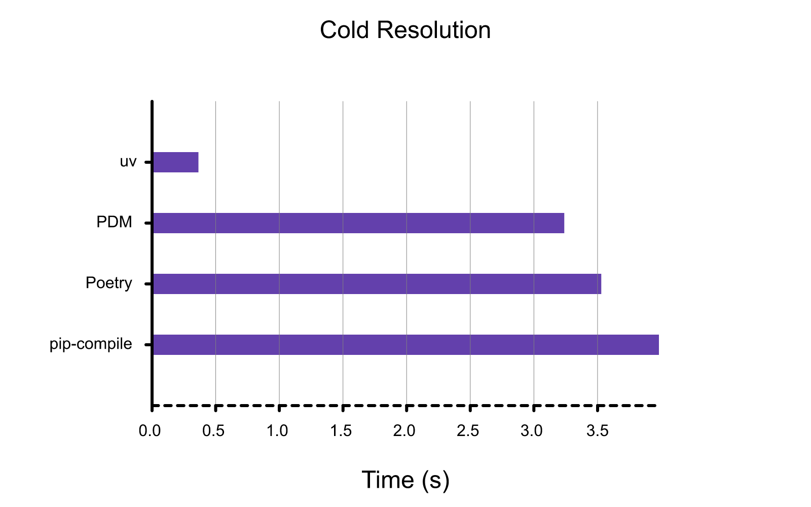
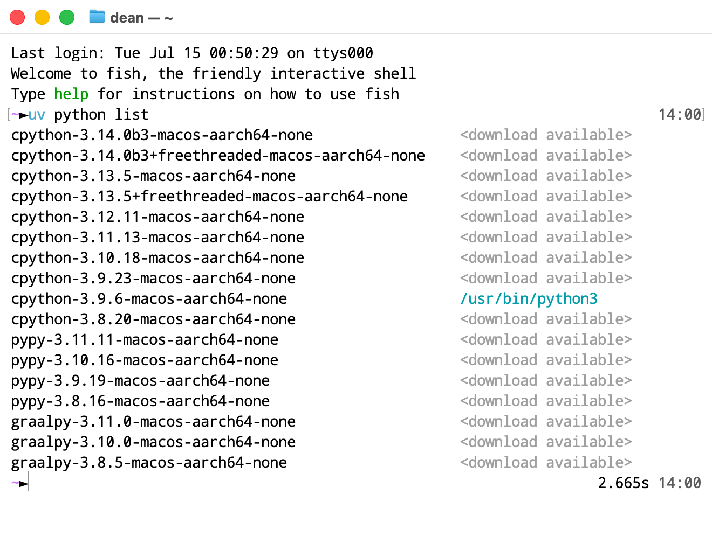

以下内容整理自 [uv 中文文档](https://uv.doczh.com/)。

# uv 是什么

> An extremely fast Python package and project manager, written in Rust.

**uv** 是由 Astral 团队开发的一款超高速 Python 包管理器，旨在替代传统的 `pip` 和 `virtualenv`。它聚焦于三个关键点：**性能、安全性、以及现代化开发流程的兼容性**。

# 为什么要使用 uv

## 性能

### Benchmark

仓库地址：[https://github.com/astral-sh/uv/blob/main/BENCHMARKS.md](https://github.com/astral-sh/uv/blob/main/BENCHMARKS.md "https://github.com/astral-sh/uv/blob/main/BENCHMARKS.md")

- 使用热缓存对软件包安装（例如 `uv sync`）进行基准测试：删除并重新创建虚拟环境，并使用同一台机器上安装的依赖项填充该环境。



- 使用冷缓存对软件包安装（例如 `uv sync`）进行基准测试：运行 `uv sync` 在新机器上或在 CI 中（假设包管理器缓存未在运行之间共享）。



- 使用热缓存（但没有现有的 lockfile）对依赖项解析（例如 `uv lock`）进行基准测试：清除现有的 `requirements.txt` 文件，从 `requirements.in` 文件重新生成。



- 使用冷缓存对依赖项解析（例如，`uv lock`）进行基准测试：在新机器上或在 CI 中运行 `uv lock`（假设包管理器缓存在运行之间不共享）。



## 存储空间

### 依赖缓存

uv 采用主动缓存策略，避免重新下载（和重新构建）之前运行中已访问过的依赖项。该缓存在硬盘中是全局的，可节省硬盘空间。（因此，需要保持 uv 安装路径与项目文件所在硬盘一致）

### 动态元数据

默认情况下，只有当目录根目录中的 `pyproject.toml`、`setup.py` 或 `setup.cfg` 文件发生更改，或者添加或删除了 `src` 目录时，uv 才会重新构建并重新安装本地目录依赖项（例如，可编辑的依赖项）。这是一种启发式方法，在某些情况下，重新安装的次数可能比预期的少。

## 和 conda 的对比

| **对比项**   | **uv**                  | **conda**           |
| ------------- | --------------------------- | ----------------------- |
| **语言支持**  | 专注 Python                   | 跨语言 (Python, R, C++ 等)  |
| **包源**    | PyPI                        | Conda Channels   |
| **虚拟环境**  | 内置，`venv` 兼容              | 独立，语言隔离                 |
| **安装速度**  | **极快**（Rust，并行，缓存）      | **较慢** (依赖解析复杂)     |
| **磁盘占用**  | **低**（全局共享缓存）           | **高**（环境相对独立）       |
| **适用场景**  | **通用 Python 开发**，CI/CD  | **数据科学**，复杂二进制依赖    |

# uv 的使用

## 太长不看

- 创建项目：`uv init`
- 安装包到环境：`uv add <package>`
- 从环境卸载包：`uv remove <package>`
- **同步环境**：`uv sync`
- 以当前环境运行文件：`uv run xxx.py`
- 清理未使用缓存：`uv cache prune`

## 项目结构

一个项目由几个重要部分组成，它们协同工作，使 uv 能够管理你的项目。 除了 `uv init` 创建的文件外，在你首次运行项目命令（如 `uv run`、`uv sync` 或 `uv lock`）时，uv 还会在项目根目录中创建一个虚拟环境和 `uv.lock` 文件。

完整的文件列表如下：

```纯文本 
.
├── .venv
│   ├── bin
│   ├── lib
│   └── pyvenv.cfg
├── .python-version
├── README.md
├── main.py
├── pyproject.toml
└── uv.lock
```


### pyproject.toml

`pyproject.toml` 是 Python 项目元数据的标准化文件。它取代了 `requirements.in`  等文件，可描述项目的依赖包组。它还为有关项目的元数据提供了一个集中位置，例如构建或工具设置。

> TOML 旨在成为一个语义显著且易于阅读的极简配置文件格式，能够无歧义地转化为哈希表，且能够简单解析成编程语言中形形色色的数据结构，用于取代 YAML 和 JSON。

```toml 
[project]
name = "example"
version = "0.0.1"
dependencies = [
    "fastapi",
    "pydantic>2"
]

[dependency-groups]
dev = ["pytest"]

```


我们可以这样说：存在 `pyproject.toml` 文件的文件夹可以被看作是一个 Python 项目。

### uv.lock

UV 使用 LockFile （`uv.lock`） 文件来锁定包版本。此文件格式为 uv 特有，并让 uv 支持高级功能。它取代了 `requirements.txt`  文件。

添加依赖项时，将自动创建并填充 lockfile，我们也可以使用 `uv lock` 显式创建它。

与 `requirements.txt` 文件不同，`uv.lock` 文件可以表示任意依赖项组，因此不需要多个文件来锁定开发依赖项。这可确保所有开发人员都使用一致的、锁定的依赖项版本。

### .python-version

`.python-version` 文件包含项目的默认 Python 版本。此文件告诉 uv 在创建项目的虚拟环境时应使用哪个 Python 版本。

### .venv

`.venv` 文件夹包含项目的虚拟环境，这是一个与系统其他部分隔离的 Python 环境。uv 将在此处安装项目的依赖项。

## 安装

使用各系统包管理器直接安装即可（`winget` / `brew` / `apt` / `pacman` 等）。

## 配置

### 安装 Python

如果系统中已安装 Python，uv 会自动检测并使用，无需额外配置。不过，uv 也能够安装和管理 Python 版本。uv 会根据需要自动安装缺失的 Python 版本，因此你无需预先安装 Python 即可上手。

- 查看**已安装 / 可下载**的 Python 版本：`uv python list`

  
  
- **安装**指定 Python 版本：`uv python install <version>`
- 在当前环境**使用**指定 Python 版本：`uv python pin <version>`
  - 如果想指定系统中已存在的 Python，可直接输入路径。例如对于 Python 自带的 `socket` 库，在 Linux 平台原生编译有对蓝牙 RFCOMM 协议的支持，但使用 uv 安装时，由于兼容性可能导致安装的 Python 并不支持该协议。我们可以使用例如 `uv python pin $(which python)` 这样的命令来指定到本地安装的 Python 环境。

    
  - 如果想**取消版本的指定**（unpin），删除项目文件夹中的 `.python-version` 文件。
- **更新**指定 Python 版本：`uv python update <version>`

### 清除缓存

- 从缓存目录中删除**所有**缓存条目，将其完全清空：`uv cache clean`
  - 请注意，在其他 uv 命令运行时修改 uv 缓存（例如 `uv cache clean`）是**不安全**的，并且直接修改缓存（例如通过删除文件或目录）**永远**不安全。
  - 删除某个包的所有缓存条目：`uv cache clean <package>`
- 删除所有**未使用**的缓存条目：`uv cache prune`

### 启用 Shell 自动补全

- `uv` 命令
  - Bash：`echo 'eval "$(uv generate-shell-completion bash)"' >> ~/.bashrc`
  - Zsh：`echo 'eval "$(uv generate-shell-completion zsh)"' >> ~/.zshrc`
  - Fish：`echo 'uv generate-shell-completion fish | source' > ~/.config/fish/completions/uv.fish`
  - Elvish：`echo 'eval (uv generate-shell-completion elvish | slurp)' >> ~/.elvish/rc.elv`
  - PowerShell / pwsh：
    ```powershell 
    if (!(Test-Path -Path $PROFILE)) {
      New-Item -ItemType File -Path $PROFILE -Force
    }
    Add-Content -Path $PROFILE -Value '(& uv generate-shell-completion powershell) | Out-String | Invoke-Expression'
    ```

- `uvx` 命令
  - `uv` 改为 `uvx`
  - `generate-shell-completion` 改为 `--generate-shell-completion`&#x20;

## 运行脚本

- 运行**无依赖项** / 仅依赖 Standard 库的脚本：`uv run xxx.py`
  - 如果脚本在项目中（即存在 `pyproject.toml` 文件），需要添加额外参数以避免脚本依赖项目：`uv run --no-project xxx.py`
- 运行**有依赖项**的脚本：`uv run --with <dependency> xxx.py`
  - &#x20;`<dependency>` 项可以是依赖包名，也可以是对依赖包版本的约束，如 `'rich>12,<13'` 等。

## 使用工具

工具是提供命令行界面的 Python 软件包。

- **不安装并运行**工具：`uvx <tool>`
  - 使用 `uvx` 时，工具会安装到临时的隔离环境中。
  - 指定 Python 版本：`uvx --python <version> <tool>`
- **安装**工具：`uv tool install <tool>`
- **升级**工具：`uv tool upgrade <tool>`
  - 升级所有工具：`uv tool upgrade --all`

### uvx

uv 包含一个用于与工具交互的专用接口。可以使用 `uv tool run` 无需安装即可调用工具，在这种情况下，其依赖项将安装在与当前项目隔离的临时虚拟环境中。由于经常会在不安装工具的情况下运行工具，因此为 `uv tool run` 提供了 `uvx` 别名，这两个命令完全等效。

也可以使用 `uv tool install` 安装工具，在这种情况下，其可执行文件将在 `PATH` 中可用，此时仍会使用隔离的虚拟环境，但命令完成后不会将其删除。

## 管理项目

### 管理依赖包

- 在当前目录**新建项目**：`uv init`
  - uv 将创建以下文件：
    ```text 
    .
    ├── .python-version
    ├── README.md
    ├── main.py
    └── pyproject.toml
    ```

- 在当前目录下的**指定文件夹新建**项目：`uv init <project_name>`
- **添加依赖包**到当前环境：`uv add <package>`
  - &#x20;`<package>` 项可以是依赖包名，也可以是对依赖包版本的约束，如 `'rich>12,<13'` 等。
- 在当前环境**移除依赖包**：`uv remove <package>`
- **升级包**：`uv lock --upgrade-package <package>`
- **更新环境**与 `pyproject.toml` 一致：`uv sync`

### 运行命令

- 在当前环境**运行命令**：`uv run <command>`
  - 在每次调用 `uv run` 之前，uv 会验证锁定文件是否与 `pyproject.toml` 保持最新，并且环境是否与锁定文件保持最新，从而无需手动干预即可使项目保持同步。`uv run` 确保你的命令在一致的锁定环境中运行。
  - `<command>` 项可以是脚本命令，也可以是某个待执行的 Python 文件。

### 手动管理环境和包：pip 接口

- 在当前环境创建 `.venv` 虚拟环境：`uv venv`
  - 创建时指定 Python 版本：`uv venv --python <version>`
- 在虚拟环境中安装包：`uv pip install <package>`
- 激活虚拟环境
  - Linux / macOS：`source .venv/bin/activate`
  - Windows：`.venv\Scripts\activate`
  - Unix 系统上的默认激活脚本适用于符合 POSIX 标准的 shell，如 `sh`、`bash` 或 `zsh`。对于常见的其他 shell，也有额外的激活脚本：
    - `source .venv/bin/activate.fish`
    - `source .venv/bin/activate.csh`
    - `use .venv\Scripts\activate.nu`
- 退出当前激活的虚拟环境：`deactivate`
- 列出当前环境所有包：`uv pip list`

## 发布 Package

### 构建系统

构建系统决定了项目应如何打包和安装。项目可以在 `pyproject.toml` 的 `[build-system]` 表中声明并配置构建系统。

uv 通过判断是否存在构建系统，来确定项目是否包含应安装在项目虚拟环境中的包。如果未定义构建系统，uv 将不会尝试构建或安装项目本身，仅安装其依赖项。如果定义了构建系统，uv 将构建项目并将其安装到项目环境中。

可以在 `uv init` 中使用 `--build-backend` 选项，来创建具有适当布局的打包项目。也可以在 `uv init` 中使用 `--package` 选项，来创建具有默认构建系统的打包项目。

### 构建包

- 构建项目：`uv build`
  - `uv build` 将在当前目录中构建项目，并将构建产物放在 `dist/` 子目录中。
- 发布软件包：`uv publish`
  - 通过 `--token` 或 `UV_PUBLISH_TOKEN` 设置 PyPI 令牌，或者通过 `--username` 或 `UV_PUBLISH_USERNAME` 设置用户名，并通过 `--password` 或 `UV_PUBLISH_PASSWORD` 设置密码。如果要从 GitHub Actions 发布到 PyPI，则无需设置任何凭据。相反，[将受信任的发布者添加到 PyPI 项目](https://docs.pypi.org/trusted-publishers/adding-a-publisher/ "将受信任的发布者添加到 PyPI 项目")。
- 测试软件包：`uv run --with <package> --no-project -- python -c "import <package>"`

## 从 pip 迁移到 uv

这里指从使用 `pip` 和 `pip-tools` 工作流，以 `requirements.txt` 为核心的项目迁移到使用 uv，以 `pyproject.toml` 和 `uv.lock` 为核心的项目。

1. 初始化项目：`uv init`
2. 导入依赖包：`uv add -r requirements.in`
   1. 如果想导入 `requirements.txt` 当中锁定版本的包，运行：`uv add -r requirements.in -c requirements.txt`
3. 使用 uv 的方式管理项目
